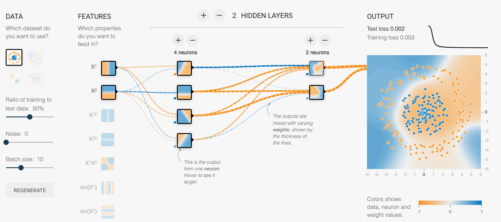
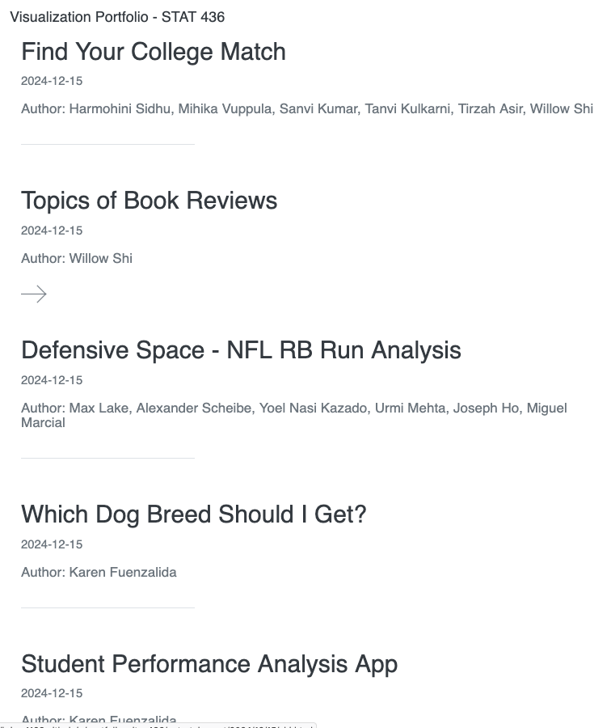

class: title

# Invitation to STAT 436: Data Visualization

<style>
.slide-background {
    background: url("figures/cover.png") no-repeat center center;
    background-size: cover;
    opacity: 0.5;
}
</style>

<div id="subtitle">
Kris Sankaran <br/>
STAT 371 <br/>
05 | February | 2025 <br/>
</div>
<div id="subtitle_right">
Slides: <a href="https://go.wisc.edu/x3m9qi">go.wisc.edu/x3m9qi</a><br/>
Readings: <a href="https://go.wisc.edu/5202r6">go.wisc.edu/5202r6</a><br/>
Recordings: <a href="https://go.wisc.edu/f8d3qj">go.wisc.edu/f8d3qj</a><br/>
Demos: <a href="https://go.wisc.edu/kgx306">go.wisc.edu/kgx306</a><br/>
</div>

<!-- 40 minute talk -->
```{r, echo = FALSE, warning = FALSE}
library(knitr)
library(RefManageR)

opts_chunk$set(echo = FALSE, message = FALSE, warning = FALSE, cache = FALSE, dpi = 200, fig.align = "center", fig.width = 6, fig.height = 3)
BibOptions(
  check.entries = FALSE,
  bib.style = "numeric",
  cite.style = "numeric",
  style = "markdown",
  hyperlink = FALSE,
  dashed = FALSE,
  max.names = 1
)
bib <- ReadBib("references.bib")
```

---

### Motivation: Perception

If our brains were built differently, we might be able to understand an entire
experiment by glancing at a spreadsheet. Even though this is impossible, data
visualization can make complex comparisons more automatic.

<div style="text-align: center;">

Figure from `r Citep(bib, "alain2017understanding")`.
</div>

---

### Course Topics

We learn to tailor our visualizations to different data types (e.g., network,
spatial, image).

<div style="text-align: center;">
<br/>
Visualizing different data types, from the <a href="https://krisrs1128.github.io/stat436_s25/index.html">course notes</a>.
</div>

---

### Course Topics

We learn how to use interactivity to help readers search for information.

<div style="text-align: center;">
<iframe src="https://connect.doit.wisc.edu/content/6df2063a-1c7d-4f01-b98c-3aebed82d190/" width=900 height=370 frameborder="0"></iframe><br/>
An example of <a href="https://krisrs1128.github.io/stat436_s25/posts/2024-12-27-week05-03">linked brushing</a>.
</div>

---

### Course Topics

We learn how to visualize the results from modern models, like those for
dimensionality reduction and deep representation learning.

<div style="text-align: center;">
<br/>
A simple neural network, from the <a href="https://playground.tensorflow.org">Tensorflow Playground</a>.
</div>

---

### Critical Thinking

One of the goals of STAT 436 is to help you think critically about
visualizations. Different ways of showing information will prioritize some
comparisons over others.

<div style="text-align: center;">
<br/>
Figure from `r Citep(bib, "heer2010crowdsourcing")`.
</div>

---

How many times larger is the circle on the right?

<div style="text-align: center;">
<iframe src="figures/circles.html" style="height: 620px; width: 600px" frameborder="0"></iframe><br/>
</div>

---

How many times taller is the bar on the right?

<div style="text-align: center;">
<iframe src="figures/bars.html" style="height: 620px" frameborder="0"></iframe><br/>
</div>

---

### Past Projects

.pull-left[
The course gives you a chance to work on a few projects over the course of the
semester. Here are examples of some past submissions.

[https://go.wisc.edu/q15t5a](https://go.wisc.edu/q15t5a)
]

.pull-right[
<div style="text-align: center;">
<a href="https://krisrs1128.github.io/portfolio_site_436/">
<br/>
</a>
</div>
]