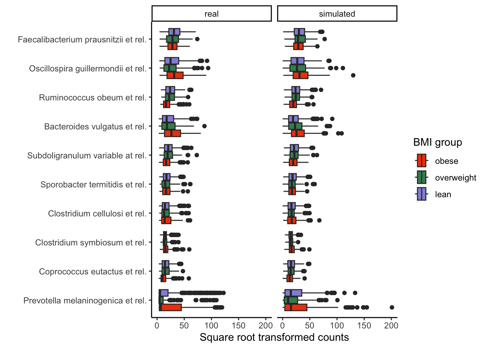
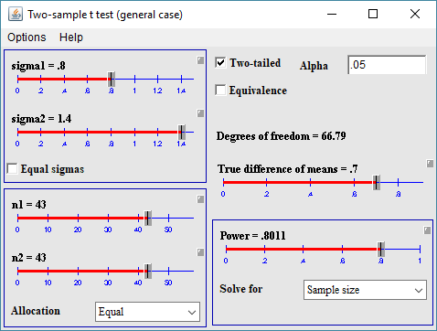
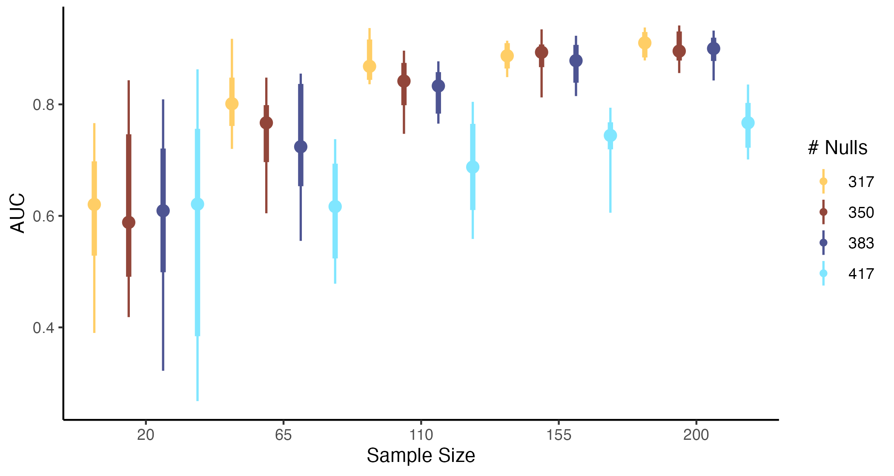
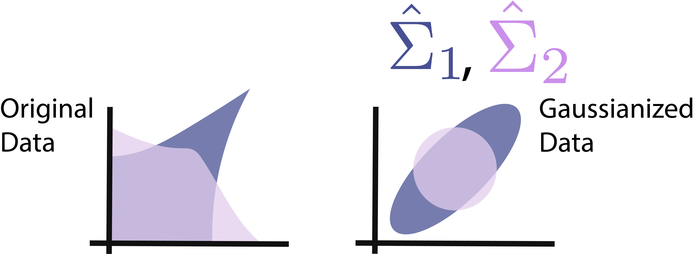
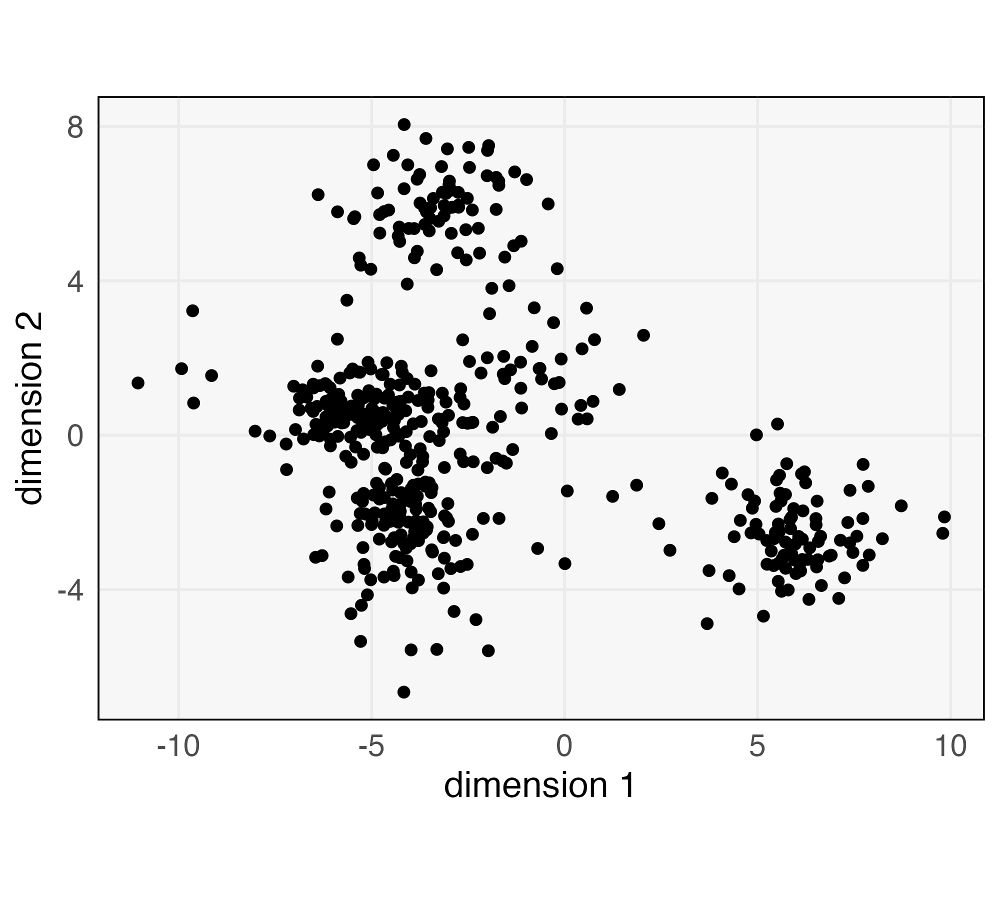
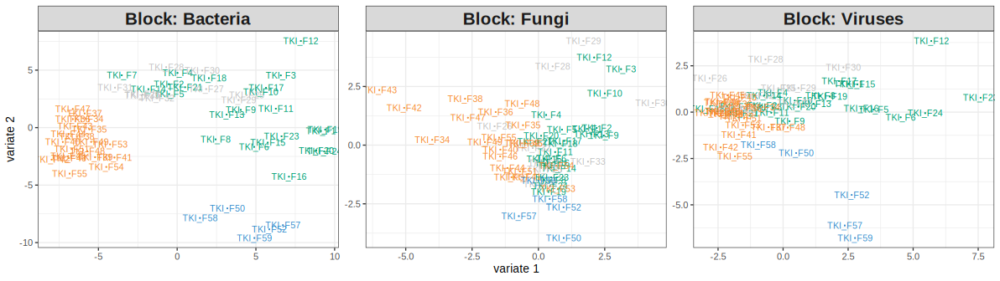
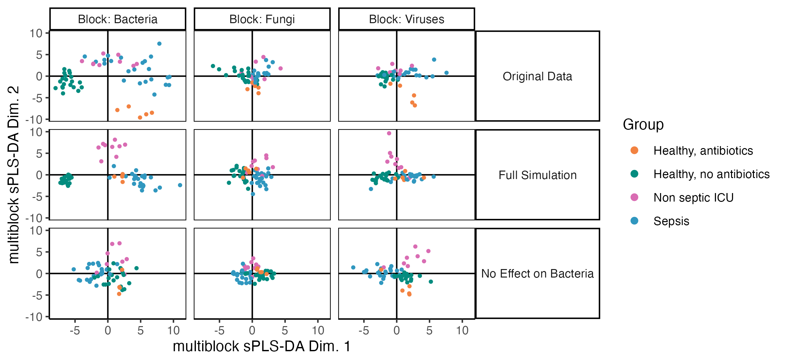
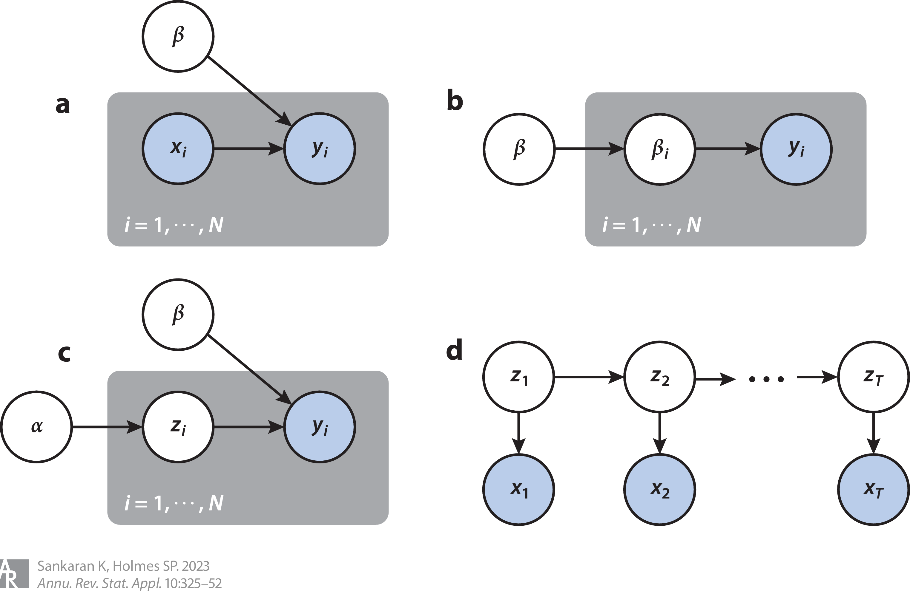
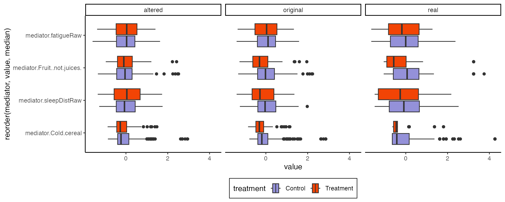
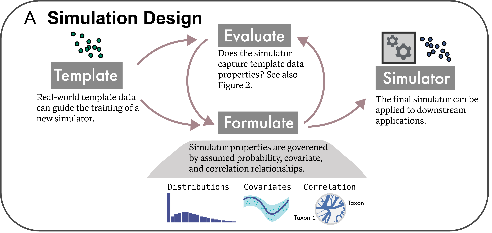

class: title

# Enhancing Microbiome Analysis with Semisynthetic Data

<style>
.slide-background {
    background: url("figures/cover.png") no-repeat center center;
    background-size: cover;
    opacity: 0.5;
}
</style>

<div id="subtitle">
Kris Sankaran <br/>
Plant Pathology Seminar<br/>
18 | February | 2025 <br/>
</div>
<div id="subtitle_right">
Slides: <a href="https://go.wisc.edu/689h7c">go.wisc.edu/689h7c</a><br/>
Lab: <a href="https://go.wisc.edu/pgb8nl">go.wisc.edu/pgb8nl</a> <br/>
</div>

<!-- 55 minute talk -->

```{r, echo = FALSE, warning = FALSE}
library(knitr)
library(RefManageR)

opts_chunk$set(echo = FALSE, message = FALSE, warning = FALSE, cache = FALSE, dpi = 200, fig.align = "center", fig.width = 6, fig.height = 3)
BibOptions(
  check.entries = FALSE,
  bib.style = "numeric",
  cite.style = "numeric",
  style = "markdown",
  hyperlink = FALSE,
  dashed = FALSE,
  max.names = 1
)
bib <- ReadBib("references.bib")
```

---

### Microbiome Data

1. A microbiome is a microbe-scale ecosystem.  It can be described by taxonomic
composition, genomic function, and biochemical features.

1. Advances in sequencing technology have made it easier than ever to rapidly
profile these taxonomic and genomic features in a range of sites, including in
the human body, on plant roots, and in the oceans. For this reason, they have
become an important part of medical, agricultural, and environmental questions.

---

### Statistical Challenges

Developing the data analysis for a microbiome study can be complicated by a
number of factors.

* **Integration**: How should we transform and analyze data across
batches or technologies, each with unique sources of technical variability?

* **Experimental Design**: How should we arrange sampling, assign treatments,
and place controls so that we can have powerful statistical conclusions?

* **Reproducibility**: How can we be sure our conclusions are trustworthy?

---

### Data Analysis Controversy `r Citep(bib, "retraction2024")`

.center[
    
]

In June 2024, _Nature_ retracted a paper `r Citep(bib, "Poore2020")` the claimed
identify microbiome signatures of cancer. This came after one year's worth of
debate `r Citep(bib, c("Gihawi2023", "SepichPoore2023", "SepichPoore2024"))`
about the data analysis.

---

### Data Analysis Controversy `r Citep(bib, "retraction2024")`

.center[
    
]

The "disease signature" was an artifact resulting from the use of a batch effect
correction method.  Before we can understand the nuances of the story, we need
to learn about batch effects and correction methods.

---

### Simulation to Resolve Controversy

Gerry Tonkin-Hill has an excellent re-analysis `r Citep(bib, "githubGitHubGtonkinhillTCGA_analysis")` of the data from `r Citep(bib, "Poore2020")` which sheds light what were likely the source of the phantom
signals. The first part is a simulation.

.pull-left[

]
.pull-right[

]

---

### The Changing Simulation Landscape

Historically, microbiome researchers have only rarely used simulation in
their data analysis workflow.

  * Time Consuming: The simulators would have to be written from scratch, which requires significant effort.
  * Unrealistic: Even afterwards, the resulting data may not be realistic enough to use to guide any practical conclusions.

However, in the last few years, the situation has changed quite noticeably.

---

### Semisynthetic Data

One of the major advances has been the design of algorithms that can leverage public data resources.

* Semisynthetic Data: The output from a simulator that has been designed to mimic external, template data. 
* Template Data: Previously gathered experimental data that can be used to train a simulator.

It's no longer necessary to start from a blank slate.

---

### New Packages

We also have many more packages that implement these new methods. Here are 6 out
of the 11 packages discussed in our review `r Citep(bib, "Sankaran2024-gb")`.

.center[
  
]
---

### Talk Outline

This talk gives examples of how semisynthetic data can help microbiome data
analysis. It is based on references 
`r Citep(bib, c("Sankaran2023", "Jiang2025", "Sankaran2024-gb"))`.

<hr/>
<div class="outline-container">
  <div class="act-header">
    <span class="tilde"></span> Act I: Benchmarking and Power Analysis <span class="tilde"></span>
  </div>
  <div class="sub-item">Differential Abundance</div>
  <div class="sub-item">Dimensionality Reduction</div>
  
  <div class="interlude">
    <span class="tilde"></span> Interlude on Evaluation <span class="tilde"></span>
  </div>
  
  <div class="act-header">
    <span class="tilde"></span> Act II: Reliability and Attribution <span class="tilde"></span>
  </div>
  <div class="sub-item">Data Integration</div>
  <div class="sub-item">Mediation Analysis</div>
</div>
<hr/>

---

## Benchmarking and Power Analysis

---

### Differential Abundance

A common question in microbiome analysis is whether a given taxon is more vs.
less abundant in some conditions vs. others. Formally, consider
  * Hypotheses of interest: $H_{1}, \dots, H_{M}$. Some of them are non-null, but you don't know which.
  * Associated $p$-values: $p_{1}, \dots, p_{M}$.

Goal: Reject as many non-null hypotheses as possible while controlling the _False Discovery Rate_,

\begin{align*}
\text{FDR} := \mathbf{E}\left[\frac{|\text{False Positives}|}{|\text{Rejections}| \vee 1}\right]
\end{align*}

---

### Simulation Example

We can define benchmark using our data. In this example, we

1. Trained a simulator to mimic data from (tk: Give the study citation and dimensions)
1. Deliberately removed the effects from the (tk: how many) taxa with the
weakest effects according to a Wilcoxon signed rank test.

Step (2) can be thought of as a _computational negative control_. Together, we
can generate realistic data with ground truth signals.

---

### Example Simulated Data

The semisynthetic data seems to capture group and taxa differences among these
highly abundant taxa.

.center[

]

---

### Benchmarking Analysis

.pull-three-quarters-left[

]

.pull-three-quarters-right[
All methods control the FDR. LIMMA has high variability in performance. Power
only plateaus around $n = 1000$ samples.
]

---

### Implementation

For this simulator, we used a zero-inflated Negative Binomial variant of the
scDesign3 model `r Citep(bib, "Song_Wang_Yan_Liu_Sun_Li_2023")`. For the
abundance of taxon $j$ in sample $i$, we used:
\begin{align*}
X_{ij} \sim \text{ZINB}\left(\mu_{g\left(i\right)j}, \varphi_{g\left(i\right)j}, \nu_{j}\right)
\end{align*}
where $g\left(i\right)$ is the BMI category of sample $i$ and where 
$\mu, \varphi$, and $\nu$ are mean, dispersion, and zero-inflation parameters,
respectively.

.center[

]

---

### Community-wide Associations

In many problems, we are interested in the relationships across a collection of
taxa. These analysis require more advanced methods, like network 
`r Citep(bib, c("Shen2024-og", "Shen2024-kj"))` or dimensionality 
reduction `r Citep(bib, "Sankaran2018")` (see figure below) techniques.

.center[
<br/>
<span style="font-size: 18px;">
</span>
]

---

### Motivation: Power Analysis

.pull-left[
1. Power analyses are intended to prevent researchers from embarking on studies
that have very little chance of detecting the hypothesized signals.

1. While there are formulas for certain univariate tests, there aren't any for 
more complex, multivariate models.
]

.pull-right[

<span style="font-size: 18px;">
Calculator from Russ Lenth's power and sample size webpage.
</span>
]

---

### sPLS-DA Setting

Our power analysis uses Sparse Parital Least Squares Discriminant Analysis
(sPLS-DA) `r Citep(bib, c("Le_Cao2008-zz", "Le_Cao2011-kn", "Rohart2017-sa"))`. This topic is it's
own full workshop, but let's review the core ideas.

.pull-left[
sPLS-DA helps with prediction when, 

* s: Not all features are predictive
* PLS: Many features are correlated with one another
* DA: The response is one of $K$ classes
]

.pull-right[

]

---

### sPLS-DA Intuition

We "blend" columns of $\mathbf{X}$ and $\mathbf{Y}$ within tables until the patterns look similar.

.center[

]

Roughly, choose weights $\mathbf{a}$ and $\mathbf{b}$ to maximize
$\text{cor}\left(\mathbf{Xa}, \mathbf{Yb}\right)$.

---

### sPLS-DA Intuition

We "blend" columns of $\mathbf{X}$ and $\mathbf{Y}$ within tables until the patterns look similar.

.center[

]

Roughly, choose weights $\mathbf{a}$ and $\mathbf{b}$ to maximize
$\text{cor}\left(\mathbf{Xa}, \mathbf{Yb}\right)$.


---

### sPLS-DA Intuition

We "blend" columns of $\mathbf{X}$ and $\mathbf{Y}$ within tables until the patterns look similar.

.center[

]

Roughly, choose weights $\mathbf{a}$ and $\mathbf{b}$ to maximize
$\text{cor}\left(\mathbf{Xa}, \mathbf{Yb}\right)$.

---

### sPLS-DA Intuition

We "blend" columns of $\mathbf{X}$ and $\mathbf{Y}$ within tables until the patterns look similar.

.center[

]

Roughly, choose weights $\mathbf{a}$ and $\mathbf{b}$ to maximize
$\text{cor}\left(\mathbf{Xa}, \mathbf{Yb}\right)$.

---

### sPLS-DA Intuition

Now we can compare samples from the two tables in a single, shared space.

.center[

]

---

### sPLS-DA Intuition

Now we can compare samples from the two tables in a single, shared space.

.center[

]

---

### sPLS-DA Intuition

To get more than one dimension, we can repeat this process after removing any
correlation with previously found patterns.

.center[

]

---

### Example Output

In this example, we are comparing mice with and without a mouse model of Type I
diabetes (T1D). SPLS-DA helps us find taxa that distinguish healthy and disease
groups.

.pull-left[

]
.pull-right[

]


---

### Problem Formulation

How many samples are necessary before this method can recover the
discriminating factors?

* **Estimate**: Train a simulator on the original data.
* **Alter/Sample**: Define negative control taxa with no association with T1D.
* **Gather/Summarize**: Evaluate SPLS-DA performance on semisynthetic data with
varying sample sizes and fractions of negative control taxa.

.center[
  
]

---

### Bivariate Relationships

Except for the "streaks" when taxa were not observed, our simulator seems to
have preserved the essential bivariate relationships across taxa.
.center[

]

---

### Power Analysis

These are the results of our simulation experiment across varying sample sizes
and proportions of truly associated taxa. When few taxa are truly predictive,
many more samples are needed.

.center[

]

---

### Copula Models

These are a type of model that "couple" a collection of known marginal
distributions `r Citep(bib, c("Joe2023-xb", "Deek2023-dc", "Sun2021-lg"))`.

.center[

]

---

### Starting Point

**Question**: If we were asked to simulate a vector of five correlated variables on
our computers right now, what would be the easiest thing to do?

---

### Starting Point

**Question**: If we were asked to simulate a vector of five correlated variables on
our computers right now, what would be the easiest thing to do?

```{r}
library(mvtnorm)
D <- 5
ones <- rep(1, D)
Sigma <- 0.01 * diag(D) + 0.99 * ones %*% t(ones)
rmvnorm(3, rep(0, D), Sigma)
```

The difficulty is that we usually want non-Gaussian margins $F_{1}, \dots, F_{D}$.

---

### Intuition

* In the Gaussianized space, it's easy to model correlation.
* The mapping back and forth is possible because we know the margins $F$.
  - $\Phi$ represents the Gaussian CDF applied componentwise
<br/>
<br/>

.center[

]

---

### Copula Models

More formally, let $F_{1}, \dots, F_{D}$ be the target margins and let $\Phi$ be
the CDF of the Gaussian distribution. Gaussian Copula modeling has these steps.

Estimate:

1. Gaussianize the observed $\mathbf{x}_{i}$ to $\mathbf{z}_{i} := \left[\Phi^{-1}\left(F_{1}\left(x_{i1}\right)\right), \dots, \Phi^{-1}\left(F_{D}\left(x_{iD}\right)\right)\right]$
1. Estimate the covariance $\hat{\Sigma}$ associated with $z_{i}$

Simulate:

1. Draw $\mathbf{z}^\ast \sim \mathcal{N}\left(0, \Sigma\right)$ 
1. Transform back $\mathbf{x}\ast := \left[F_{1}^{-1}\left(\Phi\left(z_{i1}^\ast\right)\right), \dots, F_{D}^{-1}\left(\Phi\left(z_{iD}^\ast\right)\right)\right]$

---

### Variations

1. We might expect the corelation structure to vary across groups. This can be
accomplished by setting separate $\Sigma_{k}$ across groups $k$.

1. In high-dimensions, the sample covariance $\hat{\Sigma}$ can destabilize. In
this case, we should use high-dimensional covariance estimators `r Citep(bib, c("Meinshausen2006-cg,", "Friedman2008-cw", "Cai2011-ja"))`.

.center[

]

---

## Interlude - Evaluation

---

### Evaluation Taxonomy

To be useful, simulated data need to be realistic. A few differences to be aware of:

* **Narrow/Broad Measures**: Narrow measures focus on small subsets of taxa, while broad measures evaluate community-level properties.

* **Graphical/Quantative**: Some checks are more easily quantifiable.

* **Fit-for-purpose measures**: Evaluation can focus on specific parameter estimates or analysis results.

Different types of realism should have higher priority depending on the
downstream tasks.

---

### Examples

* **Graphical, Narrow**: Boxplots or cumulative distribution function plots comparing real vs. simulated taxa.
* **Graphical, Broad**: Principal component plots of real vs. simulated dataset.
* **Quantitative, Narrow**: Two-sample Kolmogorov-Smirnov test.
* **Quantitative, Broad**: Performance of real vs. simulated data prediction.
* **Fit-for-Purpose**: Linear model coefficients on real vs. simulated data.

---

### Simulation Evaluation through Classification

Suppose we wanted to fit a model to these (simulated) data

<center>

</center>

---

* A natural enough starting point is a Gaussian mixture model with $K = 4$.
* We can simulate from the fit, but it seems quite far off.
.pull-left[
_Simulated_

]
.pull-right[
_Truth_

]

---

We can make our assessment quantitative using the discriminator idea of `r Citep(bib, "friedman2004multivariate")`.

The prediction probabilies below come from a GBM discriminator, which has an
out-of-sample prediction accuracy of 65.5%.

.pull-left[
_Simulated_

]

.pull-right[
_Truth_

]


---

As a next step,
* Increase number of components to $K = 5$.
* Fit different variances per component.

We still over-sample the gap between the two bottom-left clusters, but the GBM
accuracy has dropped down to 55.5%.
.pull-left[
_Simulated_<br/>

]
.pull-right[
_Truth_<br/>

]

---

* We use a mixture of $t$ distributions next.
* GBM accuracy is now 50.6%
  - Unsurprisingly, this is the true mechanism that generated the data.

.pull-left[
_Simulated_


]

.pull-right[
_Truth_


]

---

The discrimination probabilities become closer to 0.5 the more accurate the simulation becomes.

<center>

</center>

---

## Act 2: Reliability and Attribution

---

### Reliability Checks

1. Beyond power and benchmarking analysis, simulations can clarify how to
interpret a complicated workflow.

1. We have been calling this a *reliability check*.
These checks construct hypothetical scenarios to understand how methods behave.

<div style="margin-left: 100px;">
<span style="font-family: 'Exo 2'; font-size: 18;">
The analysis should not...<br/>
&nbsp;&nbsp;&nbsp;&nbsp;introduce spurious signals.<br/>
&nbsp;&nbsp;&nbsp;&nbsp;give high confidence results on uncertain data.<br/>
&nbsp;&nbsp;&nbsp;&nbsp;yield very different answers on similar datasets.<br/>
&nbsp;&nbsp;&nbsp;&nbsp;drown out subtle effects.<br/>
&nbsp;&nbsp;&nbsp;&nbsp;etc...
</span>
</div>

---

### Vertical Data Integration

To illustrate, let's consider a vertical data integration question. These are
problems where we get complementary 'omics views of the same samples.

.center[

]

The goal is to prepare a unified analysis, one which potentially considers
relationships across sources.

---

### ICU Example

.pull-left[
The study `r Citep(bib, "Haak2021-lu")` used amplicon sequencing data to profile
the bacterial, viral, and fungal composition in gut microbiome samples from ICU
patients at a hospital, including a subset who were experiencing sepsis.
]

.pull-right[

]

---

### Multiblock SPLS-DA Analysis

Multiblock SPLS-DA generalizes SPLS-DA to incorporate measurements across
multiple tables. With $\texttt{sepsis} \times \texttt{antibiotic use}$ status as
the response variable, the method outputs the plots below.

.center[

]

---

### Reliability Check

It's not obvious how we should interpret this output. The virus data must
influence the bacteria plot, because the method integrated the sources, but how
strong is the influence?

.center[

]

Some integration methods are more vs. less aggressive than others.

---

### Semisynthetic Data

To calibrate our interpretation, we train a simulator using these data but then
deliberately remove any association between the bacteria community profile and
the sepsis response.

.center[

]
---

### Simulation Results

Applying Multiblock SPLS-DA to these data suggests that we are in an aggressive
integration regime. 
.center[]
A reliability check like this might have helped `r Citep(bib, "Poore2020")`
realize that their normalization procedure introduced spurious associations.

---

## Mediation Analysis

---

### Model Comparison

It's common to compare models using $R^{2}$ or prediction performance. Less well
known is that we can _also_ use semisynthetic data. This works even when
regression language is insufficient.

.center[

]

---

### Mindfulness Interventions

1. This type of model comparison was helpful in an ongoing collaboration with Jo
Handelsman (Dept. Plant Pathology) and Richie Davidson (Depts.  Psychology,
Psychiatry, and Neuroscience).

1. The driving question is: 

  _Is it possible to improve psychiatric treatment for a patient using knowledge of their microbiome?_

  It seems like an unlikely connection, but it's one that might seem less
  farfetched in the years to come.

1. Indeed, there is growing evidence for a relationship between the microbiome
and psychiatric conditions, both in mouse models and in observational human
studies `r Citep(bib, c("morais2021gut", "bosch_gut_2022", "Foster2013-bw", "zheng2021gut"))`.

---

### Aside: Event in Two Weeks

.center[

]

---

### Pilot Study

.pull-left[
1. We re-analyzed a pilot study from 2021 `r Citep(bib, "Grupe2021")`, which
gathered data from 54 participants randomly assigned to either a mindfulness
training intervention or a waitlist control (n = 27 each).

1. The training lasted 2 months. Data were collected at the start, finish, and 2
month follow-up.
]

.pull-right[

]

---

### Mediation Analysis

1. We were concerned that the mindfulness intervention might be affect behavior,
which in turn influences microbiota composition.
2. To explore this, we applied a form of mediation analysis to the 16S
microbiome and survey data `r Citep(bib, c("imai2010general", "sohn2019compositional"))`.

.center[

]

---

### Mediation Analysis

1. We were concerned that the mindfulness intervention might be affect behavior,
which in turn influences microbiota composition.
2. To explore this, we applied a form of mediation analysis to the 16S
microbiome and survey data `r Citep(bib, c("imai2010general", "sohn2019compositional"))`.

.center[

]

---

### Estimated Indirect Effects

These figures summarize the paths $T \to M \to Y$.</br>
(i.e., color $\to$ x-axis $\to$ y-axis).

.center[

]

---

### Synthetic Null Data

We can alter the simulator so that some pathways are "turned off." Estimates
derived from these data provide a reference null distribution

.center[
<br/>
<span style="font-size: 24px;">
The middle panel comes from a synthetic null: $T \nrightarrow M \to Y$.
</span>
]

---

### Synthetic Null Hypothesis Testing

We can rank the effects learned from both the real and synthetic null reference
data. The significance threshold is chosen to control the proportion of null
estimates (false positives) that are included among the discoveries.

.center[

]

---

## Conclusion

---

### Software and Resources

All the examples I discussed today can be run from online tutorials we've
written to accompany our papers:

* Simulation for Microbiome Analysis ([go.wisc.edu/wnj5p9](https://go.wisc.edu/wnj5p9))
* Generative Models Examples ([go.wisc.edu/ax73qb](https://go.wisc.edu/ax73qb))

The relevant R packages behind these analysis are:

* `multimedia` - Mediation analysis for microbiome data.
* `scDesign3` - An existing simulator for single cell data
* `scDesigner` - Under-development version used in the first tutorial.

---

Simulation can turn a problem of logic into one of observation.

.center[

]

We need your help! We are looking for more examples to help us write simulation
workflows for `scDesigner`. If you have data or problems that could benefit from
simulation, please reach out.

---

.center[
### Thank you!
]

* Contact: ksankaran@wisc.edu
* Lab Members: Margaret Thairu, Shuchen Yan, Yuliang Peng, Helena Huang
* Funding: NIGMS R01GM152744, NIAID R01AI184095

---

class: reference

### References

```{r, results='asis', echo = FALSE}
PrintBibliography(bib, start = 1, end = 13)
```

---

class: reference

### References

```{r, results='asis', echo = FALSE}
PrintBibliography(bib, start = 14, end = 24)
```

---


---

