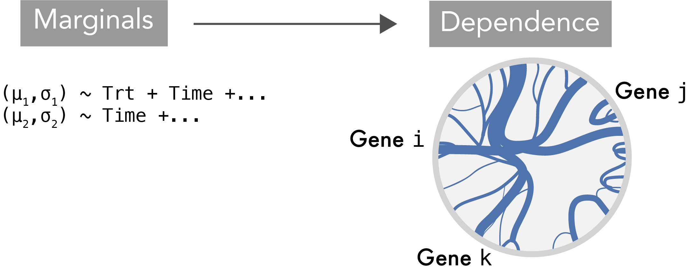
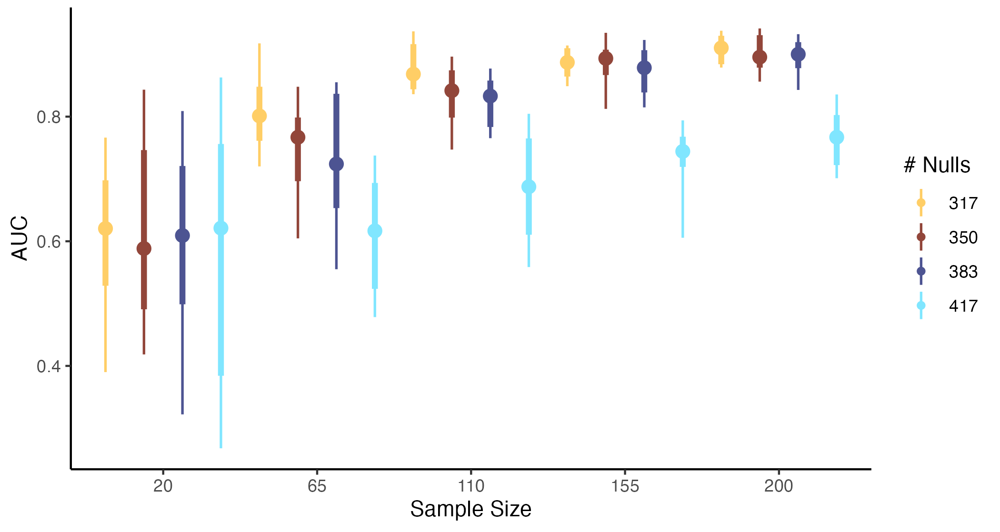

class: title

# Enhancing Microbiome Analysis with Semisynthetic Data

<style>
.slide-background {
    background: url("figures/cover.png") no-repeat center center;
    background-size: cover;
    opacity: 0.5;
}
</style>

<div id="subtitle_left">
Slides: <a href="https://go.wisc.edu/46xtw9">go.wisc.edu/46xtw9</a><br/>
Lab: <a href="https://measurement-and-microbes.org">measurement-and-microbes.org</a> <br/>
</div>
<div id="subtitle_right">
Kris Sankaran <br/>
MCBIOS: Microbiome Symphony<br/>
28 | March | 2025 <br/>
</div>

<!-- 13 minute talk -->

```{r, echo = FALSE, warning = FALSE}
library(knitr)
library(RefManageR)

opts_chunk$set(echo = FALSE, message = FALSE, warning = FALSE, cache = FALSE, dpi = 200, fig.align = "center", fig.width = 6, fig.height = 3)
BibOptions(
  check.entries = FALSE,
  bib.style = "numeric",
  cite.style = "numeric",
  style = "markdown",
  hyperlink = FALSE,
  dashed = FALSE,
  max.names = 1
)
bib <- ReadBib("references.bib")
```

---

### Data Analysis Controversy `r Citep(bib, "retraction2024")`

.center[
    
]

In June 2024, _Nature_ retracted a paper `r Citep(bib, "Poore2020")` the claimed
to identify microbiome signatures of cancer. This came after one year's worth of
debate `r Citep(bib, c("Gihawi2023", "SepichPoore2023", "SepichPoore2024"))`
about the data analysis.

---

### Data Analysis Controversy `r Citep(bib, "retraction2024")`

.center[
    
]

The "disease signature" was an artifact resulting from the use of a batch effect
correction method.  Before we can understand the nuances of the story, we need
to learn about batch effects and correction methods.

---

### Simulation to Resolve Controversy

Gerry Tonkin-Hill has an excellent re-analysis `r Citep(bib, "githubGitHubGtonkinhillTCGA_analysis")` of the data from `r Citep(bib, "Poore2020")` which sheds light what were likely the source of the phantom
signals. The first part is a simulation.

.pull-left[

]
.pull-right[

]


### Why Simulate?

More broadly, there are myriad opportunities for using simulation in microbiome
analysis. They can help us to...

1. **Benchmark methods** and identify gaps in the literature.

1. **Design experiments** that have high power to detect subtle signals.

1. **Check conclusions** that might be sensitive to technical processing steps.

---

### The Changing Simulation Landscape

Considering their potential, simulators are not so widely used.

.pull-left[
   Often, simulators must be written from scratch, which requires significant effort.
]

.pull-right[
   Even afterwards, the resulting data may not be realistic enough to be useful.
]

I know this firsthand from my past work `r Citep(bib, "sankaran2018")`... but the situation is improving quite rapidly!!

---

### Semisynthetic Data

One of the major advances has been the design of algorithms that can leverage
public data resources, like `r Citep(bib, c("Pasolli2017AccessibleCM", "Muller2022", "microbiomedatasets", "microbiomedataHomeNational"))`.

* **Semisynthetic Data**: The output from a simulator that has been designed to mimic external, template data. 
* **Template Data**: Previously gathered experimental data that can be used to train a simulator.

.center[

]

---

### Example 1: Multivariate Power Analysis

How would you run a power analysis for Sparse Partial Least Squares Discriminant
Analysis (SPLS-DA) `r Citep(bib, c("Le_Cao2008-zz", "Le_Cao2011-kn", "Rohart2017-sa"))`?
.pull-left[
SPLS-DA helps with prediction when, 

* S: Not all features are predictive
* PLS: Many features are correlated with one another
* DA: The response is one of $K$ classes

Unfortunately, it doesn't come with any analytical power formulas.
]


.pull-right[

]

---

### Example Output

In this example, we are comparing mice with and without a mouse model of Type I
diabetes (T1D). SPLS-DA helps us find taxa that distinguish healthy and disease
groups.

.pull-left[

]
.pull-right[

]


---

### Overall Approach

How many samples are necessary before this method can recover the
discriminating factors?

* **Estimate**: Train a simulator on the original data.
* **Alter/Sample**: Define negative control taxa with no association with T1D.
* **Gather/Summarize**: Evaluate SPLS-DA performance on semisynthetic data with
varying sample sizes and fractions of negative control taxa.

.center[
  
]

---

### Copula Simulation

It is important that our simulator reflect the correlation structure of the
underlying data.

We applied a Gaussian copula model `r Citep(bib, c("Joe2023-xb", "Deek2023-dc", "Sun2021-lg"))` with a high-dimensional covariance estimator.

.center[

]

---

### Bivariate Relationships

Here are example bivariate relationships learned by the simulator. Do you see
anything off?

.center[

]

---

### Power Curves

These are the results of our simulation experiment across varying sample sizes
and proportions of truly associated taxa. When few taxa are truly predictive,
many more samples are needed.

.center[

]

---

### Example 2: Mediation Analysis

Working with microbiologists and psychologists at UW-Madison, we re-analyzed a
dataset about the gut-brain axis.

.pull-left[
1. We re-analyzed the study 2021 `r Citep(bib, "Grupe2021")`, which
gathered data from 54 participants assigned to either a mindfulness training
intervention or a waitlist control (n = 27 each).

1. The training lasted 2 months. Data were collected at the start, finish, and 2
month follow-up.
]

.pull-right[

]

---

### Mediation Analysis

1. We wondered whether mindfulness intervention might be affect behavior, which
in turn influences microbiota composition.
2. To explore this, we applied a form of mediation analysis to the 16S
microbiome and survey data `r Citep(bib, c("imai2010general", "sohn2019compositional"))`.

.center[

]

---

### Mediation Analysis

1. We wondered whether mindfulness intervention might be affect behavior, which
in turn influences microbiota composition.
2. To explore this, we applied a form of mediation analysis to the 16S
microbiome and survey data `r Citep(bib, c("imai2010general", "sohn2019compositional"))`.

.center[

]

---

### Synthetic Null Data

We can alter the simulator so that some pathways are "turned off." Estimates
derived from these data provide a reference null distribution

.center[
<br/>
<span style="font-size: 24px;">
The middle panel comes from a synthetic null: $T \nrightarrow M \to Y$.
</span>
]

---

### Synthetic Null Hypothesis Testing

We rank the effects learned from both the real and synthetic null reference
data. The significance threshold is chosen to control the empirical false
discovery based on synthetic data.

.center[

]

---

### Software and Resources

All the examples I discussed today can be run from online tutorials we've
written to accompany our papers:

* Simulation for Microbiome Analysis ([go.wisc.edu/wnj5p9](https://go.wisc.edu/wnj5p9))
* Generative Models Examples ([go.wisc.edu/ax73qb](https://go.wisc.edu/ax73qb))

The relevant R packages behind these analyses are:

* `multimedia` - Mediation analysis for microbiome data.
* `scDesign3` - An existing simulator for single cell data.
* `scDesigner` - Under-development version used in the first tutorial.

---

Simulation turns abstract, conceptual questions into simple empirical ones.

.center[

]

---

.center[
### Thank you!
]

* Contact: ksankaran@wisc.edu
* Lab Members: Margaret Thairu, Shuchen Yan, Yuliang Peng, Helena Huang
* Funding: NIGMS R01GM152744, NIAID R01AI184095
* Co-authors: Hanying Jiang, Xinran Miao, Mara Beebe, Dan W. Grupe, Richie
Davidson, Jo Handelsman, Saritha Kodikara, Jingyi Jessica Li, Kim-Anh Lê Cao,
Susan Holmes

---

class: reference

### References

```{r, results='asis', echo = FALSE}
PrintBibliography(bib, start = 1, end = 13)
```

---

class: reference

### References

```{r, results='asis', echo = FALSE}
PrintBibliography(bib, start = 14, end = 28)
```

---

class: reference

### References

```{r, results='asis', echo = FALSE}
PrintBibliography(bib, start = 29, end = 40)
```

---

### Evaluation Taxonomy

This is how some common techniques fall into this taxonomy.

* **Graphical, Narrow**: Boxplots or cumulative distribution function plots comparing real vs. simulated taxa (like the DA example).

* **Graphical, Broad**: Principal component plots of real vs. simulated dataset.

* **Quantitative, Narrow**: Two-sample Kolmogorov-Smirnov test.

* **Quantitative, Broad**: Evaluation through classification (next example).

* **Fit-for-Purpose**: Linear model coefficients on real vs. simulated data (`r Citep(bib, "Sankaran2024-gb")`, "Batch Effect Correction").

---

### SPLS-DA Intuition

We "blend" columns of $\mathbf{X}$ and $\mathbf{Y}$ within tables until the patterns look similar.

.center[

]

Roughly, choose weights $\mathbf{a}$ and $\mathbf{b}$ to maximize
$\text{cor}\left(\mathbf{Xa}, \mathbf{Yb}\right)$.

---

### SPLS-DA Intuition

We "blend" columns of $\mathbf{X}$ and $\mathbf{Y}$ within tables until the patterns look similar.

.center[

]

Roughly, choose weights $\mathbf{a}$ and $\mathbf{b}$ to maximize
$\text{cor}\left(\mathbf{Xa}, \mathbf{Yb}\right)$.


---

### SPLS-DA Intuition

We "blend" columns of $\mathbf{X}$ and $\mathbf{Y}$ within tables until the patterns look similar.

.center[

]

Roughly, choose weights $\mathbf{a}$ and $\mathbf{b}$ to maximize
$\text{cor}\left(\mathbf{Xa}, \mathbf{Yb}\right)$.

---

### SPLS-DA Intuition

We "blend" columns of $\mathbf{X}$ and $\mathbf{Y}$ within tables until the patterns look similar.

.center[

]

Roughly, choose weights $\mathbf{a}$ and $\mathbf{b}$ to maximize
$\text{cor}\left(\mathbf{Xa}, \mathbf{Yb}\right)$.

---

### SPLS-DA Intuition

Now we can compare samples from the two tables in a single, shared space.

.center[

]

---

### SPLS-DA Intuition

Now we can compare samples from the two tables in a single, shared space.

.center[

]

---

### SPLS-DA Intuition

To get more than one dimension, we can repeat this process after removing any
correlation with previously found patterns.

.center[

]

---

### Copula Models

More formally, let $F_{1}, \dots, F_{D}$ be the target margins and let $\Phi$ be
the CDF of the Gaussian distribution. Gaussian Copula modeling has these steps.

Estimate:

1. Gaussianize the observed $\mathbf{x}_{i}$ to $\mathbf{z}_{i} := \left[\Phi^{-1}\left(F_{1}\left(x_{i1}\right)\right), \dots, \Phi^{-1}\left(F_{D}\left(x_{iD}\right)\right)\right]$
1. Estimate the covariance $\hat{\Sigma}$ associated with $z_{i}$

Simulate:

1. Draw $\mathbf{z}^\ast \sim \mathcal{N}\left(0, \Sigma\right)$ 
1. Transform back $\mathbf{x}^{\ast} := \left[F_{1}^{-1}\left(\Phi\left(z_{i1}^\ast\right)\right), \dots, F_{D}^{-1}\left(\Phi\left(z_{iD}^\ast\right)\right)\right]$

---


---


---

### Intuition

* In the Gaussianized space, it's easy to model correlation.
* The mapping back and forth is possible because we know the margins $F$.
  - $\Phi$ represents the Gaussian CDF applied componentwise
<br/>
<br/>

.center[

]

---

### Figure Sources

frustration by Rikas Dzihab from <a href="https://thenounproject.com/browse/icons/term/frustration/" target="_blank" title="frustration Icons">Noun Project</a> (CC BY 3.0)
confused by Rikas Dzihab from <a href="https://thenounproject.com/browse/icons/term/confused/" target="_blank" title="confused Icons">Noun Project</a> (CC BY 3.0)

---

### Pilot Study

.pull-left[
1. We re-analyzed a pilot study from 2021 `r Citep(bib, "Grupe2021")`, which
gathered data from 54 participants randomly assigned to either a mindfulness
training intervention or a waitlist control (n = 27 each).

1. The training lasted 2 months. Data were collected at the start, finish, and 2
month follow-up.
]

.pull-right[

]

---

### Estimated Indirect Effects

These figures summarize the paths $T \to M \to Y$.</br>
(i.e., color $\to$ x-axis $\to$ y-axis).

.center[

]
