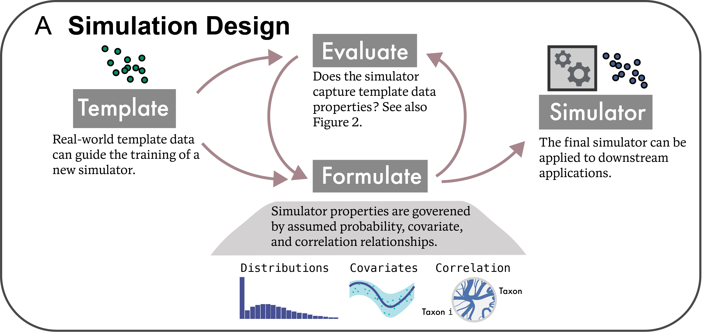

class: title

# Enhancing Microbiome Analysis with Semisynthetic Data

<style>
.slide-background {
    background: url("figures/cover.png") no-repeat center center;
    background-size: cover;
    opacity: 0.5;
}
</style>

<div id="subtitle_left">
Slides: <a href="https://go.wisc.edu/z3tx91">go.wisc.edu/z3tx91</a><br/>
Paper: <a href="https://go.wisc.edu/p12o8w">go.wisc.edu/p12o8w</a><br/>
Lab: <a href="https://measurement-and-microbes.org">measurement-and-microbes.org</a> <br/>
</div>
<div id="subtitle_right">
Kris Sankaran <br/>
<a href="https://sites.google.com/view/wiscmllm/home">Machine Learning Lunch Meetings</a><br/>
25 | April | 2025 <br/>
</div>

<!-- 13 minute talk -->

```{r, echo = FALSE, warning = FALSE}
library(knitr)
library(tidyverse)
library(RefManageR)

opts_chunk$set(echo = FALSE, message = FALSE, warning = FALSE, cache = FALSE, dpi = 200, fig.align = "center", fig.width = 6, fig.height = 3)
BibOptions(
  check.entries = FALSE,
  bib.style = "numeric",
  cite.style = "numeric",
  style = "markdown",
  hyperlink = FALSE,
  dashed = FALSE,
  max.names = 1
)
bib <- ReadBib("references.bib")
th <- theme_minimal() + 
  theme(
    panel.grid.minor = element_blank(),
    panel.background = element_rect(fill = "#f7f7f7"),
    panel.border = element_rect(fill = NA, color = "#0c0c0c"),
    axis.text = element_text(size = 20),
    axis.title = element_text(size = 24),
    strip.text = element_text(size = 24),
    legend.position = "bottom",
  )
theme_set(th)
```

---

### Why Simulate?

There are myriad opportunities for using simulation in microbiome analysis `r Citep(bib, c("Sankaran2023", "Sankaran2024-gb"))`. They
can help us to...

 **Benchmark methods** and identify gaps in the literature.
<br/>

 **Design experiments** that have high power to detect subtle signals.
<br/>

 **Check conclusions** that might be sensitive to technical processing steps.

---

### Semisynthetic Data

One of the major advances has been the design of algorithms that can leverage
public data resources, like `r Citep(bib, c("Pasolli2017AccessibleCM", "Muller2022", "microbiomedatasets", "microbiomedataHomeNational"))`.

* **Semisynthetic Data**: The output from a simulator that has been designed to mimic external, template data. 
* **Template Data**: Previously gathered experimental data that can be used to train a simulator.

.center[

]

---

.center[
## Example 1: Multivariate Power Analysis
]

---

How would you run a power analysis for Sparse Partial Least Squares Discriminant
Analysis (SPLS-DA) `r Citep(bib, c("Le_Cao2008-zz", "Le_Cao2011-kn", "Rohart2017-sa"))`?
.pull-left[
SPLS-DA helps with prediction when, 

* S: Not all features are predictive
* PLS: Many features are correlated with one another
* DA: The response is one of $K$ classes

Unfortunately, it doesn't come with any analytical power formulas.
]


.pull-right[

]

---

### Example Output

In this example, we are comparing mice with and without a mouse model of Type I
diabetes (T1D). SPLS-DA helps us find taxa that distinguish healthy and disease
groups.

.pull-left[

]
.pull-right[

]


---

### Overall Approach

How many samples are necessary before this method can recover the
discriminating factors?

* **Estimate**: Train a simulator on the original data.
* **Alter/Sample**: Define negative control taxa with no association with T1D.
* **Gather/Summarize**: Evaluate SPLS-DA performance on semisynthetic data with
varying sample sizes and fractions of negative control taxa.

.center[
  
]

---

### Copula Simulation

It is important that our simulator reflect the correlation structure of the
underlying data. We applied a Gaussian copula model `r Citep(bib,
c("Joe2023-xb", "Deek2023-dc", "Sun2021-lg"))` with a high-dimensional
covariance estimator.

.center[

]

---

### Bivariate Relationships

Here are example bivariate relationships learned by the simulator. Do you see
anything off?

.center[

]

---

### Power Curves

These are the results of our simulation experiment across varying sample sizes
and proportions of truly associated taxa. When few taxa are truly predictive,
many more samples are needed.

.center[

]

---

.center[
## Evaluation
]

---

### Evaluation Taxonomy

To be useful, simulated data need to be realistic. A few differences to be aware of:

* **Narrow/Broad Measures**: Narrow measures focus on small subsets of taxa, while broad measures evaluate community-level properties.

* **Graphical/Quantative**: Some checks are more easily quantifiable.

* **Fit-for-purpose measures**: Evaluation can focus on specific parameter estimates or analysis results.

Different types of realism should have higher priority depending on the
downstream tasks.

---

### Evaluation through Classification

What type of model would you use to simulate data like this?

<center>

</center>

---

* A natural enough starting point is a Gaussian mixture model with $K = 4$.
* We can simulate from the fit, but it seems quite far off.
.pull-left[
_Simulated_

]
.pull-right[
_Truth_

]

---

We make our assessment quantitative using the discriminator idea of `r Citep(bib, "friedman2004multivariate")`.

The prediction probabilies below come from a gradient boosting model. Its 
out-of-sample accuracy is 65.5%.
.pull-left[
_Simulated_

]
.pull-right[
_Truth_

]

---

As a next step, we increase number of components to $K = 5$ and fit different variances per component.

We still over-sample the gap between the two bottom-left clusters, but the GBM
accuracy has dropped to 55.5%.
.pull-left[
_Simulated_<br/>

]
.pull-right[
_Truth_<br/>

]

---

* We use a mixture of $t$ distributions next.
* GBM accuracy is now 50.6%
  - Unsurprisingly, this is the true mechanism that generated the data.

.pull-left[
_Simulated_


]
.pull-right[
_Truth_


]

---

The discrimination probabilities become closer to 0.5 the more accurate the simulation becomes.

<center>

</center>

---

.center[
## Example 2: Mediation Analysis
]

---

### Motivating Study

Working with microbiologists and psychologists at UW-Madison, we re-analyzed a
dataset about the gut-brain axis.

.pull-left[
1. We re-analyzed the study 2021 `r Citep(bib, "Grupe2021")`, which
gathered data from 54 participants assigned to either a mindfulness training
intervention or a waitlist control (n = 27 each).

1. The training lasted 2 months. Data were collected at the start, finish, and 2
month follow-up.
]

.pull-right[

]

---

### Mediation Analysis

1. We wondered whether mindfulness intervention might be affect behavior, which
in turn influences microbiota composition.
2. To explore this, we applied a form of mediation analysis to the 16S
microbiome and survey data `r Citep(bib, c("imai2010general", "sohn2019compositional"))`.

.center[

]

---

### Mediation Analysis

1. We wondered whether mindfulness intervention might be affect behavior, which
in turn influences microbiota composition.
2. To explore this, we applied a form of mediation analysis to the 16S
microbiome and survey data `r Citep(bib, c("imai2010general", "sohn2019compositional"))`.

.center[

]

---

### Synthetic Null Data

We can alter the simulator so that some pathways are "turned off." Estimates
derived from these data provide a reference null distribution

.center[
<br/>
<span style="font-size: 24px;">
The middle panel comes from a synthetic null: $T \nrightarrow M \to Y$.
</span>
]

---

### Synthetic Null Hypothesis Testing

We rank the effects learned from both the real and synthetic null reference
data. The significance threshold is chosen to control the empirical false
discovery based on synthetic data.

.center[

]

---

.center[
## Example 3: Data Integration
]


---

### Reliability Checks

1. Beyond power and benchmarking analysis, simulations can clarify how to
interpret a complicated workflow.

1. Following the lead of 
`r Citep(bib, c("song2021pseudotimede", "song2024improving"))`, we have been
calling this a *reliability check*.  These checks construct hypothetical
scenarios to understand how methods behave.

<div style="margin-left: 100px;">
<span style="font-family: 'Exo 2'; font-size: 18;">
The analysis should not...<br/>
&nbsp;&nbsp;&nbsp;&nbsp;introduce spurious signals.<br/>
&nbsp;&nbsp;&nbsp;&nbsp;give high confidence results on uncertain data.<br/>
&nbsp;&nbsp;&nbsp;&nbsp;yield very different answers on similar datasets.<br/>
&nbsp;&nbsp;&nbsp;&nbsp;drown out subtle effects.<br/>
&nbsp;&nbsp;&nbsp;&nbsp;etc...
</span>
</div>

---

### Vertical Data Integration

To illustrate, let's consider a vertical data integration question 
`r Citep(bib, "le2021community")`. These are problems where we get complementary
'omics views of the same samples.

.center[

]

The goal is to prepare a unified analysis which considers relationships across
sources.

---

### ICU Example

.pull-left[
The study `r Citep(bib, "Haak2021-lu")` used amplicon sequencing data to profile
the bacterial, viral, and fungal composition in the gut microbiome samples from
ICU patients at a hospital, including a subset who were experiencing sepsis.
]

.pull-right[

]

---

### Multiblock SPLS-DA Analysis

Multiblock SPLS-DA generalizes SPLS-DA to incorporate measurements across
multiple tables `r Citep(bib, "Singh2019")`. With 
$\texttt{sepsis} \times \texttt{antibiotics}$ status as the response
variable, the method outputs the plots below.

.center[

]

---

### Reliability Check

It's not obvious how we should interpret this output. For example, the virus
data must influence the bacteria plot, because the method integrated across
sources, but how strong is the influence?

.center[

]

Some integration methods are more vs. less aggressive than others.

---

### Semisynthetic Data

To calibrate our interpretation, we first fit a simulator using all data. We
then deliberately remove all associations between the bacteria community
profiles and sepsis status.

.center[

]
---

### Simulation Results

Applying Multiblock SPLS-DA to these data suggests that we are in an "aggressive
integration" regime. 
.center[]
A reliability check like this might have helped `r Citep(bib, "Poore2020")`
realize that their normalization procedure introduced spurious associations.


---

.center[
  ## Software Design
]

---

### Ergonomic Simulation Software

We can break the simulation interface into two parts.

1. **Data Structures (Nouns)**: A good representation makes the simulation
components transparent without causing cognitive overload.

1. **Operations (Verbs)**: What do we do with the structure? E.g., "estimate",
"sample", "print", "plot", "add nulls", "increase signal", "join", ...

If the resulting grammar is expressive enough, then researchers will be able to
solve problems we may not have anticipated.

```{r, read_data, echo = FALSE}
library(SingleCellExperiment)
sce <- readRDS(url("https://go.wisc.edu/77uf3h"))
sce <- sce[1:10, ]
```

```{r wrap_into_simulator, echo = FALSE}
library(splines)
library(gamboostLSS)
library(scDesigner)
simulator <- setup_simulator(
  sce,
  ~ ns(pseudotime, 3),
  ~ ZINBLSS(),
  copula = copula_gaussian()
) |>
  estimate()
```

---

### Verbs: <span style="color: #D94E4E">Plot</span>
```{r, echo = FALSE}
line_opts <- list(col = "#8C2E62", linewidth = 2)
ribbon_opts <- list(col = "#8C2E62", alpha = 0.1)
point_opts <- list(size = 0.4, alpha = 0.3)
```

```{r example_plot, out.width = 800, echo = FALSE, fig.width = 8, fig.height = 4}
plot(simulator, "pseudotime", line_opts = line_opts, ribbon_opts = ribbon_opts, point_opts = point_opts) +
  facet_wrap(~ feature, ncol = 4)
```

---

### Verbs: <span style="color:#025E73">Mutate</span>

`mutate` lets you modify a few elements from a larger simulator.

```{r second_alteration, out.width = 800}
altered <- mutate(simulator@margins, Chga:Ins1, link = ~ pseudotime) |>
  estimate(sce)
```
```{r plot_alteration, out.width = 800, echo = FALSE, fig.width = 8, fig.heigth = 4}
plot(altered, sce, "pseudotime", line_opts = line_opts, ribbon_opts = ribbon_opts, point_opts = point_opts) +
  facet_wrap(~ feature, ncol = 4)
```

---

### Verbs: <span style="color:#025E73">Mutate</span>

1. Here is a more realistic example from a longitudinal microbiome study.
2. We can use `mutate` to define a synthetic null with no disease effect for a known subset of genes.

.pull-three-quarters-left[

]
.pull-three-quarters-right[

]

---

### Verbs: <span style="color:#025E73">Mutate</span>

1. Here is a more realistic example from a longitudinal microbiome study.
2. We can use `mutate` to define a synthetic null with no disease effect for a known subset of genes.

.pull-three-quarters-left[

]
.pull-three-quarters-right[

]

---

### Verbs: <span style="color:#025E73">Join</span>

We should make it possible to combine simulators like Lego blocks.
```{r, echo = FALSE}
library(gamlss.dist)
SCGEMMETH_sce <- readRDS(url("https://go.wisc.edu/q712e3"))
SCGEMRNA_sce <-readRDS(url("https://go.wisc.edu/9n6u1y"))

rownames(SCGEMMETH_sce) <- make.names(rownames(SCGEMMETH_sce))
rownames(SCGEMRNA_sce) <- make.names(rownames(SCGEMRNA_sce))
```

```{r illustrate_joins}
experiments <- list(methylation = SCGEMMETH_sce, rna = SCGEMRNA_sce)
families <- list(~ BI(), ~ GaussianLSS())
sims <- experiments |>
  map2(families, \(x, y) setup_simulator(x, ~ cell_type, y))
```


---

### Verbs: <span style="color:#025E73">Join</span> (Copula)

One approach is to merge the list of marginal distributions and re-estimate the joint distribution.

```{r, join_simulators_glasso, eval = FALSE}
sim_joined <- map(sims, estimate, nu = 0.1) |>
  join_copula(copula_glasso())
```

This assumes that we have samples where all features are measured.

.center[

]

---

### Verbs: <span style="color:#025E73">Join</span> (Conditioning)

Alternatively, we can combine two simulators by conditioning them on shared latent structure.

```{r join_simulators, message = FALSE, warning = FALSE}
sim_joined <- join_pamona(sims)
```

.center[

]

---

### Verbs: <span style="color:#025E73">Join</span> (Conditioning)

This used partial manifold alignment `r Citep(bib, "Cao2020ManifoldAF")` to
learn shared latent variables across assays and works even in the diagonal
integration setting.

```{r print_joined}
sim_joined
```

---

### Additional Resources

All the examples I discussed today can be run from online tutorials we've
written to accompany our papers:

* Simulation for Microbiome Analysis ([go.wisc.edu/wnj5p9](https://go.wisc.edu/wnj5p9))
* Generative Models Examples ([go.wisc.edu/ax73qb](https://go.wisc.edu/ax73qb))

The relevant R packages behind these analyses are:

* `multimedia` - Mediation analysis for microbiome data `r Citep(bib, "Jiang2025")`.
* `scDesign3` - An existing simulator for single cell data `r Citep(bib, c("Li2019", "Sun2021", "Song2023"))`.
* `scDesigner` - Under-development version used in the first tutorial.

---

Simulation turns abstract, conceptual questions into simple empirical ones.

.center[

]

---

.center[
### Thank you!
]

* Contact: ksankaran@wisc.edu
* Lab Members: Margaret Thairu, Shuchen Yan, Yuliang Peng, Helena Huang
* Funding: NIGMS R01GM152744, NIAID R01AI184095
* Co-authors: Hanying Jiang, Xinran Miao, Mara Beebe, Dan W. Grupe, Richie
Davidson, Jo Handelsman, Saritha Kodikara, Jingyi Jessica Li, Kim-Anh Lê Cao,
Susan Holmes

---

class: reference

### References

```{r, results='asis', echo = FALSE}
PrintBibliography(bib, start = 1, end = 13)
```

---

class: reference

### References

```{r, results='asis', echo = FALSE}
PrintBibliography(bib, start = 14, end = 28)
```

---

### SPLS-DA Intuition

We "blend" columns of $\mathbf{X}$ and $\mathbf{Y}$ within tables until the patterns look similar.

.center[

]

Roughly, choose weights $\mathbf{a}$ and $\mathbf{b}$ to maximize
$\text{cor}\left(\mathbf{Xa}, \mathbf{Yb}\right)$.

---

### SPLS-DA Intuition

We "blend" columns of $\mathbf{X}$ and $\mathbf{Y}$ within tables until the patterns look similar.

.center[

]

Roughly, choose weights $\mathbf{a}$ and $\mathbf{b}$ to maximize
$\text{cor}\left(\mathbf{Xa}, \mathbf{Yb}\right)$.


---

### SPLS-DA Intuition

We "blend" columns of $\mathbf{X}$ and $\mathbf{Y}$ within tables until the patterns look similar.

.center[

]

Roughly, choose weights $\mathbf{a}$ and $\mathbf{b}$ to maximize
$\text{cor}\left(\mathbf{Xa}, \mathbf{Yb}\right)$.

---

### SPLS-DA Intuition

We "blend" columns of $\mathbf{X}$ and $\mathbf{Y}$ within tables until the patterns look similar.

.center[

]

Roughly, choose weights $\mathbf{a}$ and $\mathbf{b}$ to maximize
$\text{cor}\left(\mathbf{Xa}, \mathbf{Yb}\right)$.

---

### SPLS-DA Intuition

Now we can compare samples from the two tables in a single, shared space.

.center[

]

---

### SPLS-DA Intuition

Now we can compare samples from the two tables in a single, shared space.

.center[

]

---

### SPLS-DA Intuition

To get more than one dimension, we can repeat this process after removing any
correlation with previously found patterns.

.center[

]

---

### Copula Models

More formally, let $F_{1}, \dots, F_{D}$ be the target margins and let $\Phi$ be
the CDF of the Gaussian distribution. Gaussian Copula modeling has these steps.

Estimate:

1. Gaussianize the observed $\mathbf{x}_{i}$ to $\mathbf{z}_{i} := \left[\Phi^{-1}\left(F_{1}\left(x_{i1}\right)\right), \dots, \Phi^{-1}\left(F_{D}\left(x_{iD}\right)\right)\right]$
1. Estimate the covariance $\hat{\Sigma}$ associated with $z_{i}$

Simulate:

1. Draw $\mathbf{z}^\ast \sim \mathcal{N}\left(0, \Sigma\right)$ 
1. Transform back $\mathbf{x}^{\ast} := \left[F_{1}^{-1}\left(\Phi\left(z_{i1}^\ast\right)\right), \dots, F_{D}^{-1}\left(\Phi\left(z_{iD}^\ast\right)\right)\right]$

---

### Real vs. Simulated Correlation

.center[

]

A detailed explanation is given [here](https://krisrs1128.github.io/microbiome-simulation/multivariate-power-analysis.html#evaluation).

---

### Tuning High-Dimensional Covariance Estimator

.center[

]

A detailed explanation is given [here](https://krisrs1128.github.io/microbiome-simulation/multivariate-power-analysis.html#evaluation).

---

### Intuition

* In the Gaussianized space, it's easy to model correlation.
* The mapping back and forth is possible because we know the margins $F$.
  - $\Phi$ represents the Gaussian CDF applied componentwise
<br/>
<br/>

.center[

]

---

### Pilot Study

.pull-left[
1. We re-analyzed a pilot study from 2021 `r Citep(bib, "Grupe2021")`, which
gathered data from 54 participants randomly assigned to either a mindfulness
training intervention or a waitlist control (n = 27 each).

1. The training lasted 2 months. Data were collected at the start, finish, and 2
month follow-up.
]

.pull-right[

]

---

### Estimated Indirect Effects

These figures summarize the paths $T \to M \to Y$.</br>
(i.e., color $\to$ x-axis $\to$ y-axis).

.center[

]

---


---

### Figure Sources

frustration by Rikas Dzihab from <a href="https://thenounproject.com/browse/icons/term/frustration/" target="_blank" title="frustration Icons">Noun Project</a> (CC BY 3.0)

confused by Rikas Dzihab from <a href="https://thenounproject.com/browse/icons/term/confused/" target="_blank" title="confused Icons">Noun Project</a> (CC BY 3.0)

Benchmark by Sofiah from <a href="https://thenounproject.com/browse/icons/term/benchmark/" target="_blank" title="Benchmark Icons">Noun Project</a> (CC BY 3.0)

checkmark by Asa Kharisma Dini from <a href="https://thenounproject.com/browse/icons/term/checkmark/" target="_blank" title="checkmark Icons">Noun Project</a> (CC BY 3.0)

Lab glassware by Vectors Market from <a href="https://thenounproject.com/browse/icons/term/lab-glassware/" target="_blank" title="Lab glassware Icons">Noun Project</a> (CC BY 3.0)
