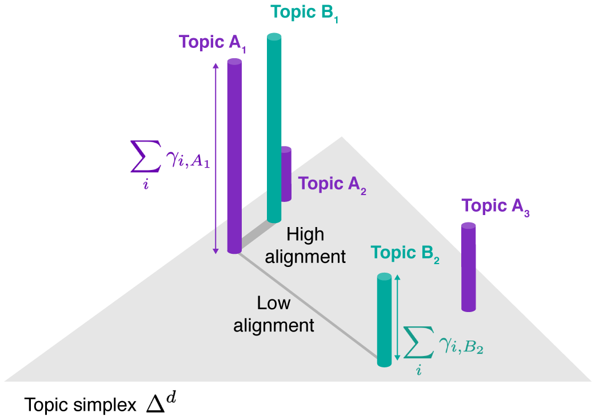
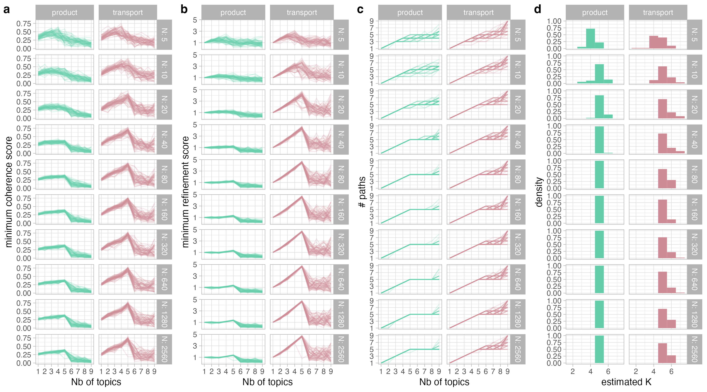
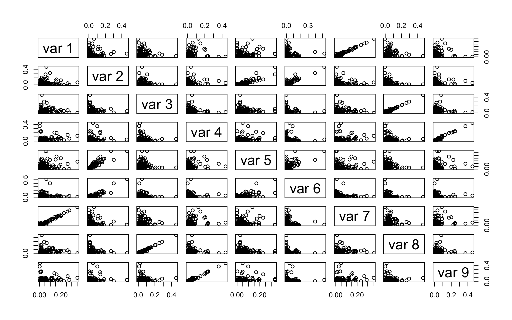

class: title

# Multiscale Topic Modeling with Alto

<div id="subtitle_left">
Slides: <a href="https://go.wisc.edu/">go.wisc.edu/</a><br/>
Paper: <a href="https://go.wisc.edu/tify36">go.wisc.edu/tify36</a><br/>
Lab: <a href="https://measurement-and-microbes.org">measurement-and-microbes.org</a> <br/>
</div>
<div id="subtitle_right">
Kris Sankaran <br/>
CGSI Virtual Class<br/>
18 | April | 2025 <br/>
</div>

```{r, echo = FALSE, warning = FALSE, message = FALSE}
library(knitr)
library(tidyverse)
library(RefManageR)

opts_chunk$set(echo = FALSE, message = FALSE, warning = FALSE, cache = FALSE, dpi = 200, fig.align = "center", fig.width = 6, fig.height = 3)
BibOptions(
  check.entries = FALSE,
  bib.style = "numeric",
  cite.style = "numeric",
  style = "markdown",
  hyperlink = FALSE,
  dashed = FALSE,
  max.names = 1
)
bib <- ReadBib("references.bib")
th <- theme_minimal() + 
  theme(
    rect = element_rect(fill = "transparent"),
    panel.grid.minor = element_blank(),
    panel.background = element_rect(fill = NA, color = "#0c0c0c"),
    plot.background = element_rect(fill = NA, color = "#0c0c0c"),
    panel.border = element_rect(fill = NA, color = "#0c0c0c"),
    axis.text = element_text(size = 20),
    axis.title = element_text(size = 24),
    strip.text = element_text(size = 24),
    legend.position = "bottom",
  )
theme_set(th)
```


---

### Estimating Weights


The weights $W$ can be estimated by solving the optimal transport problem,
\begin{align*}
&\min_{W \in \mathcal{U}\left(p, q\right)} \left<C,W\right>
\end{align*}
<span style="font-size: 20px;">
\begin{align*}
\mathcal{U}\left(p, q\right) := &\{W\in \mathbb{R}^{\left|V_{p}\right| \times \left|V_{q}\right|}_{+} : W 1_{\left|V_{q}\right|} = p \text{ and } W^{T} 1_{\left|V_{p}\right|} = q\}.
\end{align*}
</span>

```{r, out.width = 420}

```

---

### Indication of Consistency

The diagnostics become more reliable as the sample size increases.

```{r, out.width = 850}

```

---

### Extensions

The `alto` package is focused on topic models. However, it is possible to
generalize to nonnegative matrix factorization.

* We can fit $X \approx W\left(m\right)H\left(m\right)^\top$ for a sequence of $m$. The scores $w_{k}\left(m\right)$ are highly correlated across adjacent $m$.

* To build an alignment diagram, we only require that the alignment scores satisfy constraints on row and column totals. This can be achieved using iterative proportional fitting.

---

```{r, out.width = 850}

```

---

### Code Demo

Follow along: https://go.wisc.edu/d26lb4
