class: title

# Interactively Resolving Distortion in Nonlinear Dimensionality Reduction

<style>
.slide-background {
    background: url("figures/cover.png") no-repeat center center;
    background-size: cover;
    opacity: 0.5;
}
</style>

<div id="subtitle_left">
Slides: <a href="https://go.wisc.edu/">go.wisc.edu/1s4gi3</a><br/>
Lab: <a href="https://measurement-and-microbes.org">measurement-and-microbes.org</a> <br/>
</div>
<div id="subtitle_right">
Kris Sankaran <br/>
IISA 2025 <br/>
12 | June | 2025 <br/>
</div>

<!-- 25 minute talk -->

```{r, echo = FALSE, warning = FALSE}
library(knitr)
library(RefManageR)

opts_chunk$set(echo = FALSE, message = FALSE, warning = FALSE, cache = FALSE, dpi = 200, fig.align = "center", fig.width = 6, fig.height = 3)
BibOptions(
  check.entries = FALSE,
  bib.style = "numeric",
  cite.style = "numeric",
  style = "markdown",
  hyperlink = FALSE,
  dashed = FALSE,
  max.names = 1
)
bib <- ReadBib("references.bib")
```

---

### Map Distortions

 When making maps, we know that any projection introduces some degree of
 distortion. It's impossible to map the 3D earth into a 2D map while preserving
 all metric properties.
 
.center[
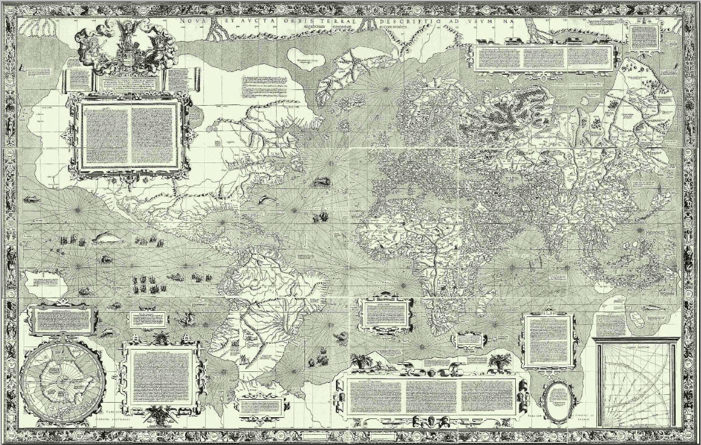
]
 
Gerardus Mercator's 1569 map of the world.
 
---

### Map Distortions

For example, the Mercator projection artificially inflates areas in northern
latitudes. But it perfectly preserves angles, and this was extremely important
for ocean navigation.

.center[
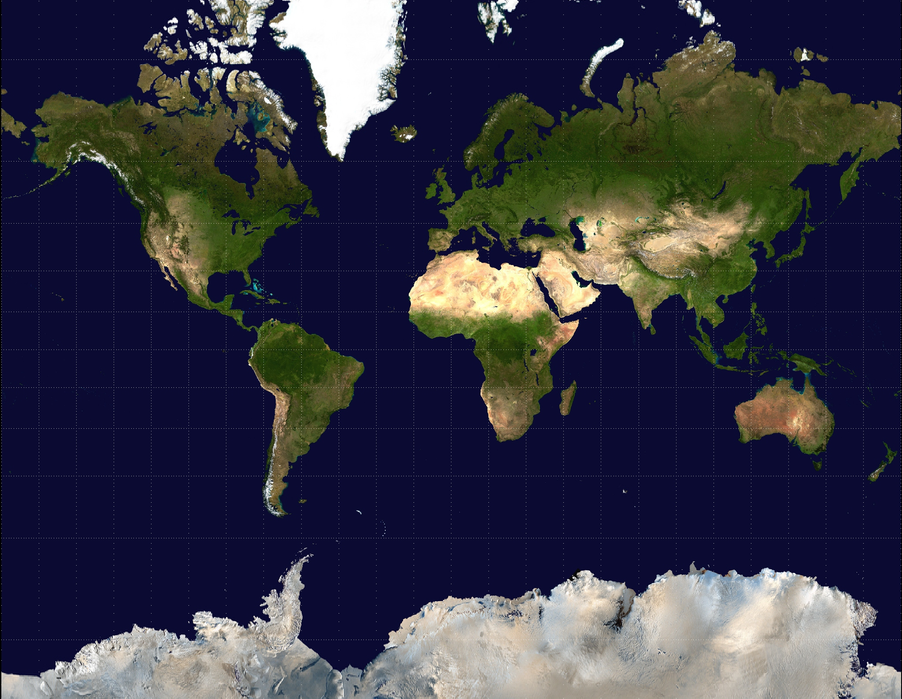
]

---

### High-Dimensional Distortions

The same is true for high-dimensional data. Despite the popularity of nonlinear
dimensionality reductions like UMAP and t-SNE, we know that they introduce
distortions. For example, they may not preserve density within different
regions of the plot.

.center[
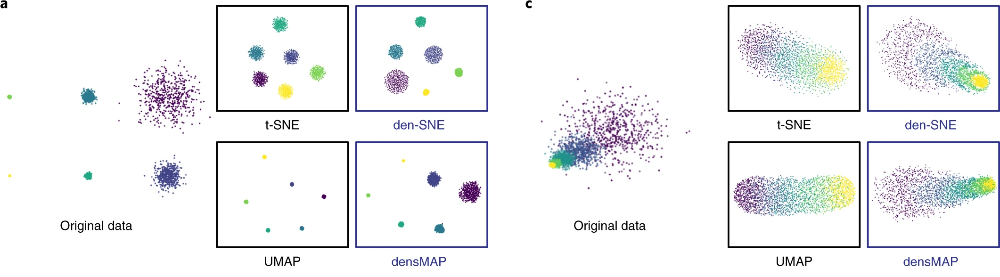
]
Example from `r Citep(bib, "narayan2021assessing")`.

---

### High-Dimensional Distortions

They can make high-dimensional random walks look artificially smooth...

.center[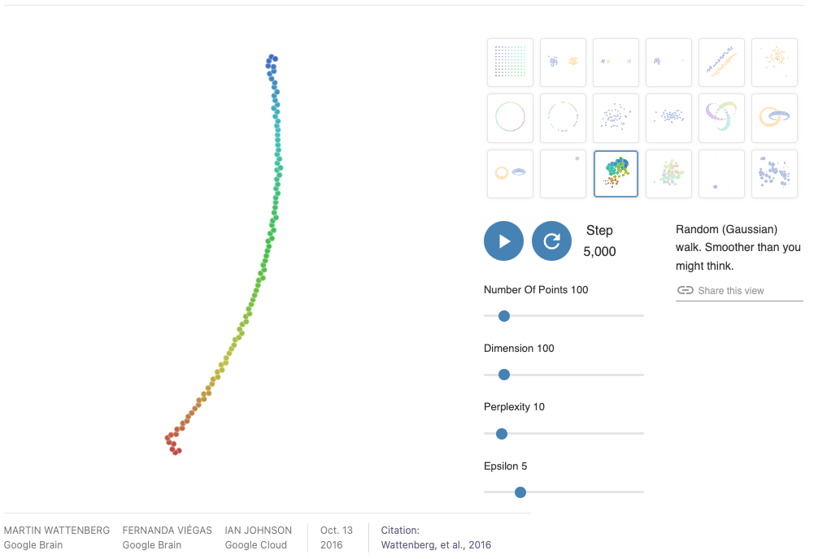 ]
Example from `r Citep(bib, "wattenberg2016how")`.

---

### High-Dimensional Distortions

They can also fail to preserve the topology of the underlying data...

.center[
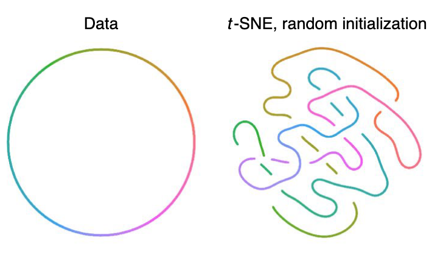
]
Example from `r Citep(bib, "Kobak2021")`.

---

### Consequences

These are not mere technical curiosities -- they can significantly impact
scientific interpretation. For example, they have been known to create
misleading differences between cell types that are actually quite similar.

.center[
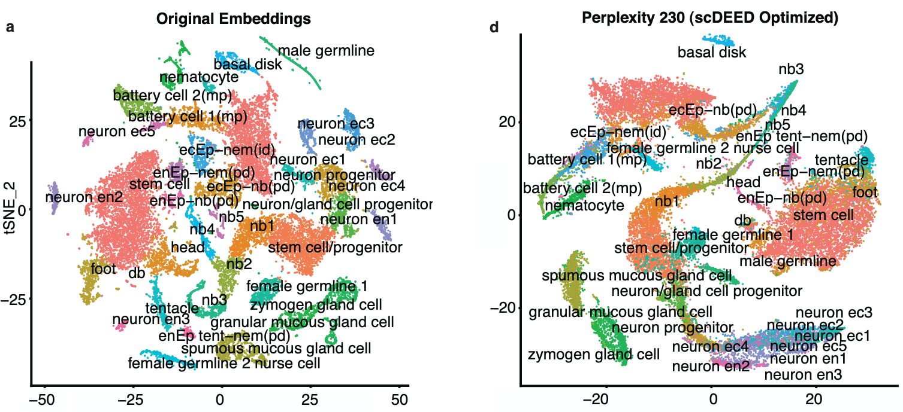
]
Example from `r Citep(bib, "xia2024statistical")`.

---

### Controversy

More generally, nonlinear dimensionality reduction has become the source of
widespread concern in the single cell literature `r Citep(bib, "Chari2023")`.

.center[
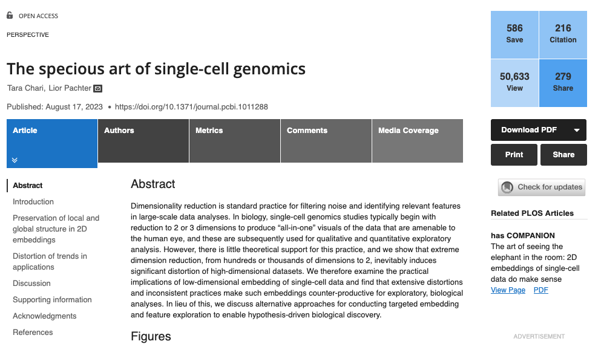
]

---

### Approach

We shouldn't abandon nonlinear dimensionality reduction, but we should try to
characterize the distortion. Our idea is to augment our usual visualizations
with measures of local distortion which are already available in the literature.

.center[
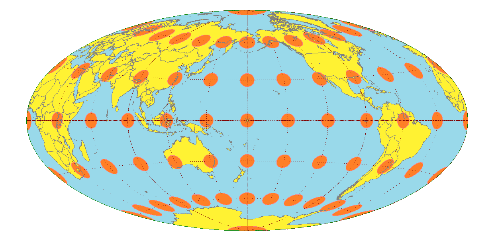
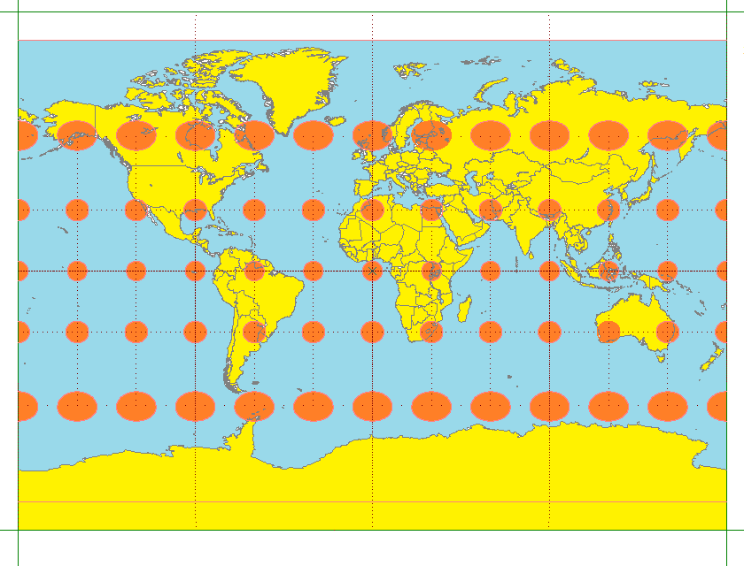
]

This is similar in spirit to Tissot's indicatrix in the cartography literature
`r Citep(bib, "laskowski1989traditional")`.

---

.center[
## Implementation
]

---
### Diffusion-Based Metrics

The graph laplacian induces a metric in the original manifold. Intuitively, two
points are close to one another if a random walk started at one point has a high
probability ending up at the other after $t$ steps.

.center[
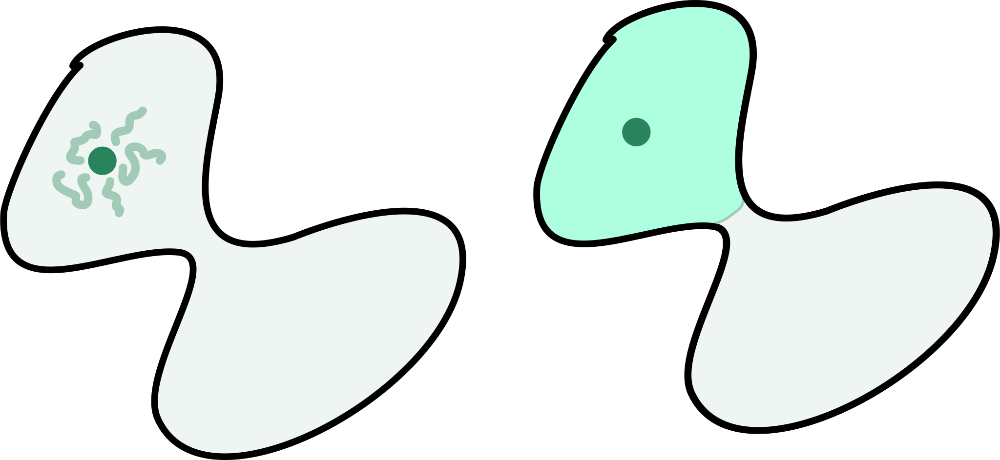
]

---

### Graph Laplacian

This random walk information is encoded in the normalized graph laplacian. 

.pull-left[
\begin{align}
K_{nn'} &= \text{exp}\left(-\frac{1}{\epsilon}\|x_{n} - x_{n'}\|^2\right)\\
D &= \text{diag}\left(K \mathbf{1}_{N}\right)\\
\tilde{K} &= D^{-1}K D^{-1}
\end{align}
]

.pull-right[
\begin{align}
\tilde{D} &= \text{diag}\left(K \mathbf{1}_{N}\right) \\
L &= \frac{1}{\epsilon}\left[I - \tilde{D}^{-1}\tilde{K}\right] \\
\end{align}
]

---

### Pushforward Metric

When we apply a nonlinear dimensionality reduction method, we distort this
metric. To understand exactly how it is warped, we apply the language of
Riemannian geometry, following `r Citep(bib, c("perrault2006metric", "mcqueen2016nearly"))`.

.center[
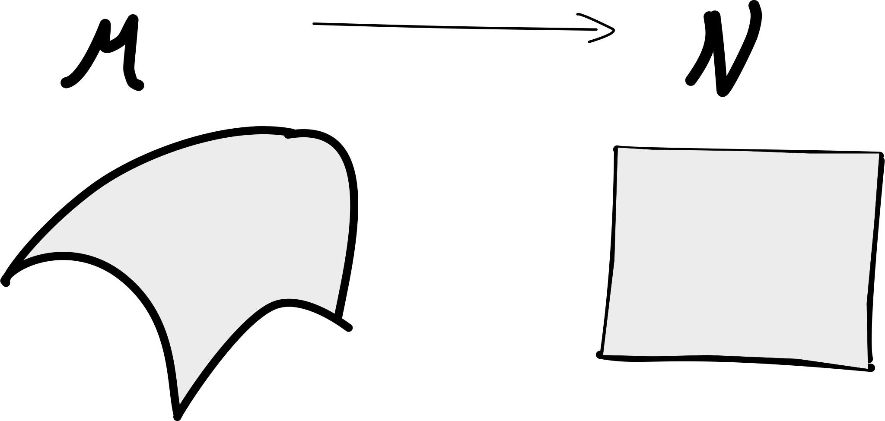
]

---

### Setup

Question: We have a diffusion-based metric on the original space $\mathcal{M}$.
How can we define an associated metric on the embedding space $\mathcal{N}$?

* $T_{p}$: The tangent space of $p \in \mathcal{M}$.
* $g_{p}: T_{p} \times T_{p} \to \mathbb{R}$: The metric on $\mathcal{M}$ at the point $p$.
* $\varphi: \mathcal{M} \to \mathcal{N}$: A smooth and invertible transformation from $\mathcal{M}$ to $\mathcal{N}$.

.center[
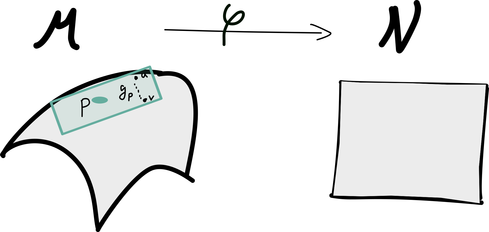
]

---

### Pushforward Metric

To define a metric on $\mathcal{N}$, we map points back onto $\mathcal{M}$ and
apply the original metric $g$. Specifically, for any $q \in \mathcal{N}$, set

\begin{align*}
\left(\varphi_{\ast}g\right)_{q}\left(x, y\right) = g_{\varphi^{-1}\left(q\right)}\left(d\varphi_{q}^{-1}\left(x\right), d\varphi_{q}^{-1}\left(y\right)\right)
\end{align*}

.center[
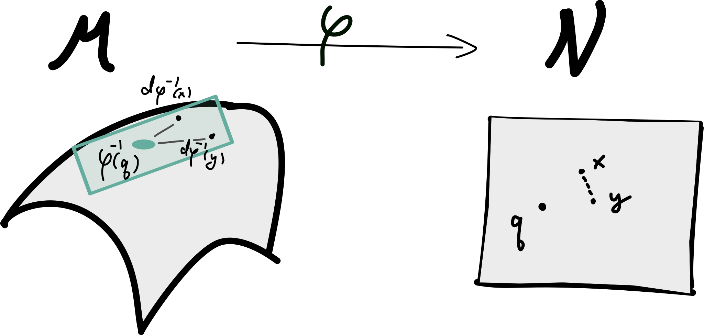
]

---

### Toy Example

Let $\mathcal{M} = \left[0, 1\right]^{2}$ with the metric induced by the inner
product $g\left(x, y\right) = x^{\top}y$, and consider the transformation

\begin{align*}
\varphi: \begin{pmatrix} x_{1} \\ x_{2} \end{pmatrix} \to \begin{pmatrix} x_{1} \\ x_{2}^{2} \end{pmatrix}
\end{align*}

.center[
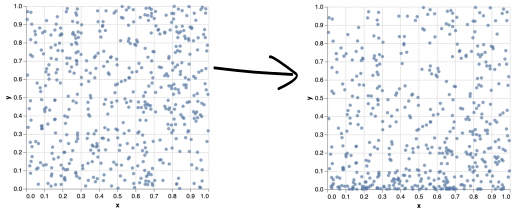
]


---

### Toy Example

Then at any point $q = \left(z_1, z_2\right)$, we have the map:
\begin{align*}
d \varphi_{q}^{-1} = \begin{pmatrix} 1 & 0 \\ 0 & \frac{1}{2}z_{2}^{-\frac{1}{2}} \end{pmatrix}
\end{align*}
which induces the metric,
\begin{align*}
\left(\varphi_{\ast}g\right)_{q}\left(x, y\right) &= x^\top \begin{pmatrix}
1 & 0 \\
0 & \frac{1}{4}z_{2}^{-1}
\end{pmatrix}y \\
&:= x^\top G^{-1}_{q} y
\end{align*}

---

### Toy Example

Visually, we represent these distorted metrics using ellipses. Directions that
are compressed means that the distance in the original space was larger than the
distance we see after the transformation.

.center[
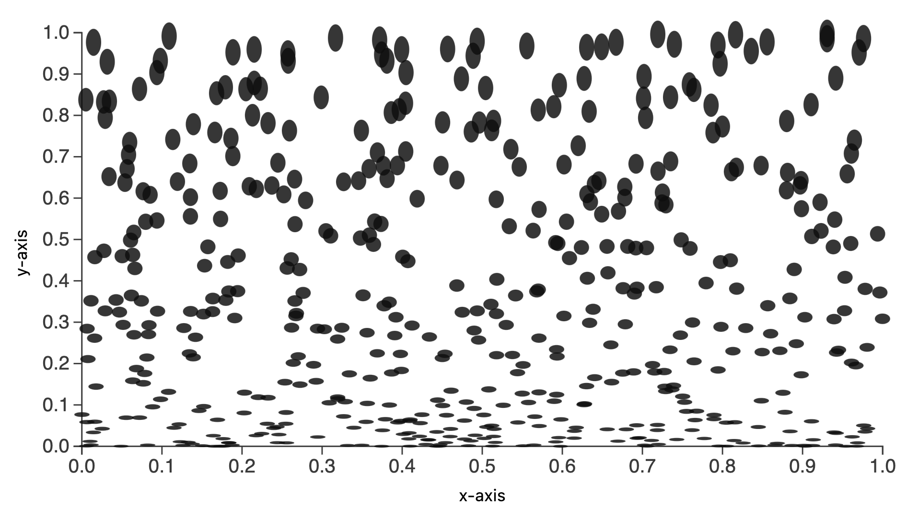
]

---

### Local Metric for Laplacians

Suppose that the $k^{th}$ dimension of the embedding algorithm is $z_{k} \in \mathbb{R}^{N}$. 
It turns out that the diffusion metric in the original space is transformed in the embedding space according to the local metrics:

\begin{align*}
G_{kl}^{-1} := \frac{1}{2}\left[L\left(z_{k} \circ z_{l}\right) - z_{k} \circ \left(L z_{l}\right) - z_{l} \circ \left(L z_{k}\right)  \right]
\end{align*}

---

### Example

These two clusters are generated as:

\begin{align*}
x_{i} \sim \frac{1}{2}\mathcal{N}\left(0, 1\right) + \frac{1}{2}\mathcal{N}\left(10, 10\right)
\end{align*}

.center[

]

---

### Example

The UMAP embeddings lose information about the cluster density, but the
difference is captured in the local metrics.

.center[
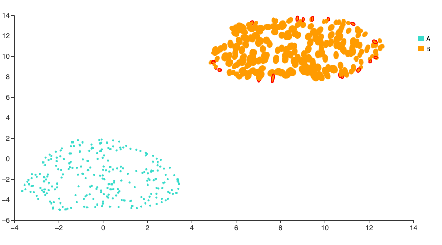
]

---

### Distance Preservation

.pull-left[
We can compare the distance to nearest neighbors in the original vs. embedding
space. 

In this scatterplot, the outliers in the top left are far apart in the embedding
space, but close to one another in the original data.
]

.pull-right[
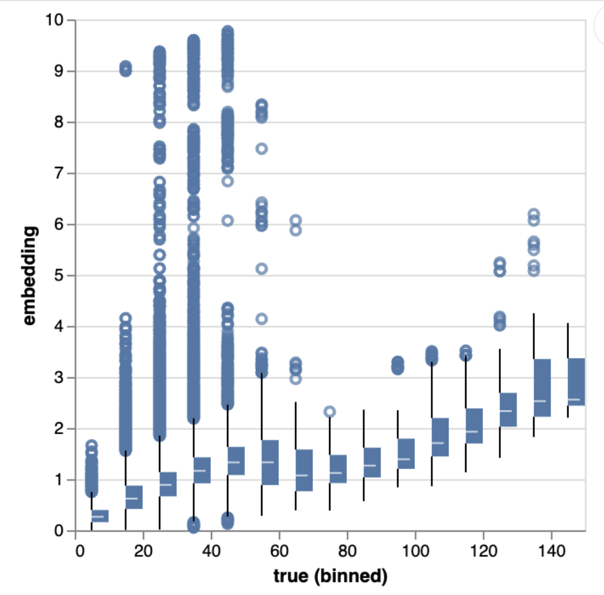
]

---

### Flagging Distorted Neighborhoods

Some neighborhoods have poorly preserved distances. To detect this, one approach
is:

* Fit the running median in a scatterplot of true vs. embedding distances.
* Compute the IQR of the residuals within each bin. Those above $3\times$ IQR are considered poorly preserved outliers.
* If a large enough fraction of a point's neighbor links are poorly preserved, then that point is flagged as "broken."

We have also implemented the scDEED algorithm for flagging problematic points `r Citep(bib, "xia2024statistical")`.

---

### Flagging Broken Neighborhoods

Here is a graphical summary:

.center[
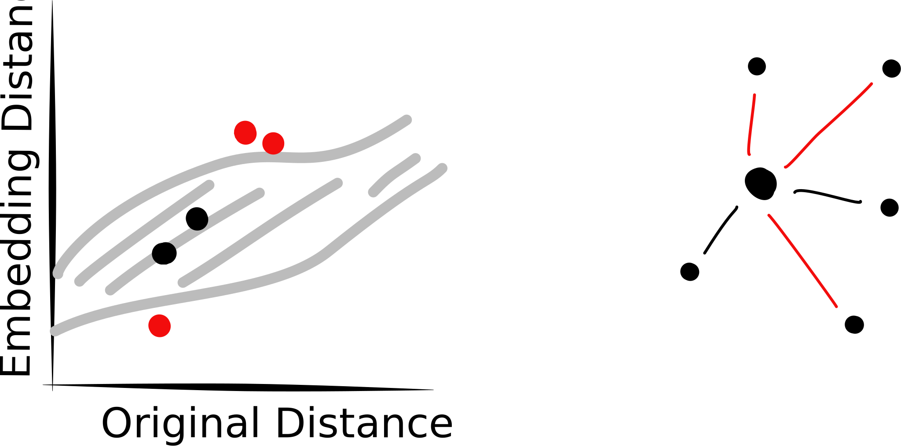
]

---

### Local Isometrization

Since we know the metrics locally, we can invert the distortion within a
neighborhood of the user interaction. For example, here we adapt the embeddings
in the uniform data example to reflect the metric close to where the user's
mouse is hovering.

.center[

]

---

### Local Isometrization Details

Depending on the user's mouse location $z^\ast$, we modify the embeddings
$z_{n}$ according to the local metrics $H_{n} = G_{n}^{-1}$.

\begin{align*}
z_n \to k_{\gamma_1}\left(z_n, f^\ast\right)\tilde{z}_{n} + \left(1 - k_{\gamma_1}\left(z_n, z^\ast\right)\right)z_n
\end{align*}
where we have defined,
\begin{align*}
\tilde{z}_n^{\ast} &:= \sqrt{H^{\ast}}\left(z_n - z^{\ast}\right) + z^{\ast}\\
H^\ast &= \sum_{n = 1}^{N}\left[\frac{k_{\gamma_2}\left(z_n, z^\ast\right)}{\sum_{n' = 1}^{N}k_{\gamma_2}\left(z_{n'}, z^\ast\right)}\right]H_{n}
\end{align*}
and $\gamma_{1}, \gamma_{2}$ control the size of the transformed region and influence of neighborhing $H_{n}$, respectively.

---

### Example

This applies isometrization to the two clusters data. When we hover over either
cluster, we can notice the difference in the true cluster variances.

.center[

]

---

.center[
## Case Studies
]

---

### Mammoth

This example comes from `r Citep(bib, c("paircodeUnderstandingUMAP", "maxnoichlNoichlFlattening"))`. The 3D skeleton scans were produced by the
Smithsonian, and we can use nonlinear dimensionality reduction to "flatten" the
skeleton into 2D.

.center[

]

---

### Mammoth

This is the embedding when applying UMAP with a 10 nearest neighbor graph and
`min_dist = 0.5`.

.center[
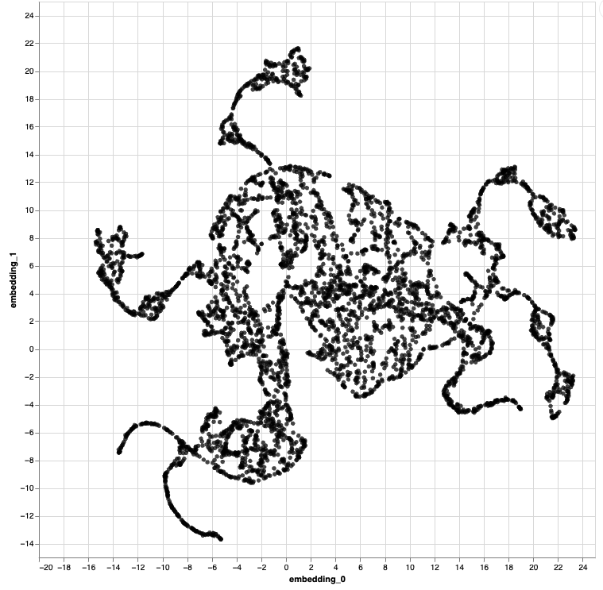
]

---

### Mammoth

Parts of the shoulders, head, and tail are further apart in the embedding
compared to the original data. Most of other distortions are points that are
placed too close to one another.

.center[
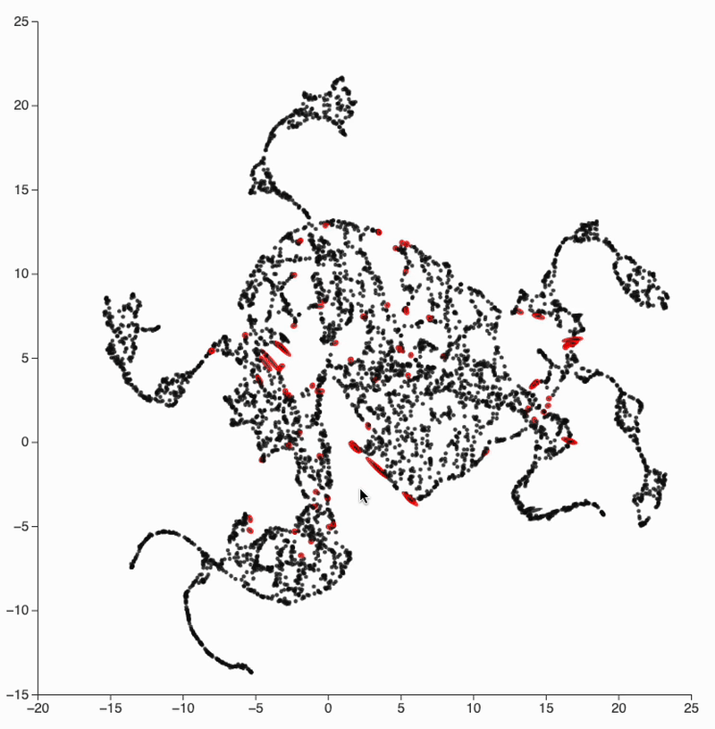
]

---

### PBMC Dataset

This is a standard single cell gene expression data set used in the introductory
UMAP tutorial in the scanpy package. We will see that even this tutorial example
can be improved by overlaying distortion information.

---

### Hydra Cell Atlas


---

### Limitations: Link Data

 Our visualization approach doesn't resolve all problems. For example, 
 distortion are inherently local and sometimes problems can arise globally.

.center[
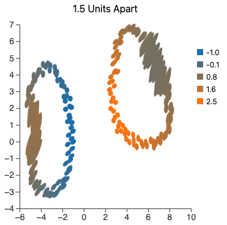
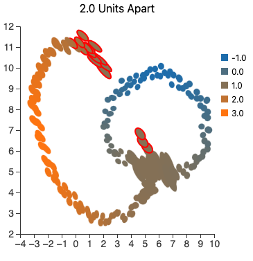
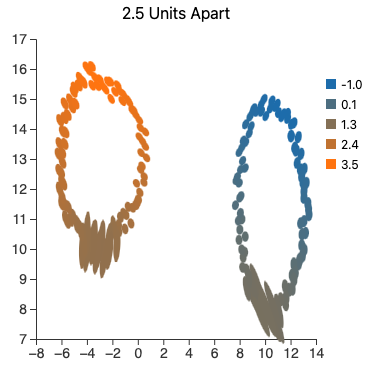
]

The original data are interlocking links. The color is the $x$-axis value and
would be unknown in practice.

---

### Summary

The `distortion` package makes it easy to derive and visualize distortion
metrics.

---

### Thank you!

* Contact: ksankaran@wisc.edu
* Lab Members: Margaret Thairu, Shuchen Yan, Yuliang Peng, Helena Huang
* Funding: NIGMS R01GM152744, NIAID R01AI184095
* Co-authors: Chenab, Shuzhen Zhang, Marina Meila

---

class: reference

### References

```{r, results='asis', echo = FALSE}
PrintBibliography(bib, start = 1, end = 13)
```

---

class: reference

### References

```{r, results='asis', echo = FALSE}
PrintBibliography(bib, start = 14, end = 28)
```
---