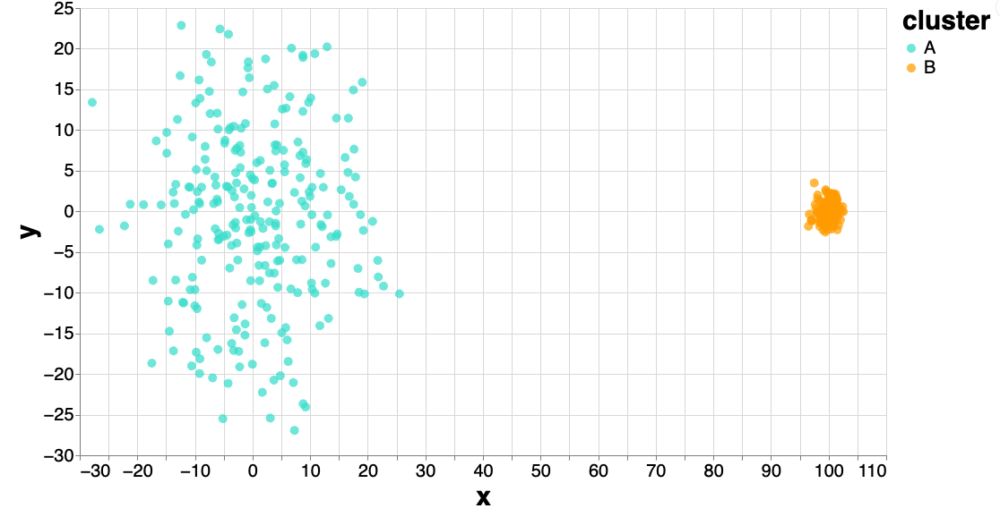
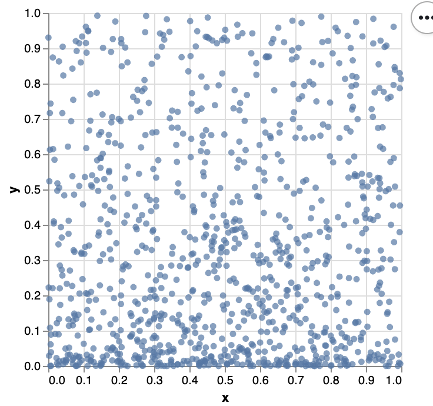

class: title

# Interactively Resolving Distortion in Nonlinear Dimensionality Reduction

<style>
.slide-background {
    background: url("figures/cover.png") no-repeat center center;
    background-size: cover;
    opacity: 0.5;
}
</style>

<div id="subtitle_left">
Slides: <a href="https://go.wisc.edu/">go.wisc.edu/1s4gi3</a><br/>
Lab: <a href="https://measurement-and-microbes.org">measurement-and-microbes.org</a> <br/>
</div>
<div id="subtitle_right">
Kris Sankaran <br/>
IISA 2025
14 | June | 2025 <br/>
</div>

<!-- 25 minute talk -->

```{r, echo = FALSE, warning = FALSE}
library(knitr)
library(RefManageR)

opts_chunk$set(echo = FALSE, message = FALSE, warning = FALSE, cache = FALSE, dpi = 200, fig.align = "center", fig.width = 6, fig.height = 3)
BibOptions(
  check.entries = FALSE,
  bib.style = "numeric",
  cite.style = "numeric",
  style = "markdown",
  hyperlink = FALSE,
  dashed = FALSE,
  max.names = 1
)
bib <- ReadBib("references.bib")
```

---

### Map Distortions

 When making maps, we know that any projection introduces some degree of
 distortion. It's impossible to map the 3D earth into a 2D map while preserving
 all metric properties.
 
.center[

]
 
Gerardus Mercator's 1569 map of the world.
 
---

### Map Distortions

For example, the Mercator projection makes artificially inflates areas in 
northern latitudes. But it perfectly preserves angles, and this was extremely
important for ocean navigation.

.center[

]
 
---

### High-Dimensional Distortions

The same is true for high-dimensional data. Despite the popularity of nonlinear
dimensionality reductions like UMAP and t-SNE, we know that they introduce
distortions.

---

### High-Dimensional Distortions

For example, they may not preserve density within different regions of the plot.

---

### High-Dimensional Distortions

Similarly, they can create an artificial smoothness in the appearance of a
random walk in high dimensions.

---

### Consequences

These are not mere technical curiosities -- they can significantly impact
scientific interpretation. For example, UMAP is ubiquitious in single cell
genomics research papers, but they have been known to create the appearance of
spurious cell types.

---

### Backlash

More generally, nonlinear dimensionality reduction has become the source of
major controversy in the single cell literature.


Anecdotally, I have heard this has influenced paper and grant reviews.

---

### Approach

We shouldn't abandon nonlinear dimensionality reduction, but we should try to
characterize the distortion. Our idea is to augment our usual visualizations
with measures of local distortion which are already available in the literature.

.center[

]

This is similar in spirit to Tissot's indicatrix in the cartography literature.

---

.center[
## Implementation
]

---

### Mammoth

This example comes from `r Citep(bib, c("paircodeUnderstandingUMAP", "maxnoichlNoichlFlattening"))`. The 3D skeleton scans were produced by the
Smithsonian, and we can use nonlinear dimensionality reduction to "flatten" the
skeleton into 2D.

.pull-right[

]

---

### Diffusion-Based Metrics

The graph laplacian induces a metric in the original manifold. Intuitively, two
points are close to one another if a random walk started at one point has a high
probability ending up at the other after $t$ steps. $t$ is a scale parameter.

---

### Graph Laplacian

This random walk information is captured by the normalized graph laplacian:

\begin{align*}
L_{\epsilon} = \frac{1}{\epsilon}\left[I - P_{\epsilon}]
\end{align*}
where we set 
\begin{align*}
P_{\epsilon}\left(x, y\right) &= \frac{k_{\epsilon}\left(x, y\right)}{\int k_{\epsilon}\left(x, y) q\left(y\right)dy} \\
k_{\epsilon}\left(x, y\right) &= \frac{k_{\epsilon}\left(x, y\right)}{q_{\epsilon}\left(x\right)q_{\epsilon}\left(y\right)}\\
q_{\epsilon}\left(x\right) &= \int k_{\epsilon}\left(x, y\right)q\left(y\right) dy
\end{align*}
and $q$ is a measure of the local density.

---

### Pushforward Metric

When we apply a nonlinear dimensionality reduction method, we distort this
metric. To understand exactly how it is warped, we apply the language of
Riemannian geometry.

(diagram of two spaces being warped)

We will review the approach of `r Citep(bib, "metriclearn")`.

---

### Setup

Question: How can we define a metric on $\mathcal{N}$?

* $\mathcal{M}$ - The original manifold
* $T_{p}$ - The tangent space of $p \in \mathcal{M}$.
* $g_{p}: T_{p} \times T_{p} \to \mathbb{R}$ - A metric on $\mathcal{M}$.
* $\varphi: \mathcal{M} \to \mathcal{N}$ - Transformation (assumed smooth and invertible) from $\mathcal{M}$ to $\mathcal{N}$.

---

### Pushforward Metric

To define a metric on $\mathcal{N}$, we map points back onto $\mathcal{M}$ and
apply the original metric $g$. Specifically, for any $q \in \mathcal{N}$, set

\begin{align*}
\left(\varphi_{\ast}g\right)_{q}\left(x, y\right) = g_{\varphi^{-1}\left(q\right)}\left(d\varphi_{q}^{-1}\left(x\right), d\varphi_{q}^{-1}\left(y\right)\right)
\end{align*}

---

### Toy Example

* Let $\mathcal{M} = \left[0, 1\right]^{2}$ with the metric induced by the inner product $g\left(x, x'\right) = x^{\top}x'.
* Consider:

\begin{align*}
\varphi\begin{pmatrix} x_{1} \\ x_{2} \end{pmatrix} &= \begin{pmatrix} x_{1} \\ x_{2}^{2} \end{pmatrix}
\end{align*}

---

### Toy Example

Then at any point $q = \left(y_1, y_2\right)$, we have the map:

\begin{align*}
d \varphi_{q}^{-1} = \begin{pmatrix} 1 & 0 \\ 0 & \frac{1}{2}y_{2}^{-\frac{1}{2}} \end{pmatrix}
\end{align*}

which induces the metric,


---

### Computation

---

### Ellipses

A simple modification is to display the embedding as ellipses that encode the
local metrics. The size and orientation of the ellipses reflect the singular
values and vectors of $H$.

---

### Example

.pull-left[
These two clusters are generated as:

\begin{align*}
x_{i}\vert z \sim \begin{cases}
\mathcal{N}\left(0, 1\right) \text{if } z_{i} = A\\
\mathcal{N}\left(10, 10\right)\text{if } z_{i} = B
\end{cases}
\end{align*}
]

.pull-right[

]

---

### Broken Neighborhoods

We can also highlight the cells with exceptionally large distortion. Bringing
the mouse near to the distorted regions highlights the neighborhoods in the
original space.

---

### Local Isometrization

Since we know the metrics locally, we can reverse them to remove the distortion
within a neighborhood of the user interaction:

\begin{align*}
f_n \to k_{\gamma_1}\left(f_n, f^\ast\right)\tilde{f}_{n} + \left(1 - k_{\gamma_1}\left(f_n, f^\ast\right)\right)f_n
\end{align*}

where we have defined,

\begin{align*}
\tilde{f}_n^{\ast} := \left(h^{\ast}\right)^{\frac{1}{2}}\left(f_n - f^{\ast}\right) + f^{\ast}\\
h^\ast = \sum_{n = 1}^{N}\left[\frac{k_{\gamma_2}\left(f_n, f^\ast\right)}{\sum_{n' = 1}^{N}k_{\gamma_2}\left(f_{n'}, f^\ast\right)}\right]h_{n}
\end{align*}

---

### Example

.pull-left[
These $\text{Unif}\left[0, 1\right]^{2}$ data have been transformed using the
transformation $\left(x, y\right) \to \left(x, y^2\right)$. We can analytically calculate the local metrics as

\begin{align*}
h_{n} = \begin{pmatrix}
1 & 0 \\
0 & 2 y_{n}
\end{pmatrix}
\end{align*}
]

.pull-right[

]

---

.center[
## Examples
]

---

### PBMC Dataset

This is a standard single cell gene expression data set used in the introductory
UMAP tutorial in the scanpy package. We will see that even this tutorial example
can be improved by overlaying distortion information.

---

### Hydra Cell Atlas


---

### Limitations: Link Data

 our visualization approach doesn't resolve all problems.  our estimates of
 distortion are inherently local and sometimes problems can arise globally.

---

### Summary

The `distortion` package makes it easy to derive and visualize distortion
metrics.

---

### Thank you!

* Contact: ksankaran@wisc.edu
* Lab Members: Margaret Thairu, Shuchen Yan, Yuliang Peng, Helena Huang
* Funding: NIGMS R01GM152744, NIAID R01AI184095
* Co-authors: Chenab, Shuzhen Zhang, Marina Meila

---

### References

```{r, results='asis', echo = FALSE}
PrintBibliography(bib, start = 1, end = 13)
```

---

### References

```{r, results='asis', echo = FALSE}
PrintBibliography(bib, start = 14, end = 28)
```
---