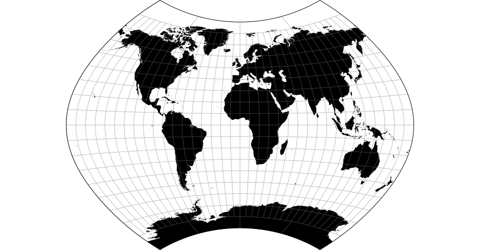
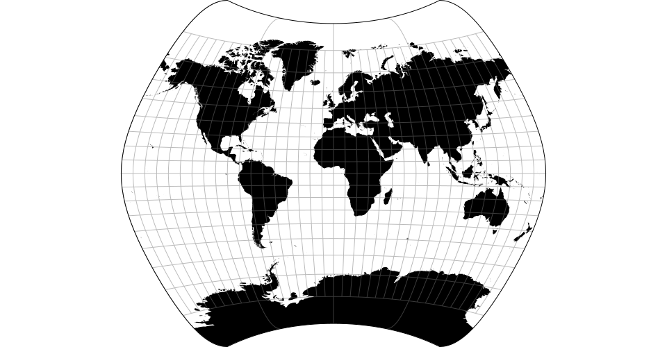
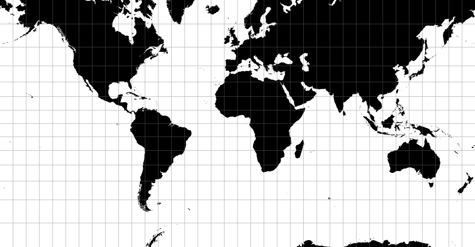

class: title

# Interactively Resolving Distortion in Nonlinear Dimensionality Reduction

<style>
.slide-background {
    background: url("figures/cover.png") no-repeat center center;
    background-size: cover;
    opacity: 0.5;
}
</style>

<div id="subtitle_left">
Slides: <a href="https://go.wisc.edu/">go.wisc.edu/1s4gi3</a><br/>
Lab: <a href="https://measurement-and-microbes.org">measurement-and-microbes.org</a> <br/>
</div>
<div id="subtitle_right">
Kris Sankaran <br/>
IISA 2025
14 | June | 2025 <br/>
</div>

<!-- 20 minute talk -->

```{r, echo = FALSE, warning = FALSE}
library(knitr)
library(RefManageR)

opts_chunk$set(echo = FALSE, message = FALSE, warning = FALSE, cache = FALSE, dpi = 200, fig.align = "center", fig.width = 6, fig.height = 3)
BibOptions(
  check.entries = FALSE,
  bib.style = "numeric",
  cite.style = "numeric",
  style = "markdown",
  hyperlink = FALSE,
  dashed = FALSE,
  max.names = 1
)
bib <- ReadBib("references.bib")
```

---

### Map Distortions

 When making maps, we know that any projection introduces some degree of
 distortion. It's impossible to map the 3D earth into a 2D map while preserving
 all metric properties.
 
 .center[
 
 
 
 ]

---

### High-Dimensional Distortions

The same is true for high-dimensional data. Despite the popularity of nonlinear
dimensionality reductions like UMAP and t-SNE, we know that they introduce
distortions.

---

### High-Dimensional Distortions

 for example, they may not preserve density within different regions of the plot

---

### High-Dimensional Distortions

Similarly, they can create an artificial smoothness in the appearance of a
random walk in high dimensions.

---

### Consequences

 These are not mere technical curiosities -- they can significantly impact
 scientific interpretation. For example, UMAP distortions have been known to
 create the appearance of spurious cell types.

---

### Approach

1. Create software that makes previously defined measures of distortion easily
accessible.

1. Use interactive visualization to clearly present these additional distortion
metrics.

---

.center[
## Distortion Metrics
]

---

### Local Geometry

---

### Neighborhood Preservation

---

.center[
## Visualizations
]

---

### PBMC Dataset

This is a standard single cell gene expression data set used in the introductory
UMAP tutorial in the scanpy package. We will see that even this tutorial example
can be improved by overlaying distortion information.

---

### Broken Neighborhoods


---

### Local Isometrization

---

.center[
## Examples
]

---

### Unequal Variances

---

### Mammoth

---

### Links

---

### Hydra Cell Atlas

---

### References

```{r, results='asis', echo = FALSE}
PrintBibliography(bib, start = 1, end = 13)
```

---

### References

```{r, results='asis', echo = FALSE}
PrintBibliography(bib, start = 14, end = 28)
```
---