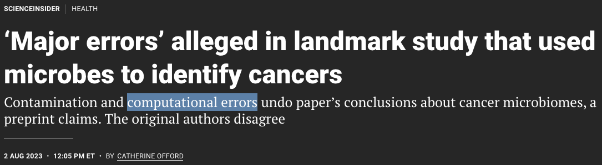
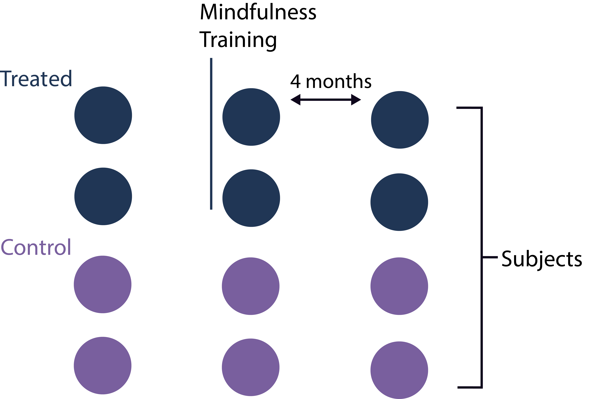
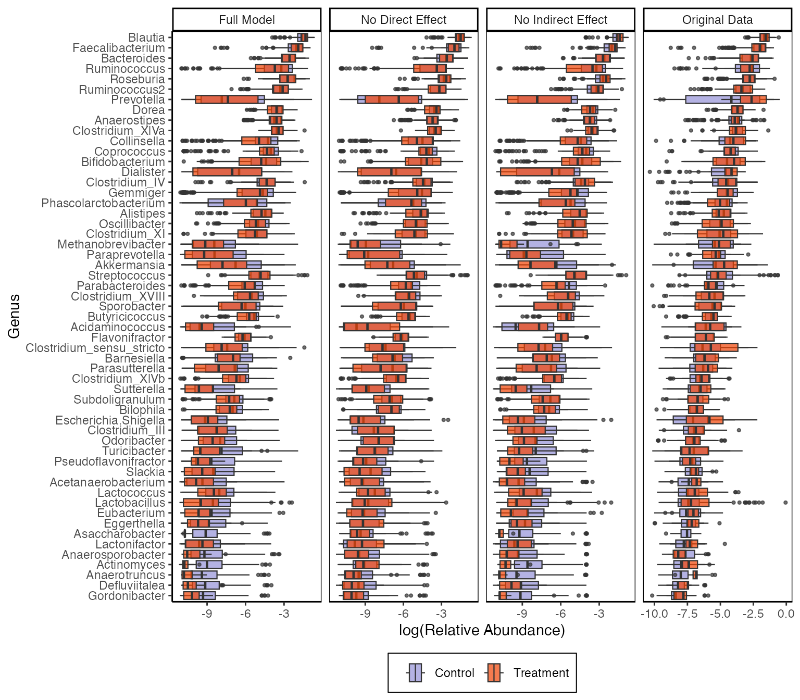

class: title

# Semisynthetic Controls and Cancer Microbiome Analysis

<style>
.slide-background {
    background: url("figures/cover.png") no-repeat center center;
    background-size: cover;
    opacity: 0.5;
}
</style>

<div id="subtitle_left">
Slides: <a href="https://go.wisc.edu/02hl09">go.wisc.edu/02hl09</a><br/>
Paper: <a href="https://go.wisc.edu/p12o8w">go.wisc.edu/p12o8w</a><br/>
Lab: <a href="https://measurement-and-microbes.org">measurement-and-microbes.org</a> <br/>
</div>
<div id="subtitle_right">
Kris Sankaran <br/>
<a href="https://symposium2025.icsa.org/">ICSA 2025</a><br/>
17 | June | 2025 <br/>
</div>

<!-- 20 minute talk -->

```{r, echo = FALSE, warning = FALSE}
library(knitr)
library(RefManageR)

opts_chunk$set(echo = FALSE, message = FALSE, warning = FALSE, cache = FALSE, dpi = 200, fig.align = "center", fig.width = 6, fig.height = 3)
BibOptions(
  check.entries = FALSE,
  bib.style = "numeric",
  cite.style = "numeric",
  style = "markdown",
  hyperlink = FALSE,
  dashed = FALSE,
  max.names = 1
)
bib <- ReadBib("references.bib")
```

---

exclude: true

### Outline

1. Cancer and the microbiome
  - Recent developments
  - Statistical challenges

1. Semisynthetic Data
  - Conceptual overview
  - Analysis examples

---

.center[
## Cancer and the Microbiome
]

---

### Overview

The relationship between the microbiome and cancer is well-established but
complex `r Citep(bib, c("Gopalakrishnan2018", "Liu2022", "Helmink2019", "Cullin2021"))`.

1. Microbes can alter (1) gene pathways, (2) immunological activity, and (3)
metabolic environments in ways that can accelerate or protect against cancer
development or progression.

1. The microbiome, unlike the human genome, is potentially alterable.
Researchers are studying ways it can be optimized to improve treatment.

---

### Carcinogenesis - Direct

.pull-left[
Some species can promote cancer. For example, `r Citep(bib, "Castellarin2011")` found enrichment of _F. nucleatum_ in matched colorectal
cancer vs. healthy tissue. These bacteria can bind to cell surfaces and activate
cancer-inducing cytokines.
]

.pull-right[
  <div class="caption">
  
  <br/>
  A summary of pathways triggered by an oncogenic microbe from `r Citep(bib, "Cullin2021")`.
  </div>
]

---

### Carcinogenesis - Indirect

.pull-left[
In a mouse model of liver cancer, `r Citep(bib, c("Ma2018"))` found that the microbiome
can produce metabolites that convert primary to secondary bile acids. 

The primary bile acids up-regulate CXCL16 production, which protects against
metastasis -- the microbiome weakens this effect.
]

.pull-right[
  <div class="caption">
  <br/>
  Figure from `r Citep(bib, "Hartmann2018")`.
  </div>
]

---

### Chemotherapy

Microbiome changes induced by chemotherapy can exacerbate adverse events, like
diarrhea and mucositis, which then limit the dosage and duration of chemotherapy
treatments `r Citep(bib, c("Arthur2012", "Lightfoot2013", "Chalif2025"))`.
<br/>
<br/>

.center[
  <div class="caption">

Figure adapted from `r Citep(bib, "Francescone2014")`.
</div>
]

---

### Immune Checkpoint Inhibitors

.pull-left[
Gut microbiome composition has been associated with the effectiveness of immune
checkpoint inhibitors `r Citep(bib, "Vetizou2015", "sivan2015commensal")`. This fact has
been exploited in clinical trials where participants undergo FMT before
immunotherapy treatment.
]

.pull-right[
  <div class="caption">
  
  Figure adapted from `r Citep(bib, "Vetizou2015")`.
  </div>
]

---

### Drug Delivery

There are bacteria that are known to home in on tumor environments. The study 
`r Citep(bib, "Din2016")` engineered a system for delivering them through
alternating periods of periodic growth and lysis.

.center[
  <div class="caption">
  
  Figure adapted from `r Citep(bib, "Din2016")`.
  </div>
]

---

### Statistical Challenges

> Technically, such big data harmonization and integration is far from trivial, while "in-house" methodologies, even when applied to the same datasets, may lead to nonoverlapping conclusions"

  -- _Microbiome and cancer_ `r Citep(bib, "Cullin2021")`

> Overall, there is not a great deal of overlap between specific bacterial taxa associated with response [to therapy]...differences may be related to several different factors--including differences in techniques used to analyze samples...suggesting the importance of developing standardized approaches for microbiome analysis.

  -- _The influence of the gut microbiome on cancer, immunity, and cancer immunotherapy_ `r Citep(bib, "Gopalakrishnan2018")`

---

.center[
## Simulation 
]

---

### Data Analysis Controversy `r Citep(bib, "retraction2024")`

.center[
    
]

In June 2024, _Nature_ retracted a paper `r Citep(bib, "Poore2020")` the claimed
identify microbiome signatures of cancer. This came after one year's worth of
debate `r Citep(bib, c("Gihawi2023", "SepichPoore2023", "SepichPoore2024"))`
about the data analysis.

---

### Data Analysis Controversy `r Citep(bib, "retraction2024")`

.center[
    
]

The "disease signature" was an artifact resulting from the use of a batch effect
correction method.  Before we can understand the nuances of the story, we need
to learn about batch effects and correction methods.

---

### Simulation to Resolve Controversy

Gerry Tonkin-Hill has an excellent re-analysis `r Citep(bib, "githubGitHubGtonkinhillTCGA_analysis")` of the data from `r Citep(bib, "Poore2020")` which sheds light what were likely the source of the phantom
signals. The first part is a simulation.

.pull-left[

]
.pull-right[

]

---

### Simulation and Supervised Normalization

This setting is balanced -- each condition is equally likely across batches. In
this case, SVN batch effect correction `r Citep(bib, "mecham2010supervised")`
works well.

.pull-left[

]
.pull-right[

]

---

### Simulation and Supervised Normalization

But what happens if there is imbalance?

.pull-left[

]
.pull-right[

]

---

### Simulation and Supervised Normalization

In this case, the SVN correction introduces an artificial difference.

.center[

]

This should cause concern about the original analysis: Hospitals specialize in
cancer types. Then again, this simulation is quite unrealistic.

---

### Why Simulate?

Simulations lie behind the many types of skills microbiome statisticians must master `r Citep(bib, c("Sankaran2023", "Sankaran2024-gb"))`. They help us to...

 **Design experiments** that have high power to detect subtle signals.
<br/>

 **Benchmark methods** and identify gaps in the literature.
<br/>

 **Check conclusions** that might be sensitive to technical processing steps.

It's worthwhile to treat simulation design with the same formality as methods
development.

---

### Semisynthetic Data

One of the major advances has been the design of algorithms that can leverage
public data resources, like `r Citep(bib, c("Pasolli2017AccessibleCM", "Muller2022", "microbiomedatasets", "microbiomedataHomeNational"))`.

* **Semisynthetic Data**: The output from a simulator that has been designed to mimic external, template data. 
* **Template Data**: Previously gathered experimental data that can be used to train a simulator.

.center[

]

---

### Example 1: Microbiome Network Inference

1. Benchmarking methods for microbiome network inference is challenging. We
can't directly observe microbe-microbe interactions, which stands in the way of
ground truth labeling.

1. We use the following choices in the design of our simulation,

- **Template**: American Gut Project (261 samples, 45 most abundant taxa)
- **Estimator**: Zero-Inflated Negative Binomial Copula
- **Goodness-of-Fit**: Graphical Checks
- **Ground Truth**: Copula correlation matrix
- **Summarization**: Estimated vs. ground-truth correlation

---

### Simulation Mechanism

We used scDesign3 `r Citep(bib, "Song2023")` to estimate a
Zero-Inflated Negative Binomial Copula with the formula `~ log(sequencing_depth) + BMI` for each taxon. These are example simulated marginals.

.center[

]

---

### Estimated Correlation

The resulting correlation estimate lacks substantial banding or blocks. We can
also sanity check some of the highly correlated pairs.

.pull-left[

]
.pull-right[

]

---

### Establishing Ground Truth

To create a basis for methods comparison, we modified the ZINB copula to use a
block correlation matrix with varying intra-block correlation strength.

.center[
  
]

---

### Methods Comparison

We compared SpiecEasi `r Citep(bib, "Kurtz2015-tf")`, a method designed for microbiome networks,
with the Ledoit-Wolf estimator `r Citep(bib, "Ledoit2004")` on $\log\left(1 + x\right)$ transformed counts.

.center[
  
]

---

### Methods Comparison

We compared SpiecEasi `r Citep(bib, "Kurtz2015-tf")`, a method designed for microbiome networks,
with the Ledoit-Wolf estimator `r Citep(bib, "Ledoit2004")` on $\log\left(1 + x\right)$ transformed counts.

.center[
  
]

---

### Generalizing

In our review, we consider a wider range of underlying correlation matrices.

.center[
  
]

---

### Example 2: Mediation Analysis

Working with microbiologists and psychologists at UW-Madison, we re-analyzed a
dataset about the gut-brain axis.

.pull-left[
1. We re-analyzed the study `r Citep(bib, "Grupe2021")`, which gathered data
from 54 participants assigned to either a mindfulness training intervention or a
waitlist control (n = 27 each).

1. The training lasted 2 months. Data were collected at the start, finish, and 2
month follow-up.
]

.pull-right[

]

---

### Mediation Analysis

1. We wondered whether mindfulness intervention might affect behavior, which
in turn influences microbiota composition.
2. To explore this, we applied a form of mediation analysis to the 16S
microbiome and survey data `r Citep(bib, c("imai2010general", "sohn2019compositional"))`.

.center[

]

---

### Synthetic Null Data

We can alter the simulator so that some pathways are "turned off." Estimates
derived from these data provide a reference null distribution.

.center[
<br/>
<span style="font-size: 24px;">
The middle panel comes from a synthetic null: $T \nrightarrow M \to Y$.
</span>
]

---

These are analogous comparisons for the simulated microbiomes.
.center[
<br/>
]

---

exclude: true

### Synthetic Null Hypothesis Testing

Let 
$\left(\hat{\theta}_{d}^{0}\right)_{d = 1}^{D}$ 
and $\left(\hat{\theta}_{d}^{1}\right)_{d = 1}^{D}$ 
be estimates derived on the real and the semisynthetic data, respectively.  We
rank the effects learned from both the real and synthetic null reference data.
The significance threshold is chosen to control the empirical false discovery
based on synthetic data.

\begin{align*}
\widehat{\text{FDR}}(t) := \frac{\# \left\{ d : \left| \hat{\theta}_{d}^{0} \right| > t \right\}}{\# \left\{ d : \left| \hat{\theta}_{d}^{0} \right| > t \right\} + \# \left\{ d : \left| \hat{\theta}_{d}^{1} \right| > t \right\}}
\end{align*}

---

### Synthetic Null Hypothesis Testing

We rank the effects learned from both the real and synthetic null reference
data. The significance threshold is chosen to control the empirical false
discovery based on synthetic data.

.center[

]

---

### Software and Resources

All the examples I discussed today can be run from online tutorials we've
written to accompany our papers:

* Simulation for Microbiome Analysis ([go.wisc.edu/wnj5p9](https://go.wisc.edu/wnj5p9))
* Generative Models Examples ([go.wisc.edu/ax73qb](https://go.wisc.edu/ax73qb))

The relevant R packages behind these analyses are:

* `multimedia` - Mediation analysis for microbiome data `r Citep(bib, "Jiang2025")`.
* `scDesign3` - An existing simulator for single cell data `r Citep(bib, c("Li2019", "Sun2021", "Song2023"))`.
* `scDesigner` - Under-development version used in the first tutorial.

---

Simulation turns abstract, conceptual questions into simple empirical ones.

.center[

]

---

.center[
### Thank you!
]

* Contact: ksankaran@wisc.edu
* Lab Members: Margaret Thairu, Hanying Jiang, Shuchen Yan, Yuliang Peng, Langtian Ma, Helena Huang
* Funding: NIGMS R01GM152744, NIAID R01AI184095
* Co-authors: Hanying Jiang, Xinran Miao, Mara Beebe, Dan W. Grupe, Richie
Davidson, Jo Handelsman, Saritha Kodikara, Jingyi Jessica Li, Kim-Anh Lê Cao,
Susan Holmes

---

class: reference

### References

```{r, results='asis', echo = FALSE}
PrintBibliography(bib, start = 1, end = 12)
```

---

class: reference

### References

```{r, results='asis', echo = FALSE}
PrintBibliography(bib, start = 13, end = 24)
```

---

class: reference

### References

```{r, results='asis', echo = FALSE}
PrintBibliography(bib, start = 25, end = 40)
```

---

### Evaluation Taxonomy

This is how some common techniques fall into this taxonomy.

* **Graphical, Narrow**: Boxplots or cumulative distribution function plots comparing real vs. simulated taxa (like the DA example).

* **Graphical, Broad**: Principal component plots of real vs. simulated dataset.

* **Quantitative, Narrow**: Two-sample Kolmogorov-Smirnov test.

* **Quantitative, Broad**: Evaluation through classification (next example).

* **Fit-for-Purpose**: Linear model coefficients on real vs. simulated data (`r Citep(bib, "Sankaran2024-gb")`, "Batch Effect Correction").

---

### SPLS-DA Intuition

We "blend" columns of $\mathbf{X}$ and $\mathbf{Y}$ within tables until the patterns look similar.

.center[

]

Roughly, choose weights $\mathbf{a}$ and $\mathbf{b}$ to maximize
$\text{cor}\left(\mathbf{Xa}, \mathbf{Yb}\right)$.

---

### SPLS-DA Intuition

We "blend" columns of $\mathbf{X}$ and $\mathbf{Y}$ within tables until the patterns look similar.

.center[

]

Roughly, choose weights $\mathbf{a}$ and $\mathbf{b}$ to maximize
$\text{cor}\left(\mathbf{Xa}, \mathbf{Yb}\right)$.


---

### SPLS-DA Intuition

We "blend" columns of $\mathbf{X}$ and $\mathbf{Y}$ within tables until the patterns look similar.

.center[

]

Roughly, choose weights $\mathbf{a}$ and $\mathbf{b}$ to maximize
$\text{cor}\left(\mathbf{Xa}, \mathbf{Yb}\right)$.

---

### SPLS-DA Intuition

We "blend" columns of $\mathbf{X}$ and $\mathbf{Y}$ within tables until the patterns look similar.

.center[

]

Roughly, choose weights $\mathbf{a}$ and $\mathbf{b}$ to maximize
$\text{cor}\left(\mathbf{Xa}, \mathbf{Yb}\right)$.

---

### SPLS-DA Intuition

Now we can compare samples from the two tables in a single, shared space.

.center[

]

---

### SPLS-DA Intuition

Now we can compare samples from the two tables in a single, shared space.

.center[

]

---

### SPLS-DA Intuition

To get more than one dimension, we can repeat this process after removing any
correlation with previously found patterns.

.center[

]

---

### Copula Models

More formally, let $F_{1}, \dots, F_{D}$ be the target margins and let $\Phi$ be
the CDF of the Gaussian distribution. Gaussian Copula modeling has these steps.

Estimate:

1. Gaussianize the observed $\mathbf{x}_{i}$ to $\mathbf{z}_{i} := \left[\Phi^{-1}\left(F_{1}\left(x_{i1}\right)\right), \dots, \Phi^{-1}\left(F_{D}\left(x_{iD}\right)\right)\right]$
1. Estimate the covariance $\hat{\Sigma}$ associated with $z_{i}$

Simulate:

1. Draw $\mathbf{z}^\ast \sim \mathcal{N}\left(0, \Sigma\right)$ 
1. Transform back $\mathbf{x}^{\ast} := \left[F_{1}^{-1}\left(\Phi\left(z_{i1}^\ast\right)\right), \dots, F_{D}^{-1}\left(\Phi\left(z_{iD}^\ast\right)\right)\right]$

---

### Real vs. Simulated Correlation

.center[

]

A detailed explanation is given [here](https://krisrs1128.github.io/microbiome-simulation/multivariate-power-analysis.html#evaluation).

---

### Tuning High-Dimensional Covariance Estimator

.center[

]

A detailed explanation is given [here](https://krisrs1128.github.io/microbiome-simulation/multivariate-power-analysis.html#evaluation).

---

### Intuition

* In the Gaussianized space, it's easy to model correlation.
* The mapping back and forth is possible because we know the margins $F$.
  - $\Phi$ represents the Gaussian CDF applied componentwise
<br/>
<br/>

.center[

]

---

### Pilot Study

.pull-left[
1. We re-analyzed a pilot study from 2021 `r Citep(bib, "Grupe2021")`, which
gathered data from 54 participants randomly assigned to either a mindfulness
training intervention or a waitlist control (n = 27 each).

1. The training lasted 2 months. Data were collected at the start, finish, and 2
month follow-up.
]

.pull-right[

]

---

### Estimated Indirect Effects

These figures summarize the paths $T \to M \to Y$.</br>
(i.e., color $\to$ x-axis $\to$ y-axis).

.center[

]

---

### Figure Sources

frustration by Rikas Dzihab from <a href="https://thenounproject.com/browse/icons/term/frustration/" target="_blank" title="frustration Icons">Noun Project</a> (CC BY 3.0)

confused by Rikas Dzihab from <a href="https://thenounproject.com/browse/icons/term/confused/" target="_blank" title="confused Icons">Noun Project</a> (CC BY 3.0)

Benchmark by Sofiah from <a href="https://thenounproject.com/browse/icons/term/benchmark/" target="_blank" title="Benchmark Icons">Noun Project</a> (CC BY 3.0)

checkmark by Asa Kharisma Dini from <a href="https://thenounproject.com/browse/icons/term/checkmark/" target="_blank" title="checkmark Icons">Noun Project</a> (CC BY 3.0)

Lab glassware by Vectors Market from <a href="https://thenounproject.com/browse/icons/term/lab-glassware/" target="_blank" title="Lab glassware Icons">Noun Project</a> (CC BY 3.0)
