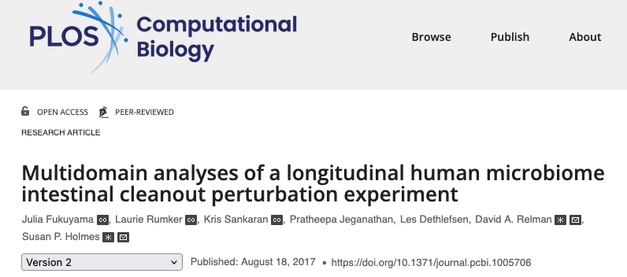
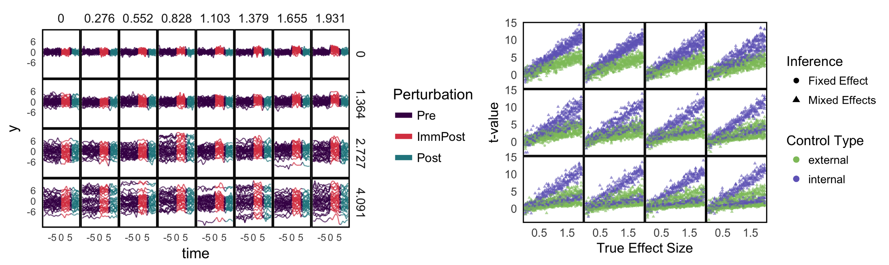
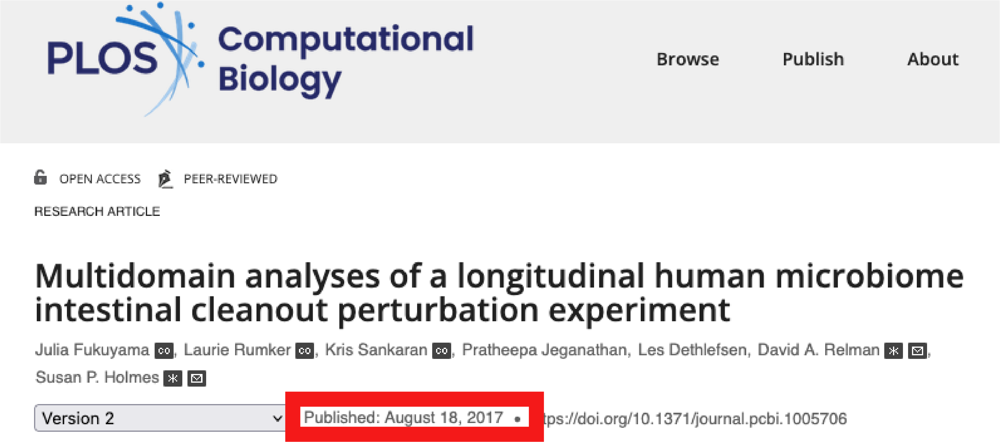
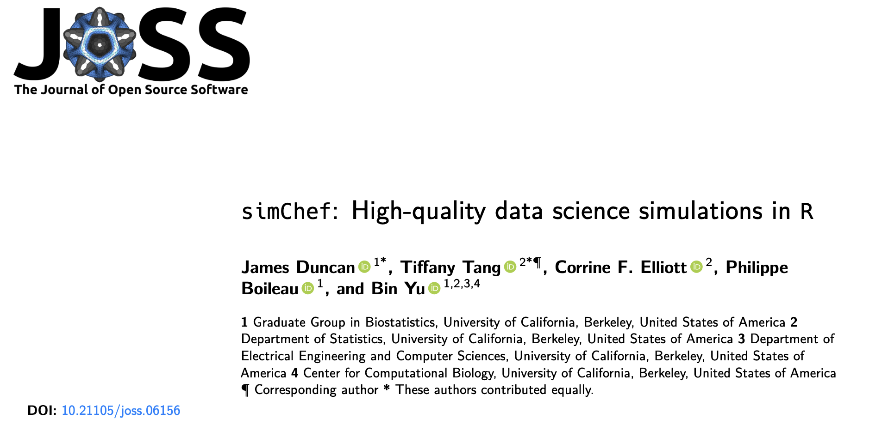
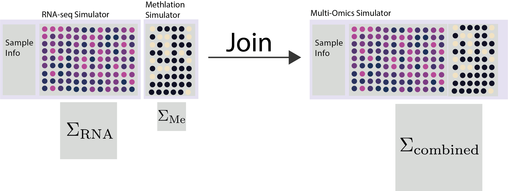

class: title

# Towards Veridical Microbiome Analysis through Semisynthetic Data

<style>
.slide-background {
    background: url("figures/cover.png") no-repeat center center;
    background-size: cover;
    opacity: 0.5;
}
</style>

<div id="subtitle_left">
Slides: <a href="https://go.wisc.edu/5q8xvl">go.wisc.edu/5q8xvl</a><br/>
Paper: <a href="https://go.wisc.edu/p12o8w">go.wisc.edu/p12o8w</a><br/>
Lab: <a href="https://measurement-and-microbes.org">measurement-and-microbes.org</a> <br/>
</div>
<div id="subtitle_right">
Kris Sankaran <br/>
<a href="https://www.eventbrite.com/e/veridical-data-science-for-biology-2025-tickets-1384456339179/">VDSB 2025</a><br/>
11 | July | 2025 <br/>
</div>

<!-- 20 minute talk, 3 min Q&A -->

```{r, echo = FALSE, warning = FALSE, message = FALSE}
library(RefManageR)
library(gamboostLSS)
library(gamlss)
library(knitr)
library(splines)
library(scDesigner)
library(tidyverse)

opts_chunk$set(echo = FALSE, message = FALSE, warning = FALSE, cache = TRUE, dpi = 200, fig.align = "center", fig.width = 6, fig.height = 3)
BibOptions(
  check.entries = FALSE,
  bib.style = "numeric",
  cite.style = "numeric",
  style = "markdown",
  hyperlink = FALSE,
  dashed = FALSE,
  max.names = 1
)
bib <- ReadBib("references.bib")
```

---

### An Early Simulation Study

The supplement to `r Citep(bib, "Fukuyama2017")` considers some experimental
design questions,

> [We] discussed the motivation behind dividing each subject into treatment and
control timepoints, rather than allocating separate study subjects as
controls...  To quantitatively characterize the impact of this choice, we
performed this simulation experiment...

.center[

]

---

How do internal and external controls compare in longitudinal microbiome
analysis?

- Rows: Increasing subject-to-subject variability.
- Columns: Increasing perturbation effect size.

.center[

]

---

Sometimes it takes a long time to appreciate the things you understood as a
beginner...

.center[

]

---

### Why Simulate?

Simulations underlie the skills microbiome statisticians must master 
`r Citep(bib, c("Sankaran2023", "Sankaran2024-gb"))`. They help us to...

 **Design experiments** that have high power to detect subtle signals.
<br/>

 **Benchmark methods** and identify gaps in the literature.
<br/>

 **Check conclusions** that might be sensitive to technical processing steps.

It's worthwhile to treat simulation design with the same formality as methods
development.

---

### Semisynthetic Data

One of the major advances has been the design of algorithms that can leverage
public data resources, like `r Citep(bib, c("Pasolli2017AccessibleCM", "Muller2022", "microbiomedatasets", "microbiomedataHomeNational"))`.

* **Semisynthetic Data**: The output from a simulator that has been designed to mimic external, template data. 
* **Template Data**: Previously gathered experimental data that can be used to train a simulator `r Citep(bib, "Sankaran2024-gb")`.

.center[

]

---

### Existing Interfaces

This is from the [`splatter` introductory vignette](https://bioconductor.org/packages/devel/bioc/vignettes/splatter/inst/doc/splatter.html#2_Quickstart) `r Citep(bib, "Zappia2017SplatterSO")`. 
It has a thoughtfully designed interface and has been used to critique
microbiome studies `r Citep(bib, "githubGitHubGtonkinhillTCGA_analysis")`.

```{r, eval = FALSE, echo = TRUE}
params <- setParams(params, mean.shape = 0.5, de.prob = 0.2)
params
#> A Params object of class SplatParams 
#> Parameters can be (estimable) or [not estimable], 'Default' or  'NOT DEFAULT' 
#> Secondary parameters are usually set during simulation
#> 
#> Global: 
#> (GENES)  (Cells)   [SEED] 
#>    8000      100   694289 
#> 
#> 29 additional parameters 
#> 
#> Batches: 
#>     [Batches]  [Batch Cells]     [Location]        [Scale]       [Remove] 
#>             1            100            0.1            0.1          FALSE 
#> 
#> Mean: 
#>  (RATE)  (SHAPE) 
#>     0.5      0.5 
```

---

### Existing Interfaces

.pull-left[
Here is an example from [`scDesign3`](https://songdongyuan1994.github.io/scDesign3/docs/articles/scDesign3.html) `r Citep(bib, "Song2023scDesign3GR")`.
This package has the most generally applicable statistical methodology.
]

.pull-right[
```{r, eval = FALSE, echo = TRUE}
example_simu <- scdesign3(
    sce = example_sce,
    assay_use = "counts",
    celltype = "cell_type",
    pseudotime = "pseudotime",
    spatial = NULL,
    other_covariates = NULL,
    mu_formula = "s(pseudotime, k = 10, bs = 'cr')",
    sigma_formula = "1", # If you want your dispersion also varies along pseudotime, use "s(pseudotime, k = 5, bs = 'cr')"
    family_use = "nb",
    n_cores = 2,
    usebam = FALSE,
    corr_formula = "1",
    copula = "gaussian",
    DT = TRUE,
    pseudo_obs = FALSE,
    return_model = FALSE,
    nonzerovar = FALSE
  )
```
]

---

### Challenges

Simulation interfaces often suffer from what researchers in human-computer interfaces call interaction gulfs `r Citep(bib, "Hutchins1985-oz")`. 
It is hard to quickly specify a data generating process, evaluate its properties, and then iterate.

.center[

]

---

<g style="font-size: 36px">
<b>Main Idea: Apply interactive computing principles to multi-omics simulation.</b>
</g>

 <span style="color:#025E73">Modularity</span>: We should be able to build
problem-specific simulators by composing simple pieces.

 <span style="color:#D94E4E">Interactivity</span>: We should give domain
researchers agency in designing, evaluating, and modifying statistical
hypotheses.

 <span style="color:#378C5C">Cooperation</span>: Science is a social activity, and good
tools  allow researchers to build upon one another's work.

---

### Related: simChef

The simChef package `r Citep(bib, "Duncan2024")` simplifies simulator
specification and execution through a tidy interface and parallel computation.
Our study focuses on how to create DGP modules for high-dimensional omics
applications.

.center[

]

---

### `scDesign3` Review

The rest of the talk will be about preparing a tidy-like interface fo
`scDesign3` `r Citep(bib, "Song2023scDesign3GR")`.  Let's review that package's approach.

.center[

]

First, we estimate models $\hat{F}_{g}\left(y_{i} \vert \mathbf{x}_{i}\right)$ for each gene $g$.

* Can use a variety of families: Gaussian, Poisson, Negative Binomial,...
* Can learn relationships for each parameter $\theta\left(\mathbf{x}_{i}\right)$.

---

### `scDesign3` Review

.pull-left[

]

.pull-right[
1. Next, we model the joint distribution of quantiles using a copula model.

1. This correlates genes even after conditioning on the same $\mathbf{x}_{i}$.
]

---

### Nouns & Verbs

We can break the interface design question into two parts.

1. **Data Structures**: How can we represent the simulator in a way that is both
transparent to a human and precise enough for a computer?

1. **Operations**: How can we encourage users to study and tinker with the data
structures?

If the resulting grammar is expressive enough, then researchers will be able to
solve problems we may not have anticipated.

```{r, read_data, echo = FALSE}
sce <- readRDS(url("https://go.wisc.edu/77uf3h"))[1:10, ]
```

---

### Verbs: <span style="color:#025E73">Mutate</span>

1. This example is from a longitudinal microbiome study about the proteins 
present in a mouse model of Huntington's Disease `r Citep(bib, "kong2020microbiome")`.
2. We can use `mutate` to define a synthetic null with no disease effect for a known subset of genes.

.pull-three-quarters-left[

]
.pull-three-quarters-right[

]

---

### Verbs: <span style="color:#025E73">Mutate</span>

1. This example is from a longitudinal microbiome study about the proteins 
present in a mouse model of Huntington's Disease 
`r Citep(bib, "kong2020microbiome")`.
2. We can use `mutate` to define a synthetic null with no disease effect for a known subset of genes.

.pull-three-quarters-left[

]
.pull-three-quarters-right[

]

---

### Verbs: <span style="color:#025E73">Join</span>

We should make it possible to combine simulators like Lego blocks.
```{r, echo = FALSE}
SCGEMMETH_sce <- readRDS(url("https://go.wisc.edu/q712e3"))
SCGEMRNA_sce <-readRDS(url("https://go.wisc.edu/9n6u1y"))

rownames(SCGEMMETH_sce) <- make.names(rownames(SCGEMMETH_sce))
rownames(SCGEMRNA_sce) <- make.names(rownames(SCGEMRNA_sce))
```

```{r illustrate_joins}
experiments <- list(methylation = SCGEMMETH_sce, rna = SCGEMRNA_sce)
families <- list(~ BI(), ~ GaussianLSS())
sims <- experiments |>
  map2(families, \(x, y) setup_simulator(x, ~ cell_type, y))
```


---

### Verbs: <span style="color:#025E73">Join</span> (Copula)

One approach is to merge the list of marginal distributions and re-estimate the joint distribution.

```{r, join_simulators_glasso, eval = FALSE}
sim_joined <- map(sims, estimate, nu = 0.1) |>
  join_copula(copula_glasso())
```

This assumes that we have samples where all features are measured.

.center[

]

---

### Verbs: <span style="color:#025E73">Join</span> (Conditioning)

Alternatively, we can combine two simulators by conditioning them on shared latent structure.

```{r join_simulators}
sim_joined <- join_pamona(sims)
```

.center[

]

---

### Example: Microbiome Network Inference

1. Benchmarking methods for microbiome network inference is challenging. We
can't directly observe microbe-microbe interactions, which stands in the way of
ground truth labeling.

1. We use the following choices in the design of our simulation,

- **Template**: American Gut Project (261 samples, 45 most abundant taxa)
- **Estimator**: Zero-Inflated Negative Binomial Copula
- **Goodness-of-Fit**: Graphical Checks
- **Ground Truth**: Copula correlation matrix
- **Summarization**: Estimated vs. ground-truth correlation

---

### Simulation Mechanism

Here are samples from the Zero-Inflated Negative Binomial Copula with the
covariates `~ log(sequencing_depth) + BMI`. Each panel compares real vs.
simulated data for one taxon.

.center[

]

---

### Estimated Correlation

The resulting correlation estimate lacks substantial banding or blocks. We can
also sanity check some of the highly correlated pairs.

.pull-left[

]
.pull-right[

]

---

### Establishing Ground Truth

To create a basis for methods comparison, we modified the ZINB copula to use a
block correlation matrix with varying intra-block correlation strength.

.center[
  
]

---

### Methods Comparison

We compared SpiecEasi `r Citep(bib, "Kurtz2015-tf")`, a method designed for microbiome networks,
with the Ledoit-Wolf estimator `r Citep(bib, "Ledoit2004")` on $\log\left(1 + x\right)$ transformed counts.

.center[
  
]

---

### Methods Comparison

We compared SpiecEasi `r Citep(bib, "Kurtz2015-tf")`, a method designed for microbiome networks,
with the Ledoit-Wolf estimator `r Citep(bib, "Ledoit2004")` on $\log\left(1 + x\right)$ transformed counts.

.center[
  
]

---

### Generalizing

In our review, we consider a wider range of underlying correlation matrices.

.center[
  
]

---

### Future Work

We've led workshops to get feedback on our package, and two questions repeatedly
arise:

1. Is there any way to make this faster?
1. How can I know when my simulator is good enough?

We've been adapting literature on scalable GLM modeling and model diagnostics 
`r Citep(bib, "Sankaran2023")` to answer these questions.

---

### Bigger Picture

1. Communicating hypothetical experimental outcomes effectively is one of the
biggest challenges of any collaborative computational biology project.
Simulation can help!

1. In statistics research, simulation is at once familiar yet underappreciated.

Analogy...

> That a composer of symphonies and operas would consider a ballet score his
best work was remarkable for the time... ballet was something of a neglected
stepchild as far as the musical world was concerned. 
-- From `r Citep(bib, "houstonsymphony")`

---

### Software and Resources

All the examples I discussed today can be run from online tutorials:

* Simulation for Microbiome Analysis ([go.wisc.edu/wnj5p9](https://go.wisc.edu/wnj5p9))
* Generative Models Examples ([go.wisc.edu/ax73qb](https://go.wisc.edu/ax73qb))

Our workshop materials are online:

* UW-Madison Plant Pathology [slides](https://krisrs1128.github.io/talks/2024/20240207/20240207.html#1), [colab](https://colab.research.google.com/drive/1IyMEQJwkslPzL9FYd5atvyGORqW9IrCI?usp=sharing)
* UniMelb Integrative Genomics [notebooks](https://github.com/krisrs1128/intro-to-simulation/), slides [1](https://go.wisc.edu/54tmr9), [2](https://go.wisc.edu/rc776i), [3](https://go.wisc.edu/gfj36r).

The relevant R packages behind these analyses are:

* `multimedia` - Mediation analysis for microbiome data `r Citep(bib, "Jiang2025")`.
* `scDesign3` - An existing simulator for single cell data `r Citep(bib, c("Li2019", "Sun2021", "Song2023scDesign3GR"))`.
* `scDesigner` - Under-development version used in the first tutorial.

---

### Thank you!

* Contact: ksankaran@wisc.edu
* Lab Members: Margaret Thairu, Hanying Jiang, Shuchen Yan, Yuliang Peng, Helena Huang
* Funding: NIGMS R01GM152744, NIAID R01AI184095

---

class: reference

### References

```{r, results='asis', echo = FALSE}
PrintBibliography(bib, start = 1, end = 13)
```

---

class: reference

### References

```{r, results='asis', echo = FALSE}
PrintBibliography(bib, start = 14, end = 27)
```


---

### Nouns: Gene-Level Models

For each gene, we can specify the regression formula and distributional family.

```{r, setup_margins}
margins <- setup_margins(sce, ~ ns(pseudotime, 3),  ~ ZINBLSS())
margins
```

```{r, estimate_margins, echo = FALSE}
margins <- estimate(margins, sce)
```

---

### Nouns: Copula Models

We can tie together a collection of marginals using a copula model.

.center[
  
]


```{r wrap_into_simulator, echo = FALSE}
simulator <- setup_simulator(
  sce,
  ~ ns(pseudotime, 3),
  ~ ZINBLSS(),
  copula = copula_gaussian()
) |>
  estimate()
```

---

### Data Analysis Controversy `r Citep(bib, "retraction2024")`

.center[
    
]

In June 2024, _Nature_ retracted a paper `r Citep(bib, "Poore2020")` that claimed
identify microbiome signatures of cancer. This came after one year's worth of
debate `r Citep(bib, c("Gihawi2023", "SepichPoore2023", "SepichPoore2024"))`
about the data analysis.

---

### Data Analysis Controversy `r Citep(bib, "retraction2024")`

.center[
    
]

The "disease signature" was an artifact resulting from the use of a batch effect
correction method.  Before we can understand the nuances of the story, we need
to learn about batch effects and correction methods.

---

### Simulation to Resolve Controversy

Gerry Tonkin-Hill has an excellent re-analysis 
`r Citep(bib, "githubGitHubGtonkinhillTCGA_analysis")` of the data from 
`r Citep(bib, "Poore2020")` which sheds light what was likely the source of the
phantom signals. The first part is a simulation.

.pull-left[

]
.pull-right[

]

---

### Simulation and Supervised Normalization

This setting is balanced -- each condition is equally likely across batches. In
this case, SVN batch effect correction `r Citep(bib, "mecham2010supervised")`
works well.
.pull-left[

]
.pull-right[

]

---

### Simulation and Supervised Normalization

But what happens if there is imbalance?

.pull-left[

]
.pull-right[

]

---

### Simulation and Supervised Normalization

In this case, the SVN correction introduces an artificial difference.
.center[  ]
This should cause concern about the original analysis: Hospitals specialize in
cancer types. Then again, this simulation is quite unrealistic.