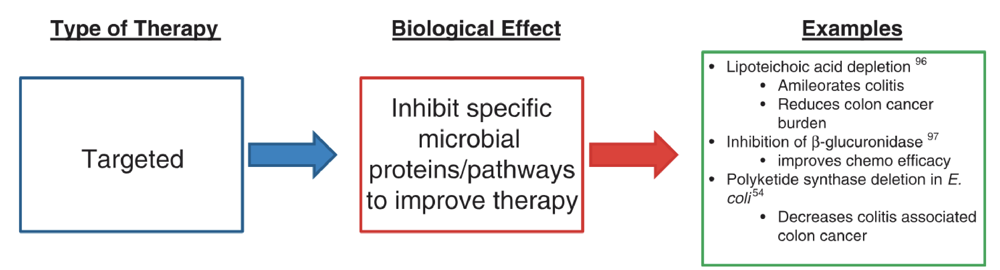
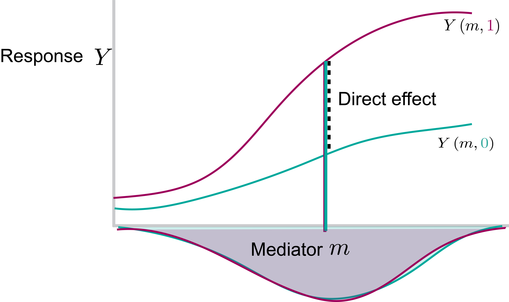
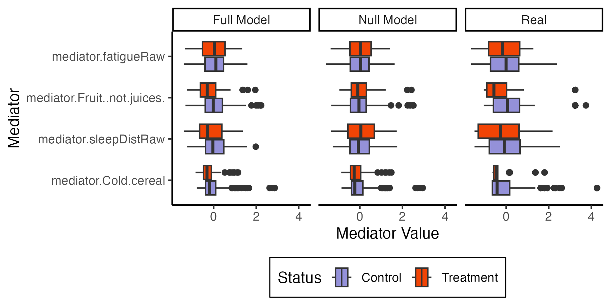

class: title

# Modular Software for Mediation Analysis of Microbiome Data

<style>
.slide-background {
    background: url("figures/cover.png") no-repeat center center;
    background-size: cover;
    opacity: 0.5;
}
</style>

<div id="subtitle_left">
Slides: <a href="https://go.wisc.edu/5ms623">go.wisc.edu/5ms623</a><br/>
Package: <a href="https://go.wisc.edu/830110">go.wisc.edu/830110</a><br/>
Lab: <a href="https://measurement-and-microbes.org">measurement-and-microbes.org</a> <br/>
</div>
<div id="subtitle_right">
Kris Sankaran <br/>
<a href="https://www.birs.ca/events/2025/5-day-workshops/25w5324/">Novel Approaches for Multi-Omics</a><br/>
17 | July | 2025 <br/>
</div>

<!-- 25 minute talk (including Q&A) -->

```{r, echo = FALSE, warning = FALSE, message = FALSE}
library(RefManageR)
library(compositions)
library(knitr)
library(phyloseq)
library(tidyverse)

opts_chunk$set(echo = TRUE, message = FALSE, warning = FALSE, cache = FALSE, dpi = 200, fig.align = "center", fig.width = 6, fig.height = 3)
BibOptions(
  check.entries = FALSE,
  bib.style = "numeric",
  cite.style = "numeric",
  style = "markdown",
  hyperlink = FALSE,
  dashed = FALSE,
  max.names = 1
)
bib <- ReadBib("references.bib")
```

$\def\Gsn{\mathcal{N}}$
$\def\Dir{\text{Dir}}$
$\def\Mult{\text{Mult}}$
$\def\diag{\text{diag}}$
$\def\*#1{\mathbf{#1}}$
$\def\Scal{\mathcal{S}}$
$\def\exp#1{\text{exp}\left(#1\right)}$
$\def\logit#1{\text{logit}\left(#1\right)}$
$\def\absarg#1{\left|#1\right|}$
$\def\E{\mathbb{E}} % Expectation symbol$
$\def\Earg#1{\E\left[{#1}\right]}$
$\def\P{\mathbb{P}} % Expectation symbol$
$\def\Parg#1{\P\left[{#1}\right]}$
$\def\m#1{\boldsymbol{#1}}$
$\def\Unif{\text{Unif}}$
$\def\win{\tilde{w}_{\text{in}}}$
$\def\reals{\mathbb{R}}$
$\newcommand{\wout}{\tilde w_{\text{out}}}$

---

### Microbiome as Mediator

We're just beginning to understand how the microbiome mediates the relationship
between environmental exposures and human health.

.center[
<div class="caption">

Figure adapted from `r Citep(bib, "Francescone2014")`.
</div>
]


Chemotherapy-induced microbiome changes can worsen adverse events, like
diarrhea and mucositis, limiting treatment dosage and duration 
`r Citep(bib, c("Arthur2012", "Lightfoot2013", "Chalif2025"))`.

---

### Alternative Mediators

More generally, for microbiome research that seeks to explain mechanisms, it is
often necssary to analyze indirect effects.

.center[
  <div class="caption">
<br/>
Figure adapted from `r Citep(bib, "Jia2023-if")`.
</div>
]

For example, _Akkermansia muciniphila_ can help regulate cholesterol levels by producing
proteins that activate important pathways for cholesterol absorption and
metabolism `r Citep(bib, "Plovier2016")`.


---

### Causal Inference Formalism

Causal mediation analysis is often a good match for carrying out these studies 
`r Citep(bib, c("Celli2021", "richiardi2013mediation"))`.  Traditional methods
from social science and epidemiology need to be adapted to reflect properties of
microbiome data 
`r Citep(bib, c("sohn2019compositional", "Wang2019", "Carter2020"))`.

.center[

]

---

### Counterfactual Notation

Under the counterfactual causal mediation analysis framework 
`r Citep(bib, c("imai2010general", "imai2010causal"))`, we imagine
counterfactuals for both mediators and outcomes, depending on treatments that we
may never have seen.

_Mediator under treatment $t$_: 
\begin{align*}
M\left(t\right)
\end{align*}

_Outcome under treatment combination_ $\left(t, t'\right)$:
\begin{align*}
Y\left(t, M\left(t'\right)\right)
\end{align*}

Note that this is not observable whenever $t \neq t'$, but we can reason about
it abstractly.

---

### Direct vs. Indirect Effects

Suppose that the treatments belong to two groups, $T \in \{0, 1\}$. Then, direct
and indirect effects are defined as

\begin{align*}
\bar{\delta} = \frac{1}{2} \sum_{t=0}^{1} \mathbb{E}\{Y(t, M(1)) - Y(t, M(0))\}\\
\bar{\zeta} = \frac{1}{2} \sum_{t'=0}^{1} \mathbb{E}\{Y(1, M(t')) - Y(0, M(t'))\}
\end{align*}

When many mediators are present, we may also want to know:

\begin{align*}
\bar{\omega}_k = \frac{1}{2} \sum_{t'=0}^{1} \mathbb{E}\{Y(t', M_k(1), M_{-k}(t')) - Y(t', M_k(0), M_{-k}(t'))\}
\end{align*}

Under appropriate sequential ignorability assumptions, these effects can be
identified (see supplemental slides).

---

### Geometric Interpretation



---

### Geometric Interpretation


---

### Geometric Interpretation


---

### Integration Challenge

Our interest in this project came from a re-analysis of a gut-brain axis
microbiome study. Participants were randomized into either a mindfulness
intervention or a control group. In this case, the the taxonomic community
composition is an outcome, and the survey measurements are mediators.

.center[

]

---

### Integration Challenge

A similar issue arises when applying mediation to support metabolomic
integration. Motivated by `r Citep(bib, "Franzosa2018")`'s discussion of the
microbiome and metabolome of inflammatory bowel disease (IBD), we could
consider:

.center[

]

---

.center[
## Package Design
]

---

### Univariate Mediation Analysis

The most straightforward implementation of mediation analysis with univariate
mediators and outcomes is a two-step linear regression:

\begin{align*}
y_i = \beta_t t_{i} + \beta_{m}m_i + \epsilon_i^y\\
m_{i} = \alpha t_i + \epsilon_{i}^{m_{i}}
\end{align*}

In this case, the direct and indirect effects are straightforward:

- Direct effect: $\beta_t$
- Indirect effect: $\alpha \beta_m$

---

### Code Interface

We could imagine writing a function to implement this analysis.

.large-code[
```{r, eval = FALSE}
model <- mediation(y, m, t)
effects(model)
```
]

But how can we adopt the more general counterfactual perspective, without
restricting ourselves to linear models?

---

### Code Interface

The `mediation` package `r Citep(bib, c("imai2010general", "imai2010causal"))`
solves this problem by instead creating an interface like:

.large-code[
```{r, eval = FALSE}
f1 <- lm(y ~ t + m)
f2 <- lm(m ~ t)
model <- mediation(f1, f2)
effects(model)
```
]

We can now accommodate any mediation or outcome model, not just linear ones!
Indeed, it's easy to use `glm` in the `mediation` package.

---

### Multimedia Interface

`multimedia` generalizes this interface for multivariate responses and outcomes
appropriate to microbiome data. For example, for the mindfulness study, we use a
logistic-normal multinomial model 
`r Citep(bib, c("atchison1980logistic", "xia2013logistic"))` for the outcomes
and lasso regression `r Citep(bib, "tibshirani1996regression")` for the
mediators.

.large-code[
```{r, eval = FALSE}
model <- multimedia(
    exper, # dataset
    lnm_model(), # outcome model
    glmnet_model(lambda = 0.5, alpha = 0) # mediation model
)
```
]

We fit each model separately, but this can still accommodate a few commonly used
approaches.

---

### Data Formats

Besides modeling, `multimedia` has data structures that make it easier to
manipulate real and counterfactual data. For example, we can use `tidy`
selection syntax `r Citep(bib, "wickham2019welcome")` to categorize variables.
```{r, echo = FALSE}
filter_mean <- function(x, threshold = 3) {
    x[, colMeans(x) > threshold]
}

simplify_tax_names <- function(x) {
    colnames(x) <- colnames(x) |>
        str_extract("g__.*+") |>
        str_replace("g__", "g") |>
        str_remove_all("[[:punct:]]")
    x
}

simplify_metab_names <- function(x) {
    new_names <- colnames(x) |>
        str_remove_all("[[\\.|\\/|\\*|,|\\:|\\(|\\)]]") |>
        str_replace_all("-", "_") |>
        str_replace_all(" ", "_") |>
        str_remove("Cluster_|Clser") |>
        str_remove("HILIC|C8|C18") |>
        str_remove("pos|neg") |>
        str_remove("__")

    colnames(x) <- paste0("m", new_names)
    x
}

annotated_metabolites <- function(metabolites) {
    str_remove(colnames(metabolites), "C18-neg_Cluster_[0-9]+: ") |>
        str_remove("C8-pos_Cluster_[0-9]+: ") |>
        str_remove("HILIC-neg_Cluster_[0-9]+: ") |>
        str_remove("HILIC-pos_Cluster_[0-9]+: ") |>
        unique() |>
        setdiff("NA")
}

Sys.setenv("VROOM_CONNECTION_SIZE" = 5e6)
taxa <- read_tsv("https://go.wisc.edu/l015v0")[, -1]
metabolites <- read_tsv("https://go.wisc.edu/0t3gs3")[, -1]
metadata <- read_tsv("https://go.wisc.edu/9z36wr")

taxa <- clr(taxa) |>
    filter_mean() |>
    simplify_tax_names()

metabolites <- log(1 + metabolites) |>
    filter_mean(threshold = 6) |>
    select(matches(annotated_metabolites(metabolites))) |>
    simplify_metab_names()

ibd_data <- metabolites |>
    bind_cols(taxa, metadata) |>
    as_tibble()
```
```{r}
head(ibd_data, 4)
```

These are the data from the motivating IBD study as a raw `data.frame`.

---

### Data Formats

Besides modeling, `multimedia` has data structures that make it easier to
manipulate real and counterfactual data. For example, we can use `tidy`
selection syntax `r Citep(bib, "wickham2019welcome")` to categorize variables.

```{r}
library(multimedia)
mediation_data(
  ibd_data,
  matches("^m[0-9]{4}"), # outcomes
  "Study.Group", # treatments
  starts_with("g") # mediators
)
```

---

### Effect Estimates

Once we have fitted mediator $\hat{M}$ and outcome $\hat{Y}$ models, we can
estimate the associated direct and indirect effects.

\begin{gathered}
\widehat{\bar{\delta}}=\frac{1}{2} \sum_{t=0}^1 \sum_{i=1}^n \widehat{Y}_i\left(t, \widehat{M}_i(1)\right)-\widehat{Y}_i\left(t, \widehat{M}_i(0)\right), \\
\widehat{\bar{\zeta}}=\frac{1}{2} \sum_{t^{\prime}=0}^1 \sum_{i=1}^n \widehat{Y}_i\left(1, \widehat{M}_i\left(t^{\prime}\right)\right)-\widehat{Y}_i\left(0, \widehat{M}_i\left(t^{\prime}\right)\right), \\
\widehat{\bar{\omega}}=\frac{1}{2} \sum_{t^{\prime}=0}^1 \sum_{i=1}^n\left\{\widehat{Y}_i\left(t^{\prime}, \widehat{M}_{i k}(1), \widehat{M}_{i,-k}\left(t^{\prime}\right)\right)-\widehat{Y}_i\left(t^{\prime}, \widehat{M}_{i k}(0), \widehat{M}_{i,-k}\left(t^{\prime}\right)\right)\right\}
\end{gathered}

---

### Bootstrap

We can gauge uncertainty in the estimated effects by re-estimating both mediator
and outcome models on bootstrap resampled versions of the original data. Here
are the metabolites with the largest indirect and direct effects in the IBD
example. 
.center[

]

---

### Model Alteration

The package provides syntax for altering models after they've been estimated.
We can set specific coefficients to zero or re-estimate with new model
specifications.

.center[

]

---

```{r, eval = FALSE}
fit <- multimedia(exper, outcome = rf_model(num.trees = 1e3)) |>
    estimate(exper)

altered_m <- nullify(fit, "T->M") |>
    estimate(exper)
altered_ty <- nullify(fit, "T->Y") |>
    estimate(exper)
```
.center[

]

---

### Synthetic Null Mediators

Here is the same principle applied to the mindfulness study. The synthetic null
survey responses have been generated from mediation models with $\alpha = 0$.

.center[
<br/>
<span style="font-size: 24px;">
The middle panel comes from a synthetic null: $T \nrightarrow M \to Y$.
</span>
]

---

These are analogous comparisons for the simulated microbiomes. Sampling from the
fitted mediation models can help with model checking.

.center[
<br/>
]

---

### Sensitivity Analysis

Sensitivity analysis can show which conclusions might be changed if any
identification assumptions are violated (listed in the appendix).  For example,
once we have fit mediation and outcome models, we can simulate according to:

\begin{align*}
Y^*(t, m)=\hat{Y}(t, m)+\epsilon^y \\
M^*(t)=\hat{M}(t)+\epsilon^m .
\end{align*}

A caveat is that this only makes sense for continuous outcomes and mediators.

---

### Sensitivity Analysis

We draw $\left(\epsilon^y, \epsilon^m\right)$ from a Gaussian with mean zero and covariance,
\begin{align*}
\Sigma(\rho, G):=\left(\begin{array}{cc}
\operatorname{diag}\left(\hat{\sigma}_M^2\right) & \rho \hat{\sigma}_M \hat{\sigma}_Y^{\top} \odot \mathbf{1}_G \\
\rho \hat{\sigma}_Y \hat{\sigma}_M^{\top} \odot \mathbf{1}_G^{\top} & \operatorname{diag}\left(\hat{\sigma}_Y^2\right)
\end{array}\right)
\end{align*}
where $\mathbf{1}_{G} \in \{0, 1\}^{K \times J}$ is an indicator over
mediator-outcome pairs $G$ over which to test sensitivity.

---

.center[
## Example
]

---

### Study Background

1. The study `r Citep(bib, "Franzosa2018")` carried out an integrative analysis
to discover metabolite and taxonomic markers with diagnostic or therapeutic
potential for IBD.

1. They gathered untargeted metabolomics + whole genome sequencing microbiome
data on a cohort of 220 patients with the disease.

1. This resulted in 8.8K and 11.7K metabolite and genus features, respectively,
all available on the 
[Curated Metabolome-Microbiome repository](https://github.com/borenstein-lab/microbiome-metabolome-curated-data/tree/main)
`r Citep(bib, "Muller2022")`.

---

### Model Setup

1. We applied centered log-ratio and $\log\left(1 + x\right)$ transformations to
the microbiome and metabolome data, respectively. Both were then filtered to
between 150 - 200 of the most abundant features.

1. We treat the microbiome as the mediators and the metabolome as the outcome.
This direction could be debated, but follows the discussion in 
`r Citep(bib, "Franzosa2018")`. 

1. Taxonomic composition depends only on treatment status. Each metabolite's
abundance is treated as a sparse linear function of a few microbes.

.large-code[
```{r eval = FALSE}
model <- multimedia(exper, glmnet_model(lambda = 0.1))
```
]

---

### Indirect Effects

This multidimensional scaling (MDS) is based on only microbiome data. Point size
reflects metabolite abundances. Associations between metabolites and the MDS
appear only for outcomes with large indirect effects.

.center[

]

---

### Pathwise Indirect Effects

The top pathwise indirect effects are similar to the geometric interpretation we
saw in the introduction!

.center[

]

---

### Sensitivity Analysis

In this sensitivity analysis, we simulate unmeasured confounding between the
abundances of the _Enterocloster_ genus (mediator) and the metabolites
(outcomes) hydrocinnamici acid, lithocholate, and arginine.

.center[

]

---

exclude: true

### Takeaways

1. Mediation analysis is a useful framework for relating environment, host, and
microbiome features. More generally, counterfactual language can guide
multi-omics data integration.

1. Modular software design can ensure that a few core statistical components can
be applied to a wide range of study applications.


---

### Thank you!

Paper: [go.wisc.edu/ebm917](https://go.wisc.edu/ebm917)

Package: [go.wisc.edu/830110](https://go.wisc.edu/830110) (also on CRAN)

* Contact: ksankaran@wisc.edu
* Lab Members: Margaret Thairu, Shuchen Yan, Yuliang Peng, Langtian Ma, Helena Huang
* Funding: NIGMS R01GM152744, NIAID R01AI184095, Gates 072185

---

class: reference

### References

```{r, results='asis', echo = FALSE}
PrintBibliography(bib, start = 1, end = 12)
```

---

class: reference

### References

```{r, results='asis', echo = FALSE}
PrintBibliography(bib, start = 13, end = 25)
```

---

### Example Model: Logistic-Normal Multinomial

The logistic-normal multinomial (LNM) model has the form:

.pull-left[
\begin{align*}
y_{i} \sim \Mult\left(N_{i}, \varphi^{-1}\left(z_{i}^{T}\beta\right)\right) \\
\beta \sim \Gsn\left(0, \diag\left(\sigma_{k}^{2}\right)\right)
\end{align*}
where $\varphi^{-1}\left(z\right) \propto\left(\exp{z_{1}}, \dots, \exp{z_{K-1}}, 1\right)$
]

.pull-right[
```{r, fig.align = "center", echo = FALSE}

```
]

---

### Identification of Overall Direct/Indirect Effects

These sequential ignorability assumptions are sufficient for identification of
overall direct and indirect effects `r Citep(bib, "imai2010general")`. For any
$t, t', x$, we require,

1. Treatment ignorability: $\left\{Y\left(t^{\prime}, m\right), M(t)\right\} \perp T \mid X=x$
1. Mediator ignorability: $Y\left(t^{\prime}, m\right) \perp M(t) \mid T=t, X=x$
1. Positivity: $\mathbb{P}(T=t \mid X=x)>0$
1. Positivity for mediator: $p_{M(t)}(m \mid T=t, X=x)>0$

---

### Identification of Pathwise Indirect EFfects

Pathwise indirect effects require a generalization of sequential ignorability
assumptions `r Citep(bib, c("Imai2013", "jerolon2021causal"))`. For any $t, t',
t'', m, x, w$ we require,

1. Treatment ignorability: $\left\{Y(t, m, w), M_k\left(t^{\prime}\right), M_{-k}\left(t^{\prime \prime}\right)\right\} \perp T \mid X=x$
1. Mediator ignorability: $Y\left(t^{\prime}, m, M_{-k}\left(t^{\prime}\right)\right) \perp M_k \mid T=t, X=x$
1. Mediator $k$ ignorability: $Y\left(t^{\prime}, M_k\left(t^{\prime}\right), w\right) \perp M_{-k} \mid T=t, X=x$
1. Positivity: $\mathbb{P}(T=t \mid X=x)>0$
1. Mediator positivity: $p_{\left(M_k t, M_{-k}(t)\right)}(m, w \mid T=t, X=x)>0$

---

### Alternative: Hurdle Model

The interface makes it easy to swap in new models. For example, here we replaced
the lasso regression on log-normalized metabolite abundances with a hurdle model
that directly models zero-inflated nonnegative data.

.large-code[
```{r, eval = FALSE}
model <- multimedia(
    exper2, # version without log transformation
    brms_model(family = hurdle_lognormal()) # new outcome model
) |>
    estimate(exper2)
```
]

---

### Alternative: Hurdle Model

.center[

]