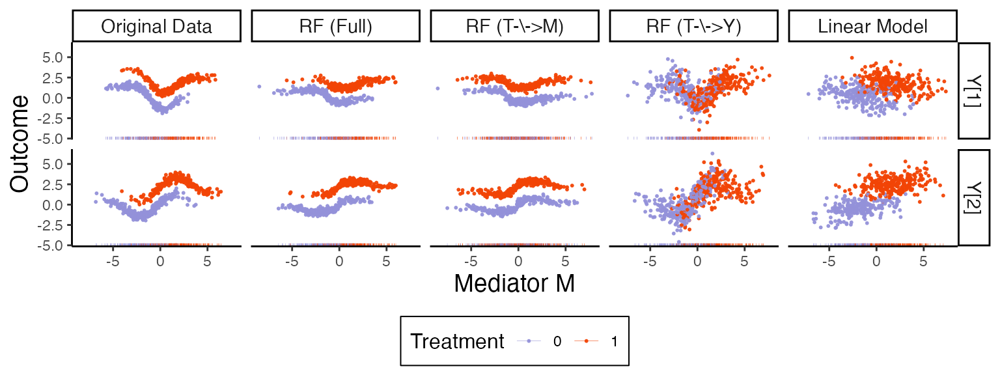

class: title

#  Modular software for mediation analysis of microbiome data

<style>
.slide-background {
    background: url("figures/cover.png") no-repeat center center;
    background-size: cover;
    opacity: 0.5;
}
</style>

<div id="subtitle_left">
Slides: <a href="https://go.wisc.edu/">go.wisc.edu/</a><br/>
Package: <a href="https://go.wisc.edu/830110">go.wisc.edu/830110</a><br/>
Lab: <a href="https://measurement-and-microbes.org">measurement-and-microbes.org</a> <br/>
</div>
<div id="subtitle_right">
Kris Sankaran <br/>
<a href="https://www.birs.ca/events/2025/5-day-workshops/25w5324/">Novel Approaches for Multi-Omics</a><br/>
17 | July | 2025 <br/>
</div>

<!-- 25 minute talk (including Q&A) -->

```{r, echo = FALSE, warning = FALSE, message = FALSE}
library(RefManageR)
library(compositions)
library(knitr)
library(phyloseq)
library(tidyverse)

opts_chunk$set(echo = TRUE, message = FALSE, warning = FALSE, cache = FALSE, dpi = 200, fig.align = "center", fig.width = 6, fig.height = 3)
BibOptions(
  check.entries = FALSE,
  bib.style = "numeric",
  cite.style = "numeric",
  style = "markdown",
  hyperlink = FALSE,
  dashed = FALSE,
  max.names = 1
)
bib <- ReadBib("references.bib")
```

$\def\Gsn{\mathcal{N}}$
$\def\Dir{\text{Dir}}$
$\def\Mult{\text{Mult}}$
$\def\diag{\text{diag}}$
$\def\*#1{\mathbf{#1}}$
$\def\Scal{\mathcal{S}}$
$\def\exp#1{\text{exp}\left(#1\right)}$
$\def\logit#1{\text{logit}\left(#1\right)}$
$\def\absarg#1{\left|#1\right|}$
$\def\E{\mathbb{E}} % Expectation symbol$
$\def\Earg#1{\E\left[{#1}\right]}$
$\def\P{\mathbb{P}} % Expectation symbol$
$\def\Parg#1{\P\left[{#1}\right]}$
$\def\m#1{\boldsymbol{#1}}$
$\def\Unif{\text{Unif}}$
$\def\win{\tilde{w}_{\text{in}}}$
$\def\reals{\mathbb{R}}$
$\newcommand{\wout}{\tilde w_{\text{out}}}$


---

### Microbiome as Mediator

We're just beginning to understand the ways in which the microbiome might
mediate the relationship between environmental exposures and human health.

Gastric surgery can change cholesterol levels. Part of the effect can be
attributed to the microbiome.

---

### Microbiome as Mediator

We're just beginning to understand the ways in which the microbiome might
mediate the relationship between environmental exposures and human health.


In cancer, both adverse events and treatment effectiveness appear mediated by
the microbiome. This has sparked interest in modifying the microbiome to improve
treatments

---

### Causal Inference Formalism

Causal mediation analysis is becoming the workhorse to drive these studies.
Traditional methods from social science and epidemiology need to be adapted to
reflect properties of microbiome data.

.center[

]

---

### Counterfactual Notation

Under the generalized causal mediation analysis framework, we imagine
counterfactuals for both mediators and outcomes, depending on treatments that we
may never have seen.

_Mediator under treatment $t$_: 
\begin{align*}
M\left(t\right)
\end{align*}

_Outcome under treatment combination_ $\left(t, t'\right)$:
\begin{align*}
Y\left(t, M\left(t'\right)\right)
\end{align*}

Note that this is not observable whenever $t \neq t'$, but we can reason about
it abstractly.

---

### Direct vs. Indirect Effects

Suppose that the treatments belong to two groups, $T \in \{0, 1\}$. Then, direct
and indirect effects are defined as

\begin{align*}
\bar{\delta} = \frac{1}{2} \sum_{t=0}^{1} \mathbb{E}\{Y(t, M(1)) - Y(t, M(0))\}\\
\bar{\zeta} = \frac{1}{2} \sum_{t'=0}^{1} \mathbb{E}\{Y(1, M(t')) - Y(0, M(t'))\}
\end{align*}

When many mediators are present, we may also want to know:

\begin{align*}
\bar{\omega}_k = \frac{1}{2} \sum_{t'=0}^{1} \mathbb{E}\{Y(t', M_k(1), M_{-k}(t')) - Y(t', M_k(0), M_{-k}(t'))\}
\end{align*}

Under appropriate sequential ignorability assumptions, these effects can be
identified.

---

### Geometric Interpretation


---

### Geometric Interpretation


---

### Geometric Interpretation


---

### Integration Challenge

Our interest in this project came from an attempt to re-analyze a dataset about
the gut brain axis. Participants were randomized into either a mindfulness
intervention or a control group. In this case, the microbiome is an outcome, and
the survey measurements are mediators.

---

### Integration Challenge

A similar issue arises when applying mediation to support metabolomic
integration. This is a quote from a study on the microbiome and metabolome of
inflammatory bowel disease `r Citep(bib, "Franzosa2018")`:

<div style="font-size: 20px">
> The CD-associated compounds eicosatrienoic (ETA) and docosapentaenoic (DPA)
acid were involved in negative associations with control-associated species and
positive associations with IBD-associated species. ETA and DPA are
polyunsaturated long-chain fatty acids (PUFAs) [which] possess bactericidal
activity by virtue of their hydrophobic nature and potential to disrupt
bacterial cell membranes. 
</div>

As in the previous example, we can imagine a mediation analysis with a
high-dimensional microbiome outcome.

---

.center[
## Package Design
]

---

### Univariate Mediation Analysis

The most straightforward implementation of mediation analysis with univariate
mediators and outcomes is a two-step linear regression:

\begin{align*}
y_i = \beta_t t_{i} + \beta_{m}m_i + \epsilon_i^y\\
m_{i} = \alpha t_i + \epsilon_{i}^{m_{i}}
\end{align*}

In this case, the direct and indirect effects are straightforward:

Direct effect: $\beta_t$
Indirect effect: $\alpha \beta_m$

---

### Code Interface

We could imagine writing a function to implement this analysis.

```{r, eval = FALSE}
model <- mediation(y, m, t)
effects(model)
```

But how can we adopt the more general counterfactual perspective, without
restricting ourselves to linear models?

---

### Code Interface

The `mediation` package `r Citep(bib, "")` solves this problem by instead
creating an interface like:

```{r, eval = FALSE}
f1 <- lm(y ~ t + m)
f2 <- lm(m ~ t)
model <- mediation(f1, f2)
effects(model)
```

We can now accommodate any mediation or outcome model, not just linear ones!
Indeed, it's easy to use `glm` in the `mediation` package.

---

### Multimedia Interface

`multimedia` generalizes this interface to support multivariate responses and
outcomes that are helpful for microbiome data. For example, for the mindfulness
study introduce above, we can use a logistic-normal multinomial model for the
outcome and a lasso regression for the mediators .

```{r, eval = FALSE}
model <- multimedia(
    exper, # dataset
    lnm_model(), # outcome model
    glmnet_model(lambda = 0.5, alpha = 0) # mediation model
)
```

We fit each model separately, but this can still accommodate a few commonly used
approaches.

---

### Data Formats


Besides modeling, `multimedia` has data structures that make it easier to
manipulate real and counterfactual data. For example, we can use `tidy`
selection syntax to categorize variables.
```{r, echo = FALSE}
filter_mean <- function(x, threshold = 3) {
    x[, colMeans(x) > threshold]
}

simplify_tax_names <- function(x) {
    colnames(x) <- colnames(x) |>
        str_extract("g__.*+") |>
        str_replace("g__", "g") |>
        str_remove_all("[[:punct:]]")
    x
}

simplify_metab_names <- function(x) {
    new_names <- colnames(x) |>
        str_remove_all("[[\\.|\\/|\\*|,|\\:|\\(|\\)]]") |>
        str_replace_all("-", "_") |>
        str_replace_all(" ", "_") |>
        str_remove("Cluster_|Clser") |>
        str_remove("HILIC|C8|C18") |>
        str_remove("pos|neg") |>
        str_remove("__")

    colnames(x) <- paste0("m", new_names)
    x
}

annotated_metabolites <- function(metabolites) {
    str_remove(colnames(metabolites), "C18-neg_Cluster_[0-9]+: ") |>
        str_remove("C8-pos_Cluster_[0-9]+: ") |>
        str_remove("HILIC-neg_Cluster_[0-9]+: ") |>
        str_remove("HILIC-pos_Cluster_[0-9]+: ") |>
        unique() |>
        setdiff("NA")
}

Sys.setenv("VROOM_CONNECTION_SIZE" = 5e6)
taxa <- read_tsv("https://go.wisc.edu/l015v0")[, -1]
metabolites <- read_tsv("https://go.wisc.edu/0t3gs3")[, -1]
metadata <- read_tsv("https://go.wisc.edu/9z36wr")

taxa <- clr(taxa) |>
    filter_mean() |>
    simplify_tax_names()

metabolites <- log(1 + metabolites) |>
    filter_mean(threshold = 6) |>
    select(matches(annotated_metabolites(metabolites))) |>
    simplify_metab_names()

ibd_data <- metabolites |>
    bind_cols(taxa, metadata) |>
    as_tibble()
```
```{r}
head(ibd_data, 4)
```

These are the data from the motivating IBD study as a raw `data.frame`.

---

### Data Formats

Besides modeling, `multimedia` has data structures that make it easier to
manipulate real and counterfactual data. For example, we can use `tidy`
selection syntax to categorize variables.

```{r}
library(multimedia)
mediation_data(
  ibd_data,
  matches("^m[0-9]{4}"), # outcomes
  "Study.Group", # treatments
  starts_with("g") # mediators
)
```

---

### Effect Estimates

Once we have fitted mediator $\hat{M}$ and outcome $\hat{Y}$ models, we can
estimate the associated direct and indirect effects.

\begin{gathered}
\widehat{\bar{\delta}}=\frac{1}{2} \sum_{t=0}^1 \sum_{i=1}^n \widehat{Y}_i\left(t, \widehat{M}_i(1)\right)-\widehat{Y}_i\left(t, \widehat{M}_i(0)\right), \\
\widehat{\bar{\zeta}}=\frac{1}{2} \sum_{t^{\prime}=0}^1 \sum_{i=1}^n \widehat{Y}_i\left(1, \widehat{M}_i\left(t^{\prime}\right)\right)-\widehat{Y}_i\left(0, \widehat{M}_i\left(t^{\prime}\right)\right), \\
\widehat{\bar{\omega}}=\frac{1}{2} \sum_{t^{\prime}=0}^1 \sum_{i=1}^n\left\{\widehat{Y}_i\left(t^{\prime}, \widehat{M}_{i k}(1), \widehat{M}_{i,-k}\left(t^{\prime}\right)\right)-\widehat{Y}_i\left(t^{\prime}, \widehat{M}_{i k}(0), \widehat{M}_{i,-k}\left(t^{\prime}\right)\right)\right\}
\end{gathered}

---

### Bootstrap

We can gauge uncertainty in the estimated effects by re-estimating both mediator
and outcome models on bootstrap resampled versions of the original data.  Here
are the metabolites with the largest indirect and direct effects in the IBD
example. 
.center[

]

---

### Model Alteration

The package provides syntax for altering models after they've been estimated.
We can set specific coefficients to zero or re-estimate with new model
specifications.

.center[

]

---

```{r, eval = FALSE}
fit <- multimedia(exper, outcome = rf_model(num.trees = 1e3)) |>
    estimate(exper)

altered_m <- nullify(fit, "T->M") |>
    estimate(exper)
altered_ty <- nullify(fit, "T->Y") |>
    estimate(exper)
```
.center[

]

---

### Synthetic Data

---

### Sensitivity Analysis

1. Mediation analysis relies on untestable assumptions. Noentheless, the
consequences of their violation can be explored using sensitivity analysis.

1. We provide methods for simulation counterfactual mediator and outcome
variables with correlated noise terms, capturing the situation where the
assumption of no pretreatment confounding is violated.

---

### Sensitivity Analysis

For example, once we have fit mediation and outcome models, we can simulate
according to:

\begin{align*}
Y^*(t, m)=\hat{Y}(t, m)+\epsilon^y \\
M^*(t)=\hat{M}(t)+\epsilon^m .
\end{align*}

A caveat is that this only makes sense for continuous outcomes and mediators.

---

### Sensitivity Analysis

We draw $\left(\epsilon^y, \epsilon^m\right)$ from a gaussian with mean zero and covariance,
\begin{align*}
\Sigma(\rho, G):=\left(\begin{array}{cc}
\operatorname{diag}\left(\hat{\sigma}_M^2\right) & \rho \hat{\sigma}_M \hat{\sigma}_Y^{\top} \odot \mathbf{1}_G \\
\rho \hat{\sigma}_Y \hat{\sigma}_M^{\top} \odot \mathbf{1}_G^{\top} & \operatorname{diag}\left(\hat{\sigma}_Y^2\right)
\end{array}\right)
\end{align*}
where $\mathbf{1}_{G} \in \{0, 1\}^{K \times J}$ is an indicator over
mediator-outcome pairs $G$ over which to test sensitivity.

---

.center[
## Example
]

---

### Study Background

> 

---

### Data Preprocessing

---

### Model Setup

---

### Estimated Effects

---

### Example Effects

---

### Sensitivity Analysis

---

### Alternative: Hurdle Model

---

### Takeaways

* integration can benefit from some of the formal language of causal inference

---

### Resources

* Documentation
* Paper

---

### Thank you!

* Contact: ksankaran@wisc.edu
* Lab Members: Margaret Thairu, Shuchen Yan, Yuliang Peng, Helena Huang
* Funding: NIGMS R01GM152744, NIAID R01AI184095

---

class: reference

### References

```{r, results='asis', echo = FALSE}
PrintBibliography(bib, start = 1, end = 13)
```

---

### Example Model: Logistic-Normal Multinomial

The logistic-normal multinomial (LNM) model has the form:

.pull-left[
\begin{align*}
y_{i} \sim \Mult\left(N_{i}, \varphi^{-1}\left(z_{i}^{T}\beta\right)\right) \\
\beta \sim \Gsn\left(0, \diag\left(\sigma_{k}^{2}\right)\right)
\end{align*}
where $\varphi^{-1}\left(z\right) \propto\left(\exp{z_{1}}, \dots, \exp{z_{K-1}}, 1\right)$
]

.pull-right[
```{r, fig.align = "center"}
include_graphics("figures/lnm.svg")
```
]

