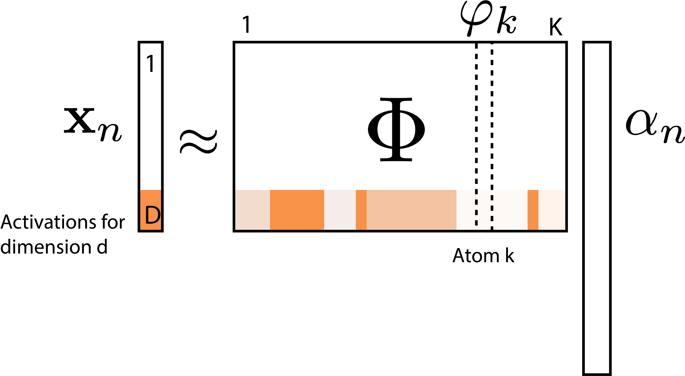
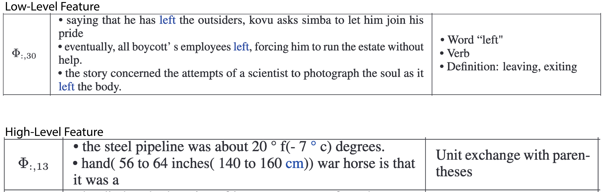

<script type="text/x-mathjax-config">
MathJax.Hub.Config({
  TeX: {
    Macros: {
      myred: ["{\\color{myred}{#1}}", 1],
      mygreen: ["{\\color{mygreen}{#1}}", 1],
      mypurple: ["{\\color{mypurple}{#1}}", 1],
      reals: "{\\mathbb{R}}",
      indic: ["{\\mathbf{1}\\left\\{#1\\right\\}}", 1],
      indep: "{\\perp\\!\\!\\!\\!\\perp}",
      Esubarg: ["{\\mathbf{E}_{#1}\\left[{#2}\\right]}", 2],
      absarg: ["{\\left|{#1}\\right|}", 1],
      "\*": ["{\\mathbf{#1}}", 1],
      diag: ["{\\text{diag}\\left({#1}\\right)}", 1]
    },
    loader: {load: ['[tex]/color']},
    tex: {packages: {'[+]': ['color']}}
  }
});
</script>

<div style = "position:fixed; visibility: hidden">
$$\require{color}\definecolor{myred}{rgb}{0.918, 0.20, 0.137}$$
$$\require{color}\definecolor{mygreen}{rgb}{0.352941176470588, 0.541176470588235, 0.501960784313725}$$
$$\require{color}\definecolor{mypurple}{rgb}{0.71, 0.29, 0.49}$$
</div>


```{r, echo = FALSE, message = FALSE, warning = FALSE}
library(knitr)
opts_chunk$set(cache = FALSE, warning = FALSE, message = FALSE)
library(RefManageR)
bib <- ReadBib("references.bib")
BibOptions(cite.style = "numeric")
```

# Interactive and Interpretable Machine Learning

<style>
.slide-background {
    background: url("figures/cover.png") no-repeat center center;
    background-size: cover;
    opacity: 0.5;
}
</style>

<div id="subtitle_left">
Slides: <a href="https://go.wisc.edu/vzhdt1">go.wisc.edu/vzhdt1</a><br/>
Paper: <a href="https://go.wisc.edu/ebm917">go.wisc.edu/ebm917</a><br/>
Lab: <a href="https://measurement-and-microbes.org">measurement-and-microbes.org</a> <br/>
</div>
<div id="subtitle_right">
Kris Sankaran <br/>
<a href="">USC Marshall</a><br/>
30 | July | 2025 <br/>
</div>

---

### What can go wrong?

.center[


Example from `r Citep(bib, "Caruana2015IntelligibleMF")`.
]


---

### What can go wrong?

.center[


Example from `r Citep(bib, "Gu2017BadNetsIV")`.
]


---

### What can go wrong?

.center[

]

---

# What Makes a Model Interpretable?
<br/>
.center[

]

---

# What Makes a Model Interpretable?
<br/>
.center[

]

<p style="font-size: 30px; position: absolute; left: 20px; top: 200px; width: 450px">
This is a difficult questions....
let's start with an easier one.
</p>

---

# What Makes a Visualization Good?
<br/>
.center[

]

---

### Key Properties

A good visualization is:

1. **Legible**: It omits extraneous, distracting elements.
1. **Annotated**: It shows data within the problem context.
1. **Information Dense**: It shows relevant variation efficiently.

.center[
<div class="caption">
<br/>
Figure from `r Citep(bib, "munzner2014visualization")`.
</div>
]

---

### Interactivity

Current AI interfaces often suffer from what researchers in human-computer
interfaces call interaction gulfs `r Citep(bib, "Hutchins1985-oz")`.  It is hard
to quickly specify a query about a model, evaluate the response, and then
iterate.

.center[

]

---

### Vocabulary

1. **Interpretable Model**: A model that, by virtue of its design, is easy for
its stakeholders to accurately describe and alter.
1. **Explainability Technique**: A method that shapes our mental models about
black box systems.

.center[
  
]

---

### Vocabulary

1. **Local Explanation**: An artifact for reasoning about individual predictions.

1. **Global Explanation**: An artifact for reasoning about an entire model.

.center[

]

---

## Shapley Values

---

### Credit Assignment

How would you distribute profit across employees $i$ in a company if you knew
that any team $S$ would have profit $v\left(S\right)$?  This is a credit
assignment problem.

.center[
<span style="font-size: 18px;">
<br/>
Shapley values are built off a game theoretic analogy.
</span>
]

---

### Shapley Credit Assignment

We can distribute credit according to how much the team's profit decreases when we remove employee $i$,

\begin{align}
\varphi\left(i\right) &= \frac{1}{D} \sum_{d = 1}^{D} \frac{1}{D - 1 \choose d - 1}\sum_{S \in S_{d}\left(i\right)} \left[v\left(S\right) - v\left(S - \{i\}\right)\right]
\end{align}

$S_{d}\left(i\right)$ is the collection of subsets of size $d$ that includes employee $i$.

.center[
<span style="font-size: 18px;">
 
</span>
]

---

### Game Theory $\to$ Machine Learning

1. Instead assigning credit to employees, we attribute importances to features.

1. The attributions are made locally at the per-prediction level.  Instead of
profit, consider the model's expected prediction when a subset $S$ of features
is fixed,

\begin{align}
v_{\*x}\left(S\right) &= \Esubarg{p\left(\*x^{\prime}_{S^C} \vert \*x_{S}\right)}{f\left(\*x_{S}, \*x^{\prime}_{S^C}\right)}
\end{align}

---

### Shapley Feature Attribution

With this definition of $v$, we can describe the importance of feature $i$ in
making the prediction $f\left(\*x\right)$:

\begin{align}
\varphi_{\*x}\left(f, i\right) &= \frac{1}{D} \sum_{d = 1}^{D} \frac{1}{D - 1 \choose d - 1}\sum_{S \in S_{d}\left(i\right)}\left[v_{\*x}\left(S\right) - v_{\*x}\left(S - \{i\}\right) \right]
\end{align}

This definition has the nice property that $f\left(\*x\right) = \sum_{d = 1}^{D}\varphi_{\*x}\left(f, d\right)$.

---

### Geometric Interpretation

\begin{align}
v_{\*x}\left(S\right) &= \Esubarg{p\left(\*x^{\prime}_{S^C} \vert \*x_{S}\right)}{f\left(\*x_{S}, \*x^{\prime}_{S^C}\right)}
\end{align}

.center[

]

---

### Geometric Interpretation

How would we compute $\varphi_{\mathbf{x}}\left(f, 2\right)$ in this example? We also need:

* $v\left(\{1, 2\}\right)$
* $v\left(\{2\}\right)$
* $v\left(\emptyset\right)$

What do these correspond to geometrically?

---

### Visualization - One Sample

Since adding all the attributions leads to $f\left(\*x\right)$, we can center a
stacked barplot around $f\left(\*x\right)$. Each piece corresponds to one feature.

.center[
<span style="font-size: 18px;">
 
</span>
]

---

### Visualization - Many Samples

Since stacked barplots are compact, we can visualize entire datasets this way.
This helps identify sets of samples which have similar explanations.

.center[
<span style="font-size: 18px;">
 
</span>
]

---

### Computational Challenges

Shapley values have some elegant properties, but naive calculation is impossible
in all but the simplest cases.

1. $v_{\*x}\left(S\right)$ involves a potentially complex conditional expectation.
1. We need to enumerate over all subsets containing $i$.

---

### Approximating $v_{x}\left(S\right)$

How can we simplify the calculation of:

\begin{align*}
v_{\*x}\left(S\right) &= \Esubarg{p\left(\*x^{\prime}_{S^C} \vert \*x_{S}\right)}{f\left(\*x_{S}, \*x^{\prime}_{S^C}\right)}
\end{align*}

?

---

### Reference Values

One simple idea is to replace $\*x^{\prime}_{S^C}$ with some reference value, like
the all zeros vector or the average $\overline{\*x}_{S^C}$ across all samples:

\begin{align*}
v_{\*x}\left(S\right) \approx f\left(\*x_{S}, \overline{\*x}_{S^C}\right)
\end{align*}

This only requires one function evaluation per set $S$ but is a very rough
approximation.

---

### Assuming $x_{S} \indep x_{S^C}$

An alternative is to assume independence between features in $S$ and $S^C$,

\begin{align*}
v_{\*x}\left(S\right) &= \Esubarg{p\left(\*x^{\prime}_{S^C}\right)}{f\left(\*x_{S}, \*x^{\prime}_{S^C}\right)} \\
&\approx \sum_{n = 1}^{N}{f\left(\*x_{S}, \*x^{\prime}_{n,S^C}\right)}
\end{align*}

We could also sum over subsamples.

---


### Regression Perspective

How can we avoid summing over so many subsets? It turns out that there is an
equivalent formulation of the Shapley value in terms of weighted linear
regression.

.pull-left[
<span style="font-size: 20px;">
\begin{align*}
v_{\*x}\left(S\right) \approx \varphi_{\*x}\left(f, 0\right) + \sum_{d = 1}^{D} \indic{d \in S}\varphi_{\*x}\left(f, d\right)
\end{align*}
</span>
]

.pull-right[
<span style="font-size: 18px;">
 
$\indic{d \in S}$ is known, so this is a linear regression with unknown
coefficients $\varphi_{\*x}\left(f, d\right)$. Notice we can compute
$v_{\*x}\left(S\right)$ on a subset of sets.
</span>
]

---

### Kernel Reweighting

Each row in this regression is a subset $S$ of features,

\begin{align*}
v_{x}\left(S\right) \approx \varphi_{\*x}\left(f, 0\right) + \sum_{d = 1}^{D} \indic{d \in S}\varphi_{\*x}\left(f, d\right)
\end{align*}

If for the row corresponding to subset $S$ we use weights
\begin{align*}
\frac{D - 1}{\binom{D}{|S|} \left|S\right|\left(D - \left|S\right|\right)}
\end{align*}
then the resulting weighted linear regression exactly recovers the Shapley
values $\varphi_{\*x}\left(f, d\right)$.

---

### Code Sketch

```{python, eval = FALSE}
# initialize data structures
mask_matrix = np.zeros((nsamples, M))
kernel_weights = np.zeros(nsamples)
synth_data = np.tile(self.data, (nsamples, 1))

# sample random subsets
for i in range(nsamples):
    mask = np.random.choice([0, 1], size=M)
    mask_matrix[i] = mask
    synth_data[i * self.N:(i + 1) * self.N, mask == 1] = x[0, mask == 1]
    kernel_weights[i] = (M - np.sum(mask)) * np.sum(mask)

# model predictions on the synthetic data
model_out = self.model(synth_data)
f = np.mean(model_out.reshape(nsamples, self.N, -1), axis=1) - self.f_bar

# weighted linear regression on adjusted f
X = mask_matrix - mask_matrix[:, -1][:, None]
y = f.flatten() - mask_matrix[:, -1] * (self.model(x) - self.f_bar)
lm = LinearRegression(fit_intercept=False).fit(X, y, sample_weight=kernel_weights)
```

---

### Feature Neighborhoods

1. Another idea is to restrict the collection of sets in the summation.

1. This is most natural when there is a notion of distance between features. For
example, for a word at the start of a sentence, don't bother with sets of words
near the end.

---

### $L$-Shapley

Let $N_{k}\left(i\right)$ be all the features within distance $k$ of feature
$i$. A fast approximation is to consider:

\begin{align*}
\varphi_{\*x}^{L}\left(f, i\right) &= \frac{1}{\absarg{N_{k}\left(i\right)}} \sum_{S \in N_{k\left(i\right)}} 
\frac{1}{\absarg{N_{k}\left(i\right) - 1 \choose \absarg{S} - 1}} \left[v_{\*x}\left(S\right) - v_{\*x}\left(S - \{i\}\right)\right]
\end{align*}

1. When $k$ is small, this will be an efficient approximation.

1. This is called $L$-Shapley. $L$ is short for local `r Citep(bib, "chen2018shapley")`.

.center[
 
]

---

### $C$-Shapley

We can further focus on those subsets that are connected to feature $i$:

\begin{align*}
\varphi_{\*x}^{C}\left(f, i\right) &= \frac{1}{\absarg{N_{k}\left(i\right)}} \sum_{S \subseteq N_{k\left(i\right), S \text{connected to } i}} 
\frac{1}{\absarg{N_{k}\left(i\right) - 1 \choose \absarg{S} - 1}} \left[v_{\*x}\left(S\right) - v_{\*x}\left(S - \{i\}\right)\right]
\end{align*}

This is called $C$-Shapley. $C$ is short for connected.

.center[
 
]

---

## Dictionary Learning

---

### Activation Analysis

.pull-left[
1. Deep learning models are built from simple layers. When an input passes
through the network, each layer transforms the activations of the layer before.

1. Within a layer, neurons activate on inputs with specific properties. For
example, neurons in an image classifier detect edge with specific
orientations.
]

.pull-right[
 <br/>
<span style="font-size: 18px;">
Figure from `r Citep(bib, "Zeiler2014")`.
</span>
]

---

### Activation Analysis

.pull-left[
1. Deep learning models are built from simple layers. When an input passes
through the network, each layer transforms the activations of the layer before.

1. Within a layer, neurons activate on inputs with specific properties. For
example, neurons in an image classifier detect edge with specific
orientations.
]

.pull-right[
 <br/>
<span style="font-size: 18px;">
Figure from `r Citep(bib, "Bengio2009")`.
</span>
]

---

### Activation Analysis

There is a line of research suggesting that the later layers in deep models
learn meaningful abstractions.

.center[
 <br/>
<span style="font-size: 18px;">
Figure from `r Citep(bib, "karpathy2015")`.
</span>
]

In some cases, the deep representations reflect features we can easily
understand, like whether a string of text lies within quotes.

---

### Dictionary Learning Formulation

Following `r Citep(bib, "Yun2021-jc")`, suppose $\*x_{n}$ are the concatenated
activations across all layers in the network. Then solve:

.pull-left[
\begin{align*}
\arg\min_{\Phi, \left(\alpha_{n}\right)} \sum_{n = 1}^{N} \|\*x_n - \*\Phi\*\alpha_{n}\|_{2} + \lambda\|\alpha_n\|_{1} \\
\text{subject to } \alpha_{n} \succeq 0 \text{ for } n = 1, \dots, N
\end{align*}
]

.pull-right[
<span style="font-size: 18px;">

</span>
]

---

### Dictionary Learning Formulation

The columns $\varphi_{k}$ of $\Phi$ are called atoms. Since the basis is
overcomplete, it can reconstruct relatively complex patterns.

.center[
<span style="font-size: 18px;">

</span>
]

---

### Example Factor

.pull-left[
1. To interpret $\varphi_{k}$, we can look for examples $i$ with large $\alpha_{ik}$.

1. For example, this feature has the largest $\alpha_{ik}$ on examples related
to the Golden Gate Bridge.
]

.pull-right[
<span style="font-size: 18px;">

</span>
]

---

### Atlases

.pull-left[
We can also build maps of many related features. This figure is a dimensionality
reduction of the $\varphi_{k}$, organized so that those that have high inner
product are placed close to one another.
]

.pull-right[
<span style="font-size: 18px;">

These annotations were generated automatically, which helps make this analysis
more automatic.
</span>
]

---

### Abstraction

1. One of the motivations for deep learning is that deeper layers of a network
can learn more abstract representations.

1. Using dictionary learning, we can test this by comparing features with more
weight on high vs. lower parts of the network `r Citep(bib, "Yun2021-jc")`.

.center[
<span style="font-size: 18px;">

</span>
]


---

### Example Features

The associated features are consistent with the belief that deeper layers are
more abstract. First, they find that factors whose coefficients $\alpha_{n}^{l}$
is much larger in either the shallower or deeper parts of the network.

.center[
<span style="font-size: 18px;">

</span>
]

---

### Example Features

The associated features are consistent with the belief that deeper layers are
more abstract. First, they find that factors whose coefficients $\alpha_{n}^{l}$
is much larger in either the shallower or deeper parts of the network.

.center[
<span style="font-size: 18px;">

</span>
]

---

### Local Explanation

We can use LIME to identify individual words that contribute the most to a single feature.

.center[
<span style="font-size: 18px;">

</span>
]

---

### Steering Generations

If we want generated output to reflect more (or less) of feature $\varphi_{k}$,
we can manually increase (or decrease) the activation of the associated neurons.

.center[
<span style="font-size: 18px;">

</span>
]

---

### Steering Generations

If we want generated output to reflect more (or less) of feature $\varphi_{k}$,
we can manually increase (or decrease) the activation of the associated neurons.

.center[
<span style="font-size: 18px;">

</span>
]

---

### Steering and Safety

This is one plausible direction for improving model safety. However, there are so
many ways in which an output can be harmful that it's not yet clear how this can
be practically done.

.center[
<span style="font-size: 18px;">

</span>
]

---

## Challenges

---

### Gauging Progress

1. Interpretability depends on criteria that are difficult to encode in the
standard ML quantitative benchmarks.
1. This is one area where statisticians can excel:
  - We critically interrogate the situations where methods can be applied.
  - We study methods within their problem contexts.

.center[

]

---

### Human Studies

.pull-left[
1. These studies can quantify how explanations influence human judgment.

1. Common tasks include editing inputs to influence prediction and guessing
  model results from explanations.

1. Good explanations don't necessary improve Human-AI collaboration.
]

.pull-right[


An example task from an interpretability study  `r Citep(bib, "Wu2021PolyjuiceGC")`.
]

---

### Human Studies

.pull-left[
1. These studies can quantify how explanations influence human judgment.

1. Common tasks include editing inputs to influence prediction and guessing
  model results from explanations.

1. Good explanations don't necessary improve Human-AI collaboration.
]

.pull-right[


An example of unpredictable effects during deployment `r Citep(bib, "Bansal2020DoesTW")`.
]

---

### Thank you!

Review Paper: [go.wisc.edu/ebm917](https://go.wisc.edu/ebm917)

Course Notes + Code: [go.wisc.edu/oid864](https://go.wisc.edu/oid864)

Slides: [go.wisc.edu/u7ikn1](https://go.wisc.edu/u7ikn1)

* Contact: ksankaran@wisc.edu
* Lab Members: Margaret Thairu, Shuchen Yan, Yuliang Peng, Langtian Ma, Helena Huang
* Funding: NIGMS R01GM152744, NIAID R01AI184095, Gates 072185

---

class: reference

### References

```{r, results='asis', echo = FALSE}
PrintBibliography(bib, start = 1, end = 14)
```

---

class: reference

### References

```{r, results='asis', echo = FALSE}
PrintBibliography(bib, start = 15, end = 30)
```

---

### Attributions

explainable reinforcement learning by iconpro86 from <a href="https://thenounproject.com/browse/icons/term/explainable-reinforcement-learning/" target="_blank" title="explainable reinforcement learning Icons">Noun Project</a> (CC BY 3.0)

data visualization by Iconiqu from <a href="https://thenounproject.com/browse/icons/term/data-visualization/" target="_blank" title="data visualization Icons">Noun Project</a> (CC BY 3.0)

Ruler by Dhipwise Store from <a href="https://thenounproject.com/browse/icons/term/ruler/" target="_blank" title="Ruler Icons">Noun Project</a> (CC BY 3.0)

bacillus by Cécile Lanza Parker from <a href="https://thenounproject.com/browse/icons/term/bacillus/" target="_blank" title="bacillus Icons">Noun Project</a> (CC BY 3.0)

Microbe by Prettycons from <a href="https://thenounproject.com/browse/icons/term/microbe/" target="_blank" title="Microbe Icons">Noun Project</a> (CC BY 3.0)

bacterium by HideMaru from <a href="https://thenounproject.com/browse/icons/term/bacterium/" target="_blank" title="bacterium Icons">Noun Project</a> (CC BY 3.0)

bacterium by Maria Zamchy from <a href="https://thenounproject.com/browse/icons/term/bacterium/" target="_blank" title="bacterium Icons">Noun Project</a> (CC BY 3.0)

---

### Historical Context

1. **Initial Wave**: Early ML systems required expert-crafted features. Deep learning
removed this requirement, creating a new need for post-hoc expalnations.

1. **Critical Self-Reflection**: Experiments highlight issues in common assumptions
and commentaries attempt to establish shared vocabulary `r Citep(bib, c("Lipton2016TheMO", "Adebayo2018SanityCF", "Rudin2018StopEB", "Murdoch2019DefinitionsMA"))`.

1. **Systematic Evaluation**: Systematic progress depends on shared tasks, objective
evaluation, and substantive theory -- these are beginning to emerge.

---

### Roadmap

These techniques are representative of larger classes of techniques for model
interpretability and explainability.

1. Direct interpretability $\to$ Sparse Regression, Featurization
1. Latent representations $\to$ Visualizing Embeddings
1. Local explainability $\to$ Integrated Gradients
1. Shared representations $\to$ Concept Bottleneck

---

### Visualization Metaphor

.pull-left[
1. People from many backgrounds are comfortable reading and creating data
visualizations.

1. Visualization software provide shared representations between computer hardware
and human thought.

1. How will interpretable ML appear in future scientific reports, newspaper
articles, and undergraduate classrooms?
]

.pull-right[
  
]

---

### Learning the Conditionals

A more sophisticated approach learns a new generative model to allow sampling
$\*x^{\prime}_{n,S^C} \vert \*x_{S}$. In fact, the same model can be used for many
conditionals.

1. Draw $N^\ast$ samples $\*x^{\prime}_{n,S^C} \sim p\left(\cdot \vert \*x\right)$
1. Approximate:

\begin{align*}
v_{\*x}\left(S\right) &\approx \sum_{n = 1}^{N^\ast}{f\left(\*x_{S}, \*x^{\prime}_{n,S^C}\right)}
\end{align*}