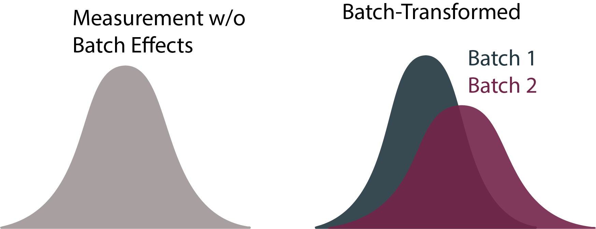
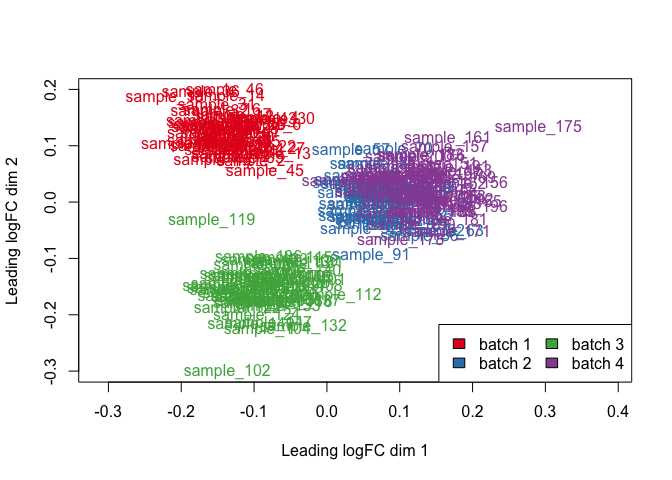
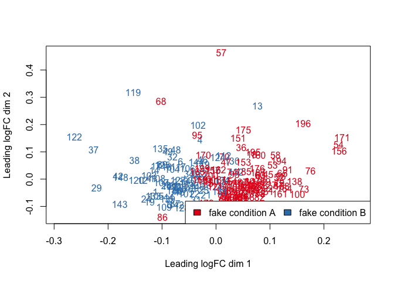

class: title

<script type="text/x-mathjax-config">
MathJax.Hub.Config({
  TeX: {
    Macros: {
      myred: ["{\\color{myred}{#1}}", 1],
      mygreen: ["{\\color{mygreen}{#1}}", 1],
      reals: "{\\mathbb{R}}",
      "\*": ["{\\mathbf{#1}}", 1],
      bm: ["{\\mathbf{#1}}", 1],
      diag: ["{\\text{diag}\\left({#1}\\right)}", 1]
    },
    loader: {load: ['[tex]/color']},
    tex: {packages: {'[+]': ['color']}}
  }
});
</script>


<style>
.myred {color: #B4575C;}
.mygreen {color: #5A8A80;}
</style>

```{r flair_color, echo=FALSE, warning = FALSE, message = FALSE}
library(xaringancolor)
setup_colors(
  myred = "#B4575C",
  mygreen = "#5A8A80"
)

library(flair)
myred <- "#B4575C"
mygreen <- "#5A8A80"
```


```{r, echo = FALSE, warning = FALSE, message = FALSE}
library(MASS)
library(knitr)
library(RefManageR)
library(tidyverse)
opts_chunk$set(echo = FALSE, message = FALSE, warning = FALSE, cache = FALSE, dpi = 200, fig.align = "center", fig.width = 6, fig.height = 3)

BibOptions(
  check.entries = FALSE,
  bib.style = "numeric",
  cite.style = "numeric",
  style = "markdown",
  hyperlink = FALSE,
  dashed = FALSE,
  max.names = 1
)
bib <- ReadBib("references.bib")
```

## Managing Batch Effects in Biological Data

<div id="subtitle_left">
Slides: <a href="https://go.wisc.edu/qjn8us">go.wisc.edu/qjn8us</a><br/>
Notes: <a href="https://go.wisc.edu/5fsbyh">go.wisc.edu/5fsbyh</a><br/>
Lab: <a href="https://measurement-and-microbes.org">measurement-and-microbes.org</a> <br/>
</div>
<div id="subtitle_right">
Kris Sankaran <br/>
<a href="http://computationalgenomics.bioinformatics.ucla.edu//">CGSI 2025</a><br/>
31 | July | 2025 <br/>
</div>

<!-- 30 minute talk -->

---

### Cancer Microbiome Controversy `r Citep(bib, "retraction2024")`

.center[
    
]

In June 2024, Nature retracted a paper `r Citep(bib, "Poore2020")` the claimed
identify microbiome signatures of cancer. This came after one year's worth of
debate `r Citep(bib, c("Gihawi2023", "SepichPoore2023", "SepichPoore2024"))`
about the data analysis.

---

### Cancer Microbiome Controversy `r Citep(bib, "retraction2024")`

.center[
    
]

The "disease signature" was an artifact resulting from the use of a batch effect
correction method.  Before we can understand the nuances of the story, we need
to learn about batch effects and correction methods.

---

### Sources of Technical Variation

There are many points at which technical variation arises. For example, for single-cell sequencing `r Citep(bib, "jiang2022statistics")`:
.pull-left[
* Sample Collection
* Sample Storage
* Library Preparation
* cDNA Synthesis
]

.pull-right[
* PCR Amplification
* Sequencing
* Read Assignment
]

Differences at any step can lead to systematic differences between data
collected across experimental runs ("batches"). This is especially problematic
for studies with large sample sizes or multiple study sites.

---

### Measurement vs. Reality `r Citep(bib, "sarkar2021separating")`

.pull-left[
1. In the same way that a photo can be blurry or obscured by glare, the
measurements we obtain from sequencing can be obscured by technical factors.

1. Any data are only an imperfect snapshot of the biological scene we're seeking
to understand. 
]

.pull-right[
    
<p class="caption">
The glare is a technical artifact of the measuring device.
</p>
]

---

### Measurement vs. Reality `r Citep(bib, "sarkar2021separating")`

.pull-left[
1. In the same way that a photo can be blurry or obscured by glare, the
measurements we obtain from sequencing can be obscured by technical factors.

1. Any data are only an imperfect snapshot of the biological scene we're seeking
to understand. 
]

.pull-right[
    
<p class="caption">
It is hard to precisely measure molecular systems. Artwork from `r Citep(bib, "Goodsell2018")`.
</p>
]

---

exclude: true

### Improving Discovery

.pull-left[
1. Batch effects can mask real biological effects.

1. To discover more interesting patterns, we need to either remove these effects
or account for them in the analysis.
]

.pull-right[

<p class="caption">
Read coverage across samples from the HapMap project, discussed in `r Citep(bib,
"Leek2010")`. Horizontal blocks have the same sequencing date.
</p>
]

---

### Improving Discovery

.pull-left[
1. Batch effects can mask real biological effects.

1. To discover more interesting patterns, we need to either remove these effects
or account for them in the analysis.
]

.pull-right[

<p class="caption">
Batch effects across collection dates from a microbiome 
study, discussed in `r Citep(bib, "Wang2019")`.
</p>
]


---

.center[
## Methods
]

---

### General Strategies

1. Correct: Subtract the batch effects before all other analysis.
1. Account: Directly model batch-to-batch variation in the analysis.

|  | Pros | Cons |
|--|---|---|
| Correct | Generality. Can be reused easily. | Can introduce its own artifacts. |
| Account | Cohesion. Only one method needed for everything.  | Time consuming. Bespoke development for each context. |

We will review correction methods.

---

### Correction Methods

.pull-left[
Any method must define,
1. Transformations: How might batch effects impact measurement?
1. Objective: How can we find the most plausible transformation for our data?
]

.pull-right[

]

The best choice can depend on properties of the data and the experimental
design, which is why there are so many available methods.

---

### Exemplar Methods

In this overview, we'll consider,

1. ComBat `r Citep(bib, "Johnson2006")` (2007). Linear Model.
1. CellAnova `r Citep(bib, "Zhang2024")` (2024). Embeddings + Linear Model.

---

### ComBat - Setting

ComBat was proposed to remove batch effects in microarray data with small sample
sizes, $n \approx 5 - 20$ per batch, and it has inspired many variants.

1. $\*y_i \in \reals^{G}$: Sample $i$'s expression levels across $G$ genes.
1. $\*x_i \in \reals^{D}$: Potentially relevant biological factors.
1. $m\left(i\right) \in \left[1, \dots, M \right]$: Which of the $M$ batches does sample $i$ belong to?

---

### ComBat - Model

Sample $i$ is assumed to be drawn from:

\begin{align*}
\*y_{i} = \mu + \*W \*x_{i} + \*b_{m(i)} + \Lambda_{m(i)}\*\epsilon_i
\end{align*}

where $\Lambda_{m} = \diag{\delta_{mg}}$ rescales the noise $\epsilon_i \sim \mathcal{N}\left(0, \diag{\sigma_g^2}\right)$.

1. The parameters $\*W$ capture shared biological effects.
1. Batch effects cause systematic location-scale shifts.
1. Given $\*b_m$ and $\*\Lambda_{m}$, we can remove their effect from
the observed data.
---

### ComBat - Estimation

Rather than estimating each gene $g$ separately, ComBat uses a hierarchical
model to share information across all genes. This improves stability in the
corrections for genes with very high noise levels.

.center[

]
<p class="caption">
By fitting the model simultaneously across genes, the estimates are "shrunk"
towards the mean. 
</p>

---

### Challenges

Batch effect correction can introduce subtle problems of its own.

**Hypothesis Testing**: When the batches are highly imbalanced, correction can
distort the null distribution of test statistics. This invalidates the usual
$p$-values `r Citep(bib, "Nygaard2015")`.

.center[

]

---

### Challenges

Batch effect correction can introduce subtle problems of its own.

.pull-three-quarters-left[
**Alignability**: Batch effect correction methods will attempt to match batches
regardless of whether there is actually any shared biology `r Citep(bib, "Ma2024")`.
]

.pull-three-quarters-right[

]

---

exclude: true

### Challenges

Batch effect correction can introduce subtle problems of its own.

**Supervision**: Methods that use a biological group label can introduce spurious
associations with that label `r Citep(bib, "githubGitHubGtonkinhillTCGA_analysis")`.

.center[

]

---

### Sensitivity and Simulation

1. Run the analysis separately across batches. Many of the results should
overlap if the biology is truly shared across batches.

1. Use a simulation to better understand the pipeline. There are many packages
for learning a simulator based on an initial dataset `r Citep(bib, "Sankaran2024")`.

---

### Simulation and Supervised Normalization

Gerry Tonkin-Hill has an excellent re-analysis `r Citep(bib, "githubGitHubGtonkinhillTCGA_analysis")` of the data from `r Citep(bib, "Poore2020")` which sheds light what were likely the source of the phantom signals. The first part is a simulation.

.pull-left[

]
.pull-right[

]

---

### Simulation and Supervised Normalization

This setting is balanced -- each condition is equally likely across batches. In
this case, SVN batch effect correction `r Citep(bib, "mecham2010supervised")`
works well.

.pull-left[

]
.pull-right[

]

---

### Simulation and Supervised Normalization

But what happens if there is imbalance?

.pull-left[

]
.pull-right[

]

---

### Simulation and Supervised Normalization

In this case, the SVN correction introduces an artificial difference.

.center[

]

This should cause concern about the original analysis: Hospitals specialize in
cancer types. Then again, this simulation is quite unrealistic.

---

### Experimental Design

1. To better account for batch effects, we should think carefully about
replication and controls `r Citep(bib, c("GagnonBartsch2011", "Jacob2015", "Gerard2021"))`.

  - Replication: Generate multiple measurements of the same sample.
  - Controls: Samples or features where the signal is known to be absent.

1. Any variation that is only present after a step of data generation must be
due to the measurement mechanism, rather than the true biology.
---

### CellAnova

1. CellAnova `r Citep(bib, "Zhang2024")` takes this thinking a step further by
formalizing an approach to defining and using control samples.

1. Across all batches, control samples are assumed to have the same underlying
biology, and this gives confidence in the resulting correction.

1. This is a more formal alternative to to maximizing overlap across batches for
each cell type. 

---

### Pool-of-Controls

1. [**Notation**] Let $\*Y^1, ..., \*Y^M$ be measurements across $M$ biological samples. 
  - Let the first $M_0$ samples are controls. 
  - Each $\*Y^m \in \reals^{N_{m} \times G}$.
2. [**Controls**] The control samples are assumed to be biologically comparable
  - Time course: All pre-treatment samples
  - Multi-omics: All healthy subjects regardless of sequencing technology

---

### Assumed Model

\begin{align*}
\bm{Y}^m &= \bm{C}^m(\mu + \bm{X}^m \bm{W}^\top + \bm{B}^m \bm{V}^\top) + \text{noise} \\\\
&:= \bm{C}^m \left(\bm{R}^m\right)^\top + \text{noise}
\end{align*}

As input, we expect:
- $\*C^m$: Cell-level encodings (e.g., cell types) in sample $m$

We want to estimate:
- $\mu$: Global mean
- $\*B^m \*V^\top$: Batch effects
- $\*X^m \*W^\top$: Real biological variation

---

### CellAnova: Detect Batch Effects

**Step 1**: Estimate the batch effects subspace,
\begin{align}
\left[\bm{R}^1-\overline{\bm{R}}^0 \;\; \cdots \;\; \bm{R}^{M_0}-\overline{\bm{R}}^0\right]^\top \in \reals^{K_c M_0 \times G} \xrightarrow{\mathrm{SVD}} \bm{V} \in \reals^{G \times K_b}
\end{align}
This should reflect hospital, technician, or platform-level effects.

**Step 2**: Evaluate the coordinates of each sample with respect to this subspace,
\begin{align}
\bm{B}^m=\left(\bm{R}^m-\overline{\bm{R}}\right) \bm{V}
\end{align}

---

### Decomposing Variation: Biology

**Step 3**: Project out the batch effects and identify a subspace spanning the remaining variation:

\begin{align}
\begin{bmatrix} \bm{R}^1 - \overline{\bm{R}} \\\\ \vdots \\\\ \bm{R}^M - \overline{\bm{R}} \end{bmatrix}(I - \bm{V}\bm{V}^\top) \xrightarrow{\text{SVD}} \bm{W}
\end{align}

Then $\bm{X}^m = (\bm{R}^m - \overline{\bm{R}})\bm{W}$ are coordinates with respect to real
biological variation.

---

### CellAnova vs. ComBat

The CellAnova paper uses notation that stacks the expressions like those we saw
in ComBat.
\begin{align}
\bm{y}_i = \mu + \bm{W} \bm{x}_i + \bm{b}_m + \Lambda_m \epsilon_i
\end{align}
vs.
\begin{align}
\bm{Y} = \bm{C}\left(\mu + \bm{X} \bm{W}^\top + \bm{B} \bm{V}^\top\right) + \text{noise}
\end{align}

Both methods shed light on why batch effects appears.

---

### Takeaways

1. **Garbage In, Garbage Out**: If the main source of variation in the data comes
from batch effects, then even the most sophisticated methodology will fail to
discover interesting biology.

1. **Approaches**: Correction methods estimate batch-specific transformations of
shared biology. These transformations are then reversed to define the
correction.

1. **Checks**: It's important not to use batch effect correction methods
thoughtlessly.  Consider applying simulation and leveraging the experimental
design.

---

class: reference

### References

```{r, results='asis', echo = FALSE}
PrintBibliography(bib, start = 1, end = 13)
```

---

class: reference

### References

```{r, results='asis', echo = FALSE}
PrintBibliography(bib, start = 14, end = 29)
```

---

### Improving Credibility

> If all goes well, then the article... has shown mammal kidney structure; if all goes badly, it shrinks to three hamsters in one laboratory in 1984.
>
> -- Bruno Latour in `r Citep(bib, "latour1987science")`

To dispute a scientific fact, a dissenter can always argue that the
conditions that led to its production are not generalizable. To guard against
this, we need to understand batch-to-batch variation.