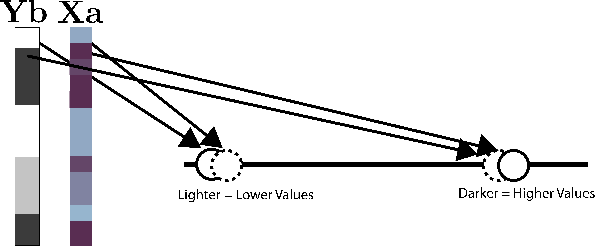

class: title

# Enhancing Microbiome Analysis with Semisynthetic Data

<style>
.slide-background {
    background: url("figures/cover.png") no-repeat center center;
    background-size: cover;
    opacity: 0.5;
}
</style>

<div id="subtitle_left">
Slides: <a href="https://go.wisc.edu/4gl0is">go.wisc.edu/4gl0is</a><br/>
Paper: <a href="https://go.wisc.edu/p12o8w">go.wisc.edu/p12o8w</a><br/>
Lab: <a href="https://measurement-and-microbes.org">measurement-and-microbes.org</a> <br/>
</div>
<div id="subtitle_right">
Kris Sankaran <br/>
GSTP Retreat<br/>
11 | August | 2025 <br/>
</div>

<!-- 13 minute talk -->

```{r, echo = FALSE, warning = FALSE}
library(knitr)
library(RefManageR)

opts_chunk$set(echo = FALSE, message = FALSE, warning = FALSE, cache = FALSE, dpi = 200, fig.align = "center", fig.width = 6, fig.height = 3)
BibOptions(
  check.entries = FALSE,
  bib.style = "numeric",
  cite.style = "numeric",
  style = "markdown",
  hyperlink = FALSE,
  dashed = FALSE,
  max.names = 1
)
bib <- ReadBib("references.bib")
```

---

### An Early Simulation Study

The supplement to `r Citep(bib, "Fukuyama2017")` considers some experimental
design questions,

> [We] discussed the motivation behind dividing each subject into treatment and
control timepoints, rather than allocating separate study subjects as
controls...  To quantitatively characterize the impact of this choice, we
performed this simulation experiment...

.center[

]

---

How do internal and external controls compare in longitudinal microbiome
analysis?

- Rows: Increasing subject-to-subject variability.
- Columns: Increasing perturbation effect size.

.center[

]

---

Sometimes it takes a long time to appreciate the things you understood as a
beginner...

.center[

]

---

### Why Simulate?

There are myriad opportunities for using simulation in microbiome analysis `r Citep(bib, c("Sankaran2023", "Sankaran2024-gb"))`. They
can help us to...

 **Benchmark methods** and identify gaps in the literature.
<br/>

 **Design experiments** that have high power to detect subtle signals.
<br/>

 **Check conclusions** that might be sensitive to technical processing steps.

---

### Semisynthetic Data

One of the major advances has been the design of algorithms that can leverage
public data resources, like `r Citep(bib, c("Pasolli2017AccessibleCM", "Muller2022", "microbiomedatasets", "microbiomedataHomeNational"))`.

* **Semisynthetic Data**: The output from a simulator that has been designed to mimic external, template data. 
* **Template Data**: Previously gathered experimental data that can be used to train a simulator.

.center[

]

---

### Example: Microbiome Network Inference

1. Benchmarking methods for microbiome network inference is challenging. We
can't directly observe microbe-microbe interactions, which stands in the way of
ground truth labeling.

1. We use the following choices in the design of our simulation,

- **Template**: American Gut Project (261 samples, 45 most abundant taxa)
- **Estimator**: Zero-Inflated Negative Binomial Copula
- **Goodness-of-Fit**: Graphical Checks
- **Ground Truth**: Copula correlation matrix
- **Summarization**: Estimated vs. ground-truth correlation

---

### Simulation Mechanism

Here are samples from the Zero-Inflated Negative Binomial Copula with the
covariates `~ log(sequencing_depth) + BMI`. Each panel compares real vs.
simulated data for one taxon.

.center[

]

---

### Estimated Correlation

The resulting correlation estimate lacks substantial banding or blocks. We can
also sanity check some of the highly correlated pairs.

.pull-left[

]
.pull-right[

]

---

### Establishing Ground Truth

To create a basis for methods comparison, we modified the ZINB copula to use a
block correlation matrix with varying intra-block correlation strength.

.center[
  
]

---

### Methods Comparison

We compared SpiecEasi `r Citep(bib, "Kurtz2015-tf")`, a method designed for microbiome networks,
with the Ledoit-Wolf estimator `r Citep(bib, "Ledoit2004")` on $\log\left(1 + x\right)$ transformed counts.

.center[
  
]

---

### Methods Comparison

We compared SpiecEasi `r Citep(bib, "Kurtz2015-tf")`, a method designed for microbiome networks,
with the Ledoit-Wolf estimator `r Citep(bib, "Ledoit2004")` on $\log\left(1 + x\right)$ transformed counts.

.center[
  
]

---

### Generalizing

In our review, we consider a wider range of underlying correlation matrices.

.center[
  
]

---

Simulation turns abstract, conceptual questions into simple empirical ones.

.center[

]

---

### Software and Resources

All the examples I discussed today can be run from online tutorials:

* Simulation for Microbiome Analysis ([go.wisc.edu/wnj5p9](https://go.wisc.edu/wnj5p9))
* Generative Models Examples ([go.wisc.edu/ax73qb](https://go.wisc.edu/ax73qb))

Our workshop materials are online:

* UW-Madison Plant Pathology [slides](https://krisrs1128.github.io/talks/2024/20240207/20240207.html#1), [colab](https://colab.research.google.com/drive/1IyMEQJwkslPzL9FYd5atvyGORqW9IrCI?usp=sharing)
* UniMelb Integrative Genomics [notebooks](https://github.com/krisrs1128/intro-to-simulation/), slides [1](https://go.wisc.edu/54tmr9), [2](https://go.wisc.edu/rc776i), [3](https://go.wisc.edu/gfj36r).

The relevant R packages behind these analyses are:

* `multimedia` - Mediation analysis for microbiome data `r Citep(bib, "Jiang2025")`.
* `scDesign3` - An existing simulator for single cell data `r Citep(bib, c("Li2019", "Sun2021", "Song2023scDesign3GR"))`.
* `scDesigner` - Under-development version used in the first tutorial.

---

.center[
### Thank you!
]

* Contact: ksankaran@wisc.edu
* Lab Members: Margaret Thairu, Yuliang Peng, Langtian Ma, Helena Huang
* Funding: NIGMS R01GM152744, NIAID R01AI184095
* Co-authors: Saritha Kodikara, Jingyi Jessica Li, Kim-Anh Lê Cao, Susan Holmes

---

class: reference

### References

```{r, results='asis', echo = FALSE}
PrintBibliography(bib, start = 1, end = 13)
```

---

### Evaluation Taxonomy

This is how some common techniques fall into this taxonomy.

* **Graphical, Narrow**: Boxplots or cumulative distribution function plots comparing real vs. simulated taxa (like the DA example).

* **Graphical, Broad**: Principal component plots of real vs. simulated dataset.

* **Quantitative, Narrow**: Two-sample Kolmogorov-Smirnov test.

* **Quantitative, Broad**: Evaluation through classification (next example).

* **Fit-for-Purpose**: Linear model coefficients on real vs. simulated data (`r Citep(bib, "Sankaran2024-gb")`, "Batch Effect Correction").

---

### SPLS-DA Intuition

We "blend" columns of $\mathbf{X}$ and $\mathbf{Y}$ within tables until the patterns look similar.

.center[

]

Roughly, choose weights $\mathbf{a}$ and $\mathbf{b}$ to maximize
$\text{cor}\left(\mathbf{Xa}, \mathbf{Yb}\right)$.

---

### SPLS-DA Intuition

We "blend" columns of $\mathbf{X}$ and $\mathbf{Y}$ within tables until the patterns look similar.

.center[

]

Roughly, choose weights $\mathbf{a}$ and $\mathbf{b}$ to maximize
$\text{cor}\left(\mathbf{Xa}, \mathbf{Yb}\right)$.


---

### SPLS-DA Intuition

We "blend" columns of $\mathbf{X}$ and $\mathbf{Y}$ within tables until the patterns look similar.

.center[

]

Roughly, choose weights $\mathbf{a}$ and $\mathbf{b}$ to maximize
$\text{cor}\left(\mathbf{Xa}, \mathbf{Yb}\right)$.

---

### SPLS-DA Intuition

We "blend" columns of $\mathbf{X}$ and $\mathbf{Y}$ within tables until the patterns look similar.

.center[

]

Roughly, choose weights $\mathbf{a}$ and $\mathbf{b}$ to maximize
$\text{cor}\left(\mathbf{Xa}, \mathbf{Yb}\right)$.

---

### SPLS-DA Intuition

Now we can compare samples from the two tables in a single, shared space.

.center[

]

---

### SPLS-DA Intuition

Now we can compare samples from the two tables in a single, shared space.

.center[

]

---

### SPLS-DA Intuition

To get more than one dimension, we can repeat this process after removing any
correlation with previously found patterns.

.center[

]

---

### Copula Models

More formally, let $F_{1}, \dots, F_{D}$ be the target margins and let $\Phi$ be
the CDF of the Gaussian distribution. Gaussian Copula modeling has these steps.

Estimate:

1. Gaussianize the observed $\mathbf{x}_{i}$ to $\mathbf{z}_{i} := \left[\Phi^{-1}\left(F_{1}\left(x_{i1}\right)\right), \dots, \Phi^{-1}\left(F_{D}\left(x_{iD}\right)\right)\right]$
1. Estimate the covariance $\hat{\Sigma}$ associated with $z_{i}$

Simulate:

1. Draw $\mathbf{z}^\ast \sim \mathcal{N}\left(0, \Sigma\right)$ 
1. Transform back $\mathbf{x}^{\ast} := \left[F_{1}^{-1}\left(\Phi\left(z_{i1}^\ast\right)\right), \dots, F_{D}^{-1}\left(\Phi\left(z_{iD}^\ast\right)\right)\right]$

---

### Real vs. Simulated Correlation

.center[

]

A detailed explanation is given [here](https://krisrs1128.github.io/microbiome-simulation/multivariate-power-analysis.html#evaluation).

---

### Tuning High-Dimensional Covariance Estimator

.center[

]

A detailed explanation is given [here](https://krisrs1128.github.io/microbiome-simulation/multivariate-power-analysis.html#evaluation).

---

### Intuition

* In the Gaussianized space, it's easy to model correlation.
* The mapping back and forth is possible because we know the margins $F$.
  - $\Phi$ represents the Gaussian CDF applied componentwise
<br/>
<br/>

.center[

]

---

### Pilot Study

.pull-left[
1. We re-analyzed a pilot study from 2021 `r Citep(bib, "Grupe2021")`, which
gathered data from 54 participants randomly assigned to either a mindfulness
training intervention or a waitlist control (n = 27 each).

1. The training lasted 2 months. Data were collected at the start, finish, and 2
month follow-up.
]

.pull-right[

]

---

### Estimated Indirect Effects

These figures summarize the paths $T \to M \to Y$.</br>
(i.e., color $\to$ x-axis $\to$ y-axis).

.center[

]

---

### Figure Sources

frustration by Rikas Dzihab from <a href="https://thenounproject.com/browse/icons/term/frustration/" target="_blank" title="frustration Icons">Noun Project</a> (CC BY 3.0)

confused by Rikas Dzihab from <a href="https://thenounproject.com/browse/icons/term/confused/" target="_blank" title="confused Icons">Noun Project</a> (CC BY 3.0)

Benchmark by Sofiah from <a href="https://thenounproject.com/browse/icons/term/benchmark/" target="_blank" title="Benchmark Icons">Noun Project</a> (CC BY 3.0)

checkmark by Asa Kharisma Dini from <a href="https://thenounproject.com/browse/icons/term/checkmark/" target="_blank" title="checkmark Icons">Noun Project</a> (CC BY 3.0)

Lab glassware by Vectors Market from <a href="https://thenounproject.com/browse/icons/term/lab-glassware/" target="_blank" title="Lab glassware Icons">Noun Project</a> (CC BY 3.0)
