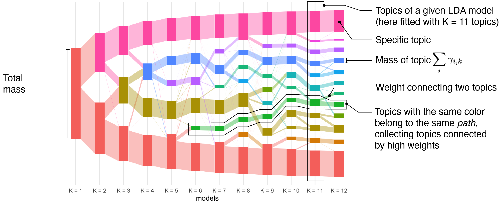
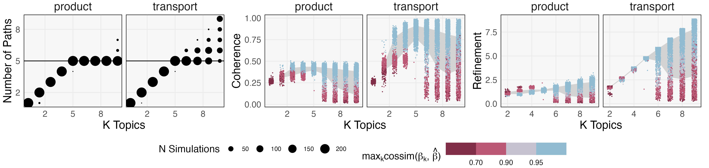

```{r, echo = FALSE, warnings = FALSE, message = FALSE}
library(RefManageR)
library(knitr)
library(tidyverse)
library(glue)
opts_chunk$set(message = FALSE, warning = FALSE, cache = FALSE, dpi = 200, fig.align = "center", fig.width = 6, fig.height = 3, echo = FALSE)
opts_knit$set(eval.after = "fig.cap")
set.seed(123)

BibOptions(cite.style = "numeric", max.names = 10)
bib <- ReadBib("references.bib")
```

<div id="links">
Slides: https://go.wisc.edu/99ndjd<br>
Lab Site: https://measurement-and-microbes.org
</div>

### Microbiome Data Science

The goal of my lab is to help microbiome researchers get the most out of their
data. The essential statistical questions are:

* **Integration**: How should we analyze data gathered from multiple batches or
technologies?

* **Experimental Design**: How should we design microbiome experiments to 
accelerate engineering or medical applications?

* **Reproducibility**: How can we be sure our conclusions are trustworthy?

We work directly with microbiologists on problems related to HIV, the gut-brain
axis, and synthetic communities.

---

exclude: true

### Problem Solving

To solve these problems, we draw from classic ideas from statistics and computing:

* **Simulation**: It's easier to design experiments and benchmark methods when
we can quickly generate realistic data.

* **Visualization**: A good interface can shape the way we think for the better,
helping us be more critical and creative.

---

### Themes: Visualization

In `r Citep(bib, "Fukuyama2022")`, we studied navigation across ensembles of topic models.



<span style="font-size: 20px;">
In the Sankey diagram, columns are models and rectangles are topics.
</span>

---

### Themes: Visualization

The patterns of flow on this diagram are useful for deciding on the number of
topics present in a dataset.

.center[


<span style="font-size: 20px;">
The diagnostics in this simulation suggest that the true $K$ is 5.
</span>
]

---

### Themes: Visualization

In `r Citep(bib, "distortions")`, we used the focus-plus-context principle to
interactively explore how dimensionality reduction methods like UMAP distort the
intrinsic geometry of the data.

.center[
  
]

---

### Themes: Visualization

In `r Citep(bib, "distortions")`, we used the focus-plus-context principle to
interactively explore how dimensionality reduction methods like UMAP distort the
intrinsic geometry of the data.

.center[
  
]

---

### Themes: Simulation

We wrote a review paper on designing simulators for microbiome data 
`r Citep(bib, "Sankaran2024")` and are actively developing new methods and
software on this theme. 


---

### Themes: Simulation

.pull-three-quarters-left[

]
.pull-three-quarters-right[
<span style="font-size: 18px;">
Here is an example of using a simulator to guide power analysis in a
multivariate model. Panels A + B check simulator faithfulness, and C compares
models across sample sizes.
</span>
]

---

### Themes: Simulation

Being able to faithfully emulate real data with controllable simulators can
guide power analysis, benchmark competing methods, and support sanity checks.

.center[

]

---

### Collaborations with Biologists

* Environmental Viral Dynamics [Anantharaman Lab, UWM]: Viruses are the most
abundant biological entities on the planet. We are helping analyze temporal data
to characterize environmental phage dynamics.

* HIV Risk Factors [Kwon Lab, Ragon Institute]: The microbiome is closely
related to immunity. We are using data to understand HIV risk from multi-omics
data.

* Mental Health and the Microbiome [Handelsman Lab, UWM]: Specific microbes have
been linked to mood disorders. We are part of a multi-institute collaboration to
better understand these gut-brain connections.

---

### Reaching Out

* You can learn more at [https://measurement-and-microbes.org](https://go.wisc.edu/pgb8nl).
    - Simulation: `r Citep(bib, c("Sankaran2024", "Sankaran2023", "Sankaran2018", "krisrs1128ChapterIntroduction"))`
    - Interfaces: `r Citep(bib, c("Jiang2025", "interpretability"))`
    - Visualization: `r Citep(bib, c("distortions", "Fukuyama2022", "Sankaran2018", "Sankaran2019"))`

* I enjoy working with students with different educational levels and backgrounds.

* Email: [ksankaran@wisc.edu](mailto:ksankaran@wisc.edu)

---
class: reference

### References

```{r, results='asis', echo = FALSE}
PrintBibliography(bib, start = 1, end = 12)
```
