class: title

<script type="text/x-mathjax-config">
MathJax.Hub.Config({
  TeX: {
    Macros: {
      myred: ["{\\color{myred}{##1}}", 1],
      mygreen: ["{\\color{mygreen}{##1}}", 1],
      reals: "{\\mathbb{R}}",
      "\*": ["{\\mathbf{##1}}", 1],
      bm: ["{\\mathbf{##1}}", 1],
      diag: ["{\\text{diag}\\left({##1}\\right)}", 1]
    },
    loader: {load: ['[tex]/color']},
    tex: {packages: {'[+]': ['color']}}
  }
});
</script>

<style>
.myred {color: ##B4575C;}
.mygreen {color: ##5A8A80;}
</style>

```{r flair_color, echo=FALSE, warning = FALSE, message = FALSE}
library(xaringancolor)
setup_colors(
  myred = "#B4575C",
  mygreen = "#5A8A80"
)

library(flair)
myred <- "#B4575C"
mygreen <- "#5A8A80"
```


```{r, echo = FALSE, warning = FALSE, message = FALSE}
library(MASS)
library(knitr)
library(RefManageR)
library(tidyverse)
opts_chunk$set(echo = FALSE, message = FALSE, warning = FALSE, cache = FALSE, dpi = 200, fig.align = "center", fig.width = 6, fig.height = 3)

BibOptions(
  check.entries = FALSE,
  bib.style = "numeric",
  cite.style = "numeric",
  style = "markdown",
  hyperlink = FALSE,
  dashed = FALSE,
  max.names = 1
)
bib <- ReadBib("references.bib")
```

## Supporting Diabetic Retinopathy Screening with Machine Learning

<div id="subtitle_left">
Slides: <a href="https://go.wisc.edu/32rv90">go.wisc.edu/32rv90</a><br/>
Lab: <a href="https://measurement-and-microbes.org">measurement-and-microbes.org</a> <br/>
</div>
<div id="subtitle_right">
Kris Sankaran <br/>
DS BMED 208 Project Talks <br/>
14 | October | 2025 <br/>
</div>

---

### Introductions: Derron

- Expertise: biomedical and translational data science, population health, and machine learning for microbiome analysis.

- Co-mentored by Bita Amani, PhD (CDU Urban Public Health/UCLA), Omolola Ogunyemi, PhD (CDU Preventive and Social Medicine, UCLA CTSI Biomedical Informatics Director), and Kris Sankaran (Statistics, UW—Madison).

- Fullerton College &rarr; CSU Long Beach &rarr; Charles Drew (CDU)
- B.S. Molecular Cell Biology and Physiology
- M.S. Biomedical Sciences

---

### Path to this project

- Volunteering at CRECE Urban Farms (Santa Ana, CA)
- Urban agriculture (UA): practice of **farming within** and **around cities** and **densely populated areas**
- Lived experience with food insecurity + insights at CRECE Urban Farms &rarr; M.S. thesis
- Thesis: Community-Based Urban Agriculture and Its Dietary, Cardiometabolic, and Social Impacts in Low-Income Urban Communities Worldwide: A Scoping Review

---

### Path to this project

- Food insecurity has **worsened**, **<u>not improved</u>**: ~10% U.S. households (2021) vs. ~13% (2022)
- Burden **IS NOT** evenly shared: highest rates in Black, Hispanic, and Indigenous populations
- Issue of access, not scarcity (**structural inequities**)
- **Health consequences** are **immediate**

---

### Community-Driven Solutions

- Food insecure residents are reclaiming and repurposing vacant lots into community-governed spaces
- Restoring food access, social ties, and cultural identity

---

.center[

]

---

.center[

]

---
.center[

]

---

.center[
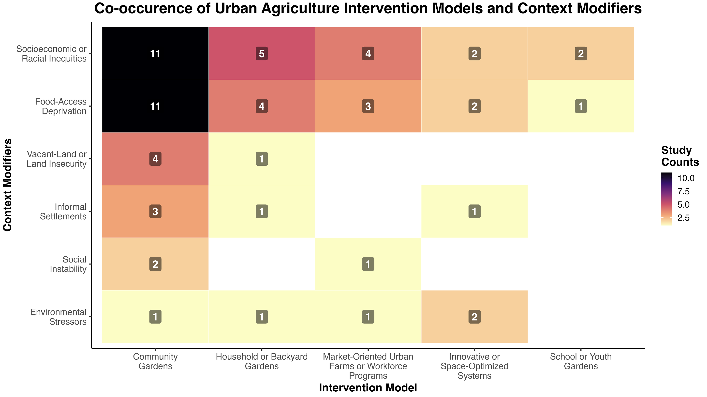
]

---

.center[
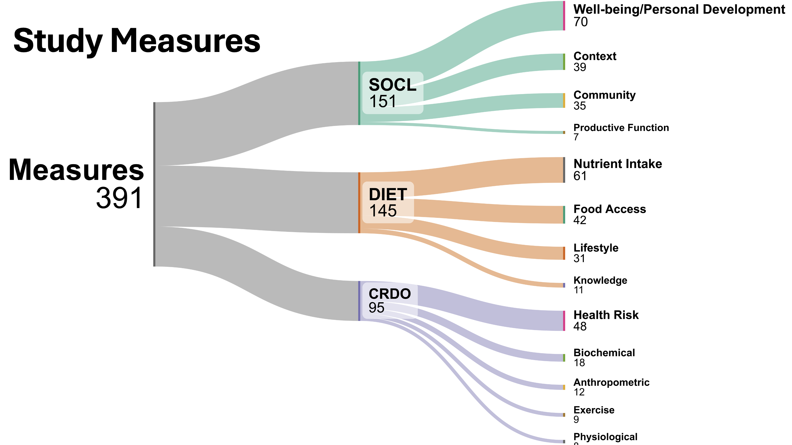
]

---

.center[
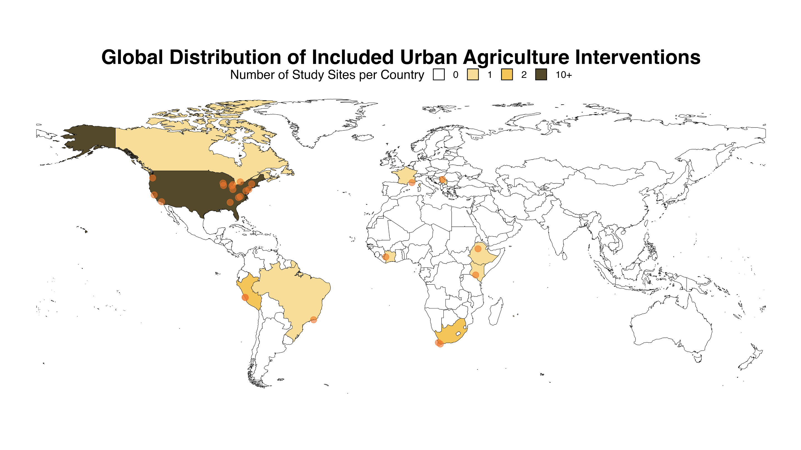
]

---

.center[
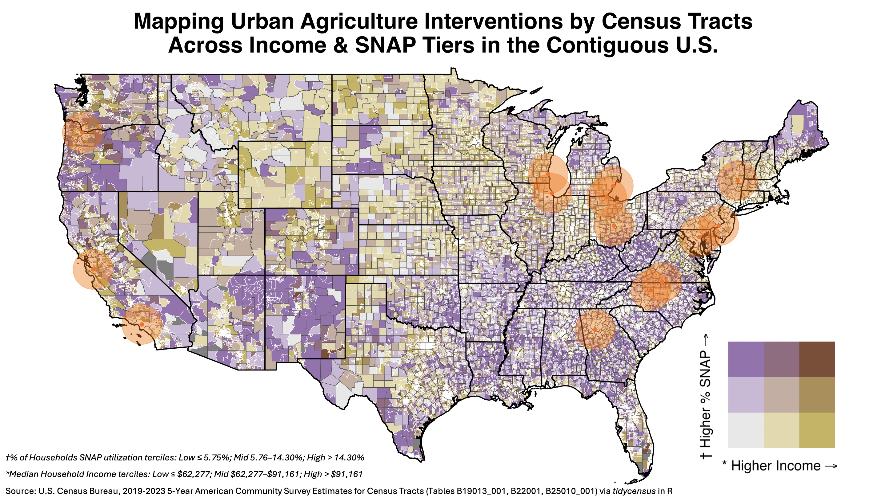
]

---

.center[
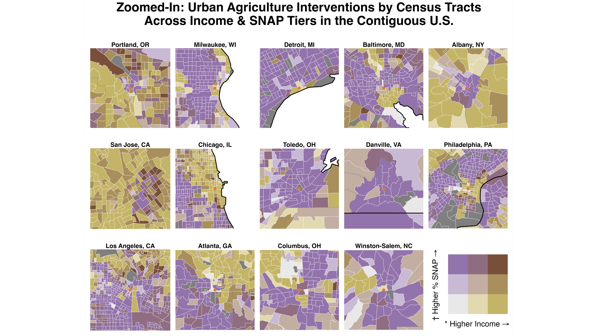
]

---

.center[
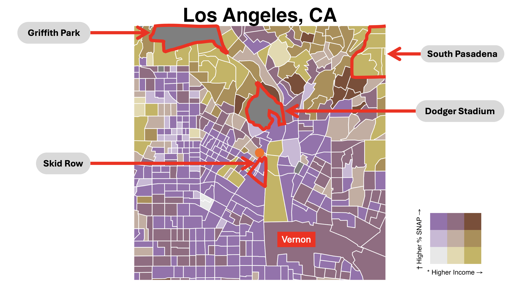
]

---

### Introductions: Kris

- Expertise: Statistics and machine learning for microbiome analysis.
    - Courses: [measurement-and-microbes.org/teaching](https://measurement-and-microbes.org/teaching/)
    - CGSI talks: [go.wisc.edu/28rm17](https://go.wisc.edu/28rm17)

- Path to project: Met Derron at CGSI 2025 and shared resources to help with MS
thesis. Excited to continue working together through the Alpert Network Fellows
program.

---

### Project Status

- Derron has focused on two papers `r Citep(bib, c("Ogunyemi2021", "Ding2023"))`:
    - Both evaluate translation of ML methods from large academic datasets to
    resource-constrained environments.

- Project Plan: Start by replicating existing modeling, then evaluate
performance in settings most relevant to Dr. Ogunyemi's lab

- Focus today is the first paper and some opportunities for further analysis.

---

class: section_header

.center[
## Project Background
]

---

### Background

.pull-left[
- Diabetic Retinopathy (DR) is a complication of diabetes, which damages blood
vessels in the retina. If left untreated, it can lead to blindness.

- Screening is essential but difficult considering the shortage of ophthalmology
expertise in many communities.
]

.pull-right[
    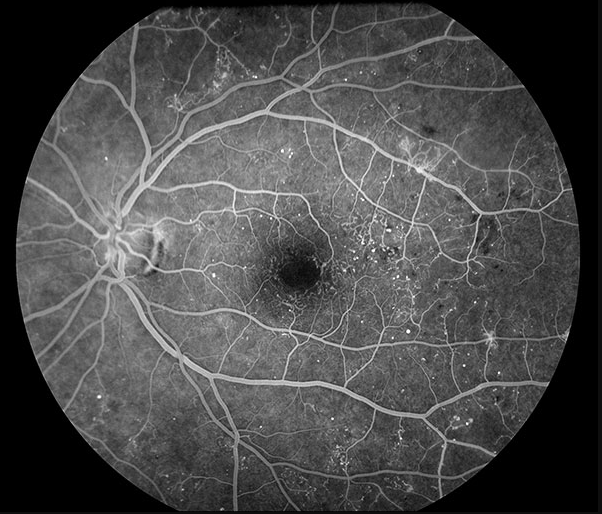
]

---

### Objective

Machine learning can be useful for resource allocation. If we can accurately
predict high-risk individuals just using electronic health records, then we could
alert physicians and help them contact screening services.

.center[
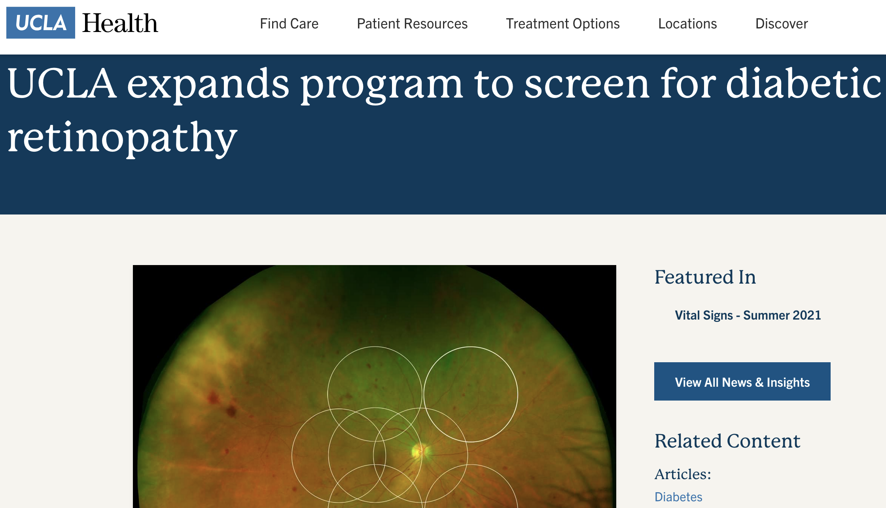
]

---

### Dataset Overview

Los Angeles County Department of Health Services EHR
- Training set: 40,631 diabetic patients (2015 – 2017)
- Test set: 9,300 diabetic patients (2018)

Key properties on the next few slides.

---

### Available Covariates

30 clinical variables (Table 1). No imaging data. Unclear what feature
preprocessing steps were applied?

.center[
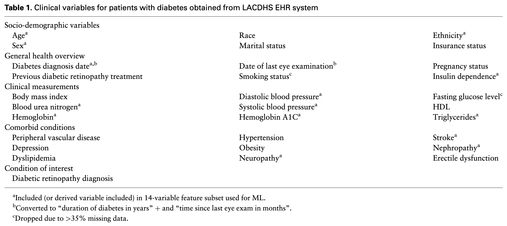
]

---

### Class Imbalance and Missingness

- 31.1% of patients are diagnosed with DR, so this is an imbalanced problem.
They applied SMOTE and majority class downsampling to deal with this.

- Up to 35% missing values, which were imputed using KNN imputation (though
unclear how this was applied on the validation set).

---

### Modeling Approach

- Prioritized 14 features using backwards selection (superscript "a" on previous
table). This fits a full linear model and then trims the variables that don't
lead to a large drop in $R^2$.

- Classifiers tested: Random Forest, Gradient Boosting Machine, Support Vector
Machine, Deep Learning model (MLP?), ensemble of them all.

- Hyperparameters were tuned using 10-fold cross validation.

---

### Results Summary

Best model: Deep learning classifier with majority class downsampling. Achieves
an AUC of 0.80 on the 2018 validation cohort.

.center[
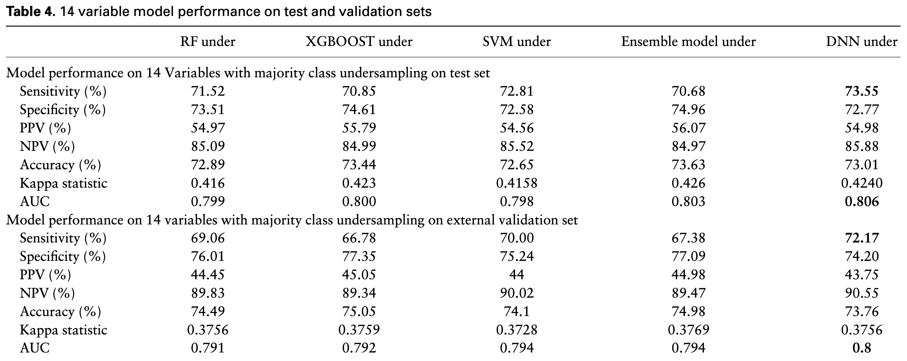
]

---

### Results Summary

- There were only minor performance differences across models, but undersampling
consistently improved over SMOTE.

- Even though it had a much larger sample size, the final AUC was comparable to
previous Diabetic Retinopathy prediction studies based on EHR. For example, in
the KNHANES study `r Citep(bib, "Oh2013")`, a training set with 490 samples was
enough to achieve an AUC of 0.83.

---

### Open Questions

- Which features or interactions are driving model predictions? Can we rely on
these features to generalize?

- Are there other potentially useful features (in or out of the EHR) that could
be useful for screening?

---

### Open Questions

- How do accuracy or important features vary by subpopulation? We can consider
local variable importance measures, like SHAP values.

.center[
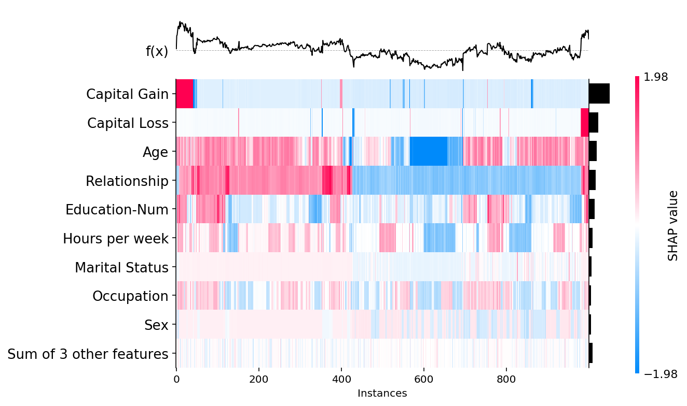
]

---

### Next Steps

- Derron is coordinating data and code access to UK Biobank and UCLA ATLAS to ensure we can replicate these results.

- We will study interpretability and generalization of these models, with the
aim of improving performance or deployability.

- Please share your questions and comments!

---

class: reference

### References

```{r, results='asis', echo = FALSE}
PrintBibliography(bib, start = 1, end = 12)
```
