class: title

<script type="text/x-mathjax-config">
MathJax.Hub.Config({
  TeX: {
    Macros: {
      myred: ["{\\color{myred}{##1}}", 1],
      mygreen: ["{\\color{mygreen}{##1}}", 1],
      reals: "{\\mathbb{R}}",
      "\*": ["{\\mathbf{##1}}", 1],
      bm: ["{\\mathbf{##1}}", 1],
      diag: ["{\\text{diag}\\left({##1}\\right)}", 1]
    },
    loader: {load: ['[tex]/color']},
    tex: {packages: {'[+]': ['color']}}
  }
});
</script>

<style>
.myred {color: ##B4575C;}
.mygreen {color: ##5A8A80;}
</style>

```{r flair_color, echo=FALSE, warning = FALSE, message = FALSE}
library(xaringancolor)
setup_colors(
  myred = "#B4575C",
  mygreen = "#5A8A80"
)

library(flair)
myred <- "#B4575C"
mygreen <- "#5A8A80"
```


```{r, echo = FALSE, warning = FALSE, message = FALSE}
library(MASS)
library(knitr)
library(RefManageR)
library(tidyverse)
opts_chunk$set(echo = FALSE, message = FALSE, warning = FALSE, cache = FALSE, dpi = 200, fig.align = "center", fig.width = 6, fig.height = 3)

BibOptions(
  check.entries = FALSE,
  bib.style = "numeric",
  cite.style = "numeric",
  style = "markdown",
  hyperlink = FALSE,
  dashed = FALSE,
  max.names = 1
)
bib <- ReadBib("references.bib")
```

## Fall 2025 Recap

<div id="subtitle_left">
Slides: <a href="https://go.wisc.edu/wqwwwo/">go.wisc.edu/wqwwwo</a><br/>
Lab: <a href="https://measurement-and-microbes.org">measurement-and-microbes.org</a> <br/>
</div>
<div id="subtitle_right">
Kris Sankaran <br/>
AI and Genomics Reading Group <br/>
12 | December | 2025 <br/>
</div>

---

### Outline

* What were the most important advances we read about?

* Which technical tricks did we see repeatedly?

* What still seems to be more of an art than a science?

* What are potential areas of improvement?

---

## Advances

---

### Functional Track Prediction

.pull-left[
The direct goal for Sequence-to-Function (S2F) was to improve functional
genomic tracks prediction.

They often reported correlation (pearson and/or spearman) across bins (e.g., 128
bp for enformer).
]

.pull-right[
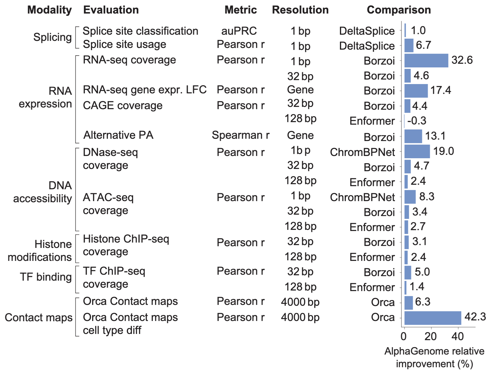
<span style="font-size: 16px">
Improvements reported by the AlphaGenome model `r Citep(bib, "Avsec2025")`.
</span>
]

---

### Functional Track Prediction

The direct goal for Sequence-to-Function (S2F) was to improve functional
genomic tracks prediction.

They often reported correlation (pearson and/or spearman) across bins (e.g.,
128bp for Enformer).

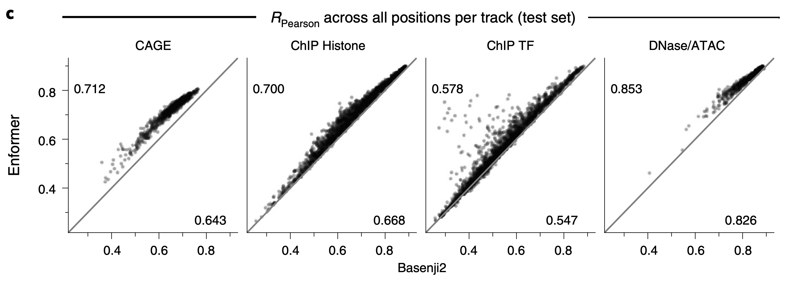
<span style="font-size: 16px">
Improvements reported by the Enformer model `r Citep(bib, "Avsec2021")`.
</span>

---

### Variant Effect Prediction

An indirect evaluation strategy was to contrast functional track predictions on
variant vs. reference alleles.

**eQTLs**: Several papers used GTEx to see whether their models could predict gene
expression changes in response to single nucleotide variants observed in real
human populations [Enformer, AlphaGenome, TraitGym].

.center[
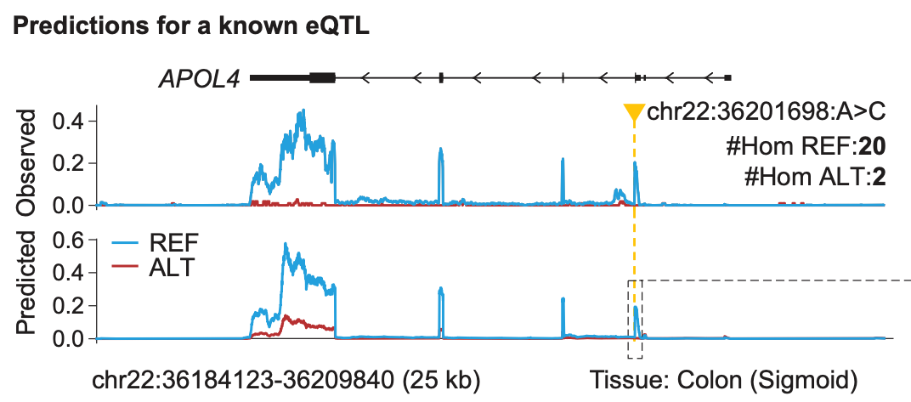
]

---

### Variant Effect Prediction

An indirect evaluation strategy was to contrast functional track predictions on
variant vs. reference alleles.

**MPRA assays**: Several papers also tested whether their models could predict
how gene expression changes in response to experimentally introduced variants
[Enformer, AlphaGenome, GET].

.center[
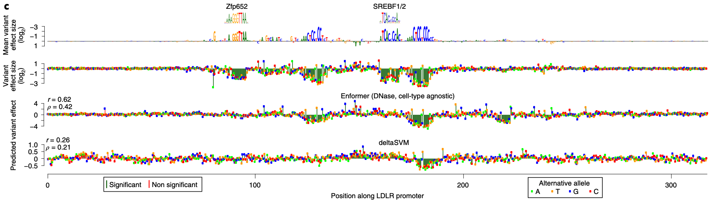
]
---

### Many Downstream Tasks

In the spirit of foundation models for language, the papers argued that the
models could be applied to many types of downstream tasks, either zero-shot or
after fine-tuning.

- Enformer and AlphaGenome
    - Predict enhancer-target pairs on independent CRISPRi perturbation datasets.
- GET `r Citep(bib, "Fu2025")`
  - Predict expression levels on cell types and functional genomics assays
  (CAGE) that were not a part of training. This used LORA fine-tuning.

---

### Many Downstream Tasks

In the spirit of foundation models for language, the papers argued that the
models could be applied to many types of downstream tasks, either zero-shot or
after fine-tuning.

- AlphaGenome: Could predict polyadenylation QTLs despite not including polyadenylation signals as a response track during training.
- TraitGym `r Citep(bib, "Benegas2025")`: Defined zero-shot scores for causal variant prediction across mendelian and complex traits.

---

## Techniques

---

### Attention Mechanisms

Enformer, AlphaGenome, and GET all used transformer-based attention to learn
long-range sequence relationships.
- The attention maps were evidence that long-range information helped.

.center[
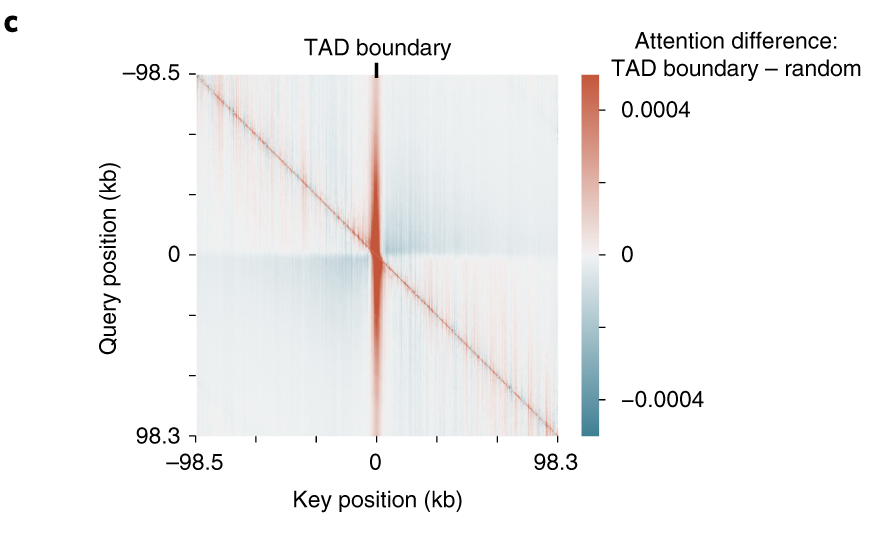<br/>
<span style="font-size: 16px">
The Enformer model automatically learned to attend to TAD boundaries.
</span>
]

---

### Attention Mechanisms

.pull-left[
The input length increases from 200kb for Enformer to 1mb for AlphaGenome.
- Needed to support communication across GPUs during training.
- Also supervised the attention maps using Hi-C contact maps.
]

.pull-right[
<br/>
<span style="font-size: 16px">
AlphaGenome processes sequences across multiple devices and includes 2D output
prediction tracks.
</span>
]

---

### Attention Mechanisms

.pull-left[
CellCap also uses attention, but on gene expression data, not sequence inputs.
Different perturbation response programs "attend" to a subset of relevant genes
`r Citep(bib, "Xu2025")`.
]

.pull-right[
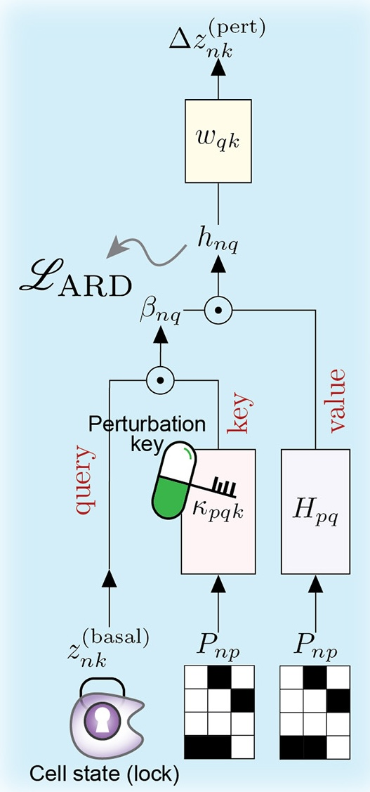
<span style="font-size: 16px">
</span>
]

---

### Convolution

1. Though attention is important for combining long-range information,
convolutional layers are still used for extracting low-level sequence features.

1. A single convolutional filter can be thought of like a PWM scanning the input
sequence for a pattern `r Citep(bib, "Novakovsky2022")`.

.center[
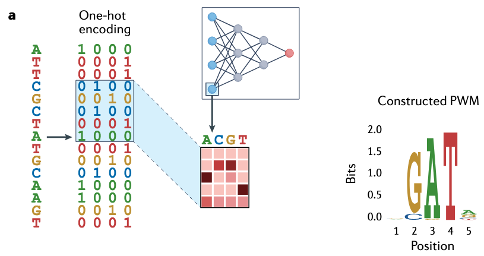
]

---

### Convolution

.pull-left[
1. The U-net structure allowed both deep and shallow convolutional features,
through encoder/decoder and skip connections, respectively.
]

.pull-right[
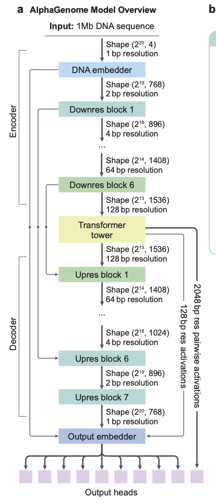
]

---

### Ensembling and Distillation

.pull-left[
1. The TraitGym study found that ensembling multiple sequence models yielded
better performance than using any one model in isolation.

1. Distillation: To speed up inference for their public API, AlphaGenome trained
a "student" model to emulate the original model's predictions.
]

.pull-right[
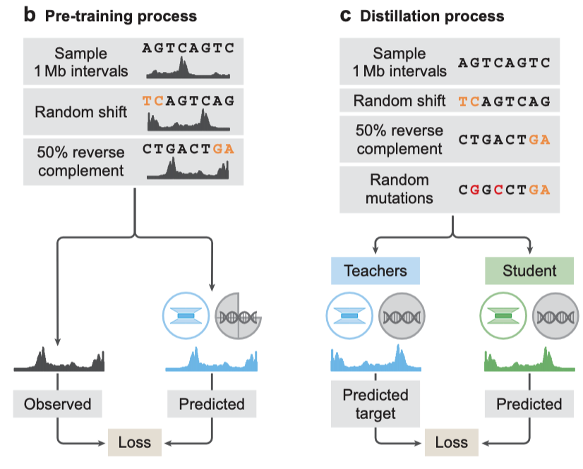
]

---

### Interpretation: In-Silico Mutagenesis (ISM)

How does swapping the reference with a variant changes track predictions? Large
changes could be important transcription factors. TraitGym, Enformer, GET, and
AlphaGenome all used this idea.

.center[
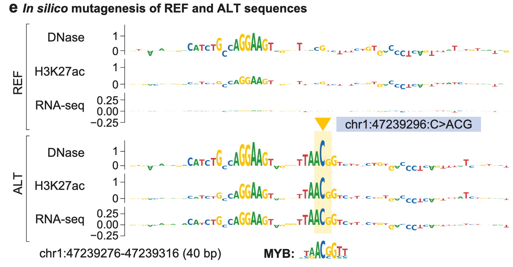
]

---

### Interpretation: In-Silico Mutagenesis (ISM)

In TraitGym, we had a self-supervised version of in-silico mutagenesis. Instead
of comparing

\begin{align*}
y\left(\text{alt}\right) \text{vs}. y\left({\text{ref}}\right)
\end{align*}

we could compare embeddings

\begin{align*}
z\left(\text{alt}\right) \text{vs.} z\left(\text{ref}\right).
\end{align*}

---

### Interpretation: Gradients

A related idea was to visualize the gradient of a target track with respect to
an input sequence. In Enformer and GET, this showed that the models had learned
long-range enhancer interactions.

.center[
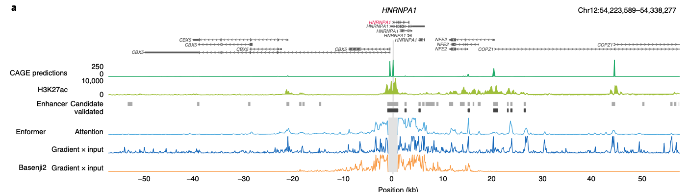
]

---

### Interpretation: Activations

We could try to understand individual neurons by seeing which sequence inputs
they activated on. Some neurons activate on motifs, but we never (?) saw more
complex regulatory "grammar" directly through network activations.

.center[

]

---

## Weaknesses and Opportunities

---

### Data Curation

There was very little agreement in the choice of datasets across models. It is
hard to tell which advances were due to architectural advances vs. better
training data.

- ATAC-seq was treated as input for GET, but output in AlphaGenome
- AlphaGenome used mice and humans, GPN-Promoter used 434 species

---

### Data Curation

Can we borrow ideas from efficient training of LLMs?

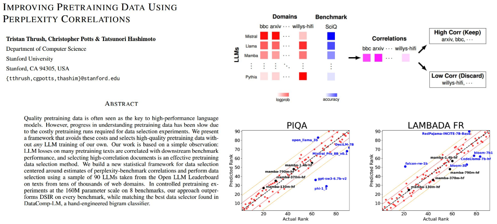

---

### Population-Level Variation

The ROSMAP dataset included whole genome sequencing and RNA expression
measurements for 839 people. Applying ISM to Enformer on these data correctly
identified eQTL positions, but the sign of the predicted effect was often wrong.

.pull-left[
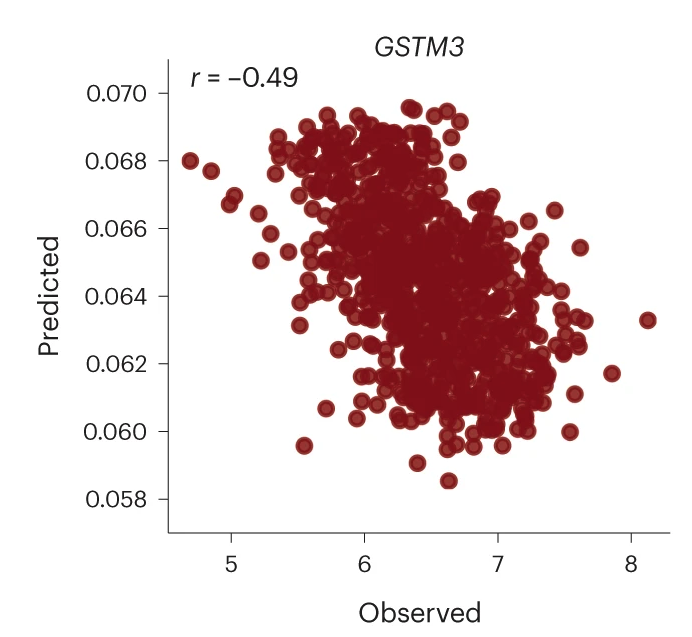
]

.pull-right[
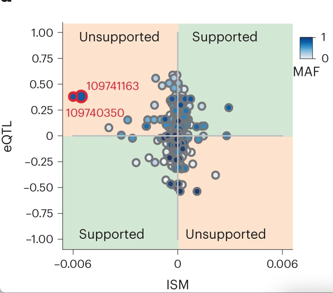
]

---

### Population-Level Variation

.pull-left[
There has been follow-up work `r Citep(bib, "Tu2025")`.
]

.pull-right[
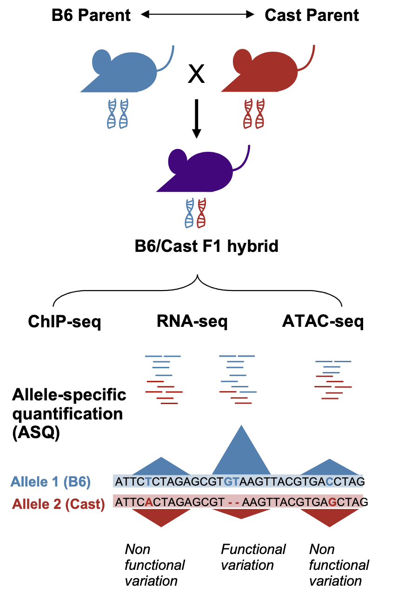
]

---

### Non-Sequence Data

For Perturb-Seq and Hi-C, we saw models (CellCAP and FastHigashi `r Citep(bib, "Zhang2022")`) that borrowed ideas from deep learning but which were simpler and more scalable than the analogous deep learning approaches.

.center[
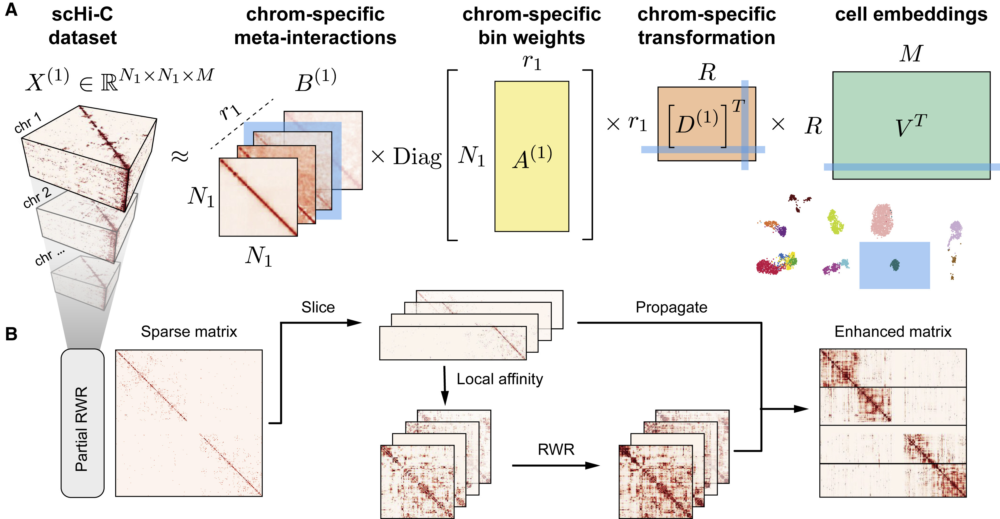
]

---

### Non-Sequence Data

.pull-left[
For Perturb-Seq and Hi-C, we saw models (CellCAP and FastHigashi `r Citep(bib, "Zhang2022")`) that borrowed ideas from deep learning but which were simpler and more scalable than the analogous deep learning approaches.
]

.pull-right[
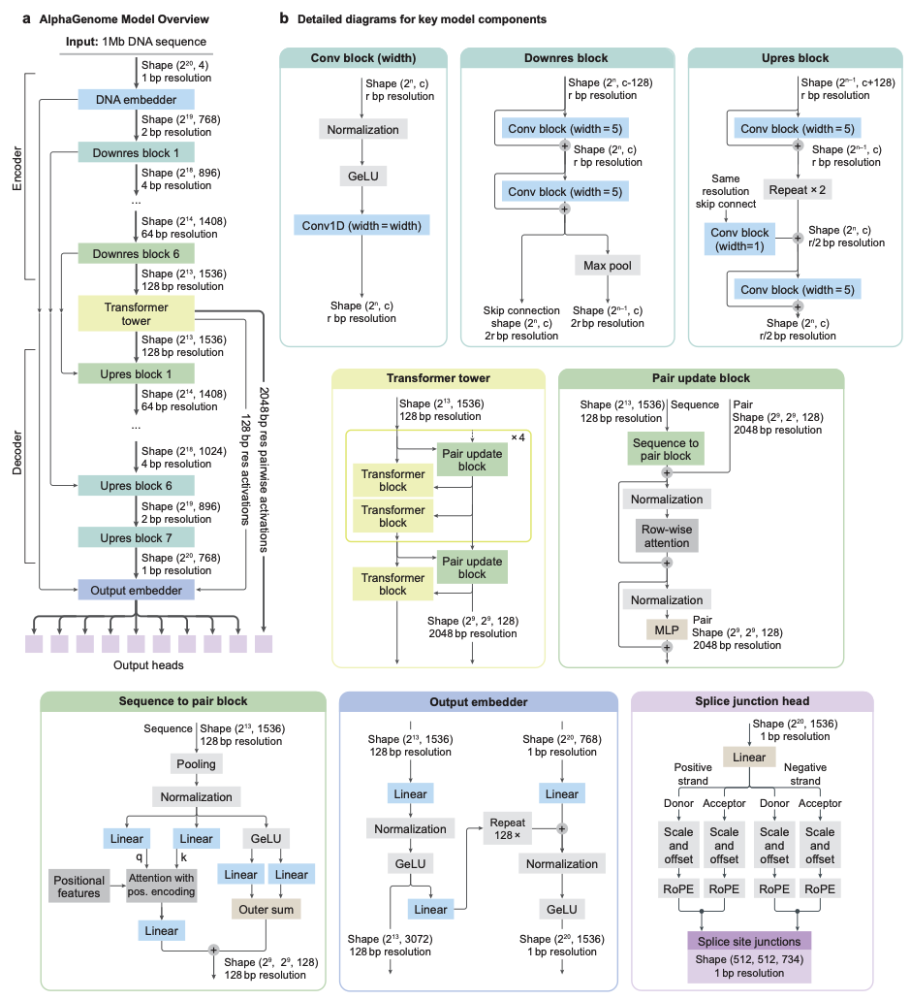
]

---

class: reference

### References

```{r, results='asis', echo = FALSE}
PrintBibliography(bib, start = 1, end = 12)
```
