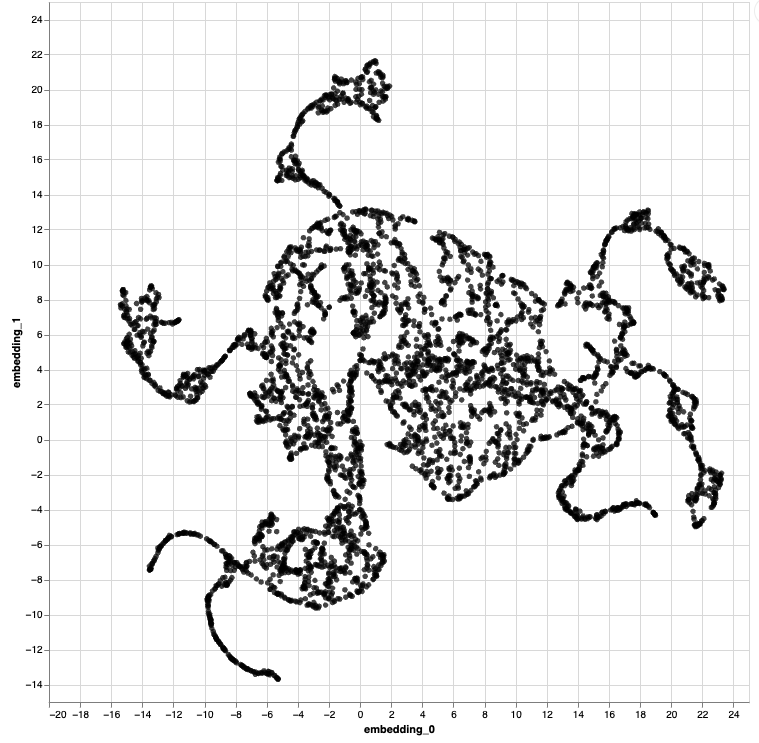

class: title

# Interactively Resolving Distortion in Nonlinear Dimensionality Reduction

<style>
.slide-background {
    background: url("figures/cover.png") no-repeat center center;
    background-size: cover;
    opacity: 0.5;
}
</style>

<div id="subtitle_left">
Paper: <a href="https://go.wisc.edu/oe3g62"/>go.wisc.edu/oe3g62</a><br/>
Slides: <a href="https://go.wisc.edu/">go.wisc.edu/</a><br/>
Lab: <a href="https://measurement-and-microbes.org">measurement-and-microbes.org</a> <br/>
Joint w/
Shuzhen Zhang, Chenab, Marina Meila <br/>
</div>
<div id="subtitle_right">
Kris Sankaran <br/>
CMStatistics <br/>
13 | December | 2025 <br/>
</div>

<!-- 25 minute talk -->

```{r, echo = FALSE, warning = FALSE}
library(knitr)
library(RefManageR)

opts_chunk$set(echo = FALSE, message = FALSE, warning = FALSE, cache = FALSE, dpi = 200, fig.align = "center", fig.width = 6, fig.height = 3)
BibOptions(
  check.entries = FALSE,
  bib.style = "numeric",
  cite.style = "numeric",
  style = "markdown",
  hyperlink = FALSE,
  dashed = FALSE,
  max.names = 1
)
bib <- ReadBib("references.bib")
```

---

### Map Distortions

 When making maps, we know that any projection introduces some degree of
 distortion. It's impossible to map the 3D earth into a 2D map while preserving
 all metric properties.

.center[

]

Gerardus Mercator's 1569 map of the world.

---

### Map Distortions

For example, the Mercator projection artificially inflates areas at the poles.
But it perfectly preserves angles, and this was extremely important for ocean
navigation.

.center[

]

---

### High-Dimensional Distortions

The same is true for high-dimensional data. Despite the popularity of nonlinear
dimensionality reductions like UMAP and t-SNE, we know that they introduce
distortions. For example, they may not preserve density within different
regions of the plot.

.center[

]
Example from `r Citep(bib, "narayan2021assessing")`.

---

### High-Dimensional Distortions

They can make high-dimensional random walks look artificially smooth...

.center[ ]
Example from `r Citep(bib, "wattenberg2016how")`.

---

### High-Dimensional Distortions

They can also fail to preserve the topology of the underlying data...

.center[

]
Example from `r Citep(bib, "Kobak2021")`.

---

### Consequences

These distortions are not mere technical curiosities -- they can significantly
impact scientific interpretation `r Citep(bib, c("Liu2025", "Kobak2021"))`. For example, they have been known to create
misleading differences between cell types that are actually quite similar.

.center[

]
Example from `r Citep(bib, "xia2024statistical")`.

---

### Consequences

They are
impact scientific interpretation `r Citep(bib, c("Liu2025", "Kobak2021"))`. For example, they have been known to create
misleading differences between cell types that are actually quite similar.

.center[

]

---

### Controversy

.pull-three-quarters-left[

]

.pull-three-quarters-right[
These problems have even entered the wider discourse about misinterpretation of
scientific findings.
]

---

### Specious Art

More generally, nonlinear dimensionality reduction has become the source of
widespread concern in the single cell literature `r Citep(bib, "Chari2023")`.

.center[

]

---

### Approach

We shouldn't abandon nonlinear dimensionality reduction, but we should try to
characterize the distortion. Our idea is to augment our usual visualizations
with measures of local distortion which are already available in the literature.

.center[


]

This is similar in spirit to Tissot's indicatrix in the cartography literature
`r Citep(bib, "laskowski1989traditional")`.

---

.center[
## Implementation
]

---

### Graph-based Metrics

The graph Laplacian induces a metric in the original manifold. Intuitively, two
points are close to one another if a random walk started at one point has a high
probability ending up at the other after $t$ steps.

.center[

]

---

### Metric Distortion

The RMetric algorithm measures how these intrinsic, graph-based distances become
distorted during the embedding process `r Citep(bib, c("perrault2006metric", "mcqueen2016nearly"))`.
This geometric view captures many related diagnostics.

---

### Local Metric Distortion

.center[

]

---

### Implementation Details

Suppose that the $k^{th}$ dimension of the embedding algorithm is $z_{k} \in \mathbb{R}^{N}$.
It turns out that the diffusion metric in the original space is transformed in
the embedding space according to the local metrics:

\begin{align*}
H_{\cdot, kl} := \frac{1}{2}\left[L\left(z_{k} \circ z_{l}\right) - z_{k} \circ \left(L z_{l}\right) - z_{l} \circ \left(L z_{k}\right)  \right]
\end{align*}

.center[

]


---

### Example

These two clusters are generated as:

\begin{align*}
x_{i} \sim \frac{1}{2}\mathcal{N}\left(0, 10\right) + \frac{1}{2}\mathcal{N}\left(100, 1\right)
\end{align*}

.center[

]

---

### Example

The UMAP embeddings lose information about the cluster density, but the
difference is captured in the local metrics.

.center[

]

---

### Local Isometrization

Since we know the metrics locally, we can invert the distortion within a
neighborhood of the user interaction. For example, here we adapt the embeddings
in the uniform data example to reflect the metric close to where the user's
mouse is hovering.

.center[

]

---

### Embedding Discontinuities

.pull-left[
- RMetric works well when distortions are "smooth" and the graph Laplacian
reflects derivative information of the embedding map.

- It fails when their are discontinuities -- two points that are close to one
another in the original space but which are fragmented in the embedding.
]

.pull-right[

]

---

### Fragmented Neighborhoods

Some neighborhoods have poorly preserved distances. To detect this, one approach
is:

* Fit the running median in a scatterplot of true vs. embedding distances.
* Compute the IQR within each bin. Points above $3\times$ IQR are considered poorly preserved outliers.
* If a large enough fraction of a point's neighbor links are poorly preserved, then that point is flagged as "broken."

---

### Fragmented Neighborhoods

.center[

]

---

.center[
## Examples
]

---

### Variable Density Swiss Roll

```{r, echo = FALSE}
library(tidyverse)
library(plotly)
library(scico)
library(scales)
sr <- read_csv("/Users/krissankaran/Desktop/collaborations/distortions-project/distortions/docs/tutorials/baselines/data/swiss_noise_0.5.csv") |>
  rename(x = `0`, y = `1`, z = `2`, t = `3`)

# map continuous `t` to a scico palette
pal <- scico(256, palette = "vik")
sr$col <- col_numeric(pal, domain = range(sr$t, na.rm = TRUE))(sr$t)
p <- plot_ly(sr, x = ~x, y = ~y, z = ~z, type = 'scatter3d', mode = 'markers', marker = list(color = ~col, size = 4), hoverinfo = 'none', showlegend = FALSE) %>%
  layout(scene = list(
    xaxis = list(showgrid = FALSE, zeroline = FALSE, showticklabels = FALSE),
    yaxis = list(showgrid = FALSE, zeroline = FALSE, showticklabels = FALSE),
    zaxis = list(showgrid = FALSE, zeroline = FALSE, showticklabels = FALSE)
  )) %>%
  config(displayModeBar = FALSE, scrollZoom = FALSE)
p
```

---

---

### Comparison with LOO-Map

---

### Mammoth

This example comes from `r Citep(bib, c("paircodeUnderstandingUMAP", "maxnoichlNoichlFlattening"))`. The 3D skeleton scans were produced by the
Smithsonian, and we can use nonlinear dimensionality reduction to "flatten" the
skeleton into 2D.

.center[

]

---

### Mammoth

This is the embedding when applying UMAP with a 10 nearest neighbor graph and
`min_dist = 0.5`.

.center[

]

---

### Mammoth

Parts of the shoulders, head, and tail are further apart in the embedding
compared to the original data. Most of other distortions are points that are
placed too close to one another.

.center[

]

---

### PBMC Dataset

This single cell gene expression data set used in the introductory data
visualization tutorial from the scanpy package `r Citep(bib, "scanpytutorialsAnalysisVisualization")`. Each point is the UMAP embedding of a
cell's high-dimensional gene expression data.

.center[

]

---

### PBMC Dataset

* Distance scales vary across clusters.
* Some boundary cells are neighbors with non-adjacent clusters in embedding space.

.center[

]

---

### PBMC Dataset

Here are the analogous embeddings when increasing the number of neighbors used
in the UMAP construction from 15 to 50.

.center[

]

---

### PBMC Dataset

In this case, the plasma and dendritic cells are less distorted than before, but
some issues remain with the monocytes.

.center[

]

---

### Hydra Cell Atlas

.pull-left[
Here is an application to a more realistic hydra cell atlas dataset `r Citep(bib, c("Siebert2019", "xia2024statistical"))`. We fit t-SNE with the perplexity hyperparameter set to 80. Points around the boundary are collapsed, and between-cluster distances are
exaggerated.
]

.pull-right[

]

---

### Hydra Cell Atlas

.pull-left[
Increasing perplexity to 500, the clusters are more reliable, but samples along
the boundary of the visualization are in fact closer than they appear.
]

.pull-right[

]

---

### Hydra Cell Atlas

.pull-left[
Applying the local isometry visualization, we can see that some of the "threads"
are actually more spread out in the original data.
]

.pull-right[

]

---

### Counterexample

Our visualization approach fails when local neighborhood information isn't
enough. These two rings are overlapping in the original data.

.center[


]

The original data are interlocking links. The color is the $x$-axis value and
would be unknown in practice.

---

### Summary

1. Distortion in nonlinear dimensionality reduction may be inevitable, but there
are ways to systematically characterize it.

1. Interactivity makes it possible to progressively reveal extra information
related to distortion depending on the analysts' priorities.

---

### Thank you!

* Contact: ksankaran@wisc.edu
* Lab Members: Margaret Thairu, Shuchen Yan, Yuliang Peng, Helena Huang
* Funding: NIGMS R01GM152744, NIAID R01AI184095

---

class: reference

### References

```{r, results='asis', echo = FALSE}
PrintBibliography(bib, start = 1, end = 13)
```

---

### Graph Laplacian

This random walk information is encoded in the normalized graph laplacian.

.pull-left[
\begin{align}
K_{nn'} &= \text{exp}\left(-\frac{1}{\epsilon}\|x_{n} - x_{n'}\|^2\right)\\
D &= \text{diag}\left(K \mathbf{1}_{N}\right)\\
\tilde{K} &= D^{-1}K D^{-1}
\end{align}
]

.pull-right[
\begin{align}
\tilde{D} &= \text{diag}\left(K \mathbf{1}_{N}\right) \\
L &= \frac{1}{\epsilon}\left[I - \tilde{D}^{-1}\tilde{K}\right] \\
\end{align}
]
