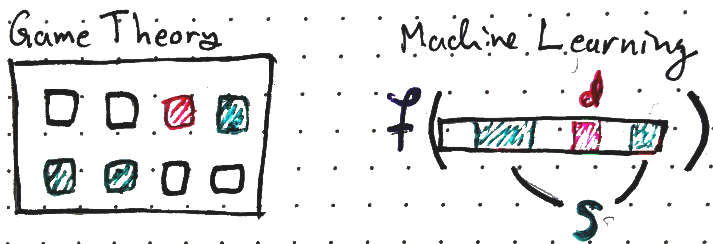
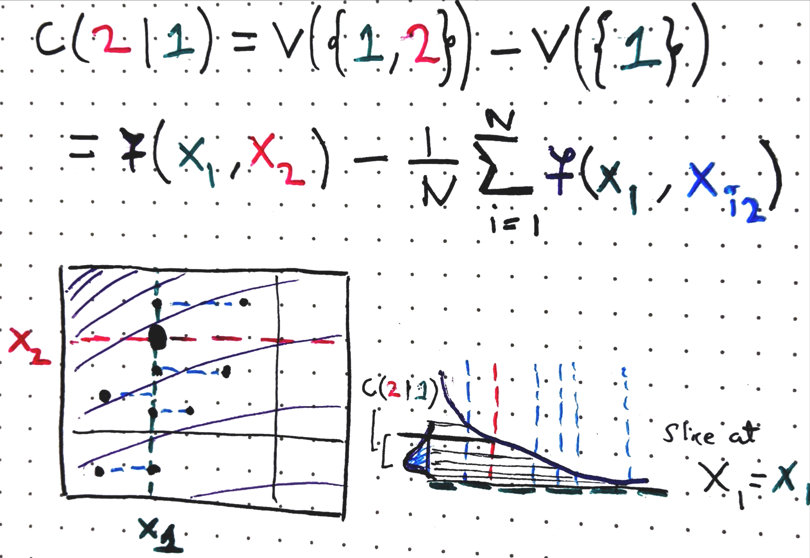
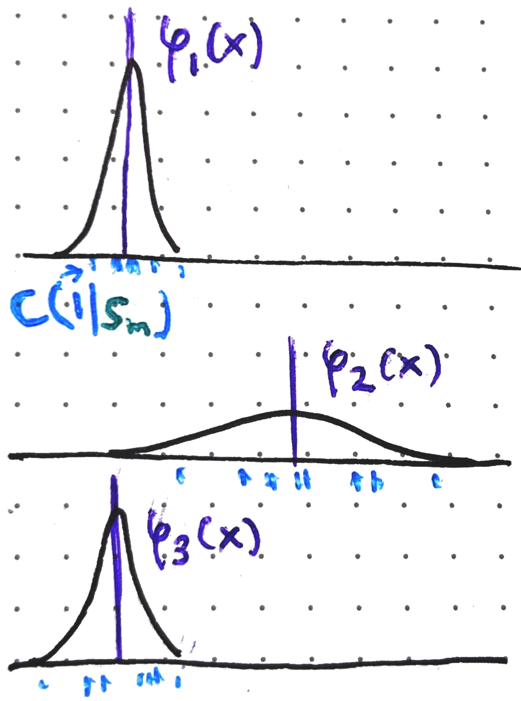
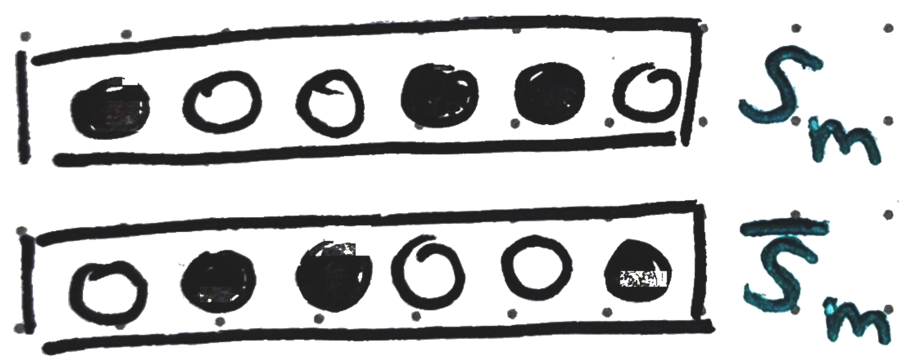
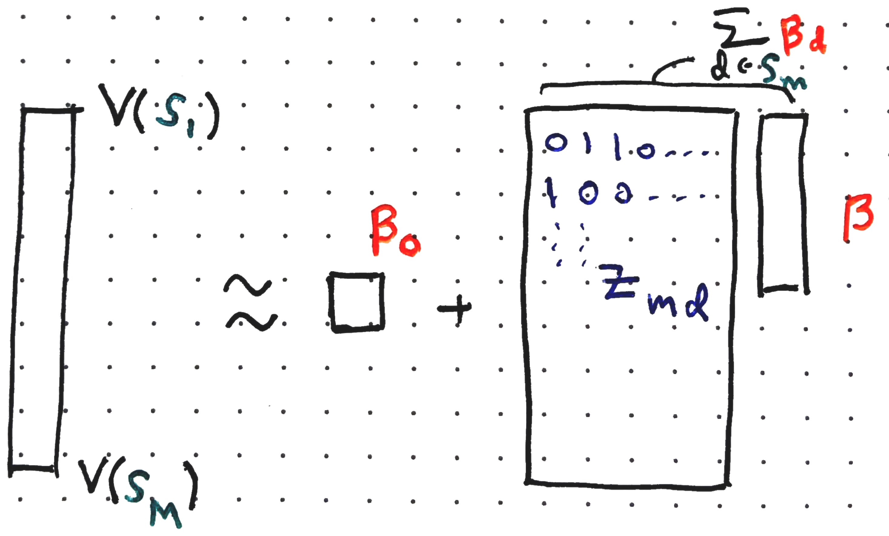
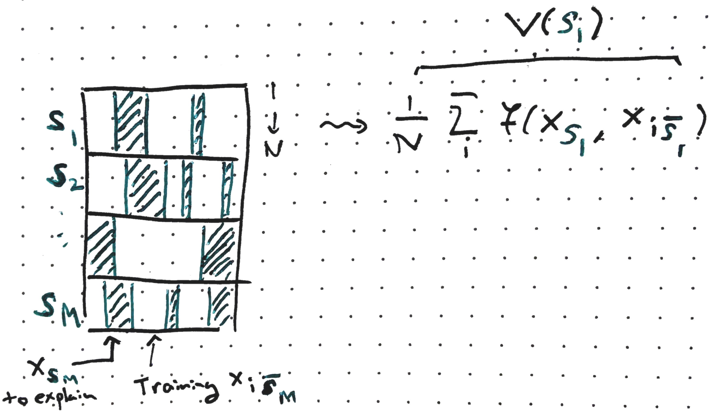
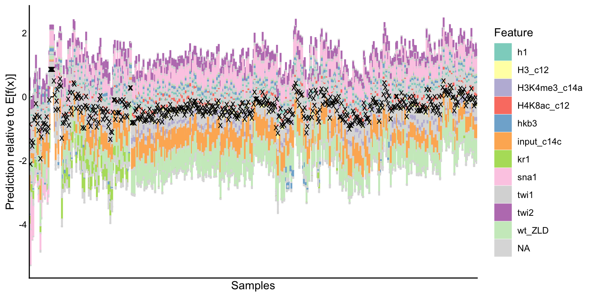
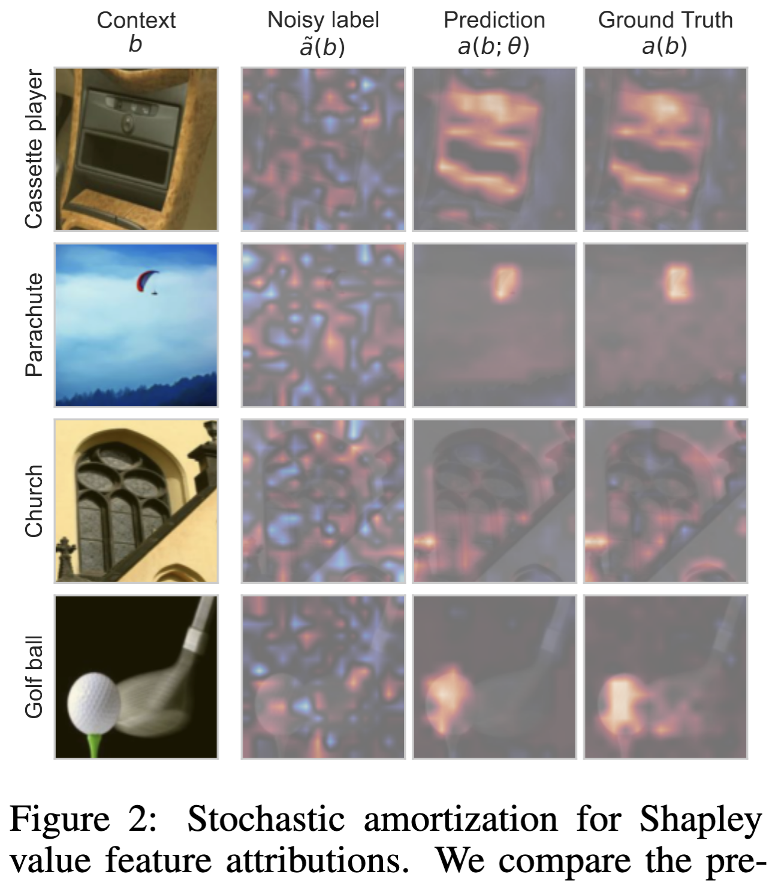
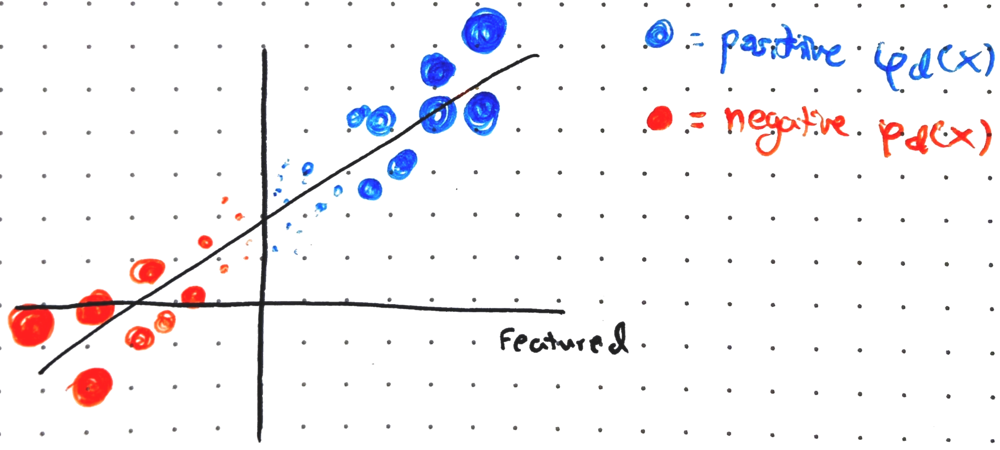

::: {style="display: none;"}
$$
\newcommand{\bs}[1]{\mathbf{#1}}
\newcommand{\reals}{\mathbb{R}}
\newcommand{\widebar}[1]{\overline{#1}}
\newcommand{\E}{\mathbb{E}}
\newcommand{\Earg}[1]{\mathbb{E}\left[{#1}\right]}
\newcommand{\Esubarg}[2]{\mathbb{E}_{#1}\left[{#2}\right]}
$$
:::

<style>
.purple { color: #7458d1ff; } /* pastel purple */
.orange { color: #fca020; } /* pastel orange */
.green { color: #3bbe67ff; } /* pastel green */
.darkblue { color: #4a9ceaff; } /* pastel dark blue */
.pink { color: #ee6ec3ff; } /* pastel pink */
</style>

```{r}
#| label: setup
#| echo: false
library(tidyverse)
library(reticulate)
theme_set(theme_classic() + theme(panel.border= element_rect(fill = NA, linewidth = .5)))
set.seed(2026)
```

```{r}
#| label: python-setup
#| echo: false
# includes the SHAP package. Can install it using,
# > conda env create -f stat479_week6.yml
# where the yaml file is located at: https://github.com/krisrs1128/stat479_notes/blob/master/notes/stat479_week6.yml
use_condaenv("stat479_week6")
```

_Readings: [1](https://arxiv.org/abs/2207.07605), [2](https://proceedings.mlr.press/v108/janzing20a.html), [3](https://proceedings.neurips.cc/paper_files/paper/2024/hash/084252ec5f05f13bf565843c1873686d-Abstract-Conference.html)_, _[Code](https://github.com/krisrs1128/stat479_notes/blob/master/notes/09-shap_definitions.qmd)_

# Conceptual Foundation

## Setup

**Goal.** Given a model <span class="purple">$f$</span> and a sample $x \in \reals^{D}$, return a _local feature attribution_ $\varphi_d\left(x\right)$ that quantifies the contribution of <span class="pink">feature $d$</span> to the prediction <span class="purple">$f\left(x\right)$</span>.

**Requirements.**

   - _Local feature attributions_. Unlike global variable importances,
   $\varphi_d\left(x\right)$ are specific to sample $x$.  This matters a
   stakeholder cares specifically about particular prediction $f(x)$ and wants
   an explanation for it.

   - _Model agnostic_. Attributions should be computable by
   querying $f$ alone, without any assumptions about what kind of model it is --
   it could be a black box.

   - _Principled._ The attribution measure should be derivable from a clear set
   of mathematical axioms.

**Approach.**

SHAP values satisfy all three requirements. This handout focuses on their
theoretical development and practical computation. We proceed in these steps,

1. _Game theory definitions._ SHAP is inspired by a classic result $n$-player
game theory.  We're not interested in game theory for its own sake, but this
framing will help us see why there are several defensible ways to adapt it to
machine learning.

1. _Machine learning analogy._ We develop an analogy between the game theoretic
definition and quantities of interest in local feature attribution.

1. _Feature removal._ The most ambiguous part of the game theory $\to$ ML
analogy is how implement "feature removal."  Different choices lead to different
SHAP variants

1. _Computation._ We discuss efficient strategies for computing SHAP values.

## Local Feature Attributions

1. _High-stakes decisions._ When an individual has a medical diagnosis made or
an insurance claim denied, knowing the globally most important features isn't
enough. They deserve an explanation specific to their case.

   - A related use case is _algorithmic recourse_. What could a stakeholder
   change to reverse a decision? (e.g., which change to their resume would have
   gotten them a job interview?)

1. _Model debugging._ A model might classify $x$ as a husky because it had snow
in the background (large $\varphi_d(x)$ on pixels $d$ in the snow region) rather
than the dog itself. This means the model has learned a "shortcut" and won't
generalize well -- a wolf in the snow might get misclassified as a husky
[@Ribeiro2016].

   {width=60%}

1. _Scientific discovery_. In heterogeneous populations (e.g., different disease
subtypes), a model might rely on different sets of features for each
subpopulation. Local attributions can highlight these differences -- e.g.,
identifying which features drive drug effectiveness in one subgroup vs. another.

   _Exercise: Give one example (hypothetical, or from your own experience) where local feature attribution would be useful. How would it differ from global variable importance?_

## Game Theory Definitions

1. SHAP is motivated by the credit assignment problem from game theory. Imagine
agents $\mathcal{D} = \{1, \dots, D\}$ and imagine where any <span
class="green">subset $S$</span> earns profit $v(S)$. How much of the total
profit $v(\mathcal{D})$ should agent $d$ receive?  This share is the **Shapley
value** $\varphi_{d}(v)$.

1. Intuitively, agent $d$'s contribution depends on how much they add to each
team $S$.  Define the marginal contributions of agent $d$ to team $S$ as,
   $$C\left(d \vert S\right) = v(S \cup \{d\}) - v(S)$$

   {width=50%}

1. The Shapley value is a weighted average of these marginal contributions
across all subsets $S \subseteq{\mathcal{D} - \{d\}}$ excluding agent $d$,

   $$
  \varphi_d(v) = \sum_{S \subseteq \mathcal{D} - \{d\}} \frac{1}{D {D - 1 \choose \left|S\right|}} C(d \vert S)
   $$ {#eq-shapley}
   The summation is over all subsets that don't include agent $\{d\}$ (if it had
   included agent $d$, then the definition of the contribution $C(d \vert S)$ of
   $d$ to $S$ wouldn't make sense).

   _Exercise: Express the following in terms of $v$. Which of these could appear in the definition of the Shapley value?_
     - _$C(1 \vert 2)$_
     - _$C(1 \vert \emptyset)$_
     - _$C(1 \vert 1)$_
     - _$C(3 \vert  \{1, 2\})$_
     - _$C(\{1, 2\} \vert 3)$_

1. The weights $1/(D {D - 1 \choose \left|S\right|})$ ensure that the weights
sum to 1, making $\varphi_{d}(v)$ a proper weighted average of marginal
contributions. For any coalition of size $s$, there are ${D - 1 \choose s}$
subsets with that size, so the total weight is,

   $$
   \sum_{s=0}^{D-1} \binom{D-1}{s} \frac{1}{D\binom{D-1}{s}} = \sum_{s=0}^{D-1} \frac{1}{D} = 1.
   $$

   {width=70%}

1. The Shapley value is the unique solution satisfying the axioms below, giving
this approach a principled justification,

   - **Efficiency**. Shapley values sum to the total profit:
    $$
    \sum_{d = 1}^{D} \varphi_{d}(v) = v\left(\mathcal{D}\right) - v\left(\emptyset\right)
    $$
    All profit is distributed and nothing is left over.

   - **Monotonicity**. If agent $d$ contributes at least as much in game $v_1$
   as in $v_2$ for every coalition^[That is, if $v_1\left(S \cup \{d\}\right) -
   v_1(S) \geq v_2\left(S \cup \{d\}\right) - v_2(S)$.], then $\varphi_d(v_1)
   \geq \varphi_d(v_2)$.

   - **Symmetry**. Equal contributors receive equal credit.  That is, if $v(S
   \cup \{d\}) = v(S \cup \{d'\})$ for every $S$, then $\varphi_d(v) =
   \varphi_{d'}(v)$.

   - **Missingness**. An agent that never contributes receives nothing.  That
   is, if $v\left(S \cup \{d\}\right) = v\left(S\right)$ for every $S$, then
   $\varphi_d(v) = 0$.

## Machine Learning Analogy

1. The key insight is that we can map this game theoretic setup to the local
feature attribution problem:

   - "profit $v(\mathcal{D})$" $\to$ "prediction $f(x)$"
   - "agent $d$" $\to$ "feature $d$."
   - "team $S$" $\to$ "subset of features $S \subset \mathcal{D}$."

   Instead of distributing profit across agents, we attribute a prediction
   $f(x)$ across features. We denote this attribution $\varphi_d(f, x)$

   {width=60%}

1. For this to work, we need to define $C(d \vert S)$ as the change in
prediction feature $d$ is included vs. removed.  Different answers to this
feature removal question lead to different Shap values. But once $C$ is defined,
we can substitute it into Equation @eq-shapley to get a local feature
attribution for sample $x$.

   _Exercise: Pick one of the four axioms for game theoretic SHAP. What does it
   imply about $\varphi_d(f, x)$?_

## Deterministic Feature Removal

1. There are three common approaches to feature removal: baseline, marginal, and
conditional. We'll review each in turn.

1. Let <span class="darkblue">$x'$ denote a _baseline_ value</span>. For
example, $\mathbf{0}\in \reals^{D}$, or the sample mean $\bar{x} \in
\reals^{D}$.  Define
   $$
   v(S) = f(x_{S}, x'_{\bar{S}}) \\
   $$
   where $x_{S}$ and $x_{\bar{S}}$ index the coordinates of $x$ included and
excluded from <span class="green">$S$</span>. This uses the real feature
values from sample $x$ for coordinates in $S$ and substitutes the baseline
<span class="darkblue">$x'$</span> elsewhere.

   {width=35%}

   _Exercise: Suppose that $x$ is an image and that $x'$ is the all zeros image. What would $\left(x_{S}, x'_{\bar{S}}\right)$ look like?_

1. The marginal contributions become,

   $$
   \begin{align*}
   C(d \vert S) &= v\left(S \cup \{d\}\right) - v(S)\\n   &= f\left(x_{S \cup \{d\}}, x'_{\overline{S \cup \{d\}}}\right) - f\left(x_{S}, x'_{\bar{S}}\right)
   \end{align*}
   $$
   This is the change in prediction when feature $d$ is included (left) vs.
   replaced by the baseline (right).

   {width=50%}

1. The downside of this approach is that it depends on the choice of baseline
$x'$, and there is no obvious principled way to choose it.

   {width=90%}

## Sampling-based Feature Removal

1. Both the marginal and conditional approaches replace the deterministic
baseline with an expectation over randomly sampled coordinates. Let
$X_{\bar{S}}$ be a random vector of the features *not* in $S$, drawn from the
training distribution. The _marginal_ approach defines,
   $$
   v(S) = \Esubarg{p(X_{\bar{S}})}{f(x_{S}, X_{\bar{S}})}
   $$ {#eq-marginal}

1. In practice, this expectation can be approximated by the training data, $x_1,
\dots, x_{N}$,
   $$
   v(S) = \frac{1}{N} \sum_{i = 1}^{N} f(x_S, x_{i,\bar{S}}).
   $$
   {width=50%}

   The figure below gives a geometric representation of one term in the SHAP
   sum,
   {width=90%}

   _Exercise: What would $C\left(1 \vert 2\right)$ look like in this figure? What about $C\left(1 \vert \emptyset\right)$?_

   _Exercise: Would you expect $\varphi_1(f, x)$ to be larger or smaller than $\varphi_2(f, x)$ for the $f$ and $x$ shown? Explain your reasoning._

1. A potential downside of this approach is that, if features are correlated,
the marginal approach may evaluate $f$ at unrealistic input combinations. This
is because $X_{\bar{S}}$ is sampled independently from the observed $x_{S}$.

   _Exercise: Modify the previous figure to illustrate this extrapolation issue._

1. The _conditional_ approach addresses this by drawing $X_{\bar{S}}$ from the
distribution conditioned on the observed $x_{S}$,

   $$
   v(S) = \Esubarg{p\left(X_{\bar{S}} \vert X_{S} = x_{S}\right)}{f(x_{S}, X_{\bar{S}})}.
   $$

1. Unlike the marginal approach, there is no generic estimator for this
conditional expectation.  Under some assumptions (e.g., multivariate
gaussianity), it might be available in closed form. Alternatively, one approach
is to train a surrogate model to approximate and sample from the required
conditional distributions.

## Causal Intervention Perspective

1. Some researchers [@janzing20a] have argued that point (3) in the
previous section is not actually a problem, and that, from a causality
perspective, the marginal approach computes the more meaningful expectation.

1. To see this, we distinguish between observed data $\tilde{x}$ and
model inputs $x$. An intervention conditional distribution sets the input
coordinates ${S}$ to $x_{S}$ while leaving $X_{\bar{S}}$ undisturbed, written as
   $$\Earg{f(X_{S}, X_{\bar{S}}) \vert \text{do}(X_{S} = x_{S})}$$
   This differs from ordinary conditioning, which asks "given $X_{S} = x_{S}$,
   what do we expect $X_{\bar{S}}$​ to look like?" In contrast, intervening asks
   "What if we force $X_S = x_S$ and leave everything else untouched?"

   _Exercise: Compare and contrast interventional conditional distributions with CP profiles._

1. Conditioning on $X_S = x_S$ can change the distribution of
$X_{\bar{S}}$ in a way that creates nonzero attributions for any feature $d$
that is correlated with $X_S$, even even if they aren't in the model.
Interventions avoid this because they leave $X_{\bar{S}}$ unchanged.

1. To make this concrete, suppose $X_1$ is a thermometer measurement,
$X_2$ is the actual temperature, and $f(X_1, X_2) = X_2$ only depends on the
actual temperature. Since the two variables are correlated, $\Esubarg{p(X_2
\vert X_1 = x_1)}{X_2} \neq \Earg{X_2}$, so $C(1 \vert \emptyset) \neq 0$ and we
get a nonzero attribution for $X_1$, even though it isn't in the model^[In full detail,
    $C(1 \vert \emptyset) = v(\{1\}) - v(\emptyset) = \Esubarg{p(X_2 \vert X_1 = x_1)}{X_2} - \Esubarg{p(X_1, X_2)}{X_2} \neq 0$ and $C(1 \vert 2) = v(\{1, 2\}) - v(\{2\}) = f(x_1, x_2) - \Esubarg{p(X_1 \vert X_2 = x_2)}{f(X_1, x_2)} = x_2 - x_2 = 0$ where in the last step we used the fact that $f(X_1, x_2) = x_2$ deterministically. Therefore the terms don't cancel and we obtain a nonzero Shapley value.].

1. It turns out that
   $$
   \Esubarg{p(X_{\bar{S}})}{f(X_{S}, X_{\bar{S}}) \vert \text{do}(X_{S} = x_{S})} = \Esubarg{p(X_{\bar{S}})}{f(x_{S}, X_{\bar{S}})}
   $$
   The right hand side is exactly the marginal expectation from @eq-marginal.
   So, the marginal approach matches a causally meaningful quantity that
   reflects what it means to remove a feature's influence.

# Computation

## Challenge

1. Let's first see why naive SHAP computation is slow. Recall the key quantities,

   * Feature $d$'s attribution,
   $$
   \varphi_d(f, x) = \sum_{S \subseteq \mathcal{D} - \{d\}} \frac{1}{D {D - 1 \choose \left|S\right|}} C(d \mid S)
   $$ {#eq-shapley}
   where $C(d \mid S) = v(S \cup \{d\}) - v(S)$ is the marginal contribution of
   $d$ to coalition $S$. Both $C$ and $v$ depend on $f$ and $x$, but we suppress this from
   our notation. We also write $\varphi_d(x)$ instead of $\varphi_d(f, x)$, since $f$ is
   fixed in these notes.

   - The value function $v(S)$ evaluates $f$ on $x$ after "removing" features
   outside of $S$ removed. We covered three removal strategies:
     - Baseline $v(S) = f(x_S, x'_{\bar{S}})$
     - Marginal^[Compared to our earlier notes, we're allowing for background subsamples B < N.]: $v(S) = \mathbb{E}_{p(X_{\bar{S}})}[f(x_S, X_{\bar{S}})] \approx \frac{1}{B}\sum_{i=1}^{B} f(x_S, x_{i,\bar{S}})$
     - Conditional: $v(S) = \mathbb{E}_{p(X_{\bar{S}} \mid X_S = x_S)}[f(x_S, X_{\bar{S}})]$

1. To compute all $D$ attributions for one sample, we need $v(S)$ for every $S
\subseteq \mathcal{D}$. Using marginal feature removal, each $v(S)$ costs $B$
evaluations of $f$.  Let's try a Fermi calculation. Take $N = 100, D = 10, B =
100$. Attribution across all samples and features requires
   $$10^2 \text{ samples} \times 2^{10} \text{ subsets} \times 10^2 \text{ calls per subset} \approx 10^7 \text{ evaluations}.$$
Supposing 1ms per call, this takes $\approx 3$ hours (and this is only 100
samples with 10 features). More generally, marginal removal costs $NB\,2^D$
evaluations.

   _Exercise: What are the relative costs of marginal vs. baseline feature removal?_

## Sampling Perspective

1. The weights in @eq-shapley define a probability distribution,
   $$
   \mathbb{P}(S) = \frac{1}{D \binom{D-1}{|S|}},
   $$
   because they are nonnegative and sum to one. This lets us rewrite
   $\varphi_d(x)$ as an expectation,
   \begin{align}
   \label{eq-distribution}
   \varphi_d(x) &= \sum_{S \subseteq \mathcal{D} \setminus \{d\}} \mathbb{P}(S)\, C(d \mid S) = \mathbb{E}_{\mathbb{P}(S)}[C(d \mid S)].
   \end{align}
   i.e., the Shapley value is the expected contribution of feature $d$ to a
   random coalition.

   Instead of enumerating all $2^{D-1}$ subsets to get the exact expectation, we
   sample $S_1, \dots, S_M \sim \mathbb{P}(S)$ and estimate
   $$
   \hat{\varphi}_d(x) = \frac{1}{M}\sum_{m=1}^{M} C(d \mid S_m).
   $$ {#eq-sampling}
   This is unbiased ($\mathbb{E}[\hat{\varphi}_d(x)] = \varphi_d(x)$) and
   increasing $M$ improves the approximation.

   _Exercise: Suppose $\mathcal{D} = \{1, \dots, 4\}$ and $d = 1$. What are the $\mathbb{P}(S)$ for the sets in @eq-shapley? _

1. To draw $S_{m} \sim \mathbb{P}(S)$ in practice, we use random permutations.
Draw $\pi : \{1, \dots, D\} \to \{1, \dots, D\}$ uniformly at random. For
example, for 10 features we could use,

   ```{r}
   #| label: example-perm
   pi <- sample(1:10)
   pi
   ```

   Let $\text{Pre}^{d}\left(\pi\right)$ the features appearing before $d$ in
   $\pi$. E.g., for $d = 4$,
   ```{r}
   #| label: perm-to-set
    pi[seq_len(match(4, pi) - 1)]
   ```
   It's not obvious, but $\text{Pre}^d\left(\pi\right)$ gives a sample from
   $\mathbb{P}\left(S\right)$.

1. To summarize, the procedure is,
   ```
   for m = 1, ..., M:
     sample a random permutation π_m over D features
     set S_m = Pre^d(π_m)
     compute C(d | S_m)
   return average of C(d | S_m) over m
   ```
   This is often called IME ("Interactions-based Method for Explanation").
   Larger $M$ gives better approximations but at higher computing cost.

1. _Adaptive sampling_. The terms $C\left(d \vert S_{m}\right)$ are random
variables with mean $\varphi_{d}\left(x\right)$.

   (picture of their histograms across $d$)

   For features that are irrelevant, the contributions are tightly clustered
   near zero, so even small values of $M$ are enough. Inspired by this
   observation, adaptive sampling tracks the variance of $C(d \mid S_m)$ across
   features and allocates more samples to high-variance features.

   {width=40%}

1. _Antithetic sampling_. Recall that
   $$
   \text{Var}(Z_1 + Z_2) = \text{Var}(Z_1) + \text{Var}(Z_2) + 2\text{Cov}(Z_1, Z_2).
   $$
   so negative correlated terms reduce the variance of the sum.

   _Exercise: If $\text{Cor}(Z_1, Z_2) = -1$ and $Z_1, Z_2$ have the same variance, what is $\text{Var}(Z_1 + Z_2)$?_

   More generally,
   $$\text{Var}\!\left(\sum_{m=1}^M Z_m\right) = \sum_m
   \text{Var}(Z_m) + \sum_{m \neq m'} \text{Cov}(Z_m, Z_{m'}),$$
   so again negative pairwise correlations reduce variance.

1. Applying this to @eq-sampling, we can reduce the correlation between
$C\left(d \vert S_m\right)$ and $C\left(d \vert S_{m'}\right)$ by pairing each
$S_m$ with its complement,

   - Sample $S_m \sim \mathbb{P}(S)$
   - Set $S_{m'} = \bar{S}_{m}$ the complement of $S_m$ in $\{1, \dots, D\}$.

   Despite its simplicity, this yields state-of-the-art variance reductions
   [@mitchell2022].

   {width=40%}

## Weighted Least Squares

1. A classical result in game theory [@Charnes1988] shows that SHAP values can
be characterized through a weighted least squares problem,
   $$
    \varphi\left(x\right) =
    \arg \min_{\beta \in \reals^{D + 1}} \sum_{S \subset \mathcal{D}} w(S) \left(v(S) - \beta_0 - \sum_{d \in S}\beta_{d}\right)^2
   $$ {#eq-kernelshap}
    where $w(S) = \left[\binom{D}{|S|} |S|(D - |S|)\right]^{-1}$ and $\varphi(x) = (\varphi_1(x), \dots, \varphi_D(x))^\top$.

1. This characterization still enumerates $2^D$ subsets, but it suggests an
approximation: sample random subsets $S_1, \dots, S_M$ and solve the weighted
regression on the reduced design. This is "KernelSHAP."

1. Let $z_{md} = \mathbf{1}[d \in s_m]$ be the associated design matrix. the
regression suggests $v(\emptyset) \approx \beta_0$ and
   $$
   v(S_m) - v(\emptyset) \approx \sum_{d = 1}^{D} z_{md}\beta_d.
   $$ {#eq-constraint}
   The efficiency constraint becomes,
   $$
   v(\mathcal{D}) - v(\emptyset) \approx \sum_{d = 1}^{D} \beta_d =: \Delta\\
   $$
   We can improve the quality of our approximation by enforcing these
   constraints, substituting $v(\emptyset) = \Esubarg{p(x)}{f(X)} \approx \frac{1}{N}\sum_{i = 1}^{N} f(x_i)$ and $v(\mathcal{D}) = f(x)$.

   _Exercise: In fact, the regression objective ensures that $v\left(\emptyset\right) = \beta_0$ and $v(\mathcal{D}) - v(\emptyset) = \Delta$ hold exactly. Can you see why?_

   {width=65%}

1. To see this concretely, let's try a code implementation (validated
against the `shap` package below). First, initialize the binary mask matrix
$z_{md}$, kernel weights, and feature-removed inputs:

   ```{python}
   #| label: mask-init
   #| eval: false
   mask_matrix = np.zeros((M, D))
   kernel_weights = np.zeros(M)
   synth_data = np.tile(data, (M, 1))
   ```

1. Next we draw random subsets $S_m$ and the corresponding feature-removed data
$(x_{S_m}, x_{i,\bar{S}_m})$:

   ```{python}
   #| label: subset-sampling
   #| eval: false
   for i in range(M):
        mask = np.random.choice([0, 1], size=D)
        mask_matrix[i] = mask
        synth_data[i * N:(i + 1) * N, mask == 1] = x[0, mask == 1] # explaining x[0]
        kernel_weights[i] = 1 / (comb(self.D, mask.sum()) * mask.sum() * (self.D - mask.sum()))
   ```
   {width=65%}

   We evaluate $f$ on the feature-removed data. Here `f_bar` estimates
   $v(\emptyset)$.
   ```{python}
   #| label: model-eval
   #| eval: false
    f_bar = np.mean(model(data))
    f = model(synth_data)
    v = np.mean(f.reshape(M, N, -1), axis=1)
   ```

   _Exercise: In the line `synth_data[i, ...]`, how many entries of `synth_data` get modified? What is the interpretation?_

1. Finally, we run the weighted regression. We incorporate efficiency
constraints from point (3). Since $\beta_D = \Delta - \sum_{d= 1}^{D - 1}
\beta_d$, we can substitute into @eq-constraint,
   $$
   v(S_m) - v(\emptyset) - z_{mD}\Delta \approx \sum_{d = 1}^{D - 1}\left(z_{md}- z_{mD}\right)\beta_{d}
   $$
   The left hand side is `y` below and the right hand side is `X`.
   ```{python}
   #| label: weighted-regression
   #| eval: false
   y = (v - f_bar).flatten() - mask_matrix[:, -1] * (model(x) - f_bar)
   X = mask_matrix - mask_matrix[:, -1][:, None]
   lm = LinearRegression(fit_intercept=False).fit(X, y, sample_weight=kernel_weights)

   # final shapley values
   phi = np.zeros(D)
   phi[:-1] = lm.coef_[:-1]
   phi[-1] = (model(x) - f_bar) - np.sum(lm.coef_)
   ```

## Amortization

1. So far, we've only explained a single observation $x$. In
practice, we want attributions for many $\{x_i\}_{i =1}^{N}$.  An important
insight is that attributions across observations are often related, so we can
pool our estimates across all samples. This lets us tolerate rougher estimates
for each individual sample.

   {width=60%}

1. _Amortization_ frames parameter estimation as
supervised learning. For concreteness, consider noisy KernelSHAP estimates using small $M$,
   $$
   \hat{\varphi}_d^{M}(x_i) = \arg \min_{\beta \in \reals^{D + 1}} \sum_{m = 1}^{M} w(S_m) \left(v(S_m) - \beta_0 - \sum_{d \in S_m}\beta_{d}\right)^{2}
   $$
   Then train a model $a_\theta : \reals^D \to \reals^D$ (e.g. linear or neural
   network) to predict these estimates,
   $$
  \hat{\theta} = \arg\min_{\theta \in \Theta} \sum_{i=1}^{N}
  \left\|\hat{\varphi}^M(x_i) - a_\theta(x_i)\right\|^2.
   $$
   This is now like a supervised learning problem where the "labels" are
   $\hat{\varphi}^{M}(x_i)$ and the input features are $x_i$.

1. Once $\hat{\theta}$ has been found, we can very quickly get
attributions for a new sample $x^\ast$ by just calling
$a_{\hat{\theta}}(x^\ast)$. We don't even need to sample any subsets $S_m$ or
evaluate any $v(S_m)$. Moreover, the learned model can smooth over the noise in
the per-sample estimates, leading to $a_{\hat{\theta}}(x^*)$ that approximates
$\varphi(x^*)$ more accurately than $\hat{\varphi}^M(x^*)$.

1. Some caveats. Training $a_{\theta}$ can itself be computationally
intensive. Also, if the labels $\hat{\varphi}^M(x_i)$ are too noisy, the learned
mapping may be inaccurate. Nonetheless, early research suggests that even
moderate $M$ and practical $a_{\theta}$ can learn $\varphi(x)$ with high
fidelity.

   {width=60%}

## Model-Specific Versions

1. Within specific model classes, we can derive closed-form SHAP formulas that
bypass enumeration over subsets. For example, in your HW3, you will show that
linear models $f(x) = \beta_0 + \sum_{d} \beta_{d}x_{d}$ with baseline removal
satisfy,
   $$
   \varphi_{d}(x) = \beta_{d}\left(x_{d} - x_{d}'\right)
   $$
   The
   attribution only depends on feature $d$'s deviation from the baseline and
   coefficient $\beta_d$. A similar derivation shows that for marginal feature
   removal,
   $$
    \varphi_{d}(x) = \beta_{d}\left(x_{d} - \Esubarg{p(x)}{X_{d}}\right)
   $$
   so using the marginal removal is the same as using the sample mean as a
   baseline.

   {width=55%}

1. There are two other important model-specific methods,

   - TreeSHAP: This gives exact SHAP values tree-based model (CART,
   bagging, boosting, random forest). It's available as `TreeExplainer`
   in the `shap` python package and the `treeshap` R package.
   - DeepSHAP: This is an approximation for deep learning models.  It's not
   exact, but has lower variance than model-agnostic approaches. It is available
   through the `DeepExplainer` class in `shap` and the `DeepSHAP` class in the
   `innsight` R package.

## Code Example

1. Let's apply the `shap` python package to identify important variables in the
`adult` dataset. Each $x_i$ is a survey response for person $i$, and $y_i$
indicates whether they make more than $50K/year.

   ```{python}
#| label: shap-data
import shap
import matplotlib.pyplot as plt
plt.rcParams['figure.autolayout'] = True

X, y = shap.datasets.adult()
X, y = X.iloc[:2000], y[:2000]   # subsample for speed
X
   ```

1. We train a random forest model to these data using the `sklearn` package.

   ```{python}
#| label: shap-model
from sklearn.ensemble import RandomForestClassifier
model = RandomForestClassifier(n_estimators=100)
model.fit(X, y)
   ```

1. Here, we're explaining the first 50 samples $x_1, \dots, x_{50}$ using the
marginal feature removal approach, as implemented by `KernelExplainer` (we'll go
over the exact computational algorithm next week). The $N = 2000$ rows in `X`
are used in estimating the marginal expectation @eq-marginal. Notice that the
explainer only needs access to the anonymous function `predictor` -- it doesn't
require any knowledge of the type of model implemented within it.

   ```{python}
#| label: shap-values
#| output: false
X_explain = X.iloc[:50]
predictor = lambda X: model.predict_proba(X)[:, 1]

#explainer  = shap.KernelExplainer(predictor, X) # if you want to run accurate version
explainer  = shap.KernelExplainer(predictor, X.sample(100)) # if you want to run the fast version
sv = explainer.shap_values(X_explain)
   ```

   _Exercise: What is the dimension of `sv`?_

1. A waterfall plot shows $\varphi_d(f, x)$ for all $d$ features. By the
efficiency axiom, the sum of these bars is equal to the predicted response.

   ```{python}
#| label: shap-waterfall
#| fig-width: 12
#| fig-height: 6
exp_single = shap.Explanation(
    values = sv[0],
    base_values = explainer.expected_value,
    data = X_explain.iloc[0].values,
    feature_names = X_explain.columns.tolist(),
)
shap.plots.waterfall(exp_single)
   ```

1. Here is an alternative visualization well-suited for visualizing attributions
for multiple samples (lines) simultaneously.  This visualization is helpful for
identifying clusters of samples with similar feature attributions.

   ```{python}
#| label: shap-force
#| fig-width: 12
#| fig-height: 6
shap.decision_plot(explainer.expected_value, sv, X_explain)
   ```

   _Exercise: Imagine explaining this visualization to a non-data scientist. Describe each component without jargon and summarize the main takeaways within the salary prediction context._

1. Throughout these notes, we've assumed we can easily compute,
    $$
  \varphi_d(v) = \sum_{S \subseteq \mathcal{D} - \{d\}} \frac{1}{D {D - 1 \choose \left|S\right|}} C(d \vert S)
    $$
    This is actually challenging to compute! It runs over exponentially many
    subsets _just to explain a single sample_. So far, we've swept this
    computational challenge under the rug. Next week we'll discuss practical
    strategies to computing SHAP values efficiently.

## Code Example: KernelSHAP Implementation

1. This example shows that the `KernelSHAP` sketch above indeed agrees with the
[official
implementation](https://github.com/shap/shap/blob/61f0f8e3e0168aba1ca8f40bb8f352c37ad1519e/shap/explainers/_kernel.py#L41).
We've copied our code into the `explain` method in the class below.
`shap_values` simply loops `explain` over many samples.

   ```{python}
   #| label: kernel-explainer
   import numpy as np
   from math import comb
   from sklearn.linear_model import LinearRegression

   class SimpleKernelExplainer:
       def __init__(self, model, data):
           self.model = model
           self.data = data
           self.N, self.D = data.shape
           self.f_bar = np.mean(model(data))

       def shap_values(self, X, M):
           explanations = []
           for i in range(X.shape[0]):
               explanations.append(self.explain(X[i:(i + 1)], M))
           return np.array(explanations)

       def explain(self, x, M):
           # initialize data structures
           mask_matrix = np.zeros((M, self.D))
           kernel_weights = np.zeros(M)
           synth_data = np.tile(self.data, (M, 1))

           # sample random subsets
           for i in range(M):
               mask = np.random.choice([0, 1], size=self.D)
               mask_matrix[i] = mask
               synth_data[i * self.N:(i + 1) * self.N, mask == 1] = x[0, mask == 1]

               # edge 0 and self.D handled by constraints
               if 0 < mask.sum() < self.D:
                   kernel_weights[i] = 1 / (comb(self.D, mask.sum()) * mask.sum() * (self.D - mask.sum()))

           # model predictions on the synthetic data
           model_out = self.model(synth_data)
           v = np.mean(model_out.reshape(M, self.N, -1), axis=1)

           # weighted linear regression on adjusted f
           X = mask_matrix - mask_matrix[:, -1][:, None]
           y = (v - self.f_bar).flatten() - mask_matrix[:, -1] * (self.model(x) - self.f_bar)
           lm = LinearRegression(fit_intercept=False).fit(X, y, sample_weight=kernel_weights)

           # return shapley approximation
           phi = np.zeros(self.D)
           phi[:-1] = lm.coef_[:-1]
           phi[-1] = (self.model(x) - self.f_bar) - np.sum(lm.coef_)
           return phi
   ```

1. We'll test this implementation using a random forest model trained on the
`make_friedman1` dataset [@Friedman1991].

   ```{python}
   #| label: fit-model
   from sklearn.ensemble import RandomForestRegressor
   from sklearn.datasets import make_friedman1

   X, y = make_friedman1(n_samples=100, n_features=5, noise=0.1)
   model = RandomForestRegressor(n_estimators=100)
   model.fit(X, y)
   ```

1. We run both our simple and the official explainer in the block below.

   ```{python}
   #| label: our-shap
   import shap

   explainer = SimpleKernelExplainer(model.predict, X)
   official_explainer = shap.KernelExplainer(model.predict, X)

   shap_values = explainer.shap_values(X, M=1000)
   official_shap_values = official_explainer.shap_values(X, nsamples=1000, silent=True)
   ```

   There's randomness in the estimates, but they're close.

   ```{python}
   #| label: compare-shap

   print("Package: ", np.round(official_shap_values[:5], 4))
   print("Ours: ", np.round(shap_values[:5], 4))
   ```