### Interactive Visualization

---

### Focus-plus-Context

The focus-plus-context principle [@heer2004] states that readers should be able to zoom into patterns of interest without losing relevant context.

<video controls style="max-width: 700px; display: block; margin: 0 auto;">
  <source src="figures/doi_trees.mp4" type="video/mp4">
</video>

---

## phylobar

<br/>
<br/>
<br/>
<br/>
<br/>
<br/>
<br/>

<span style="font-size: 36px">
Kuo, M., Lê Cao, K.-A., Kodikara, S., Mao, J., & Sankaran, K. (2026). phylobar: an R package for multiresolution compositional barplots in omics studies. Bioinformatics (Oxford, England), 42(4). doi:10.1093/bioinformatics/btag151
</span>

---

### Motivation

---

### Motivation

Stacked barplots visualize sample-to-sample variation in microbiome community
structure. They struggle to show finer taxonomic resolutions.

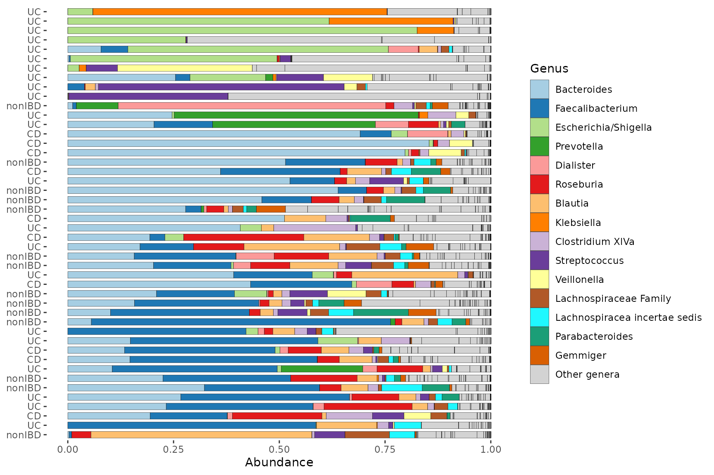{width=900}

::: {.smaller}
Figure from the [microbiomeViz documentation](https://david-barnett.github.io/microViz/reference/comp_barplot.html) [@microbiomeviz].
:::

---

### Motivation

Stacked barplots visualize sample-to-sample variation in microbiome community structure. They struggle to show finer taxonomic resolutions.

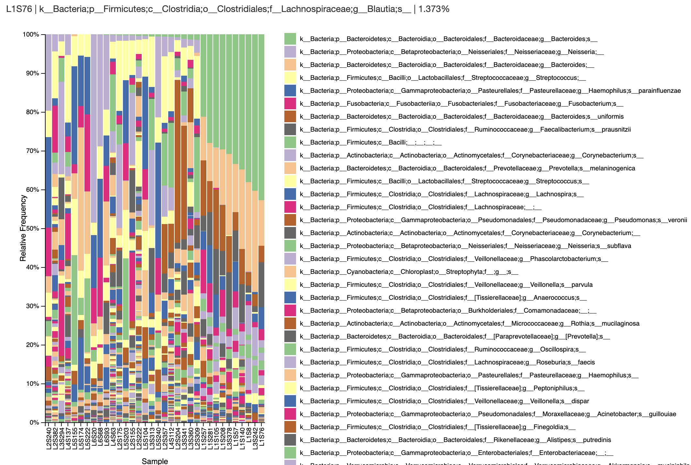{width=900}

::: {.smaller}
Figure from the [Qiime2 View documentation](https://view.qiime2.org/visualization/?src=https://docs.qiime2.org/2024.2/data/tutorials/moving-pictures/taxa-bar-plots.qzv) [@Bolyen2019].
:::

---

### Phylobar

Applying focus-plus-context reveals rare taxa abundances while preserving
overall structure

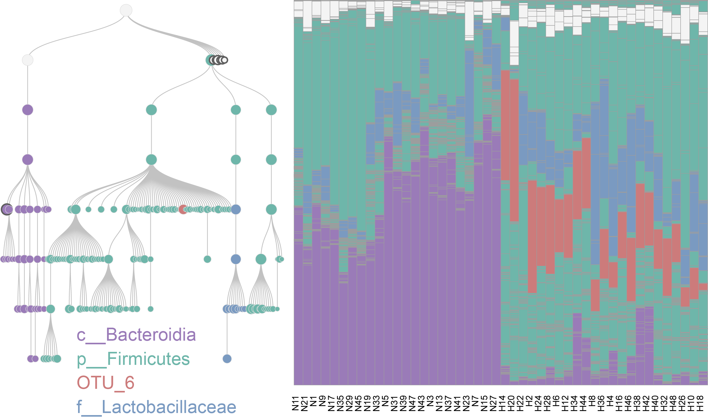{width=900}

::: {.smaller}
Figure from the [phylobar documentation](https://mkdiro-o.github.io/phylobar/articles/hfhs.html#htmlwidget-ac96cb3ee4656e2e9ec3)  [@Kuo2025].
:::

---


## Distortion Visualization

<br/>
<br/>
<br/>
<br/>
<br/>
<br/>
<br/>

<span style="font-size: 36px">
Sankaran, K., Zhang, S., Chenab, & Meilă, M. (2026). Interactive visualization of metric distortion in nonlinear data embeddings using the distortions package. Briefings in Bioinformatics, 27(2). doi:10.1093/bib/bbag136
</span>

---

### Distortions in $t$-SNE and UMAP

Both $t$-SNE and UMAP introduce distortions. For example, they may not preserve
density within different regions of the plot.

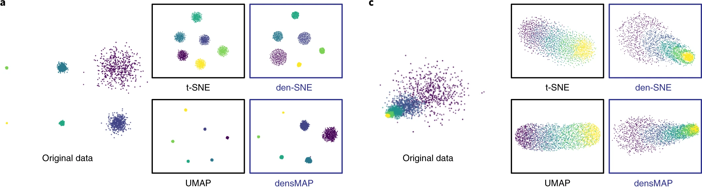{width=1000}

Example from [@narayan2021assessing].

---

### Consequences

These distortions are not mere technical curiosities -- they significantly
impact scientific interpretation [@Liu2025; @Kobak2021]. For example, they
create misleading differences between cell types that are actually similar.

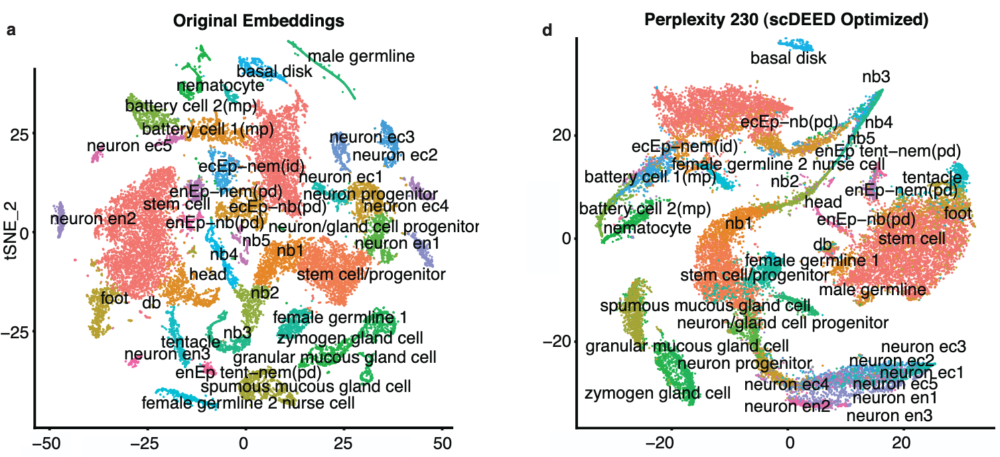{width=700}
Example from [@xia2024statistical].

---

### Approach

Rather than abandoning nonlinear dimensionality reduction, we augment the
embeddings to characterize distortion.

:::: {.columns}
::: {.column width="50%"}
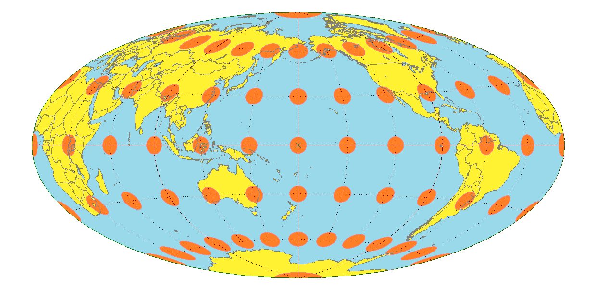{width=400}
:::
::: {.column width="50%"}
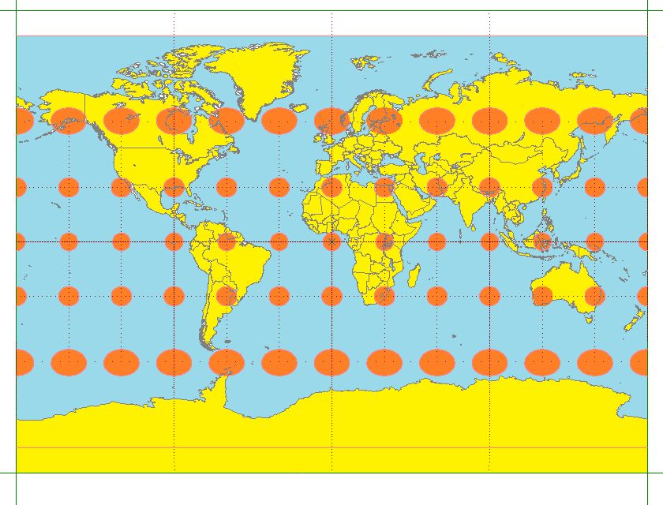{width=400}
:::
::::

This is a high-dimensional version of Tissot's indicatrix from cartography
[@laskowski1989traditional].

---

### RMetric Motivation

The RMetric algorithm [@perrault2006metric; @mcqueen2016megaman] quantifies
distortion geometrically. To motivate the algorithm, consider the distortion
induced by mapping the sphere into latitude/longitude coordinates.

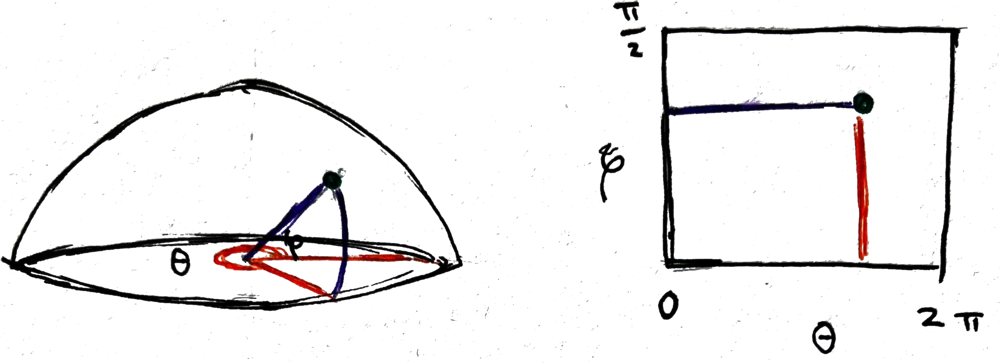{width=800}

---

### Half-Sphere Parameterization

Parameterize points on $\mathcal{M}$ using spherical coordinates:

\begin{align*}
\mathbf{x}\left(p\right) = \left(\cos\varphi\cos\theta, \cos\varphi \sin\theta, \sin\varphi\right)
\end{align*}

The associated (latitude, longitude) embedding is

\begin{align*}
\mathbf{z}\left(p\right) =
\left(\theta\left(p\right), \varphi\left(p\right)\right).
\end{align*}

{width=800}

---

### Dual Pushforward Metric

The gradients $\nabla z^i$ of the embedding dimensions reflect distortion.

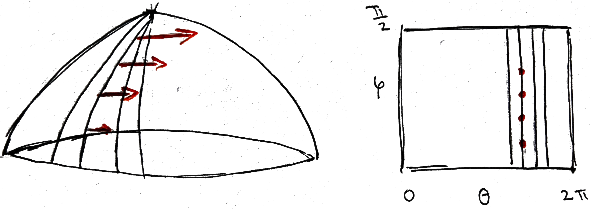{width=1000}

Since the level sets of $z^\theta$ become more compressed near the poles, the
gradients $\nabla z^\theta$ become larger there.

---


### Dual Pushforward Metric

This gradient information can be stored in the matrix $H$ with elements,

\begin{align*}
h^{ij} = \langle \nabla z^i, \nabla z^j \rangle_{g_{0}}
\end{align*}
where $g_{0}$ is the metric on $\mathcal{M}$ inherited from the ambient space.

<br/>
<br/>
In our example,

\begin{align*}
H = \begin{pmatrix} 1/\cos^2\varphi & 0 \\ 0 & 1 \end{pmatrix}
\end{align*}

---

### Product Rule for Laplacians

For any $f$ and $g$, the Laplacian $\Delta$ satisfies,
\begin{align*}
\Delta(fg) = f\,\Delta g + g\,\Delta f + 2\langle \nabla f, \nabla g \rangle_{g_{0}}
\end{align*}

Setting $f = z^i$, $g = z^j$ and rearranging,
\begin{align*}
h^{ij} = \langle \nabla z^i, \nabla z^j \rangle_{g_0} = \frac{1}{2}\left[\Delta(z^i z^j) - z^i\Delta z^j - z^j\Delta z^i\right]
\end{align*}

Since there are methods for estimating $\Delta$ from data [@Hein2005;
@Coifman2006], we also have a practical method for approximating local
distortions $H$!

---


### Examples

This is the classic Swiss Roll data, but with higher density near the endpoints.

```{r}
#| echo: false
#| out-width: 60%
library(tidyverse)
library(plotly)
library(scico)
library(grDevices)
library(scales)

sr <- read_csv("https://raw.githubusercontent.com/krisrs1128/distortions/5df30d71e6092f9f06c203021ba38e6f24a0c50c/site/tutorials/baselines/data/swiss_noise_0.5.csv") |>
  rename(x = `0`, y = `1`, z = `2`, t = `3`)

# map continuous `t` to the ggplot2-style gradient
rng <- range(sr$t, na.rm = TRUE)
t_scaled <- (sr$t - rng[1]) / diff(rng)
pal_fun <- colorRamp(c("#B776A6", "#BAC4A2"))
cols_mat <- matrix(NA_real_, nrow = length(t_scaled), ncol = 3)
cols_mat <- pal_fun(t_scaled)
sr$col <- rgb(cols_mat[,1], cols_mat[,2], cols_mat[,3], maxColorValue = 255)


p <- plot_ly(sr, x = ~x, y = ~y, z = ~z, type = 'scatter3d', mode = 'markers', marker = list(color = ~col, size = 4), hoverinfo = 'none', showlegend = FALSE) %>%
  layout(scene = list(
    xaxis = list(showgrid = FALSE, zeroline = FALSE, showticklabels = FALSE),
    yaxis = list(showgrid = FALSE, zeroline = FALSE, showticklabels = FALSE),
    zaxis = list(showgrid = FALSE, zeroline = FALSE, showticklabels = FALSE)
  )) %>%
  config(displayModeBar = FALSE)
p
```

---

### Variable Density Swiss Roll

$t$-SNE (perplexity = 100) breaks the roll in the low-density region and
artificially spreads the high density area.

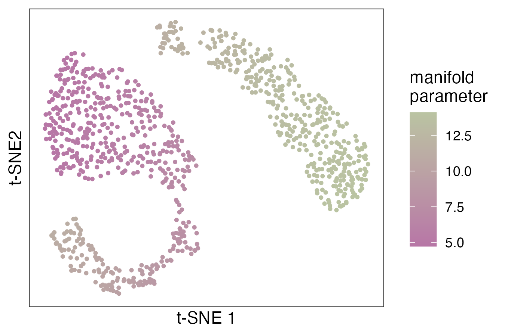{width=640}

---

### Fragmented Neighborhoods

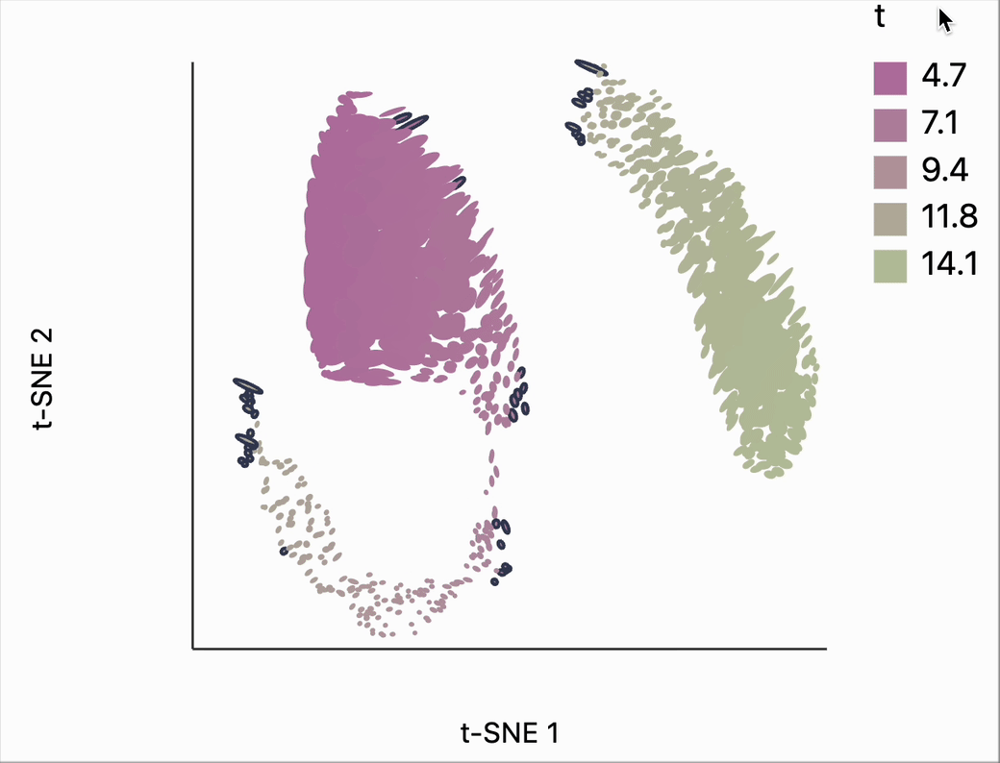{width=640}

---

### Fragmented Neighborhoods

{width=640}

---

### Poorly Preserved Distances

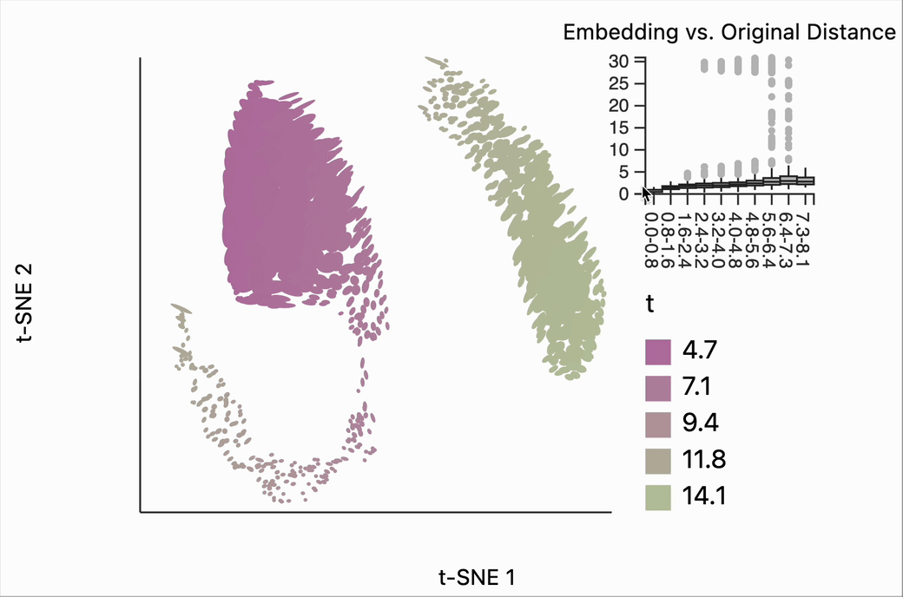{width=710}

---

### Hydra Cell Atlas

:::: {.columns}
::: {.column width="50%"}
In this hydra cell differentiation dataset [@Siebert2019; @xia2024statistical],
$t$-SNE (perplexity = 80) collapses points along the dataset periphery and
exaggerates between-cluster distances
:::
::: {.column width="50%"}
{width=470}
:::
::::

---

### Hydra Cell Atlas

:::: {.columns}
::: {.column width="50%"}
At perplexity = 500, the clusters are more reliable, but peripheral samples are
in fact closer than they appear
:::
::: {.column width="50%"}
{width=470}
:::
::::

---

### DensMap vs. UMAP

Both variation in ellipses and fragmented neighborhood statistics can be used to
compare competing algorithms, similarly to [@xia2024statistical; @Venna2006].

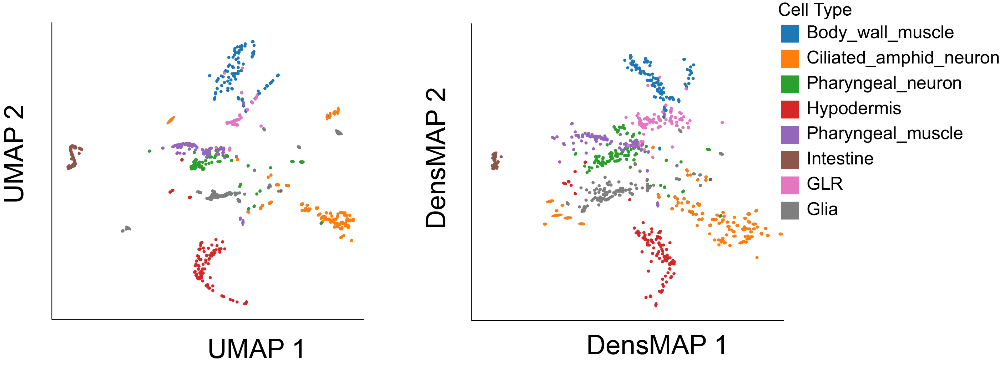{width=900}

This example uses data from a _C. elegans_ cell differentiation study [@Packer2019].

---

### DensMap vs. UMAP

Both variation in ellipses and fragmented neighborhood statistics can be used to
compare competing algorithms, similarly to [@xia2024statistical; @Venna2006].

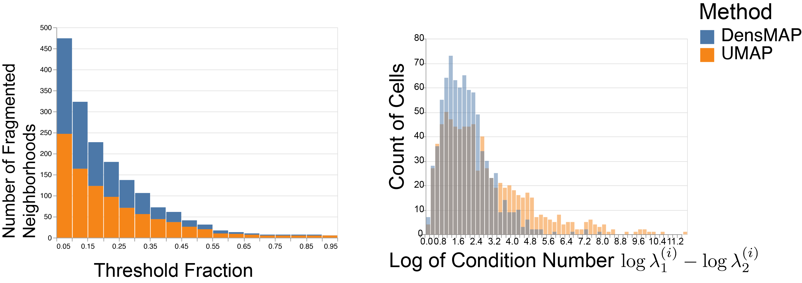{width=950}

This example uses data from a _C. elegans_ cell differentiation study [@Packer2019].

---

### Summary


1. Interactivity can reveal distortion information based on the analyst's
priorities.

**Papers**: [https://go.wisc.edu/e2c16h](https://go.wisc.edu/e2c16h)

**Packages**: [https://pypi.org/project/distortions](https://pypi.org/project/distortions)

---

### Acknowledgments

* Contact: ksankaran@wisc.edu
* Lab Members: Yuliang Peng, Langtian Ma, Cameron Jones, Jiaxin Ye, Helena Huang
* Funding: NIGMS R01GM152744, NIAID R01AI184095, Gates INV-072185, NIH R01HG014687

---

## Appendix

---

### Graph Laplacian

To compute $L$, we use the estimator from [@Coifman2006].

1. Build the kernel matrix $W_{kl} = \exp(-\|X_k - X_l\|^2 / h)$, where $h$ is a bandwidth hyperparameter.

2. Normalize both columns and rows.
\begin{align*}
D &= \text{diag}(W\mathbf{1}) \qquad \tilde{W} = D^{-1}WD^{-1}  \\
\tilde{D} &= \text{diag}(\tilde{W}\mathbf{1}) \qquad L = \tilde{D}^{-1}\tilde{W}
\end{align*}
Column normalization accounts for differences in sampling density.

---

### Pushforward Metric

What does a small step in the embedding space correspond to in $\mathcal{M}$? The pushforward metric answers this,

\begin{align*}
g_{ij} = \left\langle \frac{\partial\mathbf{x}}{\partial z^i}, \frac{\partial\mathbf{x}}{\partial z^j}\right\rangle_{\mathbb{R}^3}
\end{align*}

This varies across $p \in \mathcal{M}$ but we suppress it from the notation.

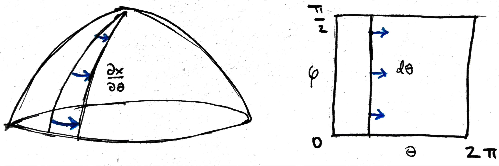{width=800}

---

### Pushforward Metric

In the sphere example, these derivatives can be directly computed and to obtain,

\begin{align*}
G = \begin{pmatrix} \cos^2\varphi & 0 \\ 0 & 1 \end{pmatrix}
\end{align*}
Near the equator ($\varphi \approx 0$), a small step in $\theta$ covers more
distance than near the north pole ($\varphi \approx \frac{\pi}{2}$).

{width=800}

---

### Derivation of $G$

First note that,
\begin{align*}
\frac{\partial\mathbf{x}}{\partial \theta} = \left(-\cos\varphi\sin\theta, \cos\varphi\cos\theta, 0\right).
\end{align*}
Therefore,
\begin{align*}
g_{11} &= \left\langle \frac{\partial\mathbf{x}}{\partial \theta}, \frac{\partial\mathbf{x}}{\partial \theta}\right\rangle_{\mathbb{R}^3} \\
&= \cos^2\varphi\sin^2\theta + \cos^2\varphi\cos^2\theta \\
&= \cos^2\varphi
\end{align*}

---

### Derivation of $H$ from $\Delta\left(fg\right)$

By the product formula with $z^1 = \theta$:
\begin{align*}
h^{11} = \langle \nabla \theta, \nabla \theta \rangle_{g_0} = \frac{1}{2}\left[\Delta(\theta^2) - 2\theta\Delta\theta\right]
\end{align*}

---

### Derivation of $H$ from $\Delta\left(fg\right)$

The general formula for the Laplace-Beltrami operator is
$$\Delta f = \frac{1}{\sqrt{\det G}}\sum_{i,j}\frac{\partial}{\partial z^i}\left(\sqrt{\det G}\, g^{ij}\frac{\partial f}{\partial z^j}\right).$$

Since $\det(G) = \cos^2\varphi$ and the off-diagonal $g^{ij}$ are zero,
\begin{align*}
\Delta f = \frac{1}{\cos^2\varphi}\frac{\partial^2 f}{\partial\theta^2} + \frac{1}{\cos\varphi}\frac{\partial}{\partial\varphi}\left(\cos\varphi\frac{\partial f}{\partial\varphi}\right)
\end{align*}

---

### Derivation of $H$ from $\Delta\left(fg\right)$

We can plug in the choices of $f$ that we care about,
\begin{align*}
\Delta\theta &= 0\\
\Delta(\theta^2) &= \frac{1}{\cos^2\varphi}\frac{\partial^2(\theta^2)}{\partial\theta^2} = \frac{2}{\cos^2\varphi}
\end{align*}

and then substitute into the formula from 2 slides ago,
\begin{align*}
h^{11} = \frac{1}{2}\left[\frac{2}{\cos^2\varphi} - 2\theta \cdot 0\right] = \frac{1}{\cos^2\varphi}.
\end{align*}

---

### Interaction Gulfs

There are two classic challenges in interactive interfaces [@Hutchins1985],

- Gulf of Execution: The gap between what you want to do and how you specify it in the system.

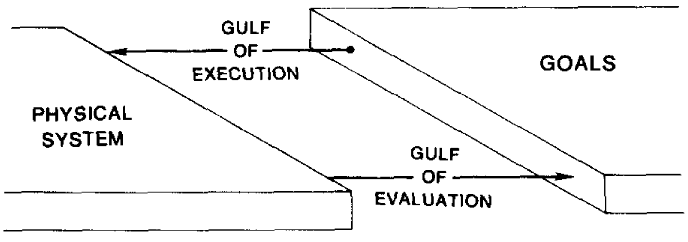{width=600}

These challenges also apply to interactive data analysis.

---

### Interaction Gulfs

There are two classic challenges in interactive interfaces [@Hutchins1985],

- Gulf of Evaluation: The gap between what the system shows you and an understanding of what it represents.

{width=600}

These challenges also apply to interactive data analysis.

---

### Dual Pushforward Metric

Alternatively, the gradients $\nabla z^i$ of the embedding dimensions also
reflect distortion.

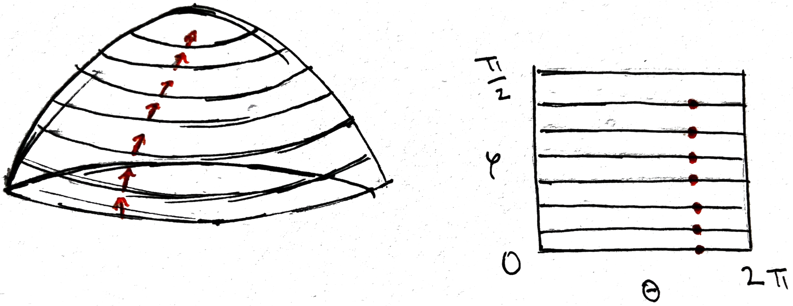{width=1000}

In contrast, the gradients $\nabla z^{\varphi}$ don't depend on $\varphi$.

---

### Comparison with LOO-map

The stability-based algorithm [@Liu2025] gives a similar
interpretation. But the visual encoding is more subtle, and the leave-one-out
approach is time consuming even with approximations.

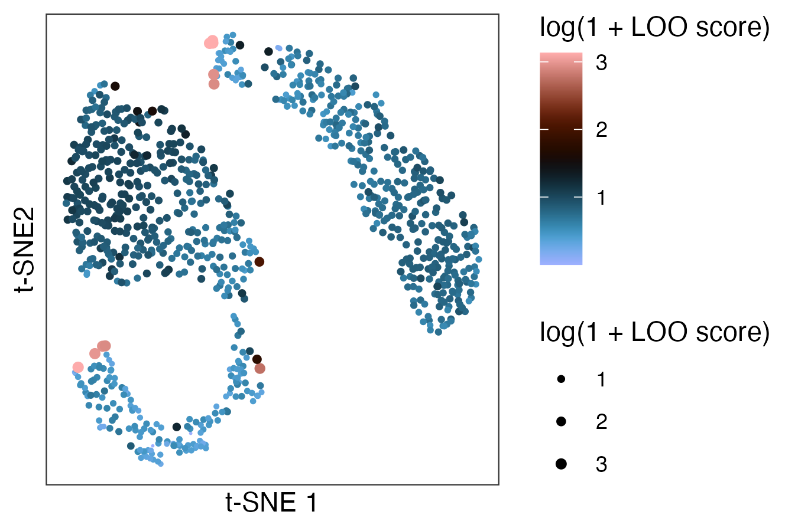{width=600}

---

### References {.smaller}
