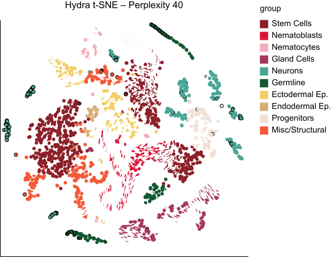
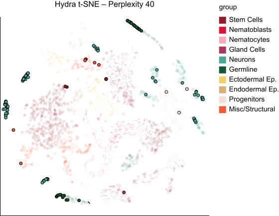
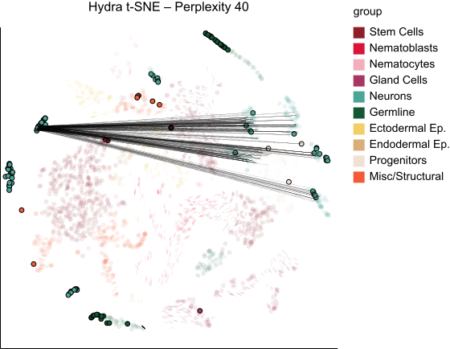
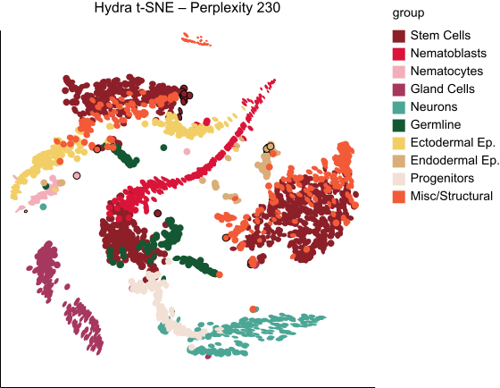
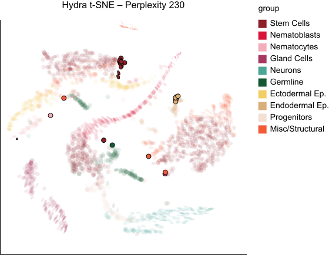
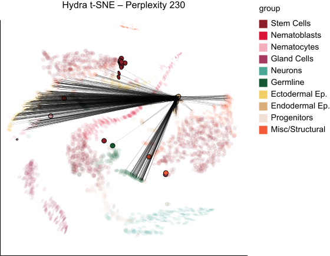

```{r, echo = FALSE, warnings = FALSE, message = FALSE}
library(RefManageR)
library(knitr)
library(tidyverse)
library(glue)
opts_chunk$set(message = FALSE, warning = FALSE, cache = FALSE, dpi = 200, fig.align = "center", fig.width = 6, fig.height = 3, echo = FALSE)
opts_knit$set(eval.after = "fig.cap")
set.seed(123)

BibOptions(cite.style = "numeric", max.names = 10)
bib <- ReadBib("references.bib")
```

<div id="links">
Slides: https://go.wisc.edu/669t74<br>
Lab Site: https://measurement-and-microbes.org
</div>

<div style="height: 2em;"></div>

### Interactive and Interpretable Omics Analysis

My lab writes statistical software that helps biologists get the most out of
their data. The essential questions are,

* **Integration**: How should we analyze data gathered from multiple batches or
technologies?

* **Experimental Design**: How should we design experiments to accelerate engineering or medical applications?

* **Reproducibility**: How can we be sure our conclusions are trustworthy?

We work directly with microbiologists on problems related to HIV, the gut-brain
axis, and synthetic communities.

---

exclude: true

### Problem Solving

We strive to use advanced multiomics workflows while keeping the analysis
transparent. To this end, we draw from the data visualization and machine
learning interpretability literatures.

* **Visualization**: A good interface can shape the way we think for the better,
helping us be more critical and creative.

* **Interpretability**: We want models that we can trust and control.

---

### Themes: Visualization

Stacked bar plots are used in microbiome research to compare composition across groups or over time.

.pull-left[
- $x$-axis position encodes samples
- Color encodes taxonomy
]

.pull-right[
  

Figure from the Qiime2 paper `r Citep(bib, "Bolyen2019")`.
]


---

### Themes: Visualization

The basic limitation is that they can only show so many colors at a time. This
makes it difficult to study rarer taxa.

.center[
  
]
Figure from the [Qiime2 documentation](https://view.qiime2.org/visualization/?src=https://docs.qiime2.org/2024.2/data/tutorials/moving-pictures/taxa-bar-plots.qzv).


---

### Themes: Visualization

Undergraduate Megan Kuo wrote the phylobar package to create color palettes by painting an
accompanying tree structure `r Citep(bib, "Kuo2026")`.

.center[
  
]
Figure from the [phylobar documentation](https://mkdiro-o.github.io/phylobar/articles/hfhs.html#htmlwidget-ac96cb3ee4656e2e9ec3)  `r Citep(bib, "Kuo2026")`.

---

### Pseudobulk Data

This idea works whenever you cared about hierarchically organized compositions,
like this COVID-19 immunology data.


---

### Themes: Visualization

In `r Citep(bib, "distortions")`, we used the focus-plus-context principle to
interactively explore how dimensionality reduction methods like UMAP and t-SNE distort the
intrinsic geometry of the data.

.center[
  
]

---

### Themes: Visualization

In `r Citep(bib, "distortions")`, we used the focus-plus-context principle to
interactively explore how dimensionality reduction methods like UMAP and t-SNE distort the
intrinsic geometry of the data.

.center[
  
]

---

### Themes: Visualization

In `r Citep(bib, "distortions")`, we used the focus-plus-context principle to
interactively explore how dimensionality reduction methods like UMAP and t-SNE distort the
intrinsic geometry of the data.

.center[
  
]

---

### Themes: Visualization

In `r Citep(bib, "distortions")`, we used the focus-plus-context principle to
interactively explore how dimensionality reduction methods like UMAP and t-SNE distort the
intrinsic geometry of the data.

.center[
  
]

---

### Themes: Visualization

In `r Citep(bib, "distortions")`, we used the focus-plus-context principle to
interactively explore how dimensionality reduction methods like UMAP and t-SNE distort the
intrinsic geometry of the data.

.center[
  
]

---

### Themes: Visualization

In `r Citep(bib, "distortions")`, we used the focus-plus-context principle to
interactively explore how dimensionality reduction methods like UMAP and t-SNE
distort the intrinsic geometry of the data.

.center[
  
]

---

### Themes: Interpretability

We want to benchmark omics analysis tasks like batch integration and trajectory
inference. VAEs can generate realistic data, but how can we create ground truth?

.center[

]

---

### Themes: Interpretability

PhD student Langtian Ma found a way to intervene on VAE latent states in a way
that supports precise control of both ground truth signal and technical effects.

.center[

]

---

### Collaborations with Biologists

* HIV Risk Factors [Kwon Lab, Ragon Institute]: The microbiome is closely
related to immunity. We are using data to understand HIV risk from multi-omics
data.

* Mental Health and the Microbiome [Handelsman Lab, UWM]: Specific microbes have
been linked to mood disorders. We are part of a multi-institute collaboration to
better understand these gut-brain connections.

  - We are actively recruiting for this project.

---

### Reaching Out

* You can learn more at [https://measurement-and-microbes.org](https://go.wisc.edu/pgb8nl).
    - Interactivity: `r Citep(bib, c("Kuo2026", "Temirbek2026", "Jiang2025", "distortions", "Sankaran2024"))`
    - Interpretability: `r Citep(bib, c("Sankaran2024inter", "Yang2026", "Fukuyama2022", "Janik2021", "sankaran2019remembrances"))`

* I enjoy working with students with different educational levels and backgrounds.

* Email: [ksankaran@wisc.edu](mailto:ksankaran@wisc.edu)

---
class: reference

### References

```{r, results='asis', echo = FALSE}
PrintBibliography(bib, start = 1, end = 12)
```
