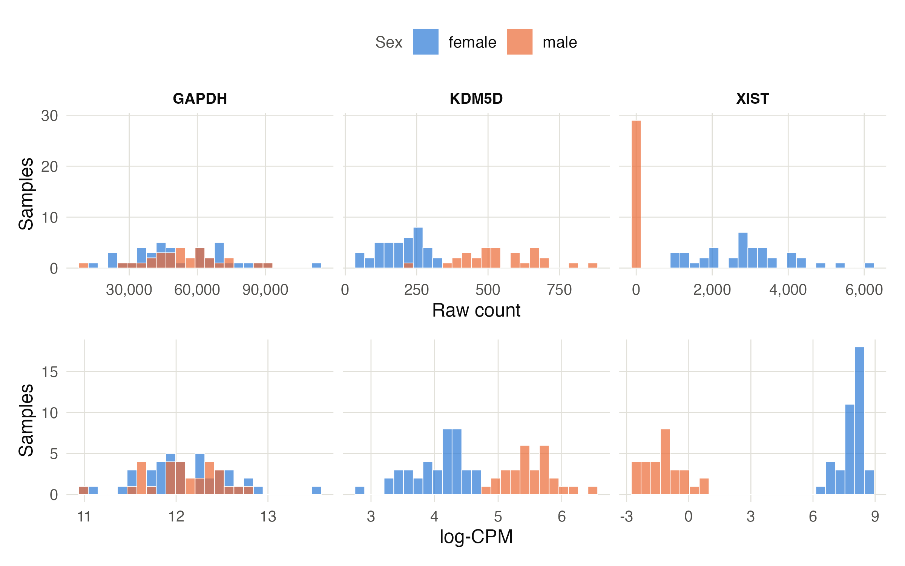
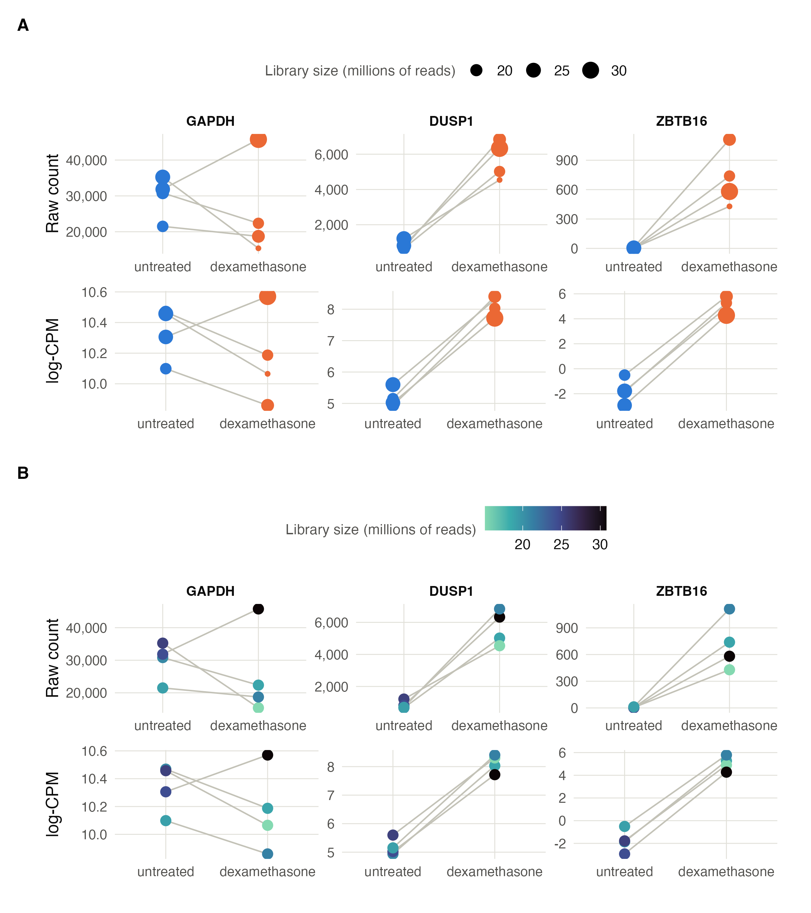
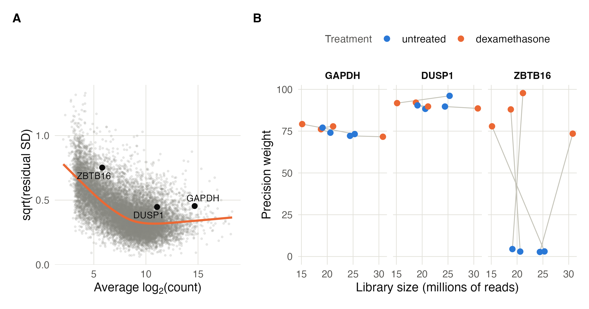
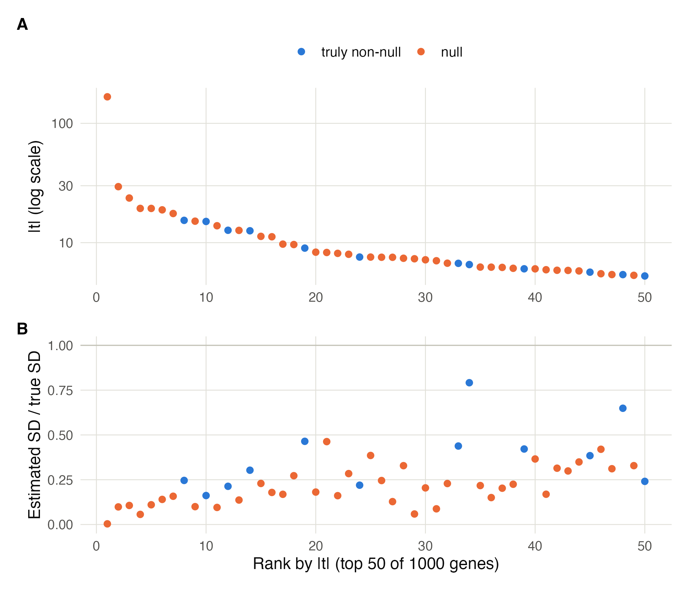
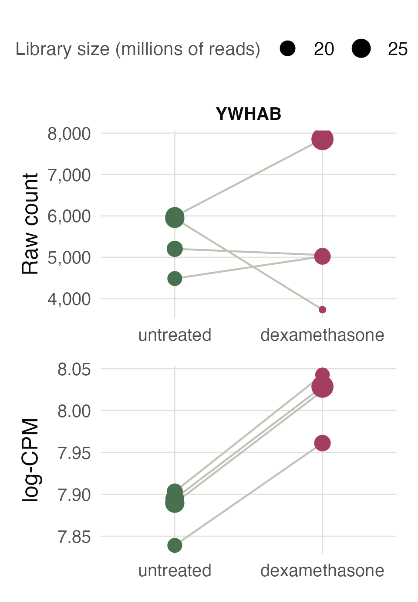
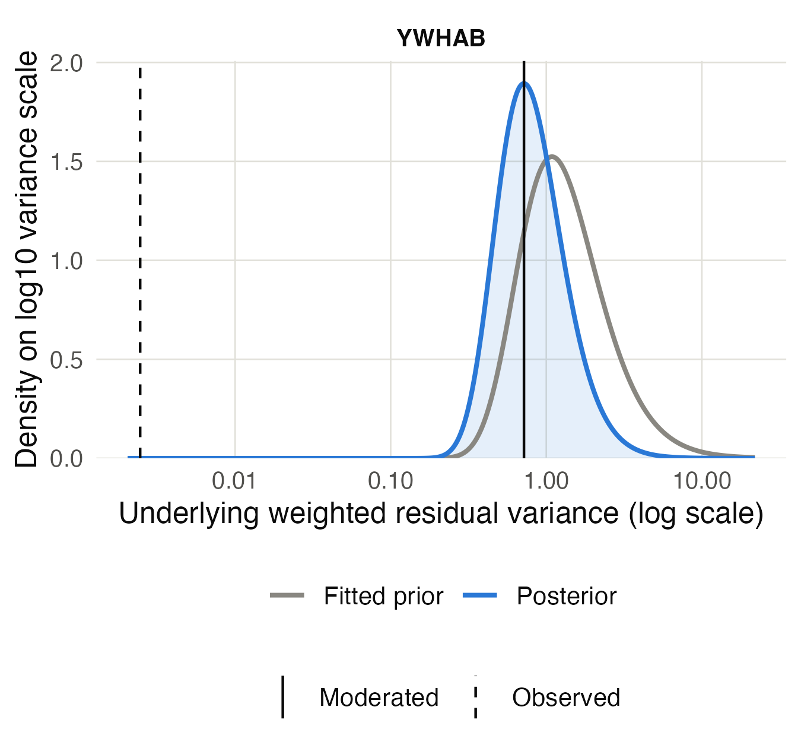
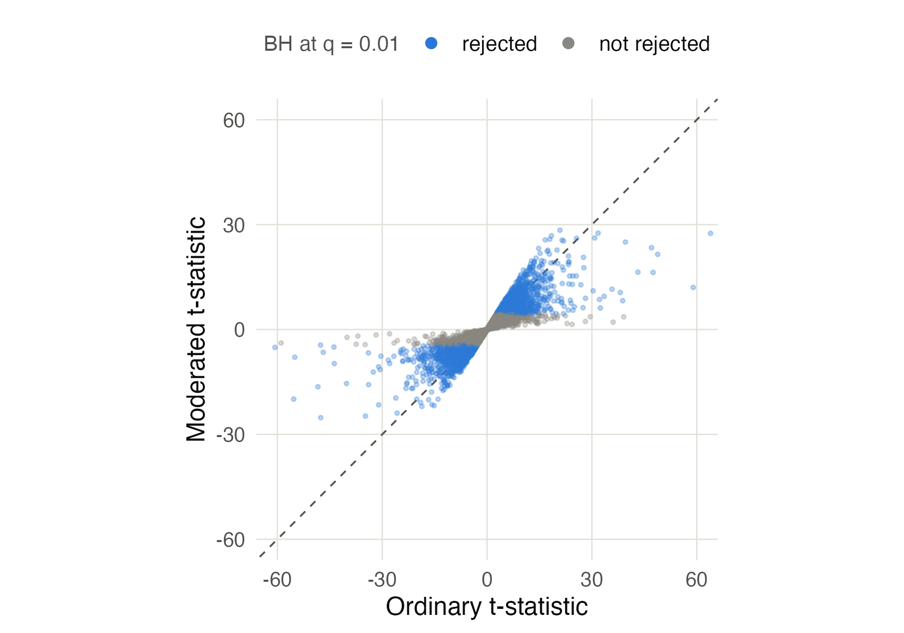
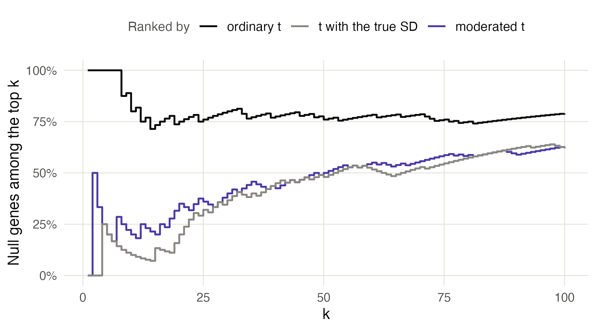

## Motivation

1. Comparison is fundamental to discovery in biology. In the sequencing era we
make comparisons by looking at large-scale molecular readouts.

   * In functional genomics we compare molecular profiles before and after knocking out genes.
   * In cancer biology we compare molecular profiles in cancer versus healthy tissue.
   * In single cell eQTL studies, we might look for cell-type specific gene expression that differs across genotypes.

   This is true across many different assay types, for example bulk RNA,
   single-cell pseudobulk data, or ATAC-seq data.

   [pictures of molecular assays]

   Viewed more abstractly we're often interested in comparing the levels of
   genomic features across conditions. We may also be aware of some external
   factors that influence the level of the observed feature (e.g., different
   timepoints in a time course experiment or levels of a secondary treatment)
   and may want to account for that.

2. Naive approaches to comparison can miss interesting signal. Small biological
effects might be drowned out by large but technical ones. By using appropriate
controls and properly accounting for measurement errors, we can make more
accurate comparisons.

3. The overarching goal of multiple testing in high-throughput biology is to
identify genomic features that vary in a systematic way across conditions of
interest. From an analysis perspective, there are two fundamental challenges:

   - The usual statistical assumptions do not immediately apply.
   - There may be hundreds or thousands of features of potential interest. The
   more we analyze, the greater the risk that irrelevant features might appear
   associated just by chance.

   The first problem motivates _normalization methods_, and the second motivates
   _multiple hypothesis testing methods_. There have been very many proposals
   for both normalization and multiple hypothesis testing. We will focus on the
   specific procedure adopted by limma, though many of the ideas of this
   approach appear throughout the literature.

## Example

1. Before diving more deeply into the theoretical concepts, let's briefly look
at a concrete code example^[You can find many more in the [online manual](https://bioconductor.org/packages/release/bioc/vignettes/limma/inst/doc/usersguide.pdf).]
The block below loads the packages that we'll need.

```{r}
library(limma)
library(edgeR)
library(tidyverse)
library(airway)

```

We'll analyze the
[airway dataset](https://www.bioconductor.org/packages/release/data/experiment/html/airway.html),
which comes from an RNA-seq experiment to study how gene expression profiles
change in smooth muscle tissue treated with dexamethasone. The data come from
four cell lines, and for each line, we have one control and one treated sample
(8 samples total).

```{r}
data(airway)
airway
```

1. The experiment object above includes the raw counts (`assay`) and metadata
about the genes (`rowData`) and samples (`colData`).

[picture of row, column data]

The first line below makes sure that `untrt` is the reference level, so a
positive $t$-statistic is interpreted as the treatment being larger than the
control. Limma expects the experiment object to be stored in a DGEList, which
just reorganizes the counts and metadata already present in the original
experiment object

```{r}
colData(airway)$dex <- factor(colData(airway)$dex, levels = c("untrt", "trt"))
dge <- DGEList(counts = assay(airway), samples = colData(airway), genes = rowData(airway))
dge
```

1. We next filter genes that are expressed at very low levels. The commands
below apply normalization steps, which we'll discuss in more detail below. The
most important part of the block below is that we define the factors that
influence gene expression. Here, both the cell line and the dexamethasone status
are allowed to influence each gene's expression levels. This is encoded in the
"formula" object `~ cell + dex`.

```{r}
keep <- filterByExpr(dge, group = dge$samples$dex)
dge  <- normLibSizes(dge[keep, ])
design <- model.matrix(~ cell + dex, data = dge$samples)
v <- voom(dge, design)
```

1. We use the output from the normalization step as input for hypothesis
testing. The top table output shows those genes which have the most significant
difference between dexamethasone and control settings.

```{r}
fit_raw <- lmFit(v, design)
fit <- eBayes(fit_raw)
topTable(fit, coef = "dextrt")
```

## Linear Models Background

4. The machinery that underlies both normalization and multiple hypothesis
testing is the linear model. We will take a brief detour to understand some of
the basic mechanics of hypothesis testing through linear models.

5. Let $y_i$ represent measurements of interest across samples $n$. Imagine that
data come from two groups (e.g., healthy and disease, or knockout and control)
and that are both normally distributed. The groups may have different means but
are required to have the same variances.

$$
\begin{align}
Y_{n} \sim \mathcal{N}\left(\mu_{A}, \sigma^2\right) \text{ for }n \in \text{ Group } A\\
Y_{n} \sim \mathcal{N}\left(\mu_{B}, \sigma^2\right) \text{ for }n \in \text{ Group } B
\end{align}
$$

If we want to see whether or not these two underlying means are the same, we can
consider the statistic,

$$
t = \frac{\bar{y}_A - \bar{y}_B}{s\sqrt{1/N_A + 1/N_B}}.
$$

This is the differences in empirical means of groups A and B, adjusted according
to an empirical estimate of the within-group variance. This adjustment ensures
that we account for the spread within each group when interpreting the
difference in means.

6. We will say that when the means of the two groups are equal, the "null
hypothesis" holds. The reason for the naming is that when the two groups have
the same mean, there is no need to further investigate differences between the
groups (our interest is "null"). Formally, this is denoted,

 $$H_{0}: \mu_{A} = \mu_{B}$$

Notice that even when $H_{0}$ holds theoretically, on any actual dataset, the
observed difference in sample means will be nonzero, and therefore $t \neq 0$.
In the plot below, the normal densities denote the true data distributions in
each group, the points represent the observed data, and the horizontal lines
reflect the observed sample means.


However, the further the statistic $t$ is from zero (either very negative or
very positive), the less plausible the null hypothesis $H_0$ becomes. The
example below is a case where $H_{0}$ does not hold, and this is reflected in
the relatively larger $t$-statistic.


7. Under the null hypothesis $H_{0}$, what would be typical values of $t$? We
can answer this with a simulation. Here I've simulated 10K null datasets,
computed the associated $t$-statistics, and put those statistics into a
histogram. These turn out to follow a very clean distribution, and it's in fact
possible to derive a theoretical formula for it, which is overlaid.


8. This is very useful because it tells us that anything that doesn't fall into
this distribution counts as evidence against the null hypothesis. Here I
generated one sample where the true group difference is 2 and I've overlaid the
t-statistic from that dataset onto the null from before.


This is the essential logic of hypothesis testing: if we see a statistic that's
very unlikely under the null distribution, then we have evidence that the null
hypothesis is false. A $p$-value is defined as the area of the distribution
above the test statistic, and it is a measure of the strength of this evidence
(smaller area $\to$ less likely to come from the null).

9. So if we're willing to believe the Gaussian assumption, we have a full
procedure for comparing two groups of data. But in genomics we often will need
to account for variables that could influecne the response $y_n$ but which
aren't the actual treatment of interest. The situation might be like in the
figure below, where we care about the difference between A and B, but the
response is influenced by a sample-specific factor $X_n$. If we ignored this
factor and only compared the $y_i$ values, then the groups would blend into one
another and we wouldn't be able to detect any difference


10. In this case we might want to test the null hypothesis $H_{0}$ that the
lines for the two groups are exactly overlapping. The main trick is to subtract
out the effects from the $X_n$ and see whether there still remains a difference
between the two groups. That is, after subtracing the $X_n$ effects (i.e.,
looking at the gaps between the points and the dashed line), we return to the
setting above.


This is exactly what a linear model does. The formula becomes a bit more
complicated, but we can again derive a statistic $t$ that has a closed form null
distribution under $H_{0}$.

11. The fact that we can make comparisons between groups while accounting for
other variables is what makes linear models such a versatile statistical method.
The concrete example here uses a straight line for $X$ but in fact the same
machinery works generally, including when the effects are nonlinear, when the
slopes of the lines are not parallel, and when we have more than two groups to
compare.

## Normalization

12. Unfortunately the Gaussian assumption doesn't make any sense for genomics
data. But linear models are so appealing that the field has gone to great
lengths to try to salvage their applicability. The main way this is done is
through the process called normalization and this lies at the heart of limma.

13. There are two significant issues that stand in the way of simply making the
Gaussian assumption. The first is that sequencing assays return counts of
different genomic features, and these are not continuous measurements like the
Gaussian. The second is that each sample's mean can depend a lot on its
sequencing depth. This sequencing depth is an experimental artifact that can
obscure the actual biological differences between conditions.

14. An idea that solves both problems at once is to apply a log
counts-per-million (CPM) transformation. Suppose that the expression for gene
$g$ in sample $n$ is $y_{ng}$. Arrange all these data into a samples-by-genes
matrix $Y \in \mathbb{R}^{N\times G}$.

   [draw picture of the matrix]

   The log CPM transformation is,

   $$
   y_{ng} \rightsquigarrow \log\left(\frac{y_{ng} + \frac{1}{2}}{\sum_{k}y_{nk} + 1} \times 10^{6}\right)
   $$

   The $\frac{1}{2}$ and $1$ offsets prevent us from taking a log of zero, which
   is undefined. Besides this, the fraction inside of the log converts each
   sample into something close to a relative frequency of gene $j$ in sample $i$
   (it would be exact without the offsets). This removes the differences in
   sequencing depths. The 10^4 converts everything back to counts and it's where
   the "per-million" name comes from. Second by taking the log transformation,
   we convert the often count data into continuous data where the normal
   distribution assumption is more believable.

15. Here are histograms of three genes before and after applying the CPM
transformation. The data are described in more detail in the second case study
below. For XIST, the normal approximation makes much more sense after the
transformation.



At this point, we can, in principle, fit a linear model where the experimental
designs are the predictors and the transformed gene expression values are the
response.

16. One problem is that when we convert to frequencies we're losing a
meaningful information about the precision of our measurements. Two samples can
have exactly the same log CPM value for a gene but have different total counts.
The total count information is important because the sample with very deep
sequencing is measured more accurately than one with shallow sequencing.

17. This shows up in the spread of the groups after the log CPM transformation
has been applied. For example, in the three genes below^[This is from a
different case study, which we'll also review below. ], the logCPM
transformation has put all the genes on roughly the same scale. Instead of
ranging from 0 to 40,000, they're in roughly the range from -5 to 10.



But notice that the ZBTB16 gene has more variation within each group compared to
the other two genes. In formal statistical language, this is called the residual
variation, and it turns out to be a general phenomenon that genes that have
smaller total counts originally also have larger residual variation.



17. Lima uses this empirical trend to reweight the observations. The curve above
was learned using gene-level quantities. But we can compute the quantity on the
x-axis for any particular $y_{ng}$, and this is used to derive an associated
weight (details in appendix), called precision weights. Intuitively, if an
observation comes from a sample with very deep sequencing, it will have higher
precision.

These weights can then be incorporated into linear models through weighted
linear regression. For example in the simple case where we're simply looking at
the difference between two groups, we would compute a weighted average instead
of a plain average.

## Multiple Hypothesis Testing

19. At this point we could imagine applying a linear model to every single
genomic feature. We would have a separate null hypothesis associated with each
gene. We would reject those where the groups means seem to be different
(controlling for other technical factors). The resulting list of significant
genes would be the ones that we prioritize for follow-up analysis.

20. This doesn't quite work, though. It's easiest to understand through a small
example. Here I've simulated a thousand hypothetical genes from two groups. For
every gene, I have simulated variances $\sigma_{g}^{2}$ from a uniform
distribution between 0.5 and 2, some have expression values that stay closer to
their mean than others. For 50 of these genes, I introduce a true difference of
2.5 between the means . In the language of the two-groups model above, $\mu_{A}
= 0, \mu_{B} = 2.5$.  I sample only two replicates per group (four samples
total).

21. The top panel in the plot below shows the 50 genes with the most significant
$t$-statistics.  Only 12 of these are actually related to the treatment! Of the
top 10 genes, only two are actually relevant.



The bottom panel makes clear what's going on. The genes that appear the most
significant actually just have estimated variances $s_{g}^2$ that are smaller
than their true variances $\sigma_{g}^2$, which we know in the simulation, but
which we wouldn't know in reality. The problem is that with small sample sizes,
we might have a small empirical variance just by chance, and since the
t-statistic divides by the square root of that variance, we end up
overestimating the associated genes' significance.

$$
t_{g} = \frac{\bar{y}_{A,g} - \bar{y}_{B,g}}{s_{g}\sqrt{1/N_A + 1/N_B}}.
$$

22. There are two ways a gene could have small estimated variance $s_{g}^2$.
Either (i) the gene truly has little variation around its mean (i.e. we would
see this if we continued sampling), or (ii) just by chance, the replicates we
observed happen to be close to one another. The major insight of limma is that
the other genes can help us tell which of these two situations we are in.

It first posits a prior distribution $H$ for the genewise variances,
$$
\sigma_{g}^{2} \over{iid}\sim H.
$$
Since the distribution of $s_{g}^2$ given $\sigma_{g}^{2}$ has a known form, it
then becomes possible to compute a posterior for each gene $g$,
$$
p\left(\sigma_{g}^2 \vert s_{g}^2\right),
$$
and this posterior allows us to bypass using the original $s_{g}$ in a new,
"moderated" $t$-statistic.

Since we observe the standard deviations $s_{g}$ across many genes, it's
possible to actually estimate $H$. This is what is meant by limma performing
empirical Bayes. Compared to standard Bayesian inference, where the prior must
simply be assumed, we can use the many parallel genes to inform our prior $H$.

1. The posterior mean of $\sigma_{g}^{2}$ will be drawn closer to the observed
prior mean. The consequence is that the moderated $t$-statistics are much less
affected by the small standard deviations $s_{g}$.  When using these
$t$-statistics instead of the original ones, we have many fewer false positives
among our top-ranked genes. For example, consider the gene YWHAB. Since the
lines connecting each treatment-control pair are nearly parallel, the residual
variance after accounting for cell line effects is very small.



The posterior update pulls the $\sigma_{g}^2$ into a more reasonable range,
using information about the variances from all the other genes that we've
observed.



1. Looking across all genes, we can see that the $t$-statistics are generally
shrunken towards zero. The genes that we expect to be shrunk the most are those
whose standard deviations were much lower than expected after estimating the
prior variance $H$.



 Using these moderated $t$ statistics tends to greatly reduce the number of
 false positives. For example, returning to our simulation setup from before, we
 can see that ranking using the moderated $t$-statistics leads to fewer false
 positives among the top-ranked genes and is nearly as good as using the ground
 truth standard deviation.



23. There's one last statistical consideration. If we use the usual hypothesis
testing cutoffs then we're liable to return many false positives. The issue
appears in this XKCD comic.


   The problem is that the hypothesis testing cutoffs are originally designed so
   that under the null hypothesis the probability of a false positive is
   $\alpha$ (usually set to 0.05). But as we test more and more hypotheses, the
   probability of encountering at least one false positive grows, because each
   time there is a probability $\alpha$ of a false positive

24. To deal with this phenomenon Benjamini and Hochberg had the idea that
instead of controlling the probability of a single false positive, we should
control the proportion of false positives among all rejections. They called the
false positives "false discoveries," which led to the definition of the false
discovery rate.

25. Formally let $H_{1}, \dots, H_{G}$ represent the null hypothesis for the $G$
genes. Suppose we obtain p-values $p_{1}, \dots, p_{G}$. Suppose that $R$ of
these $p$-values are smaller than $\alpha$. These are our rejections, they are
the discoveries we would comment on in our paper. Among these $R$ rejections,
suppose that $V$ are false discoveries (in practice, we would never know this).
The quantity

   $$
   \widehat{\mathrm{FDP}} = \frac{V}{R\vee 1}
   $$
   is the empirical false discovery proportion in this one experiment and its
   expected value across many experiments with the same underlying distribution
   is called the false discovery rate,
   $$
   \mathrm{FDR} = \mathbb{E}\left[\widehat{\mathrm{FDP}}\right]
   $$

26. In addition to introducing this quantity, Benjamini and Hochberg proposed a
way of adjusting the $p$-value cutoffs so that if we reject our hypothesis using
these cutoffs instead of the canonical $\alpha$, we would provably control the
false discovery rate. Their procedure is now called the Benjamini-Hochberg (or
BH) procedure,

   * Order the $G$ p-values from smallest to largest
    $$
    p_{(1)} \le p_{(2)} \le \cdots \le p_{(G)}
    $$
    and denote the associated null hypothesis by $H_{(1)}, \dots, H_{(G)}$.
   * Fix a target FDR level $q$^[This is the analog of $\alpha$ in ordinary hypothesis testing] and define a new sequence of thresholds $\alpha_{k} = \frac{kq}{G}$. This means that the smallest p-value is compared to the strictest threshold, the next smallest is compared to a slightly more lenient one, etc.
   * Find the largest $k$ where $p_{(k)} \le \alpha_{k}$, and reject all hypotheses $H_{(1)}, \dots, H_{(k)}$. If there is no such $k$, don't make any rejections.

27. This procedure actually has an intuitive explanation in terms of the histogram of p-values.

## Extra Code Example

1.

```{r}
library(tweeDEseqCountData)
data(pickrell1)

counts  <- exprs(pickrell1.eset)
samples <- data.frame(sex = factor(pickrell1.eset$gender), row.names = colnames(counts))
genes   <- data.frame(gene_id = rownames(counts), row.names = rownames(counts))
dge <- DGEList(counts = counts, samples = samples, genes = genes)
dge
```

```{r}
keep <- filterByExpr(dge, group = dge$samples$sex)
dge  <- normLibSizes(dge[keep, ])
```

```{r}
design <- model.matrix(~ sex, data = dge$samples)
v <- voom(dge, design)
```

```{r}
fit_raw <- lmFit(v, design)
fit <- eBayes(fit_raw)
topTable(fit, coef = "sexmale")
```
