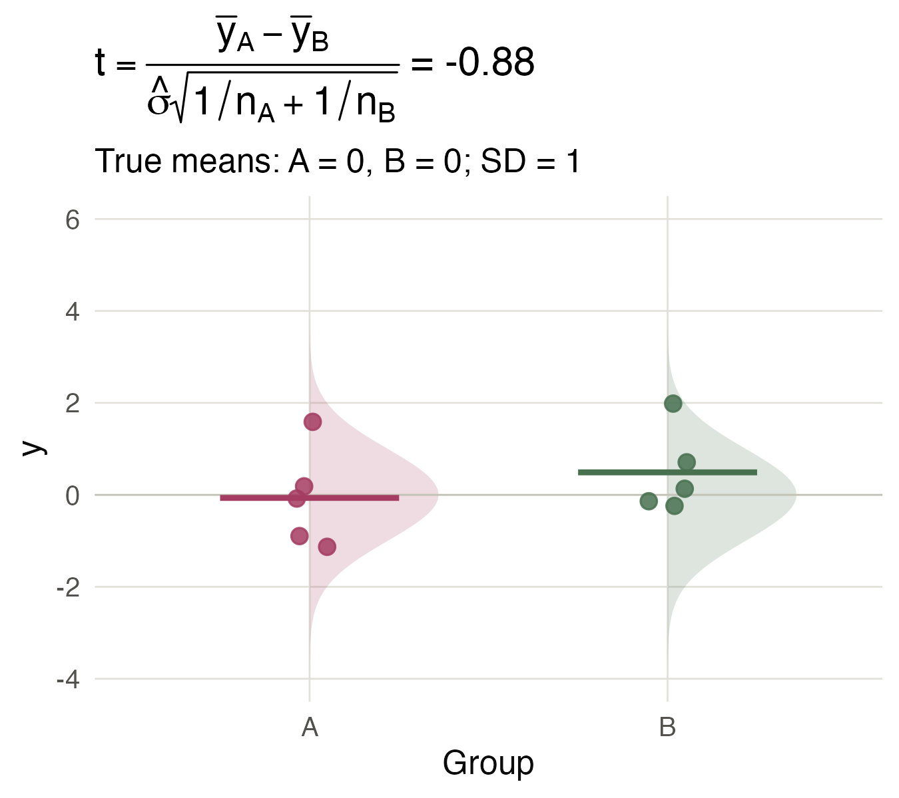
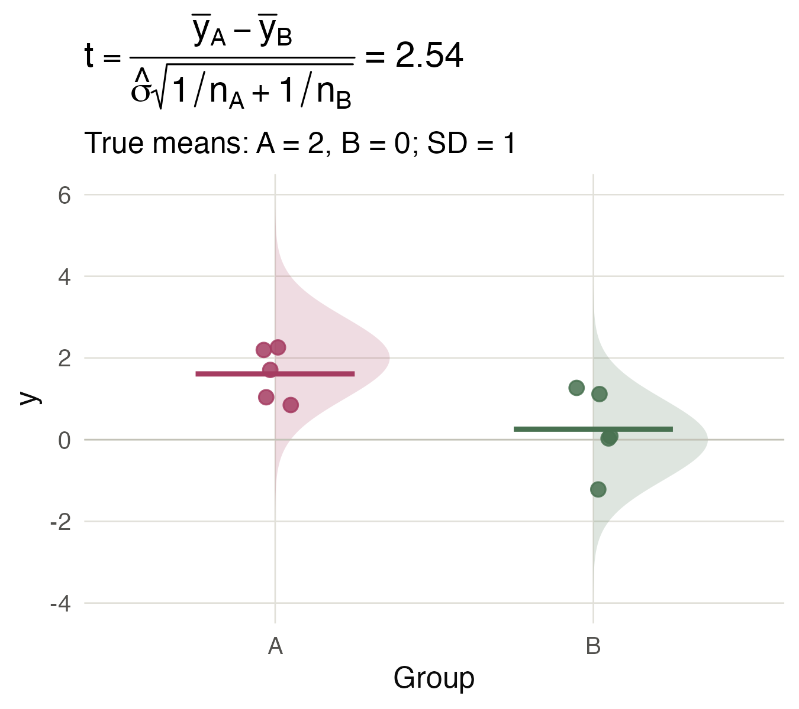
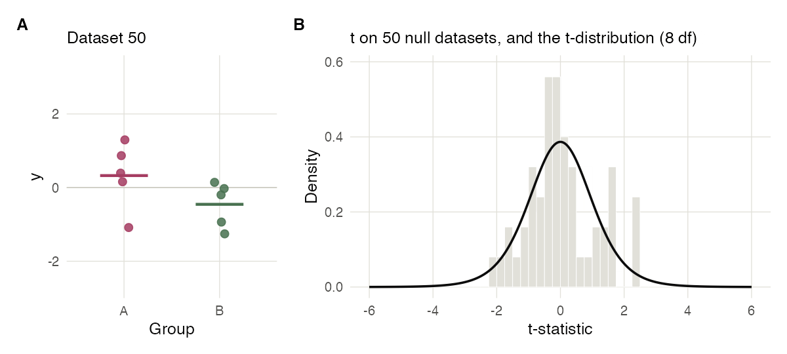
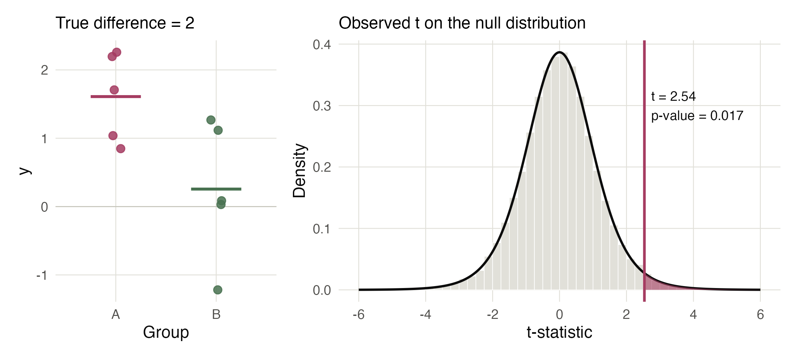
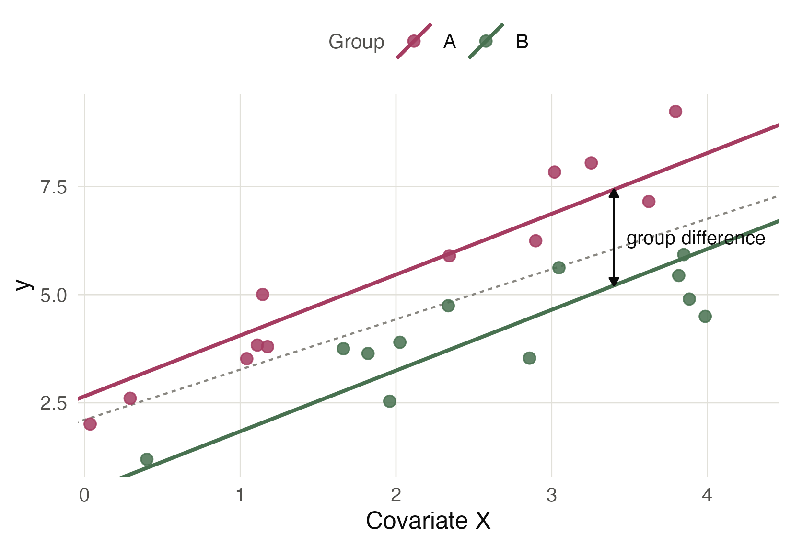
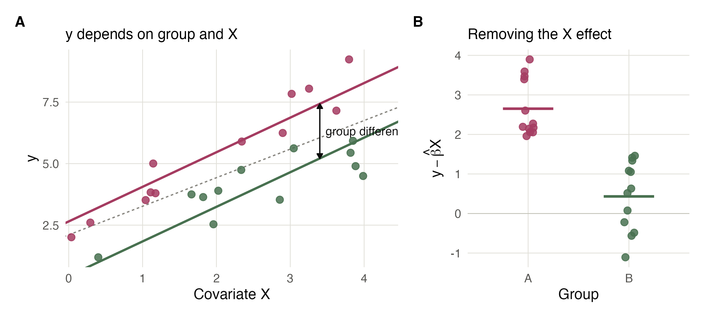

## Motivation

1. Comparison is fundamental to discovery in biology. In the sequencing era we
make comparisons by looking at large-scale molecular readouts.

   * In functional genomics we compare molecular profiles before and after knocking out genes.
   * In cancer biology we compare molecular profiles in cancer versus healthy tissue.
   * In single cell eQTL studies, we might look for cell-type specific gene expression that differs across genotypes.

   This is true across many different assay types, for example bulk RNA,
   single-cell pseudobulk data, or ATAC-seq data.

   [pictures of molecular assays]

   Viewed more abstractly we're often interested in comparing the levels of
   genomic features across conditions. We may also be aware of some external
   factors that influence the level of the observed feature (e.g., different
   timepoints in a time course experiment or levels of a secondary treatment)
   and may want to account for that.

2. Naive approaches to comparison can miss interesting signal. Small biological
effects might be drowned out by large but technical ones. By using appropriate
controls and properly accounting for measurement errors, we can make more
accurate comparisons.

3. The overarching goal of multiple testing in high-throughput biology is to
identify genomic features that vary in a systematic way across conditions of
interest. From an analysis perspective, there are two fundamental challenges:

   - The usual statistical assumptions do not immediately apply.
   - There may be hundreds or thousands of features of potential interest. The
   more we analyze, the greater the risk that irrelevant features might appear
   associated just by chance.

   The first problem motivates _normalization methods_, and the second motivates
   _multiple hypothesis testing methods_. There have been very many proposals
   for both normalization and multiple hypothesis testing. We will focus on the
   specific procedure adopted by limma, though many of the ideas of this
   approach appear throughout the literature.

## Linear Models Background

4. The machinery that underlies both normalization and multiple hypothesis
testing is the linear model. We will take a brief detour to understand some of
the basic mechanics of hypothesis testing through linear models.

5. Let $y_i$ represent measurements of interest across samples $i$. Imagine that
data come from two groups (e.g., healthy and disease, or knockout and control)
and that are both normally distributed. The groups may have different means but
are required to have the same variances.

$$
\begin{align}
Y_{i} \sim \mathcal{N}\left(\mu_{A}, \sigma^2\right) \text{ for }i \in \text{ Group } A\\
Y_{i} \sim \mathcal{N}\left(\mu_{B}, \sigma^2\right) \text{ for }i \in \text{ Group } B
\end{align}
$$

If we want to see whether or not these two underlying means are the same, we can
consider the statistic,

$$
t = \frac{\bar{y}_A - \bar{y}_B}{\hat{\sigma}\sqrt{1/n_A + 1/n_B}}.
$$

This is the differences in empirical means of groups A and B, adjusted according
to an empirical estimate of the within-group variance. This adjustment ensures
that we account for the spread within each group when interpreting the
difference in means.

6. We will say that when the means of the two groups are equal, the "null
hypothesis" holds. The reason for the naming is that when the two groups have
the same mean, there is no need to further investigate differences between the
groups (our interest is "null"). Formally, this is denoted,

 $$H_{0}: \mu_{A} = \mu_{B}$$

Notice that even when $H_{0}$ holds theoretically, on any actual dataset, the
observed difference in sample means will be nonzero, and therefore $t \neq 0$.
In the plot below, the normal densities denote the true data distributions in
each group, the points represent the observed data, and the horizontal lines
reflect the observed sample means.

However, the further the statistic $t$ is from zero (either very negative or
very positive), the less plausible the null hypothesis $H_0$ becomes. The
example below is a case where $H_{0}$ does not hold, and this is reflected in
the relatively larger $t$-statistic.

7. Under the null hypothesis $H_{0}$, what would be typical values of $t$? We
can answer this with a simulation. Here I've simulated 10K null datasets,
computed the associated $t$-statistics, and put those statistics into a
histogram. These turn out to follow a very clean distribution, and it's in fact
possible to derive a theoretical formula for it, which is overlaid.

8. This is very useful because it tells us that anything that doesn't fall into
this distribution counts as evidence against the null hypothesis. Here I
generated one sample where the true group difference is 2 and I've overlaid the
t-statistic from that dataset onto the null from before.

This is the essential logic of hypothesis testing: if we see a statistic that's
very unlikely under the null distribution, then we have evidence that the null
hypothesis is false. A $p$-value is defined as the area of the distribution
above the test statistic, and it is a measure of the strength of this evidence
(smaller area $\to$ less likely to come from the null).

9. So if we're willing to believe the Gaussian assumption, we have a full
procedure for comparing two groups of data. But in genomics we often will need
to account for variables that could influecne the response $y_i$ but which
aren't the actual treatment of interest. The situation might be like in the
figure below, where we care about the difference between A and B, but the
response is influenced by a sample-specific factor $X_i$. If we ignored this
factor and only compared the $y_i$ values, then the groups would blend into one
another and we wouldn't be able to detect any difference

10. In this case we might want to test the null hypothesis $H_{0}$ that the
lines for the two groups are exactly overlapping. The main trick is to subtract
out the effects from the $X_i$ and see whether there still remains a difference
between the two groups. That is, after subtracing the $X_i$ effects (i.e.,
looking at the gaps between the points and the dashed line), we return to the
setting above.

This is exactly what a linear model does. The formula becomes a bit more
complicated, but we can again derive a statistic $t$ that has a closed form null
distribution under $H_{0}$.

11. The fact that we can make comparisons between groups while accounting for
other variables is what makes linear models such a versatile statistical method.
The concrete example here uses a straight line for $X$ but in fact the same
machinery works very generally, including when the effects are nonlinear, when
the slopes of the lines are not parallel, and when we have more than two groups
to compare.

## Normalization

12. Unfortunately the Gaussian assumption doesn't make any sense for genomics
data. But linear models are so appealing that the field has gone to great
lengths to try to salvage their applicability. The main way this is done is
through the process called normalization and this lies at the heart of limma.

13. There are two significant issues that stand in the way of simply making the
Gaussian assumption. The first is that sequencing assays return counts of
different genomic features, and these are not continuous measurements like the
Gaussian. The second is that each sample's mean can depend a lot on its
sequencing depth. This sequencing depth is an experimental artifact that can
obscure the actual biological differences between conditions.

14. An idea that solves both problems at once is to apply a log
counts-per-million (CPM) transformation. Suppose that the expression for gene
$j$ in sample $i$ is $y_{ij}$. Arrange all these data into a samples-by-genes
matrix $Y \in \mathbb{R}^{N\times J}$.

   [draw picture of the matrix]

   The log CPM transformation is,

   $$
   y_{ij} \to \log\left(1 + \frac{y_{ij}}{\sum_{k}y_{ik}} \times 10^{4}\right)
   $$

   The fraction inside of the log converts each sample into a relative
   frequency, which removes the differences in sequencing depths. The 10^4
   converts everything back to counts and it's where the "per-million" name
   comes from. Second by taking the log transformation, we convert the often
   count data into continuous data where the normal distribution assumption is
   more believable.

15. Here are histograms of three genes before and after applying the CPM
transformation.
   [code to generate these figures]

16. One problem is that when we convert to compositions we're actually losing a
lot of meaningful information about the precision of our measurements. A sample
with very deep sequencing is measured more accurately than one with very shallow
sequencing even if they have roughly comparable relative gene frequencies.

17. The limma-voom workflow addresses this by storing not simply the log CPM
values but also the associated precision weights. I've included an appendix
about where these weights come from but for our purposes it's enough to think
about the high-precision samples being those with deeper sequencing.

18. It turns out that these weights can be incorporated into linear models. For
example in the simple case where we're simply looking at the difference between
two groups, we would compute a weighted average where the samples that are
measured with higher precision are given higher weights. In limma all the
differential analysis is based on linear models with these precision weights.

## Multiple Hypothesis Testing

19. At this point we could imagine applying a linear model to every single
genomic feature. We would have a separate null hypothesis associated with each
gene. We would reject those where the groups means seem to be different
(controlling for other technical factors). The resulting list of significant
genes would be the ones that we prioritize for follow-up analysis.

20. This doesn't quite work, though. It's easiest to understand through a small
example. Here I've simulated (? refer to paper) gaussian samples each from two
groups. All the linear model assumptions hold. There are (?) "genes", the first
(?) of which are nonnull.

   [write a small simulation following Hongkai Ji and X. Shirley Liu's paper: https://doi.org/10.1038/nbt.1619].

21. I've plotted the t-statistics vs. the gene index, and I've shaded in those
that would be rejected according to a 0.05 cutoff. Many of the genes that we
know of seem to have very large t-statistics.

   [create a figure representing this]

   The problem immediately becomes clear if we look at the associated standard
   deviations. Just by chance some of these genes have low estimated standard
   deviations and that makes the t-statistic very large. This is a consequence
   of the relatively small sample size. If we had more samples we'd be able to
   better estimate $\hat{\sigma}$, but as it is we sometimes underestimate and
   these genes end up appearing significant.

22. We somehow need a better way of estimating these variances. The insight of
limma is that we can pool information across all the genes to improve our
variance estimates. Specifically if we plot the observed gene means against
their observed standard deviations (after normalization), we often see a trend
like this.

   (show picture of limma trend relationship)

   The genes with the very low standard deviation cause the problems we observed
   above. Therefore limma replaces the raw standard deviation estimates with a
   version that "pushes" all the estimates toward the fitted trend. This ensures
   that no samples have very low standard deviation. This is where the
   "moderated" in "moderated fold change estimation" comes from in the subtitle
   of the limma package.

23. There's one last statistical consideration. If we use the usual hypothesis
testing cutoffs then we're liable to return many false positives. The issue
appears in this XKCD comic.

   (jellybeans comic)

   The problem is that the hypothesis testing cutoffs are originally designed so
   that under the null hypothesis the probability of a false positive is
   $\alpha$ (usually set to 0.05). But as we test more and more hypotheses, the
   probability of encountering at least one false positive grows, because each
   time there is a probability $\alpha$ of a false positive

24. To deal with this phenomenon Benjamini and Hochberg had the idea that
instead of controlling the probability of a single false positive, we should
control the proportion of false positives among all rejections. They called the
false positives "false discoveries," which led to the definition of the false
discovery rate.

25. Formally let $H_{1}, \dots, H_{J}$ represent the null hypothesis for the $J$
genes. Suppose we obtain p-values $p_{1}, \dots, p_{J}$. Suppose that $R$ of
these $p$-values are smaller than $\alpha$. These are our rejections, they are
the discoveries we would comment on in our paper. Among these $R$ rejections,
suppose that $V$ are false discoveries (in practice, we would never know this).
The quantity

   $$
   \widehat{\mathrm{FDP}} = \frac{V}{R\vee 1}
   $$
   is the empirical false discovery proportion in this one experiment and its expectation across many experiments with the same underlying distribution is called the false discovery rate,
   $$
   \mathrm{FDR} = \mathbb{E}\left[\widehat{\mathrm{FDP}}\right]
   $$

26. In addition to introducing this quantity, Benjamini and Hochberg proposed a
way of adjusting the $p$-value cutoffs so that if we reject our hypothesis using
these cutoffs instead of the canonical $\alpha$, we would provably control the
false discovery rate. Their procedure is now called the Benjamini-Hochberg (or
BH) procedure,

   * Order the $J$ p-values from smallest to largest
    $$
    p_{(1)} \le p_{(2)} \le \cdots \le p_{(J)}
    $$
    and denote the associated null hypothesis by $H_{(1)}, \dots, H_{(J)}$.
   * Fix a target FDR level $q$^[This is the analog of $\alpha$ in ordinary hypothesis testing] and define a new sequence of thresholds $\alpha_{k} = \frac{kq}{J}$. This means that the smallest p-value is compared to the strictest threshold, the next smallest is compared to a slightly more lenient one, etc.
   * Find the largest $k$ where $p_{(k)} \le \alpha_{k}$, and reject all hypotheses $H_{(1)}, \dots, H_{(k)}$. If there is no such $k$, don't make any rejections.

27. This procedure actually has an intuitive explanation in terms of the histogram of p-values.

## Annotated Example

plotMA

volcano plot

toptable